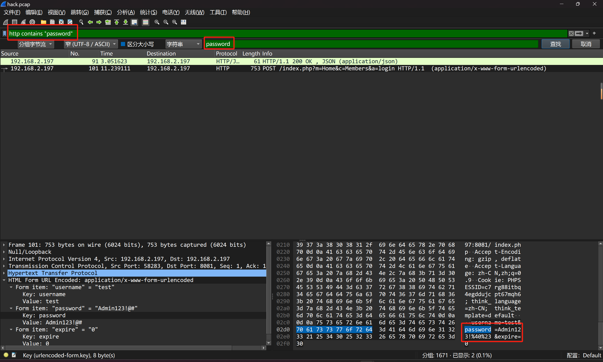
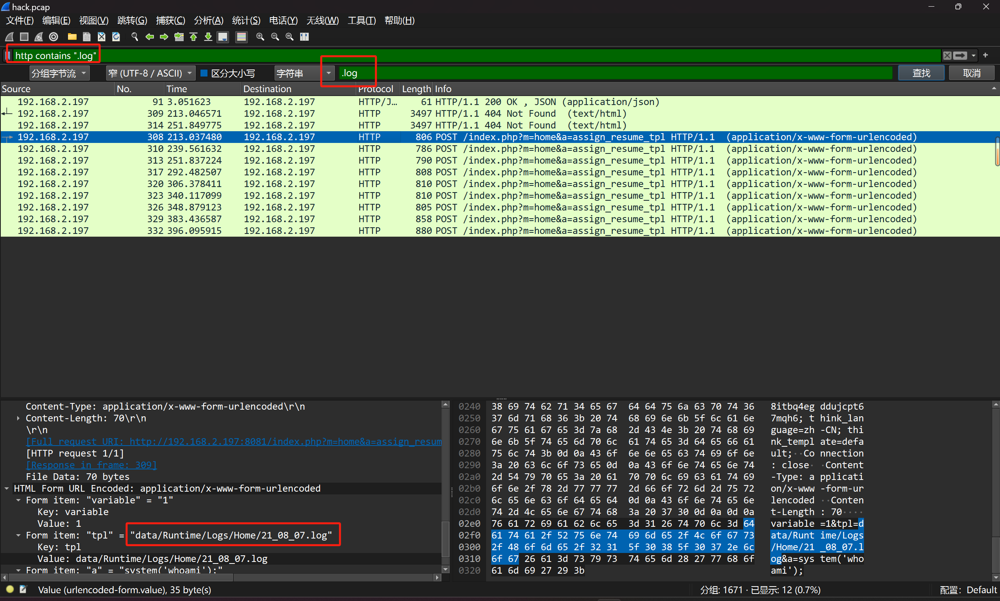
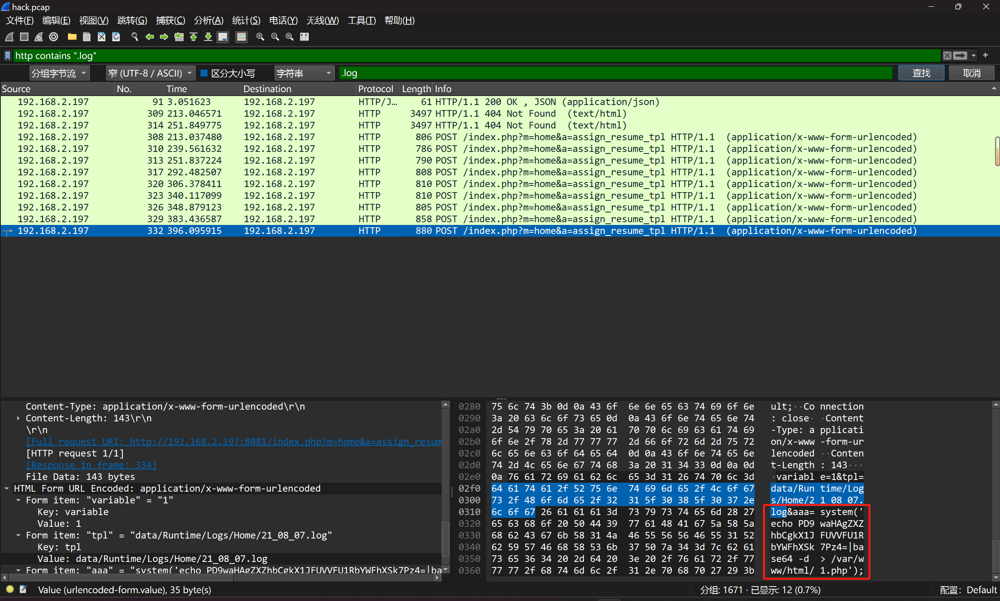
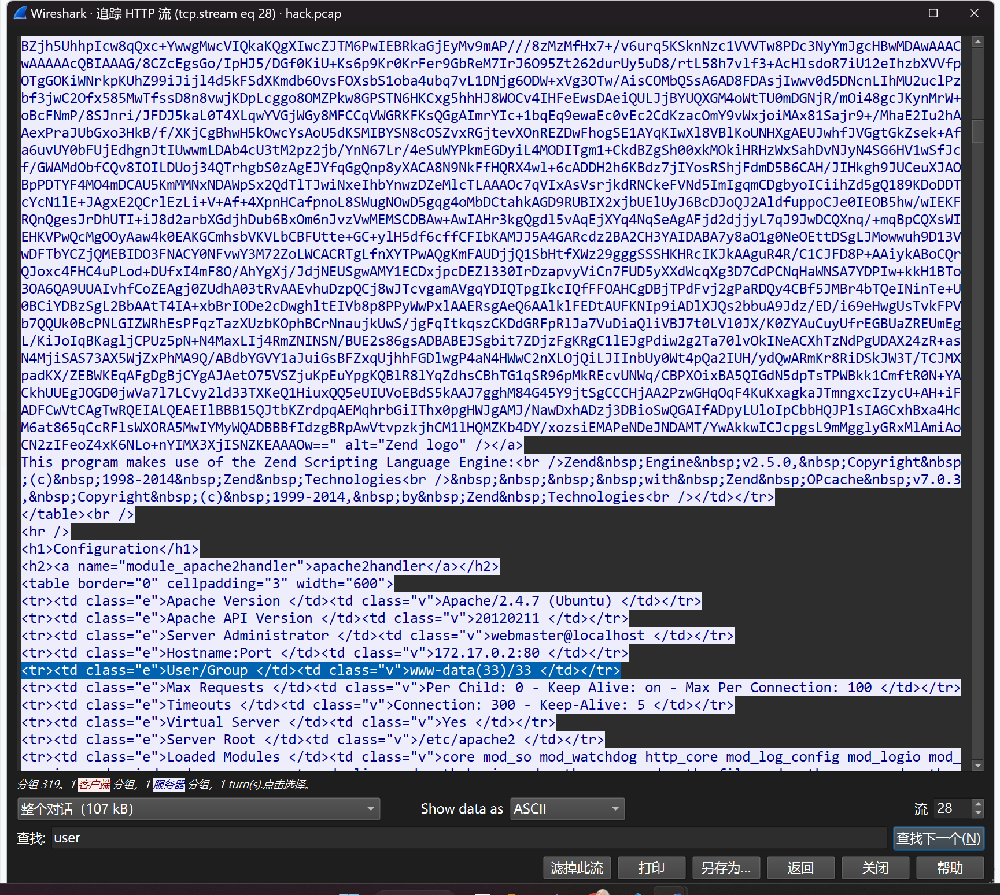
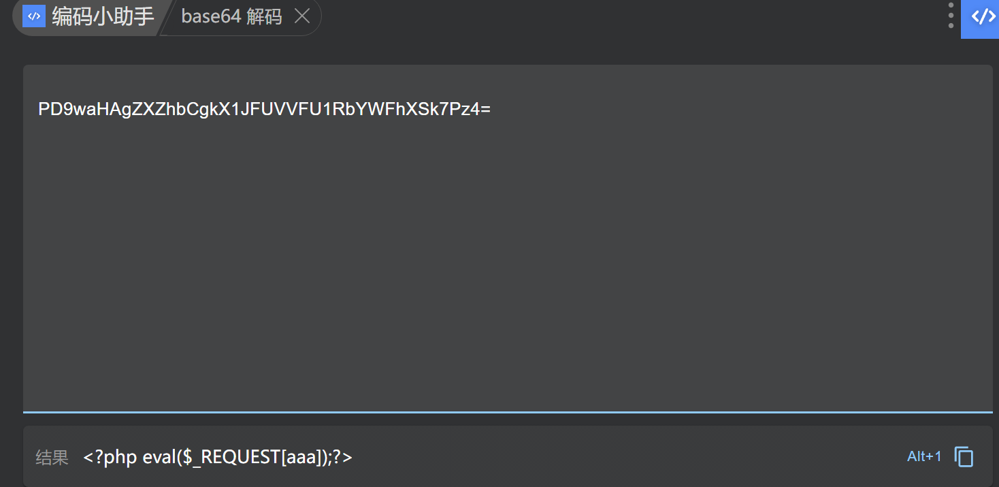
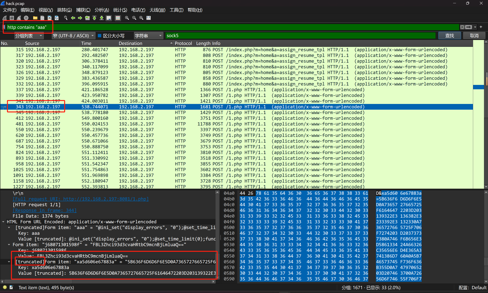
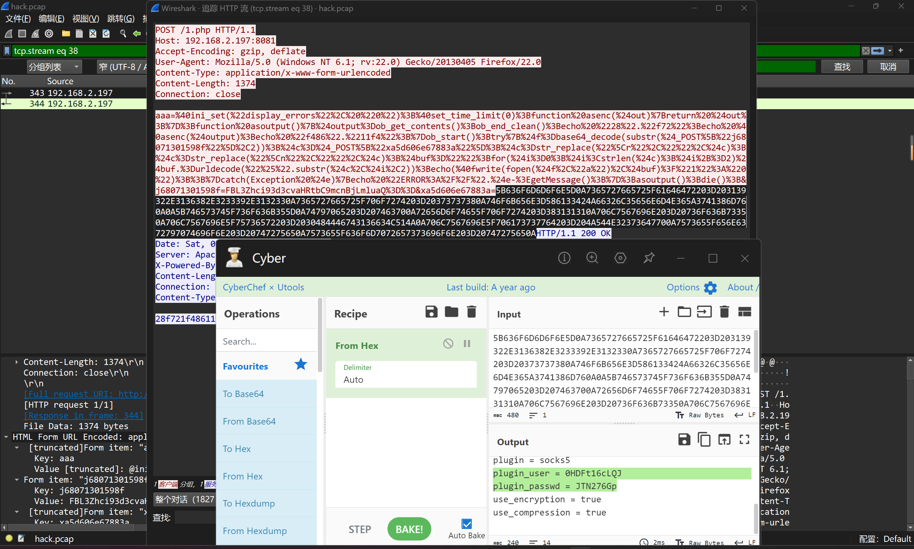

---
tags:
  - notes
comments: true
dg-publish: true
---

> misc 中的流量分析 writeup 。

- [常见网站认证形式](https://devv.ai/search?threadId=dy1c8qcr5gxs)

## LitCTF 2024

### 女装照流量

> [题目](https://www.nssctf.cn/problem/5621) [文件](attachments/ez_flow.zip) [题解](https://www.nssctf.cn/note/set/7338)

从流量上看 TCP 占多，在[统计>协议分级](attachments/Flow_analysis-8.png) 中可以看到 HTTP 的“信息”很多；筛选 http ，判断是在上传很多文件 => [文件>导出对象>HTTP>全部保存](attachments/Flow_analysis-9.png) 。接下来检查这些文件。

- jpg 文件确实是女装照，有兴趣自己看 ~~说不定藏了信息呢~~
- ma.php 系类文件，一一检查；对于明显是 url 编码的内容，解码后发现都有类似于 `$p=base64_decode(substr($_POST["da8af99c22690c"],2));` 的语句，意为将该键的值从第二位起（0 为首位，故不包含第二个字符）的字符串进行 base 解码；我们搜索该键，就能[找到相应的值](attachments/Flow_analysis-10.png)
    - 尝试到 ma(14).php 时，出现[密码](attachments/Flow_analysis-11.png) `PaSsw0rd_LitCtF_L0vely_tanJi`。
    - 尝试到 ma(19).php 时，发现是二进制文件，使用 file 检测（或者结合过程中的信息猜一猜也知道是 zip）更改扩展名，使用密码得到 flag。
- 剩下的文件有兴趣可以探索？

> [!FLAG]
>
> LitCTF{anTsw0rd_fl0w_is_eAsY_f0r_u}

## EIS 2019

> 提交平台：[NSSCTF](https://www.nssctf.cn/problem/)
### webshell

> [题目](https://www.nssctf.cn/problem/1266) [题解参考](https://blog.csdn.net/weixin_45446164/article/details/131998099)

> [!FLAG]
>
> flag{AntSword_is_Powerful_3222222!!!!}

## 陇剑杯 2021

### WebShell

> 题目： [WebShell](attachments/Flow_analysis-4.png)

#### 问 1

使用 wireshark 打开 hack.pcap，过滤含有 "password" 的文件，只有两个，直接 `ctrl+f` 找 "password"，如图：

注意是 base64 解码：

> [!FLAG]
>
> NSSCTF{Admin123!@#}

#### 问 2

同理，找 ".log" ：

但是不知道绝对路径，但是看 `a` 的值，是在执行命令，往下看，得到：

> [!FLAG]
>
> NSSCTF{/var/www/html/data/Runtime/Logs/Home/21_08_07.log}

#### 问 3

权限问题自然是先找 "whoami"，发现有两条，第一条响应 404 失败，第二条 200 成功，检查 User/Group（用户权限）：

> [!FLAG]
>
> NSSCTF{www-data}

#### 问 4

刚才我们也看到了，1.php 。

> [!FLAG]
>
> NSSCTF{1.php}

#### 问 5

查看（echo 进入） 1.php 中的内容：

搜索 `aaa`，但是确实基础知识不足，我连什么是 **代理工具客户端** 都不知道，看了 [writeup](https://www.nssctf.cn/note/set/7719) ，重点在于：`frpc.ini`，故：

> [!FLAG]
>
> NSSCTF{frpc}

#### 问 6 & 问 7

顺着 aaa 的搜索看下来？简而言之见 343 帧 [^1]的内容：

[^1]: 为何当前不知

可以看到信息截断了，追踪把其复制下来，放入 cyberchef 中：

> [!FLAG]
>
> NSSCTF{0HDFt16cLQJ#JTN276Gp}