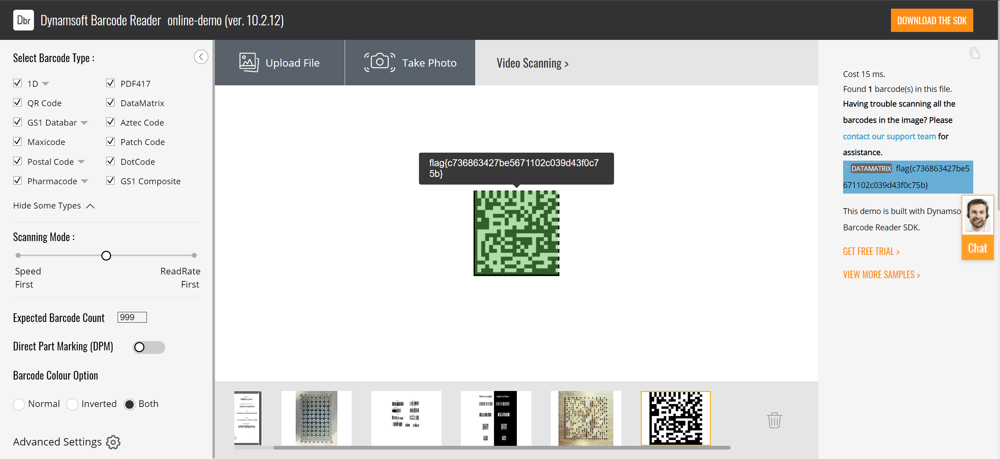

---
tags:
- notes
- ctf
comments: true
---

## CISCN 2022 东北

### 听说这是一个二维码

> [题目](https://www.nssctf.cn/problem/2398)

我的第一个音频隐写题目。

先傻傻地听了一遍歌（感觉是 AI 生成的），然后一无所获；检查文件属性信息，一无所有。使用 file、binwalk 检查也是很正常；那么用 010editor 查看，[末尾一看就很奇怪]attachments/audio.png)，放入 cyberchef -> magic 中，[获得密码](attachments/audio-1.png) `ThisI5Passw0rd` 。

但是密码干嘛用的？不知道，搜索 "sound from deep" ，原来是 [DeepSound](https://github.com/Jpinsoft/DeepSound) 这个软件，下载后将 `二维码.wav` 放入，[填入密码](attachments/audio-2.png)，提取隐藏文件 flag.pcap 。

打开 flag.pcap，滑动过程中，只有 [No. / Time / Destination](attachments/audio-3.png) 三栏内容发生变化；No. 变化是必然的，Time 很复杂，从 Destination 入手，只有两种，考虑 01 二进制流。

使用 pyshark 提取二进制写入 flag.txt：

```python title="get_binary.py"
import pyshark
import binascii
from PIL import Image


def process_pcap(pcap_file):
    cap = pyshark.FileCapture(pcap_file)
    binary_stream = ""

    for packet in cap:
        if "IP" in packet:
            if packet.ip.dst == "172.16.0.1":
                binary_stream += "0"
            elif packet.ip.dst == "172.16.255.1":
                binary_stream += "1"

    return binary_stream


if __name__ == "__main__":
    pcap_file = "flag.pcap"

    binary_stream = process_pcap(pcap_file)
    with open("flag.txt", "w") as f:
        f.write(binary_stream)
```

再猜测二维码图片为方形（失败了就要修改长宽暴力查找了）：

```python title="get_pic.py"
from PIL import Image
import numpy as np

# Read the flag.txt file
with open("flag.txt", "r") as file:
    binary_data = file.read().strip()

# Calculate the side length of the square image
side_length = int(len(binary_data) ** 0.5)

# Convert the binary string to a 2D numpy array with the correct data type
image_array = np.array([int(bit) for bit in binary_data], dtype=np.uint8).reshape(
    side_length, side_length
)

# Create the original image
original_image = Image.fromarray(image_array * 255, mode="L").convert("1")
original_image.save("original_flag.png")

# Create the flipped image in case we flip 0/1
flipped_array = 1 - image_array
flipped_image = Image.fromarray(flipped_array * 255, mode="L").convert("1")
flipped_image.save("flipped_flag.png")

print("Image processing complete.")
```

[获得二维码](attachments/audio-4.png)，使用 [barcode-reader](https://demo.dynamsoft.com/barcode-reader/) 扫描：



可以看到，是一个 DATAMATRIX，`flag{c736863427be5671102c039d43f0c75b}` 。

> [!FLAG]
>
> NSSCTF{c736863427be5671102c039d43f0c75b}

