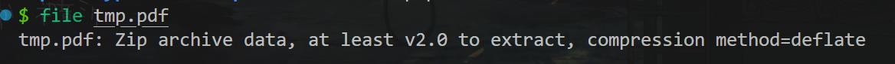
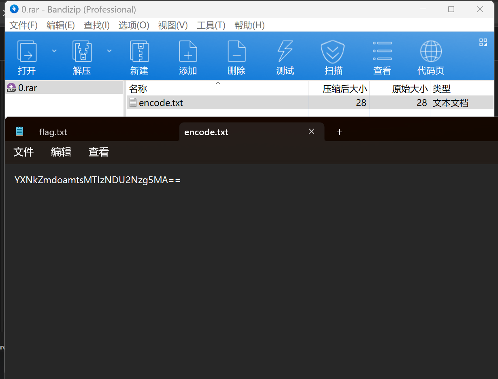
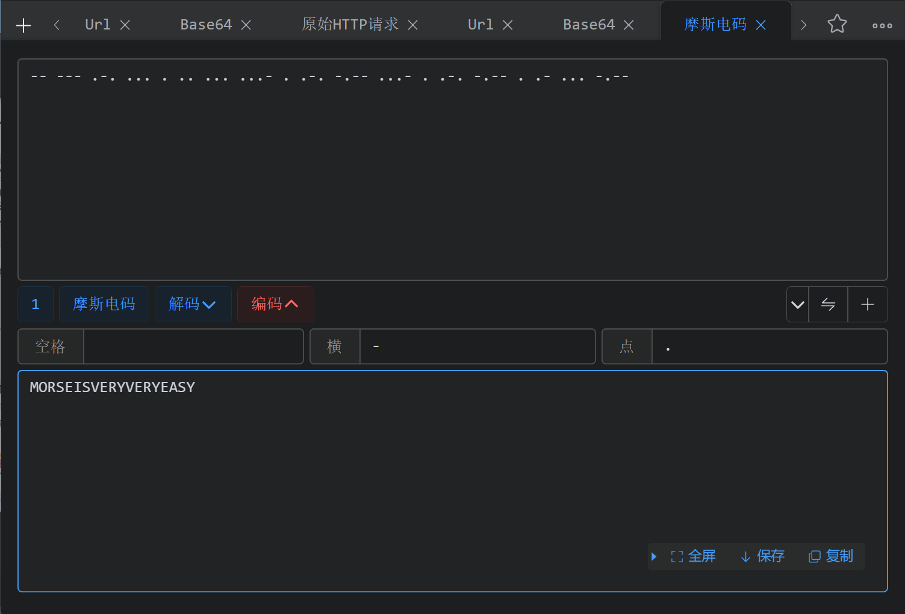

---
tags:
  - notes
comments: true
dg-publish: true
---

> misc 往往需要多层处理，以 qrcode 开头的都放这吧。

[暴力破解](attachments/qrcode-2.png)获得密码：`1tcKm` ，获得 flag ：

> [!FLAG]
>
> NSSCTF{h@ck-Z3r0}

## NISACTF 2022

### bilala的二维码

拿到附件，显然缺少了定位角，使用 [一些工具补全](https://www.kapwing.com/studio/editor) [二维码](attachments/qrcode-1.png)，扫描得到一张图片，我姑且命名为 balabala.jpg，然后 binwalk 检查，分离，看得出来是 morse.mp3 要密码。

接下来难评，全靠猜了，压缩包密码为 `NISA`（这么长当然也可以直接爆破，但是不知道大小写/有无数字，还是要一段时间的）；然后就是经典的音频摩斯密码，[这里](https://morsecode.world/international/decoder/audio-decoder-adaptive.html)有个自动款；解出 `PART 1: M0RS34ND`；然后加上的是 binwalk 分离出来的第二章图片的像素之比 `282X231` (有点若只)。

> [!FLAG]
>
> NSSCTF{M0RS34ND282X231}

## HNCTF 2022 WEEK2

### 扫不出来的二维码

扫不出来，但是我扫了却出来了😅，下载得到 pdf，但是打不开，`file` 照妖镜：

改为 zip，得到 `正如计算机里只有 0 和 1.png` 。

同样的方式，用 file、binwalk、steghide 都检查了，没发现问题……

于是扔给 AI，居然也是一种二维码！为 [Maxicode](https://devv.ai/search?threadId=dy2q5wodzklc)，可以用[在线工具](https://products.aspose.app/barcode/zh-hans/recognize/maxicode) 很快扫出来，basee64 解码：

> [!FLAG]
>
> nssctf{I_h0te_the_QRc0de!!!!}

## [SWPU 2019]神奇的二维码

> [题目](https://www.nssctf.cn/problem/39) [参考题解](https://www.nssctf.cn/note/set/2780)

拿到一张图片，你可能有很多想法；我们先用 [binwalk 扫描](attachments/神奇的二维码.png) ，发现几个 rar，binwalk 分解后，分别尝试打开：

base64 解码得 `asdfghjkl1234567890` ，应该是一个密码；跳过中间没啥意义的压缩包，我们看到 flag.doc 中显然是 base64 的编码（只有 a-zA-Z0-9），使用 cyberchef base64 解码（连续解码 20 次，额），获得了 `comEON_YOuAreSOSoS0great` ，这是最后一个压缩包的密码。

打开 good.mp3 ，一听就是发电报😂，使用 audicity 或者其他你喜欢的工具打开，宽者为 `-` ，窄者为 `.` ，进行莫斯解码（对于只有三种字符的情况，很可能是莫斯密码）：

题目要求小写：

> [!FLAG]
>
> NSSCTF{morseisveryveryeasy}