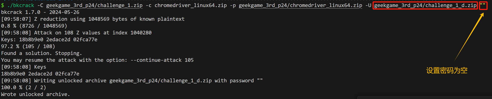
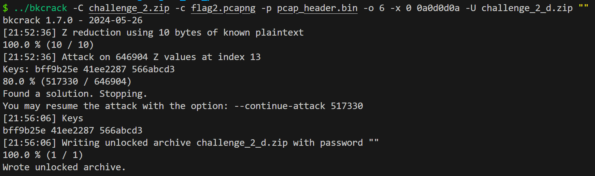

---
tags:
- notes
- ctf
comments: true
---

## Geekgame-3rd

- [prob24](https://github.com/PKU-GeekGame/geekgame-3rd/tree/master/official_writeup/prob24-password)

拿到两个压缩包，检查不是伪加密后，从压缩包入手。

### challenge 1

在 challenge_1.zip 中，发现有 `chromedriver_linux64.zip` ，这个文件很可能是公开的；能够获取压缩包内的部分文件，我们就可以使用[明文攻击](https://www.uf4te.cn/posts/3a71eb8.html)，使用 [bkcrack](https://github.com/kimci86/bkcrack) 。

首先我们来看这个压缩包的 **原始大小** 为 5845152（字节？），这可以通过 `bkcrack -L` 命令查看，或者部分压缩软件支持显示。

接着我们去[搜索一下](attachments/zip_rar-1.png)，在[这里](https://chromedriver.storage.googleapis.com/)依据[文件大小搜索](attachments/zip_rar-2.png)到我们需要的版本为 `89.0.4389.23/chromedriver_linux64.zip` ，故而[下载](https://chromedriver.storage.googleapis.com/89.0.4389.23/chromedriver_linux64.zip)即可。

有了明文，如下攻击得到 challenge_1_d.zip:



使用空密码解压 challenge_1_d.zip 获取 flag.txt:

> [!FLAG]
>
> flag{insecure_zip_crypto_using_known_file_content}

### challenge 2

还有一个压缩包呢，只有一个文件，怎么办？[通过扩展名推测明文](https://www.poboke.com/crack-encrypted-zip-file-with-plaintext-attack.html)。在 [pacpng](https://pcapng.com/) 中我们了解到 panpng 文件的 Section Header Block (SHB) 有其固定的格式：

```hex
0a 0d 0d 0a 8c 00 00 00 4d 3c 2b 1a 01 00 00 00  | ........M<+.....
ff ff ff ff ff ff ff ff 03 00 2d 00 4d 61 63 20  | ..........-.Mac 
4f 53 20 58 20 31 30 2e 31 30 2e 34 2c 20 62 75  | OS X 10.10.4, bu
69 6c 64 20 31 34 45 34 36 20 28 44 61 72 77 69  | ild 14E46 (Darwi
6e 20 31 34 2e 34 2e 30 29 00 00 00 04 00 34 00  | n 14.4.0).....4.
44 75 6d 70 63 61 70 20 31 2e 31 32 2e 36 20 28  | Dumpcap 1.12.6 (
76 31 2e 31 32 2e 36 2d 30 2d 67 65 65 31 66 63  | v1.12.6-0-gee1fc
65 36 20 66 72 6f 6d 20 6d 61 73 74 65 72 2d 31  | e6 from master-1
2e 31 32 29 00 00 00 00 8c 00 00 00              | .12)........
```

`0a 0d 0d 0a __ __ __ __ 4d 3c 2b 1a 01 00 00 00` 处格式比较一致，共有 14 个 bytes ，可以直接用 `bkcrack -C challenge_2.zip -c flag2.pcapng -p pcap_header.bin -o 6 -x 0 0a0d0d0a -U challenge_2_d.zip ""` 爆破。

[爆破花了大概15分钟](attachments/zip_rar-5.png)；比特流要用二进制形式写入！不然和我一样试了半天不知道为啥出不来；随便写个 python 写入好了：

```python title=""
# 定义十六进制字符串
hex_string = "00004d3c2b1a01000000"

# 将十六进制字符串转换为字节
binary_data = bytes.fromhex(hex_string)

# 将字节写入文件
with open("pcap_header.bin", "wb") as f:
    f.write(binary_data)

print("数据已成功写入 pcap_header.bin")
```

在[这里](https://pcapng.com/#:~:text=However%2C%20applications%20that%20output%20PcapNG%20files%20typically%20don%E2%80%99t%20know%20beforehand%20how%20large%20the%20current%20section%20will%20be.%20The%20section%20length%20is%20therefore%20normally%20%2D1%20(0xffffffffffffffff)%2C%20which%20means%20that%20the%20size%20of%20the%20section%20isn%E2%80%99t%20specified.)提到，我们抓包的时候是不知道实际容量是多少的，所以抓包的时候通常直接设置节长度为 `0xffffffffffffffff` ，我们可以先加上这个进行尝试来减少爆破时间。



可以看到时间减少到不到 4 分钟了，不妨先大胆试试。

[最后在流量中找找就好了](attachments/zip_rar-4.png)

> [!FLAG]
>
> flag{inSecUrE-zip-CrYPTO-eVeN-withOuT-KNOWN-file-CoNtENT]

## SWPU 2020

### 套娃

- [nssctf](https://www.nssctf.cn/problem/47)

起初获得一个 “套娃.xls” ，利用 `file` 命令获得是 zip 文件，改扩展名解压，重复一次后获得 RC4data.txt（内容为"U2FsdGVkX19uI2lzmxYrQ9mc16y7la7qc7VTS8gLaUKa49gzXPclxRXVsRJxWz/p"）RC4key.zip（加密） + esayrc4.xlsx（无法打开，修改为 zip 后同样无法打开）。名字提示的这么多了，[了解一下 RC4](https://www.yuxingchen.love/index.php/2024/08/04/rc4%E5%8A%A0%E5%AF%86%E7%AE%97%E6%B3%95%E6%B7%B1%E5%88%BB%E5%89%96%E6%9E%90%E7%BB%93%E5%90%88ctf%E9%80%86%E5%90%91%E7%AD%BE%E5%88%B0/)，得知我们需要密钥/密钥流、密文就可以得到明文。

使用 010 查看文件，在 esayrc4.xlsx [末尾发现了密钥](attachments/zip_rar.png) "ABCDEFGHIJKLMNOPQRSTUVWXYZ" ，放入 [在线rc4网站解密](https://config.net.cn/tools/Rc4.html)[^1]。

[^1]: 这个网站是我在本题的讨论区得知的，其他网站如果要求设置编码格式，解不出来（或者只是没找对），就比较难绷。

> [!FLAG]
>
> NSSCTF{ef1a73d40977a49b99b871980f355757}
