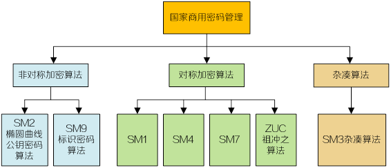

---
tags:
  - notes
  - crypto
comments: true
dg-publish: true
---

## 介绍

> [!WIKI] [商用密码](https://zh.wikipedia.org/wiki/%E5%95%86%E7%94%A8%E5%AF%86%E7%A0%81)
>
> 商用密码是中华人民共和国政府用于非国家机密信息保护所采用的一系列密码技术和密码产品的总称，其相关技术部分为国家秘密。商用密码的研发及使用由国家密码管理局统一管理。
> 
> [什么是国密算法？](https://wiki.h3c.com/cn/detail.html?WikiName=%E5%9B%BD%E5%AF%86%E7%AE%97%E6%B3%95)

部分密码算法细节已公开，可在 [国家密码管理局](https://www.oscca.gov.cn/sca/xxgk/bzgf.shtml) 或 [国家标准全文公开系统](https://openstd.samr.gov.cn/bzgk/gb/) 查询。

## 扩展链接

学习推荐：[Bilibili - 可厉害的土豆](https://space.bilibili.com/253413704/upload/video)

代码实现： [GmSSL](https://github.com/guanzhi/GmSSL) or [GmSSL-Python](https://github.com/GmSSL/GmSSL-Python) ，[使用文档](http://gmssl.org/docs/docindex.html)  。