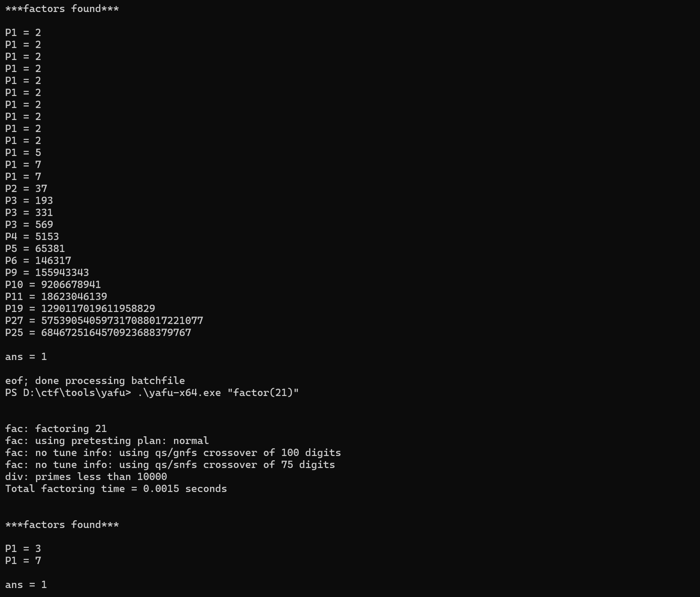

---
tags:
  - notes
comments: true
dg-publish: true
---

平时分解大因数都用的是 [facotrdb](https://factordb.com/) 但是断网比赛咋办？看向了 [yafu](https://github.com/bbuhrow/yafu) 。

> [!QUOTE]
>
> YAFU (with assistance from other free software) uses the most powerful modern algorithms (and implementations of them) to factor input integers in a  completely automated way.  The automation within YAFU is state-of-the-art,  combining factorization algorithms in an intelligent and adaptive methodology  that minimizes the time to find the factors of arbitrary input integers.   It is most optimized for general inputs up to 160 digits in size, although  there is support for inputs much larger than that, if they have a special  form.  There are also specialized functions for handling  lists of inputs and  ranges of contiguous smaller inputs.

记录下基本的使用：

## 获取

首先从 [github](https://github.com/bbuhrow/yafu) 拉取源代码，或者从 [sourceforge](https://sourceforge.net/projects/yafu/) 下载。

## 基本使用

在 windows 中进入到对应文件夹下，使用 powershell[^1] 打开。

键入：

```shell
# 分解较小的数
.\yafu-x64.exe "factor(<little number>)"
# 分解较大的数
.\yafu-x64.exe "factor(@)" -batchfile to_be_factor.txt
```

我使用的是 git clone 下来的源代码。使用第二条命令时，大整数，放在文件中，末尾多换两个行，不然似乎会有问题；而且似乎这样做也会导致文本被吞了??？有点奇怪。

[^1]: powershell 支持部分 linux 命令，个人更加熟悉，cmd 也是一样的。

