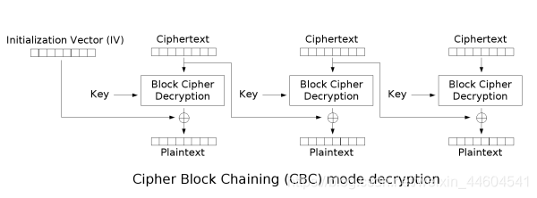
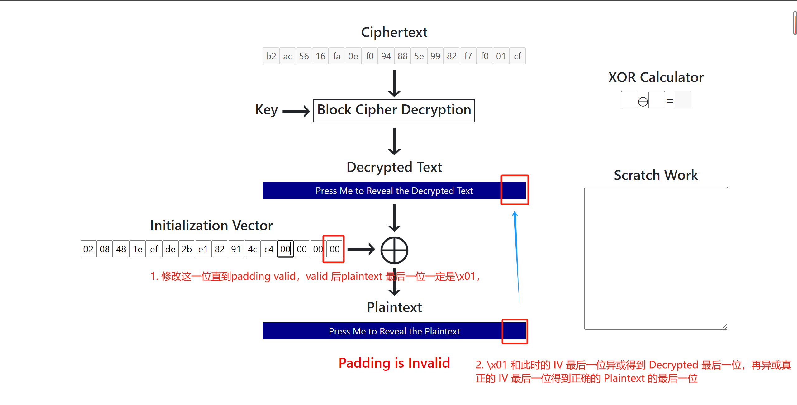

---
tags:
  - notes
  - crypto
comments: true
dg-publish: true
---

## Intro

### 填充预言机攻击（Padding Oracle Attack）

填充预言机攻击是一种密码学攻击，它利用了密码系统在处理填充错误时的行为。这种攻击允许攻击者在不知道加密密钥的情况下解密数据，或者在某些情况下，甚至可以加密数据。

### 攻击原理

填充预言机攻击的核心在于分组密码的填充机制。在分组密码中，数据被分成固定大小的块进行加密。如果数据不足以填满最后一个块，就需要添加填充。常见的填充标准如 `PKCS #5` 和 `PKCS #7 ` ，会在数据末尾添加一系列的字节，使得最后一个块的大小满足加密算法的要求。

攻击者可以通过观察系统处理填充错误的方式来推断出关于加密数据的信息。例如，如果系统在填充错误时返回不同的错误消息[^1]，或者处理时间有显著差异，攻击者就可以利用这些信息来逐步推断出原始数据或加密密钥。

[^1]:  一般来说，如果密文没有被篡改，则解密成功，并且业务校验成功，响应200；如果密文被篡改，服务端无法完成解密，解密校验失败，则响应500；如果密文被篡改，但是服务端解密成功，但业务逻辑校验失败，则可能返回200或302等响应码,而不是响应500



### 攻击步骤

获取密文和初始化向量（IV）：攻击者首先需要获取到密文和用于 CBC 模式加密的初始化向量。

修改密文：攻击者对密文进行修改，然后发送给系统进行解密尝试。

分析响应：根据系统的响应，攻击者可以判断出修改后的密文是否导致了有效的填充。

推断密文块：通过逐个字节修改密文块并观察系统响应，攻击者可以推断出密文块的内容。

重复以上步骤：对于多个密文块，攻击者重复以上步骤，直到整个密文被解密。

### 攻击条件

要成功进行填充预言机攻击，必须满足以下条件：
- 攻击者能够获取到密文和初始化向量。
- 系统在处理填充错误时必须有可观察的行为差异，例如不同的错误消息或处理时间差异。

## CTF 实例

> 来自 [ZJUCTF2024 crypto eazy_pad](https://ctf.zjusec.com/games/4/challenges) 。

记：从题目中获取的 IV 为 IV，而之后交付给解密函数/服务器的、附在 ciphertext 之前的为 attack_IV；真正的明文为 P，而解密函数/服务器解密 attack_IV+ciphertext 后的明文记作 P_ 。

### 老思路

在 ctf 101 短学期课程中，其实已经学习过 padding oracle attack，但是我当时的理解有缺陷，思路如下



即我认为：

```python
D[-1] = attack_IV[-1] ^ P_[-1] # P_[-1] 即 b'\x01'
P[-1] = D[-1] ^ IV[-1]
```

由此解出 P，依次类推，得到下面的攻击函数：

```python title="old_padding"
def padding_oracle_attack(encrypt_msg):
    gus = set()
    IV = encrypt_msg[:16]
    print("IV: ", IV)
    ciphertext = encrypt_msg[16:]
    block_size = 16
    # 16 字节一组
    blocks = [
        ciphertext[i : i + block_size] for i in range(0, len(ciphertext), block_size)
    ]
    # print(blocks)
    plaintext = b""
    
    for block_index in range(len(blocks)):
        # 决定 "IV"
        if block_index == 0:
            previous_block = IV
        else:
            previous_block = blocks[block_index - 1]
    
        current_block = blocks[block_index]
        # print("current_block: ", current_block)
        decrypted_block = bytearray(16)
    
        for byte_index in range(block_size - 1, -1, -1):
            attack_IV = bytearray(16)
    
            padding_value = block_size - byte_index
            # print(padding_value)
            for i in range(block_size - 1, byte_index, -1):
                attack_IV[i] = decrypted_block[i] ^ padding_value
            # print(attack_IV)
            for guess in range(256):
                attack_IV[byte_index] = guess
                attack_ciphertext = attack_IV + current_block
    
                if decrypt(attack_ciphertext):
                    gus.add(guess)
                    decrypted_byte = guess ^ padding_value
                    decrypted_block[byte_index] = decrypted_byte
                    break
        # previous_block 发挥的是 IV 的功能
        plaintext_block = xor_bytes(decrypted_block, previous_block)
        plaintext += plaintext_block
    # 将gus 变为列表并排序
    print(sorted(list(gus)))
    return plaintext
```

但是，这道题要求访问次数为 0x2024，约 8000 次；而我们这样需要 $256*32 =8192$ 次；即便不是每次都要到 256 才结束，我们假定是 128 次；又因为题中

```python
def decrypt(msg: bytes):
    global cout
    cout += 1
    IV = msg[:16]
    cipher = AES.new(KEY, AES.MODE_CBC, IV)
    decrypted = cipher.decrypt(msg[16:])
    return unpad(decrypted) ^ (random.random() > 0.1)
```

返回结果对 padding valid 的判断进行了 0.9 概率的翻转，所以我们需要多试几次才能够保证某一次的 padding valid 是否正确。这导致次数要为原来的 10 倍，那么我们的次数远远不够了。

### 新思路

我们为什么要执着于解出 D ? ciphertext->decryptedtext 这一过程总是不变的，也就是说 D 是不变的。我们想让 P[-1]=b"\x01" ，可以推导：

```python
IV[-1]^D[-1]=P[-1] # =>
IV[-1]^P[-1]^P_[-1]^D[-1]=P[-1]^P[-1]^P_[-1] = P_[-1] # 即 b'\x01'，所以只需要遍历 P[-1] ，构造 attack_IV 即可
attack_IV[-1]=IV[-1]^P[-1]^P_[-1]
```

这个思路能够将我们遍历的目标由 attack_IV 变为 P，即 256->|M| ，其中 M 代表明文空间；又由题意可知，我们的明文空间 M={0,1,2,3,4,5,6,7,8,9,a,b,c,d,e,f} ，那么次数就够了：

```python title="padding_oracle"
def padding_oracle_attack(encrypt_msg):
    IV = encrypt_msg[:16]
    ciphertext = encrypt_msg[16:]
    block_size = 16
    blocks = [
        ciphertext[i : i + block_size] for i in range(0, len(ciphertext), block_size)
    ]
    # print("blocks: ", blocks, len(blocks))
    full_plaintext = b""
    
    for block_index in range(len(blocks)):
        if block_index == 0:
            attack_IV = bytearray(IV)
        else:
            attack_IV = bytearray(blocks[block_index - 1])
    
        current_block = blocks[block_index]
        plaintext = bytearray(16)
        for byte_index in range(block_size - 1, -1, -1):
            padding_value = block_size - byte_index
            # print("padding_value: ", padding_value)
    
            for i in range(block_size - 1, byte_index, -1):
                attack_IV[i] = IV[i] ^ plaintext[i] ^ padding_value
            # print("attack_IV: ", attack_IV)
            for pf in b"0123456789abcdef":
                attack_IV[byte_index] = IV[byte_index] ^ pf ^ padding_value
                attack_cipher = attack_IV + current_block
                # print("attack_cipher: ", attack_cipher)
    
                if padding_decide(attack_cipher):
                    plaintext[byte_index] = pf
                    # print("plaintext: ", plaintext)
                    break
        IV = current_block
        full_plaintext += plaintext
    return full_plaintext
```

至此本题告破，结合题目的交互脚本如下：

```python title="easy_pad_solver.py"
from pwn import *
from Crypto.Util.Padding import pad, unpad
from padding_oracle import padding_oracle_attack


pad_length = 16
pad = lambda msg: msg + (chr(pad_length) * (16 - len(msg) % 16)).encode()
unpad = lambda msg: bytes([msg[-1]]) * msg[-1] == msg[-msg[-1] :]


def handOutMsg(message):
    print("hand out ing .............")
    con.sendafter(b"Quit", b"2\n")
    con.sendafter(b"Give me message", message.encode() + b"\n")


def sendAttackCiphertext(attack_ciphertext):
    # 将attack_ciphertext 由 bytearray 转为可发送的数据类型
    attack_ciphertext = attack_ciphertext.hex().encode()
    try:
        con.sendafter(b"2. Quit", b"1\n")
        con.sendafter(b"Give me ciphertext", attack_ciphertext + b"\n")
        respon = con.recvuntil(b"1. Decrypt").decode()
        return respon
    except EOFError:
        print("Connection closed unexpectedly")
        return None


def padding_decide(attack_ciphertext):
    times = 16
    responses = [sendAttackCiphertext(attack_ciphertext) for _ in range(times)]
    # 超过一半的返回值为False，则返回True
    if sum(1 for resp in responses if "False" in resp) > times / 2:
        return True
    elif sum(1 for resp in responses if "True" in resp) > times / 2:
        return False
    else:
        raise ValueError("padding_decide error")


context.log_level = "debug"
con = connect("127.0.0.1", 61600)

encrypt_msg = con.recvuntil(b"\n")[:-1]  # remove the last '\n'
encrypt_msg = bytes.fromhex(encrypt_msg.decode())
print(encrypt_msg)
# exit()

recovered_bytes = padding_oracle_attack(encrypt_msg)
print("recovered_bytes", recovered_bytes)
recovered_message = recovered_bytes.decode("ascii")
print("recovered_message: ", recovered_message)
handOutMsg(recovered_message)

con.recvall(timeout=10)
con.close()
```