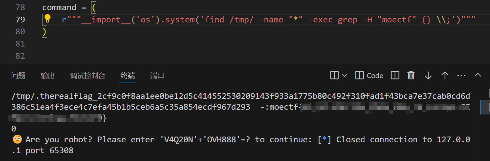
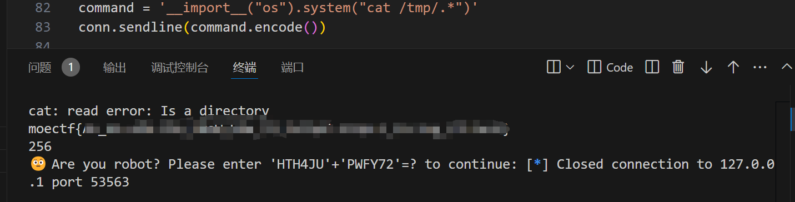
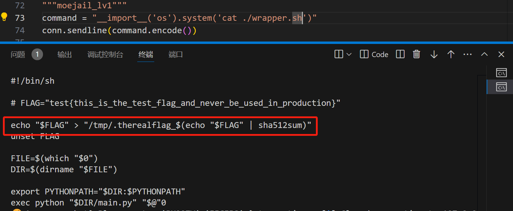
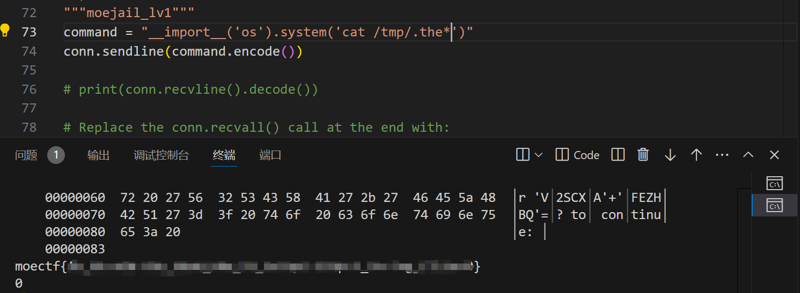

---
tags:
  - notes
comments: true
dg-publish: true
---

拿到 shell/ 可以任意代码执行了都不知道该干什么？下面是可能的思路以 [moectf2024 moejail_lv1](https://ctf.xidian.edu.cn/games/10/challenges?challenge=95) 为例。

## 暴力搜索文件内容

例如，我们可以使用 `find . -name "*" -exec grep -H "flag{" {} \;` 来递归搜索文件中包含 `flag{` 字段的文件，熟悉命令的话可以知道，`.` 表示由当前路径开始，`*` 所在的引号内表示匹配的文件名，`*` 表示我们想要搜索所有文件。

（这里使用 /tmp/ 是因为我已经知道它在那了，节约时间）

如果发现什么都没搜到，可能需要注意的是[globbing pathnames](https://man7.org/linux/man-pages/man7/glob.7.html)：

> [!CITE]
>
> If a filename starts with a `.`, this character must be matched explicitly.  (Thus, _rm *_ will not remove .profile, and _tar c *_ will not archive all your files; _tar c ._ is better.)

例如

但是

## 查看一些关键信息

### 环境变量

执行 `env` 或者 `set` 可以查看环境变量（有时可能就是 `echo $FLAG` 就可以了）。

### 命令历史

在 `~/.history` `~/.bash_history` `~/.zsh_history` 中可能包含了执行过的历史记录，从命令我们可以推测出题人之前在这干了什么。

例如，我在使用 zsh 之前只是使用 bash 安装了 zsh 而已：

## 从当前文件找线索

### 查看当前路径

可以使用 `pwd` `ls` `ls -a` 等查看当前路径及文件。

### 就近查看文件寻找有用信息

### 查看对应的文件

## 其他

其他可能存在信息，但是不那么常见的内容，包括当前 shell 所在服务器/系统的信息，运行过的进程等等……