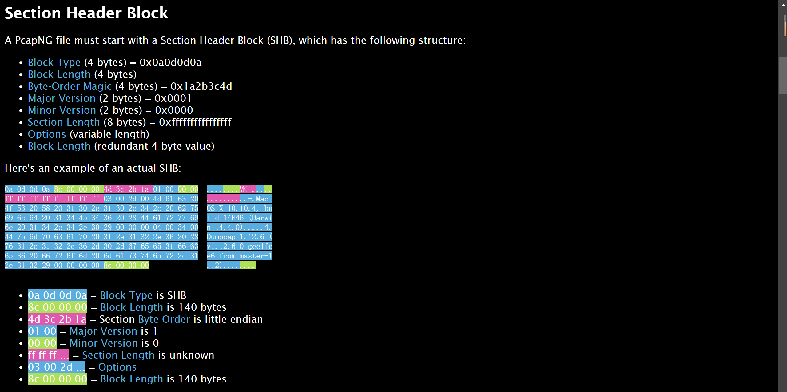
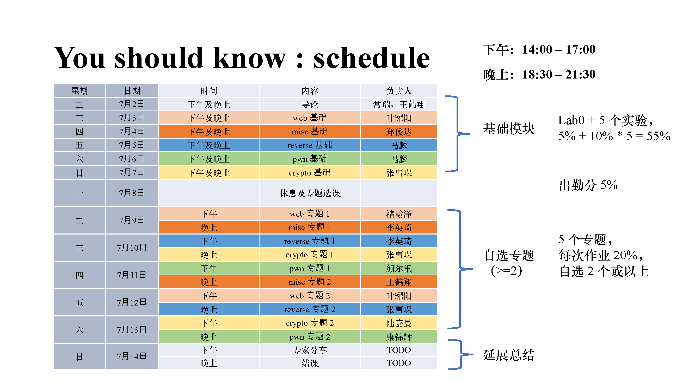

---
tags:
- ctf
- collection
comments: true
---

> [!SUMMARY]
>
> CTF 学习过程中用到的工具；后来也把一些比较好的文章放在里面了；如果前有一个 `-` 表示我还没具体看/用过，但是粗看还不错。

## 综合性网站

- [随波逐流](http://1o1o.xyz/)
- [mzy0](https://ctf.mzy0.com/)

## 学习平台

- [CTF-wiki](https://ctf-wiki.org/)
- [Hello-ctf](https://hello-ctf.com/)
- [-Practical CTF](https://book.jorianwoltjer.com/)

## 练习&赛事平台

- [ZJUBUS](https://zjusec.com/)
    - 需要 ZJU 校网
- [NSSCTF](https://www.nssctf.cn/problem)
- [BUUCTF](https://buuoj.cn/challenges)
- [-攻防世界](https://adworld.xctf.org.cn/challenges/list)
- [cryptohack](https://cryptohack.org/challenges/) or [-cryptopals](https://cryptopals.com/)
- [-bugku](https://ctf.bugku.com/)
- [Ethernaut 题库闯关题解](https://learnblockchain.cn/column/19)
- [ctftime](https://ctftime.org/ctfs)
    - 国内外知名赛事
- [-CTF-writeups-public](https://shiltemann.github.io/CTF-writeups-public/)

## MISC

- [FileReverse-Tools](https://github.com/AabyssZG/FileReverse-Tools)
    - “对二进制文件反转、倒置以及十六进制编码处理相关的工具，解决CTF和工作中的文件处理问题”
- [CTFCrackTools](https://github.com/0Chencc/CTFCrackTools)
    - 挺久没更新了
- [-PuzzleSolver](https://github.com/Byxs20/PuzzleSolver)
    - 现在获取需要一些“代价”
- [misc总结(隐写篇)](https://www.dr0n.top/posts/b9152a17/#0x06-snow%E9%9A%90%E5%86%99)

### 图片类

- [Aperi'Solve](https://aperisolve.com)
    - 图片一把梭
    - [Aperisolver](https://github.com/Zeecka/AperiSolve)
        - 项目仓库，支持本地 dockers 运行
- [steghide](https://steghide.sourceforge.net/download.php)
    - [medium——Steghide Tool](https://medium.com/@ece11106.sbit/steghide-tool-ec74edd69de4)
- [Barcode 阅读器](https://demo.dynamsoft.com/barcode-reader/)
    - 很多类型的二维码都能扫
- [Barcode Generator](https://barcode.tec-it.com/zh/)
    - 二维码生成器
- [fotoforensics](https://fotoforensics.com/)
    - 图像取证分析
- [blind_watermark](https://github.com/guofei9987/blind_watermark)
    - 直接嵌入的盲水印
- [BlindWaterMark](https://github.com/chishaxie/BlindWaterMark)
    - 相似图嵌入的盲水印
- [gaps](https://github.com/nemanja-m/gaps)
    - 自动拼图
- [Visual_cryptography](https://www.wikiwand.com/en/articles/Visual_cryptography)
    - 对两张图像进行异或
    - [例题](https://wilige.top/2018/09/26/NTFS%E6%95%B0%E6%8D%AE%E6%B5%81%E9%9A%90%E5%86%99/)
- [Deformed-Image-Restorer](https://github.com/AabyssZG/Deformed-Image-Restorer)
    - 图片宽高自动爆破修复

- [ctf101-misc-slider](https://slides.tonycrane.cc/CTF101-2023-misc/lec2/#/3/5)
    - 也许该好好看看？

### 压缩包

- [APPNOTE-6.3.9.TXT](https://pkware.cachefly.net/webdocs/APPNOTE/APPNOTE-6.3.9.TXT)
    - 4.0 ZIP Files
- [hashcat](https://github.com/hashcat/hashcat)
- [zip 伪加密检测](https://ctfever.uniiem.com/tools/pseudo-encrypted-zip-check)
- [CRC32-Tools](https://github.com/AabyssZG/CRC32-Tools)
    - CRC碰撞全自动化脚本
- [bkcrack](https://github.com/kimci86/bkcrack)
    - [zip明文攻击](https://www.uf4te.cn/posts/3a71eb8.html)
    - [使用明文攻击破解加密的zip文件](https://www.poboke.com/crack-encrypted-zip-file-with-plaintext-attack.html)
### 音频类

- [audio-decoder-adaptive](https://morsecode.world/international/decoder/audio-decoder-adaptive.html)
    - 直接根据音频自己解莫斯密码
- [slienteye](https://achorein.github.io/silenteye/)
- [audacity](https://www.audacityteam.org/)
- [常见题型](https://blog.csdn.net/qq_51652400/article/details/123504708)

### OSINT

> [!QUESTION]
>
> 什么是 [OSINT](https://www.wikiwand.com/en/articles/Open-source_intelligence) ？

-  [Digital-Privacy](https://github.com/ffffffff0x/Digital-Privacy/blob/master/README.zh-cn.md#manual)
    - 一个巨大的开源信息站点收集项目

- [谷歌地图](https://www.google.com/maps)
- [百度地图](https://map.baidu.com/)
- [高德地图](https://ditu.amap.com/)
- [saucenao](https://saucenao.com/)
- [GeoSpy](https://geospy.ai/)
    - 根据图片使用 AI 寻找地点（当然，不是很准，但是他的描述中可能会有你本来没注意到的地方）
- 太阳角度、阴影长度等太阳相关
    - [suncalc](https://www.suncalc.org/)
    - 时间→位置互相估计
- 飞机航班信息
    - [-flightaware](https://flightaware.com)
    - [-flightradar24](https://flightradar24.com)
    - [-adsbexchange](https://adsbexchange.com)
    - 估计方向，位置，时间等
- 风景信息→Yandex 搜索
- 天气信息、云层信息等

- [web archive](https://web.archive.org/)
    - 网页存档

- 网络空间搜索
    - [-钟馗之眼](https://www.zoomeye.org/)
    - [-fofa](https://fofa.info/)
    - [-shodan](https://www.shodan.io/)
- [codesearch](https://codesearch.aixcoder.com/#/)
- [sourcegraph](https://sourcegraph.com/search)

### 流量分析

- [wireshark](https://www.wireshark.org/#downloadLink)
- [PcapNG File Format](https://pcapng.com/)

- [CSDN —— pcapng 文件格式](https://blog.csdn.net/m0_53887937/article/details/133978428)
    - [文件提取](https://zgao.top/%E4%BB%8Ewireshark%E6%B5%81%E9%87%8F%E4%B8%AD%E6%8F%90%E5%8F%96%E6%96%87%E4%BB%B6/)
- [pcap fix](https://f00l.de/hacking/pcapfix.php)

### 内存取证

- [volatility foundation](https://github.com/volatilityfoundation)
    - [csdn-volatility 的安装与使用](https://blog.csdn.net/weixin_44895005/article/details/123917324)
- [-LovelyMem](https://github.com/Tokeii0/LovelyMem)

- [ctf101-misc](https://slides.tonycrane.cc/CTF101-2023-misc/lec3/#/2)
### 区块链与以太坊

- [remix](https://remix.ethereum.org/)
    - solidity 在线编辑平台
- [ethernaut](https://ethernaut.openzeppelin.com/)
    - 著名以太坊智能合约入门题目集
    - [Youtube上的讲解](https://www.youtube.com/playlist?list=PLO5VPQH6OWdWh5ehvlkFX-H3gRObKvSL6)
- [powfaucet](https://sepolia-faucet.pk910.de/)
      -  sepolia 中 ETH 的获取源
- [Ethereum Unit Converter](https://eth-converter.com/)
- [鹤翔万里——以太坊区块链合约安全基础](https://www.bilibili.com/video/BV1q2421Z7NK/)
- [-chainflag](https://chainflag.org/challenges)

### 简单编解码

- [CyberChef](https://gchq.github.io/CyberChef/)
    - 赛博厨子
- [ciphey](https://github.com/Ciphey/Ciphey)
    - 自称快于 CyberChef，且捕获类似于 flag{content} 的结果（如果实际的 flag 比较奇怪，或者有一层混淆之类的，可能导致无法解出）
    - 基本使用：
        - `ciphey -t "encode_flag"`
        - `ciphey -f flag.txt`
- [python-codext](https://github.com/dhondta/python-codext)
    - 能在 python 中使用，也能在命令行使用
- [CaptfEncoder](https://github.com/guyoung/CaptfEncoder)
- [Tupper's self-referential formula](https://www.wikiwand.com/en/articles/Tupper%27s_self-referential_formula)
    - [tuppers-formula](https://tuppers-formula.ovh/)
- [Zero-Width Characters](https://medium.com/@umpox/be-careful-what-you-copy-invisibly-inserting-usernames-into-text-with-zero-width-characters-18b4e6f17b66)
    - [zero-width-web](https://yuanfux.github.io/zero-width-web/)
- [-basecrack](https://github.com/mufeedvh/basecrack/) <- base 系列爆破
    - [-base64decode](https://www.base64decode.org/) 还支持文件解码
- [键盘按键代码](https://www.lizhanglong.com/Tools/KeyCode)
- [新佛曰](http://hi.pcmoe.net/buddha.html)

- [CTF 常见编码及加解密](https://www.cnblogs.com/ruoli-s/p/14206145.html)
- [Crypto CTFs Tricks](https://book.hacktricks.xyz/cn/crypto-and-stego/crypto-ctfs-tricks)

### 其他

- [Poppler (software)](https://www.wikiwand.com/en/articles/Poppler_(software))
    - 处理 pdf 的命令行工具。
- [igfonts](https://igfonts.io/) or [Italic Text Generator](https://lingojam.com/ItalicTextGenerator)
    - 生成 Unicode 混淆字符，绕过 ASCII 过滤
- [Alternate Data Streams (ADS)](https://www.nirsoft.net/utils/alternate_data_streams.html)
    - 
- [hex](https://hexed.it/)
    - 在线十六进制编辑器
- [List_of_file_signatures](https://www.wikiwand.com/en/articles/List_of_file_signatures)
- [NATO phonetic alphabet](https://www.wikiwand.com/zh/articles/%E5%8C%97%E7%BA%A6%E9%9F%B3%E6%A0%87%E5%AD%97%E6%AF%8D)
- [-VirusTotal](https://www.virustotal.com/gui/home/upload)
    - 文档、url 等病毒检测
- [whitespace](https://esolangs.org/wiki/Whitespace)
    - 奇奇怪怪的编程语言；居然有在线编译能运行它
    - [-ideone](https://ideone.com/)

## Crypto

> 也许分类没那么正确，主要是否需要一些数学知识来区分古典密码和现代密码。

-  [practicalcryptography](http://www.practicalcryptography.com/)

### 古典密码学

- [quipqiup](https://quipqiup.com/) or  [SubstitutionBreaker](https://gitlab.com/guballa/SubstitutionBreaker)
    - 换位密码
- [Boxentriq](https://www.boxentriq.com/)
    - Code-Breaking, Cipher and Logic Puzzles Solving Tools
    - [cipher identifier](https://www.boxentriq.com/code-breaking/cipher-identifier)
    - [caesar-cipher](https://www.boxentriq.com/code-breaking/caesar-cipher)
    - [-vigenere-cipher](https://www.boxentriq.com/code-breaking/vigenere-cipher)
- [-Vigenère Solver](https://www.guballa.de/vigenere-solver) or [-Vigenere](https://atomcated.github.io/Vigenere/)
    - 维吉尼亚密码，多挺多的，不知道哪个好用一些；密钥长度超过 30 就别想着能直接爆破了……
- [codecs](https://github.com/python/cpython/blob/main/Lib/codecs.py) or [codext](https://github.com/dhondta/python-codext)
    - 更全的解码 python 库
- 不明觉厉系列：
    - [-dcode](https://www.dcode.fr/)
    - [-dencode](https://dencode.com/)

### 现代密码学

- [factordb](http://factordb.com/)
    - 大数因式分解，支持的数据大小是我所见过最大的；
    - [factordb-python](https://pypi.org/project/factordb-pycli/) 本地运行。
- [OEIS](https://oeis.org/)
    - **在线整数序列百科全书**（On-Line Encyclopedia of Integer Sequences）
- [proofWiki](https://proofwiki.org/wiki/Main_Page)
    - 数学性质（证明）查找
- [Sage math](https://www.sagemath.org/)
    - [sagecell online](https://sagecell.sagemath.org/)
    - [sage document](https://doc.sagemath.org)
        - [Cryptography part](https://doc.sagemath.org/html/en/reference/cryptography/index.html)
    - [学习记录](https://darstib.github.io/blog/tutorial/python_learn/crypto/)
- [GmSSL](https://github.com/guanzhi/GmSSL)
    - 国产商用密码开源库
- [SSL tools](https://www.ssleye.com/ssltool/)

### 常用攻击脚本

- [RsaCtfTool](https://github.com/RsaCtfTool/RsaCtfTool)
- [-PadBuster](https://github.com/AonCyberLabs/PadBuster)

## Web

- [Githack](https://github.com/lijiejie/GitHack)
- [DNS lookup](https://www.nslookup.io/)
- [JWT](https://jwt.io/)
- [BurpSuite](https://portswigger.net/burp/releases)
    - [BurpSuite 配置](http://testingpai.com/article/1715763803515)
- [regex101](https://regex101.com/)
    - 可以 debug 看到详细的正则匹配过程，然后利用匹配步数限制来绕过检测

- [csdn-webshell 工具流量特征分析](https://blog.csdn.net/qq_53577336/article/details/125048353)
- [CTF Web信息搜集](https://rickliu.com/posts/24259a52c7ee/index.html)
- JS 总结
    - [-CTF比赛中关于javascript的总结](https://introspelliam.github.io/2017/11/12/misc/CTF%E6%AF%94%E8%B5%9B%E4%B8%AD%E5%85%B3%E4%BA%8Ejavascript%E7%9A%84%E6%80%BB%E7%BB%93/)
    - [-2022 年 CTF Web 前端與 JS 題總結](https://blog.huli.tw/2022/12/26/ctf-2022-web-js-summary/)

## 泛工具箱

- [CTFtools-wiki](https://github.com/ProbiusOfficial/CTFtools-wiki)
- [Hello-ctf toolkit](https://hello-ctf.com/ToolKit/)
- [ctf-tools](https://github.com/zardus/ctf-tools)
- https://blog.51cto.com/hsqcpp/7939098
- [Awesome-CTF](https://github.com/Threekiii/Awesome-CTF)
- [CTFNOTE](https://github.com/TFNS/CTFNote)
- [-ctfever](https://ctfever.uniiem.com/)
- [-bugku](https://ctf.bugku.com/tools)
- [-Openctf的工具箱](https://ns.openctf.net/learn/misc.html#%E5%B8%B8%E8%A7%81%E9%A2%98%E5%9E%8B%E5%8F%8A%E5%B7%A5%E5%85%B7)
- [UU在线工具](https://uutool.cn/)
    - [文本文件合并](https://uutool.cn/txt-merge/)

## CTF101

- [Flag提交网站](https://ctf.zjusec.com/games/3/challenges)
- [实验网站](https://courses.zjusec.com/slides/)
- [智云链接](https://classroom.zju.edu.cn/coursedetail?course_id=63047)
- [一个小总结](https://juruo123.github.io/2024/07/02/CTF/)

