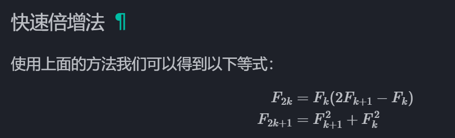
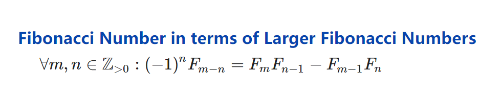
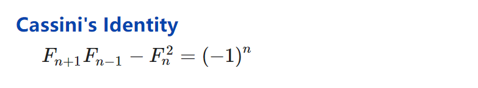
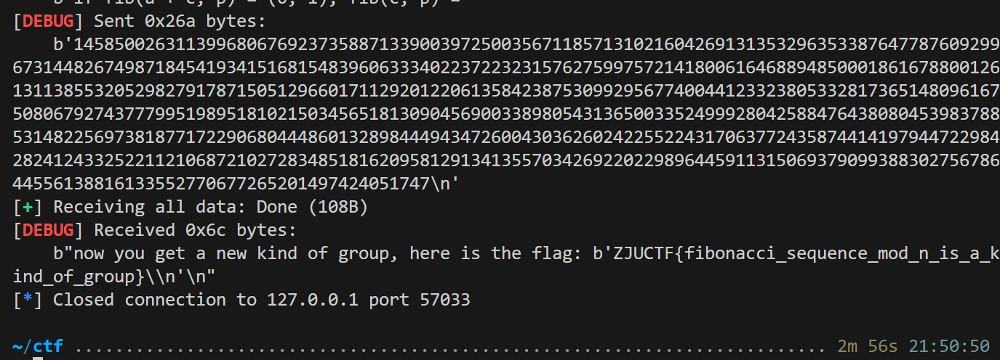
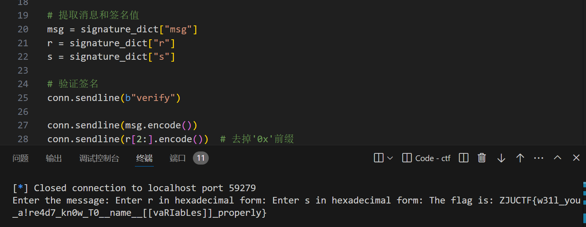

---
tags:
- notes
- ctf
comments: true
---

## easy_pad

经典的 padding oracle attack，详见

```python title="paddint_oracle.py"
def padding_oracle_attack(encrypt_msg):
IV = encrypt_msg[:16]
ciphertext = encrypt_msg[16:]
block_size = 16
blocks = [
    ciphertext[i : i + block_size] for i in range(0, len(ciphertext), block_size)
]
full_plaintext = b""

for block_index in range(len(blocks)):
    if block_index == 0:
        attack_IV = bytearray(IV)
    else:
        attack_IV = bytearray(blocks[block_index - 1])

    current_block = blocks[block_index]
    plaintext = bytearray(16)
    for byte_index in range(block_size - 1, -1, -1):
        padding_value = block_size - byte_index

        for i in range(block_size - 1, byte_index, -1):
            attack_IV[i] = IV[i] ^ plaintext[i] ^ padding_value
        # the char set of plaintext
        plaintext_set = b"0123456789abcdef"
        for pf in plaintext_set:
            attack_IV[byte_index] = IV[byte_index] ^ pf ^ padding_value
            attack_cipher = attack_IV + current_block
            if padding_decide(attack_cipher):
                plaintext[byte_index] = pf
                print("plaintext: ", plaintext)
                break
    IV = current_block
    full_plaintext += plaintext
return full_plaintext
```

交互脚本：

```python title="easy_pad_solver.py"
from pwn import *
from Crypto.Util.Padding import pad, unpad
from padding_oracle import padding_oracle_attack

# 提交message
def handOutMsg(message):
    print("hand out ing .............")
    con.sendafter(b"Quit", b"2\n")
    con.sendafter(b"Give me message", message.encode() + b"\n")

# padding
def sendAttackCiphertext(attack_ciphertext):
    # 将attack_ciphertext 由 bytearray 转为可发送的数据类型
    attack_ciphertext = attack_ciphertext.hex().encode()
    try:
        con.sendafter(b"2. Quit", b"1\n")
        con.sendafter(b"Give me ciphertext", attack_ciphertext + b"\n")
        respon = con.recvuntil(b"1. Decrypt").decode()
        return respon
    except EOFError:
        print("Connection closed unexpectedly")
        return None

# padding valid decide
def padding_decide(attack_ciphertext):
    times = 16
    responses = [sendAttackCiphertext(attack_ciphertext) for _ in range(times)]
    # 超过一半的返回值为False，则返回True
    if sum(1 for resp in responses if "False" in resp) > times / 2:
        return True
    elif sum(1 for resp in responses if "True" in resp) > times / 2:
        return False
    else:
        raise ValueError("padding_decide error")


context.log_level = "debug"
con = connect("127.0.0.1", 61600)

encrypt_msg = con.recvuntil(b"\n")[:-1]  # remove the last '\n'
encrypt_msg = bytes.fromhex(encrypt_msg.decode())
print(encrypt_msg)
# exit()

recovered_bytes = padding_oracle_attack(encrypt_msg)
print("recovered_bytes", recovered_bytes)
recovered_message = recovered_bytes.decode("ascii")
print("recovered_message: ", recovered_message)
handOutMsg(recovered_message)

con.recvall(timeout=10)
con.close()
```

## FIB I

考察斐波那契数列知识，参考 [Properties of Fibonacci Numbers](https://proofwiki.org/wiki/Properties_of_Fibonacci_Numbers) & [OI-wiki](https://oi-wiki.org/math/combinatorics/fibonacci/#%E5%BF%AB%E9%80%9F%E5%80%8D%E5%A2%9E%E6%B3%95)

三个部分依次参考：

### part1


### part2



将 k 看作二进制编码，分别用该递推公式求的 2 的幂倍的 a，然后使用 part1 相加

### part3



其中 $(-1)^n$ 用下面的公式获得：



### 代码：

交互代码：

```python title="fib1.py"
import re
from pwn import *
from fib1_func import fib_plus, fib_multi, fib_minus


def extract_info(data):
    p = int(re.search(r"p = (\d+)", data).group(1))
    k = int(re.search(r"k = (\d+)", data).group(1))
    fib_a = tuple(map(int, re.search(r"fib\(a, p\) = \((\d+), (\d+)\)", data).groups()))
    fib_b = tuple(map(int, re.search(r"fib\(b, p\) = \((\d+), (\d+)\)", data).groups()))
    return p, k, fib_a, fib_b


def getAns(res, p):
    return res[0] * p + res[1]


context.log_level = "debug"
con = connect("127.0.0.1", 57033)
for _ in range(10):
    data = con.recvuntil(b"fib(a + b, p) =").decode()
    p, k, fib_a, fib_b = extract_info(data)

    # part 1
    res = fib_plus(fib_a, fib_b, p)
    ans = getAns(res, p)
    con.sendline(str(ans).encode())

    # part 2
    data = con.recvuntil(b"fib(k * a, p) =").decode()
    res = fib_multi(k, fib_a[0], fib_a[1], p)
    ans = getAns(res, p)
    con.sendline(str(ans).encode())

    # part 3
    data = con.recvuntil(b"if fib(a + c, p) = (0, 1), fib(c, p) = ").decode()
    # extract fib(a+c, p)
    fib_apc = tuple(
        map(int, re.search(r"fib\(a \+ c, p\) = \((\d+), (\d+)\)", data).groups())
    )
    fib_c = fib_minus(fib_apc, fib_a, p)
    # fib_c = fib_a
    ans = getAns(fib_c, p)
    con.sendline(str(ans).encode())
con.recvall()
con.close()
```

函数代码：

```python title="fib1_func.py"
# part 1
def fib_plus(fib_a, fib_b, p):
    fa, fap1 = fib_a
    fb, fbp1 = fib_b
    # fapb = fa*fbp1 + fam1*fb
    fam1 = fap1 - fa
    fapb = (fa * fbp1 + fam1 * fb) % p
    # fap1pb = fap1*fbp1 + fa*fb
    fapbp1 = (fap1 * fbp1 + fa * fb) % p

    return fapb, fapbp1


# part 2
import sys
sys.setrecursionlimit(1500)  # 将递归深度限制设置为 1500

def fib_2power(n, fa, fap1, p):
    if n == 1:
        return fa, fap1
    # print(n)
    c, d = fib_2power(n >> 1, fa, fap1, p)

    c2 = (c * (2 * d - c)) % p
    d2 = (c * c + d * d) % p

    if n & 1:
        return d2, (c2 + d2) % p
    else:
        return c2, d2


def fib_multi(k, fa, fap1, p):
    from math import log2

    # 将 k 转为 2 进制数，并分别求 fib_2power(k) 的值，使用 fib_plus() 合并
    k_bin = bin(k)[2:][::-1]
    k_len = len(k_bin)
    res = (0, 1)
    for i in range(k_len):
        if k_bin[i] == "1":
            res = fib_plus(res, fib_2power(2**i, fa, fap1, p), p)
    return res


# Part 3
def fib_minus(fib_a, fib_b, p):
    fa, fap1 = fib_a
    fb, fbp1 = fib_b
    fam1 = fap1 - fa
    fbm1 = fbp1 - fb
    factor = fbp1 * fbm1 - fb * fb
    famb = (factor * (fa * fbm1 - fam1 * fb)) % p
    fambp1 = (factor * (fap1 * fbm1 - fa * fb)) % p

    return famb, fambp1
```



> [!FLAG]
>
> ZJUCTF{fibonacci_sequence_mod_n_is_a_kind_of_group}

## ezxor

若明文比特为 $x_{0}x_{1}x_{2}x_{3}\dots$ 翻转前的 cipher 比特为 $y_{0}y_{1}y_{2}y_{3}\dots$ ，那么由于异或的交替性，有 $x_{i}=y_{i-1} \oplus y_{i} (1\leq i<len(cipher))$ ，所以我们可以靠 cipher 很快解出明文；

```python title="ezxor_solver.py"
ciphertext = "01100...01010110"

# print(bin(ord("R"))[2:].zfill(8)) # 01010010
plaintext_bin = "0"
for i in range(len(ciphertext) - 1):
    plaintext_bin += str(int(ciphertext[i]) ^ int(ciphertext[i + 1]))

# 8bits 一组，转换为字符
plaintext = ""
for i in range(0, len(plaintext_bin), 8):
    plaintext += chr(int(plaintext_bin[i : i + 8], 2))

print(plaintext)
# Romn{e!é^ the mundane worl¤     slike a starqy sky admiredàfrom a&bustling city.[ÊUCF{Tell_do>e!_Wel£¯me_to_YJUCTF_2<24!}

# ZJUCTF{Well_done!_Welcome_to_ZJUCTF_2024!}
```

翻转了怎么办？猜吧，一猜一个准：

> [!FLAG]
>
> ZJUCTF{Well_done!_Welcome_to_ZJUCTF_2024!}

## shad0wtime

~~紧张刺激的拼手速环节~~

```python title="shad0wtime_solver.py"
from pwn import *

context.log_level = "debug"
conn = remote("localhost", 59279)
conn.recvuntil(b"Enter your option: ")
conn.sendline(b"sign_time")

signature_data = conn.recvuntil(b"Enter your option: ").decode()
signature_dict = eval(signature_data.split("\n")[0])


msg = signature_dict["msg"]
r = signature_dict["r"]
s = signature_dict["s"]

conn.sendline(b"verify")

conn.sendline(msg.encode())
conn.sendline(r[2:].encode())  # 去掉'0x'前缀
conn.sendline(s[2:].encode())  # 去掉'0x'前缀

result = conn.recvall().decode()
print(result)

conn.close()
```



> [!FLAG]
>
> ZJUCTF{w31l_you_a!re4d7_kn0w_T0__name__[[vaRIabLes]]_properly}
