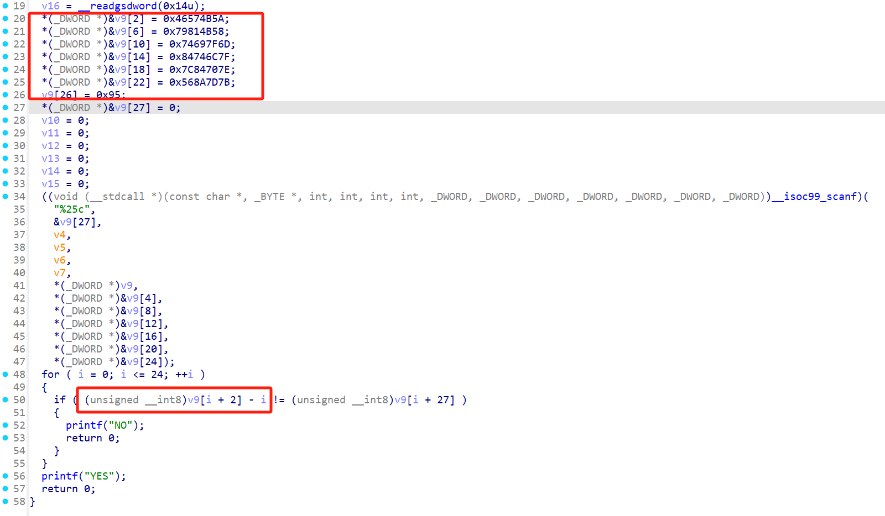
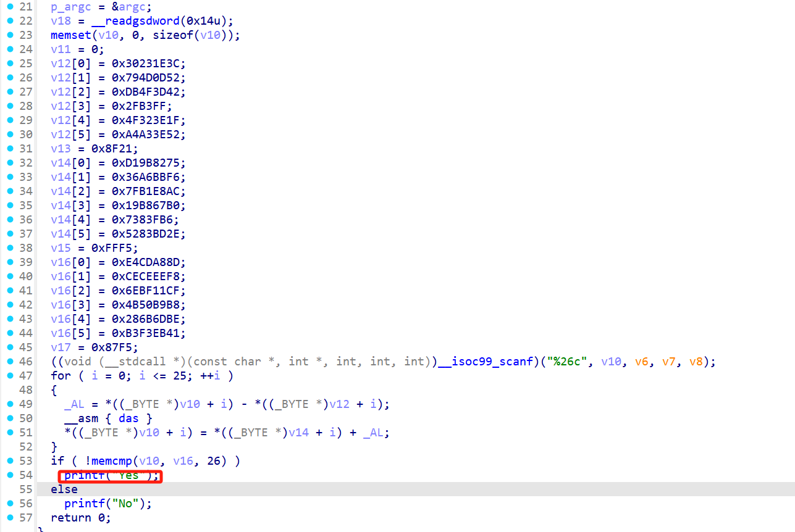

## rev beginner 1

使用 IDA 反汇编，读懂 main 函数部分即可：



```python title="input.py"
#   *(_DWORD *)&v9[2] = 0x46574B5A;
#   *(_DWORD *)&v9[6] = 0x79814B58;
#   *(_DWORD *)&v9[10] = 0x74697F6D;
#   *(_DWORD *)&v9[14] = 0x84746C7F;
#   *(_DWORD *)&v9[18] = 0x7C84707E;
#   *(_DWORD *)&v9[22] = 0x568A7D7B;
#   v9[26] = 0x95;

v9 = [
    0x00,
    0x00,
    0x5A,
    0x4B,
    0x57,
    0x46,
    0x58,
    0x4B,
    0x81,
    0x79,
    0x6D,
    0x7F,
    0x69,
    0x74,
    0x7F,
    0x6C,
    0x74,
    0x84,
    0x7E,
    0x70,
    0x84,
    0x7C,
    0x7B,
    0x7D,
    0x8A,
    0x56,
    0x95,
]

print(len(v9))

flag = ""
for i in range(25):
    flag += chr(v9[i + 2] - i)

print(flag)
```

> [!FLAG]
>
> ZJUCTF{rev_is_fun_right?}

## rev beginner 2



先学 [Das](https://www.felixcloutier.com/x86/das) ，正向爆破：

```c title="rev2_solver.c"
// v12
unsigned char p1[26] = {
    0x3C,
    0x1E,
    //...
    }
// v14
unsigned char p2[26] = {
    0x75,
    0x82,
    //...
    }
unsigned char p3[26] = {
    0x8D,
    0xA8,
    //...
    }

#include <stdio.h>
#include <string.h>
void process_input(unsigned char* input) {
    for (int i = 0; i <= 25; ++i) {
        unsigned char al = input[i] - (unsigned char)p1[i];
        __asm__("das" : "+a" (al));
        input[i] = (unsigned char)p2[i] + al;
    }
}

unsigned char das_simulate(unsigned char num, unsigned char al) {
    unsigned char numl = num&0x0f; // 低四位
    unsigned char numh = num&0xf0; // 高四位
    unsigned char all = al&0x0f;
    unsigned char aih = al&0xf0;
    bool AF, CF;
    AF = numl<all;
    CF = numh<aih+AF;
    unsigned char ret = (num-al);
    unsigned char a = ret&&0xf;
    unsigned char b = ret&&0xf0;
    if (a>9||AF) {
        ret -= 6;
    }
    if (b>144||CF) {
        ret -= 0x60;
    }
    return ret;
}

int main() {
    for (int i = 0; i < 26; ++i)
        for (int j = 33; j < 128; ++j) {
            unsigned char al = p3[i] - p2[i];
            if ((das_simulate(j, p1[i]) == al) && j>=0x20 && j<=0x7d) {
                printf("%c", j);
                break;
            }
        }
}
```


> [!FLAG]
>
> ZJUCTF{welc0me-2-reverse!}

