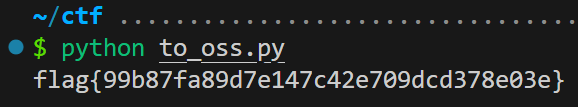

## easy Pentest

> [Devvai 粗略了解一下 OSS](https://devv.ai/search?threadId=e0ylg5ysejuo): （对话不公开）

学学 oss 的访问：

```python title="to_oss.py"
import oss2

# git 会检测密码，所以这里进行模糊，详见原题
access_key = "###"
secret_key = "###"
bucket_name = "oss-test-qazxsw"
object_key = "fffffflllllaaaagggg.txt"
auth = oss2.Auth(access_key, secret_key)
bucket = oss2.Bucket(auth, "https://oss-cn-beijing.aliyuncs.com", bucket_name)

# 获取文件内容
try:
    content = bucket.get_object(object_key).read()
    print(content.decode("utf-8"))
except Exception as e:
    print(f"error: {e}")
```



> [!FLAG]
>
> flag{99b87fa89d7e147c42e709dcd378e03e}