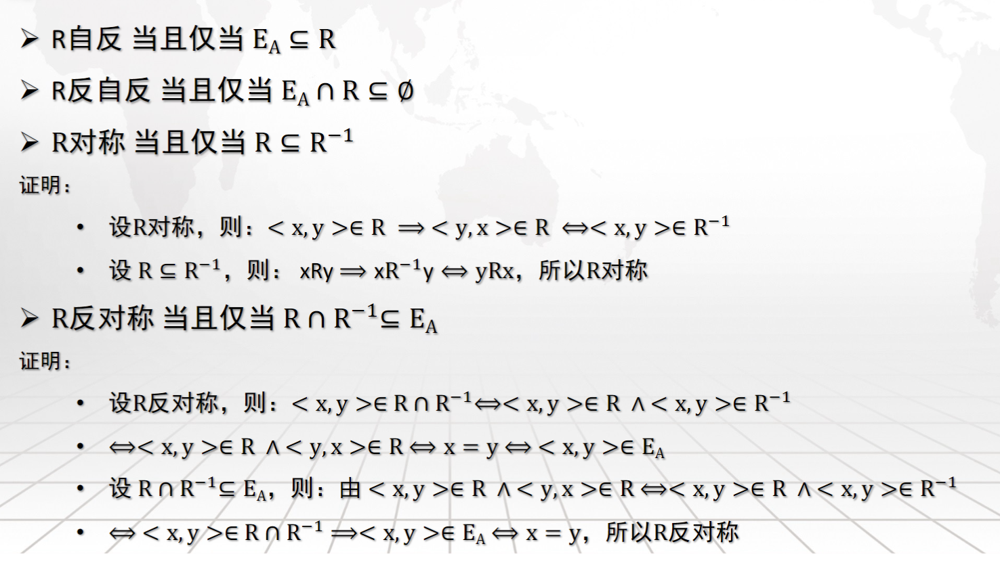
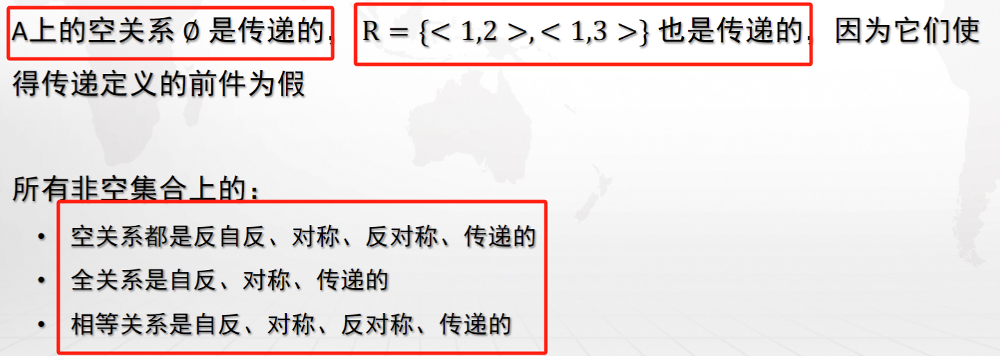
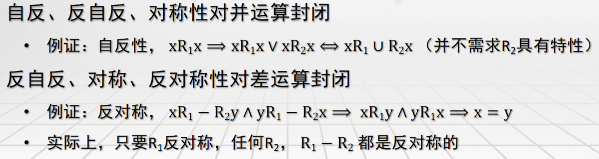

> 放一些信安原中讲到的的零碎知识点，如果后续系统学习了再搬进去；标题代表 PPT 出处。

## 离散数学

---

### 集合论（第十课 PPT）

> 对于关系的判定从图论的角度来看可能会更加好理解

如何理解下面红框中的两个推论：

首先理解下面两组定义：

- 由逻辑蕴涵 $P\to Q$ 当且仅当 $P=1  \land Q= 0$ 时为假 => A 为空时，$x \in A$ 恒为假，即 $P=0$ ，故（反）对称关系中推导式恒为真，故自反且反自反

- 对于 $E_{A}$ ，只有指向自己的边，任意两个节点之间都没有边！那当然是对称和反对称都满足了

---

---

---

结合传递关系的定义：

- $x,y,z \in A$ 本身为假，故该式恒真，故传递

-  在 R 中 $1\to2 ,1\to 3$ ，确实找不到不符合传递的两个节点，故传递

- 这些充要条件可以记忆

---

> [!NOTE]
>
> 我们通过有向图不仅可以描述关系，还可以描述运算 A&B（&表示某一运算符；A、B 具有相同的顶点，U 表示对应完全图；毕竟图本身就可以用集合来描述）：
> 
> - 并运算：A 添加 A 中没有但是 B 中有的边
> 
> - 差运算：A 删减 AB 中都含有的边
>
> - 交运算：保留 AB 中都含有的边
>
> - 补运算：相当于 U - A
>
> - 逆运算：相当于把有向图的边全部反过来

- 在一个每一个节点都有环的图中添加若干条边，每个节点依旧有环

- 在一个每一个节点都没有环的图中删去若干条边，依旧没有环

- 只要知道 $\neg y \overline{R}x \equiv yRx$ 就没啥问题了

- 两个图中节点都至多只指向自己，取它们的相同边，自然也只有指向节点自己的边

- 不难得证

---

最小（大）元与极小（大）元的区别是：

- **最** 要求所有元素均可以比较即均可表述为 <u>小于或等于</u> 

- **极** 则只需要那些可以比较的都符合 <u>小于或等于</u> 即可

> 如果一个集合中所有元素两两不可比较，那我们可以说所有元素都是极小（大）元

> [!NOTE]
>
> - B 的最大（小）元必为 B 的极大（小）元
>
> - B 不一定存在最大（小）元，但存在则是唯一的
>
> - 如果 B 是有限集，则 B 必存在极大（小）元，但未必唯一

一个例子：

---

一层划分为一个单元，不难验证

---