---
tags:
  - notes
comments: true
dg-publish: true
---

## ISA review

### Instruction Set Principles

- type of internal storage:
    - stack
    - accumulator
    - register

**GPR**: General Purpose Register
**TOS:** Top Of Stack

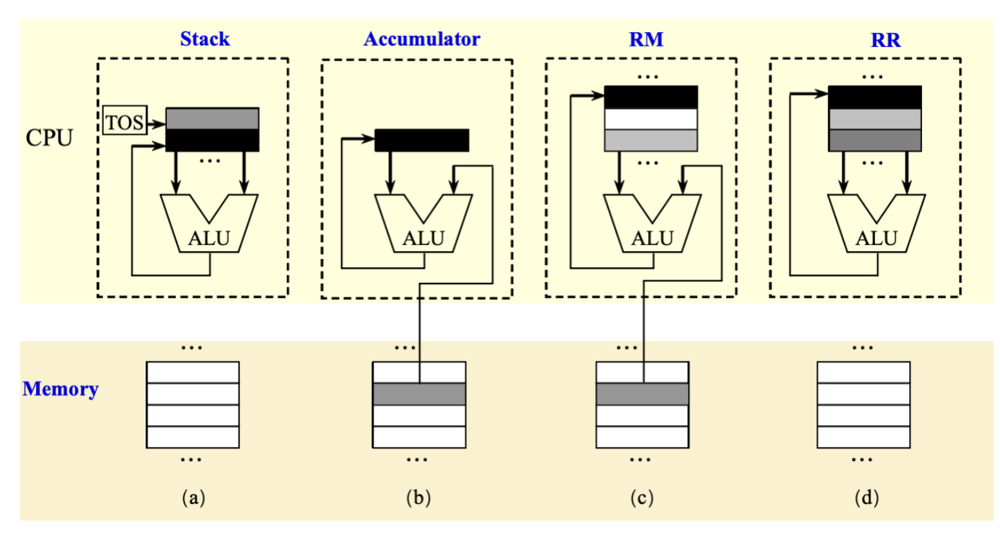

**Risc-V** (RR):
-  To apply arithmetic operations
    - Load values from memory into registers
    - Store result from register to memory
- Memory is byte addressed
    - Each address identifies an 8-bit byte
- Words are aligned in memory
    - Address must be a multiple of 4
- RISC-V is Little Endian
    - Least-significant byte at least address

- RISC-V ISA designed for pipelining
    - All instructions are 32-bits
        - Easier to fetch and decode in one cycle
        - c.f. x86: 1- to 17-byte instructions
    - Few and regular instruction formats
        - Can decode and read registers in one step
    - Load/store addressing
        - Can calculate address in 3rd stage, access memory in 4th stage
    - Alignment of memory operands
        - Memory access takes only one cycle

### Format of instructions

- Six Basic Instruction formats (similar to MIPS, but optimized)
    - Reduce combinational logic delay
    - Extend addressing range

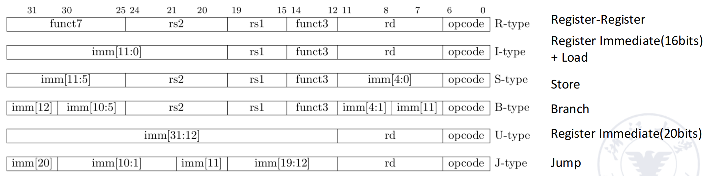

No subtract immediate instruction,Just use a negative constant 
- addi x8, x9, -1

### Address mode

- immediate addressing
- register addressing
- base addressing
- PC-relative addressing

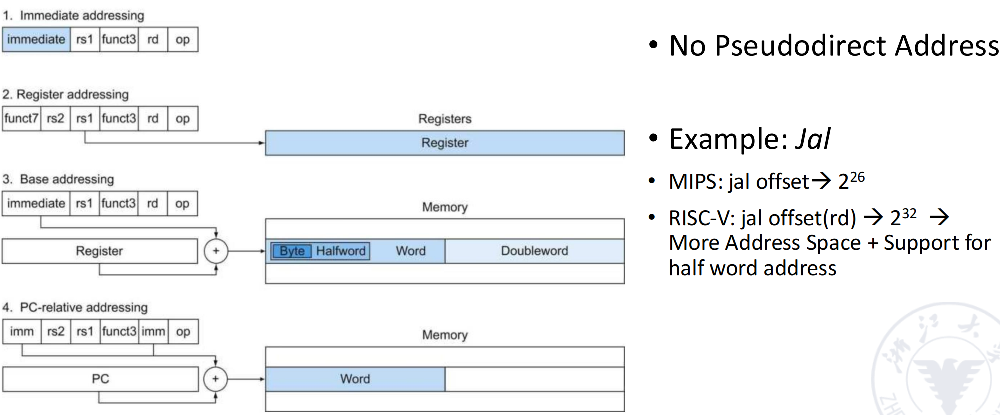

## Classes of pipelining

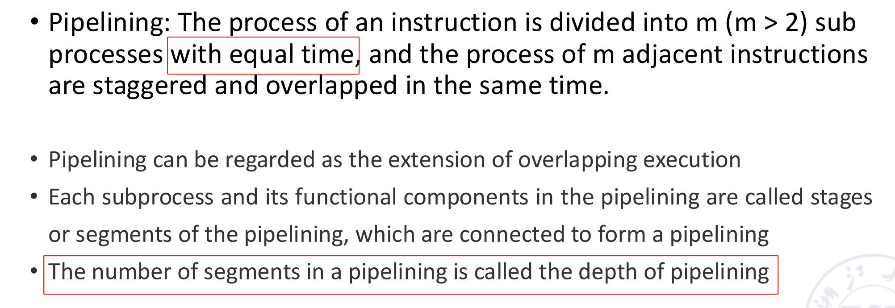

- The pipelining needs the pass time and the empty time
    - **Pass time**: the time for the first task from beginning (entering the pipelining) to ending.
    - **Empty time**: the time for the last task from entering the pipelining to have the result.

### single & multi

- Single function pipelining
    - only one fixed function pipelining (just like five-stages pipeline we will learn)
- Multi function pipelining
    - each section of the pipelining can be **connected differently** for several different functions.

> [!EXAMPLE]- 不同连接实现不同的功能
>
> 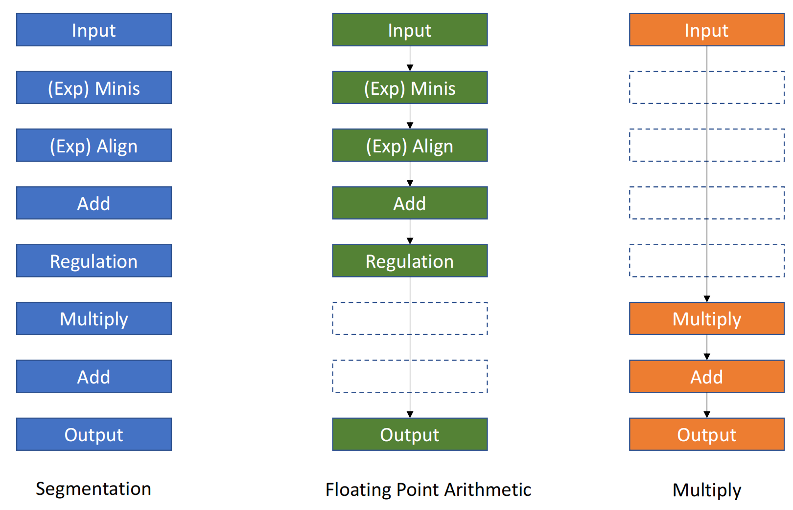

### static & dynamic

- Static pipelining
    - In the same time, each segment of the **multi- functional pipelining** can only work according to the connection mode of the same function
    - 也就是说，只有这一功能实现完毕后才能够切换；考虑流水线充满和排空的时间，如果反复切换功能，效率非常低。
- Dynamic pipelining
    -  In the same time, each segment of the **multi- functional pipelining** can be connected in different ways and perform multiple functions at the same time

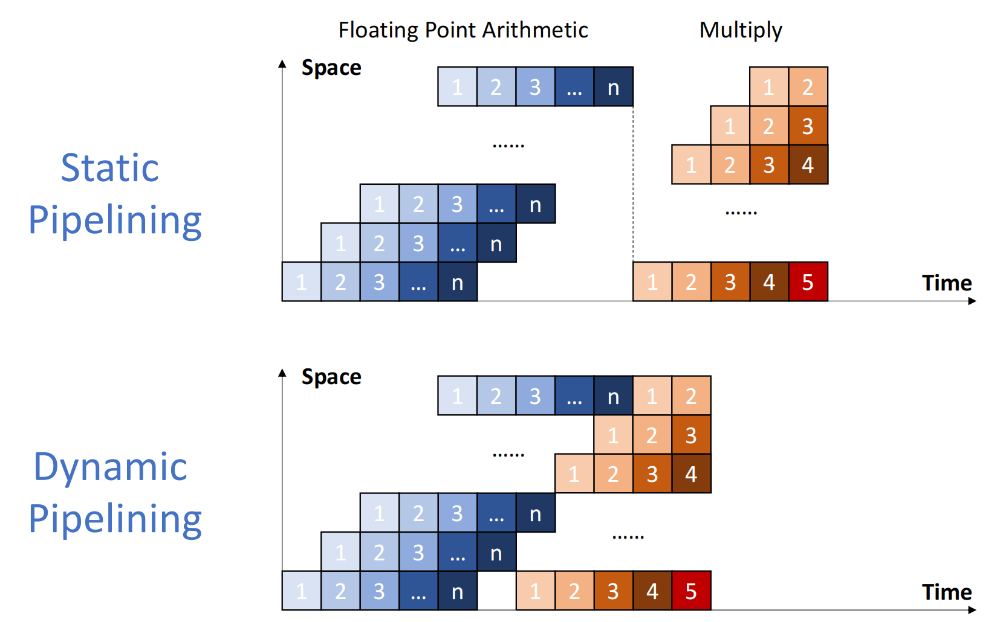

### linear & nonlinear

- Linear pipelining
    - Each stage of the pipelining is connected serially without feedback loop. When data passes through each segment in the pipelining, **each segment can only flow once at most**.
- Nonlinear pipelining
    - In addition to the serial connection, there is also a feedback loop in the pipelining
    - Initial conflit vector -> conflict vector -> state transition graph -> circular queue -> shortest average interval

> 关于做题，放在 [PBFX - Linear and nonlinear pipeline](PBFX.md#Linear%20and%20nonlinear%20pipeline)

### order & disorder

- Ordered pipelining
    - In the pipelining, the outflow order of tasks is exactly the same as the inflow order. Each task flows by sequence in each segment of the pipelining
- Disordered pipelining
    - In the pipelining, the outflow order of tasks is not the same as the inflow order. The later tasks are allowed completed first

## An Implementation of Pipelining

单纯从理解流水线来看，我们的流水线 CPU 应该是：

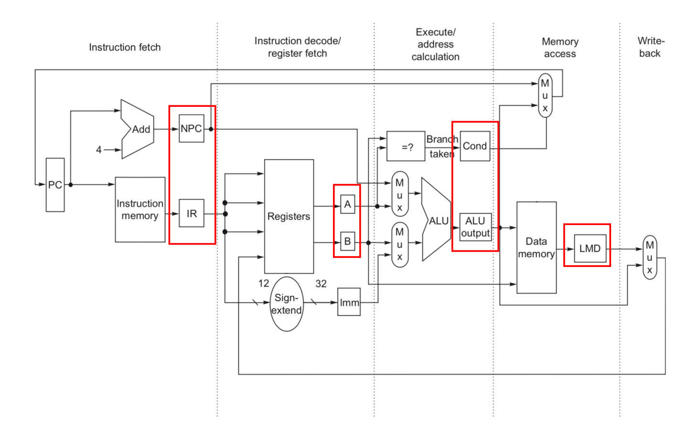

### Single-Cycle Datapath to the Pipelined Version

从单周期 CPU 的架构，试图将多条指令分阶段进行“并行”：

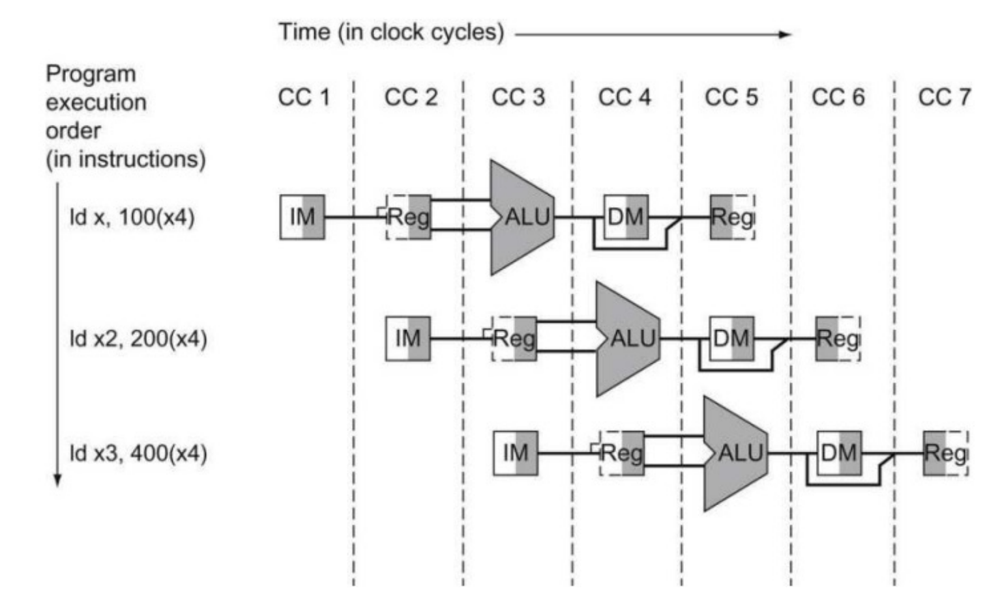

> [!HELP]
>
> 上图中，横轴表示时钟周期，纵轴依次表示下一条指令。
> 
> 右半部分灰色表示将要向该部件进行读取，左半部分灰色表示将要向该部件写入。

我们发现如果我们想要并行多条指令的执行，需要为每个并行指令设置一条数据通路；但是很多时候一些部件是空闲的，我们想要使得各部分部件能够同时处理不同指令的对应阶段，提高利用率。

但是对于同一个部件（例如寄存器），同时写入和取出可能会发生错误；同时我们需要同时存储 5 条指令所需要的内容（例如写入寄存器的地址、控制信号），我们使用 pipeline registers 来保留它们：

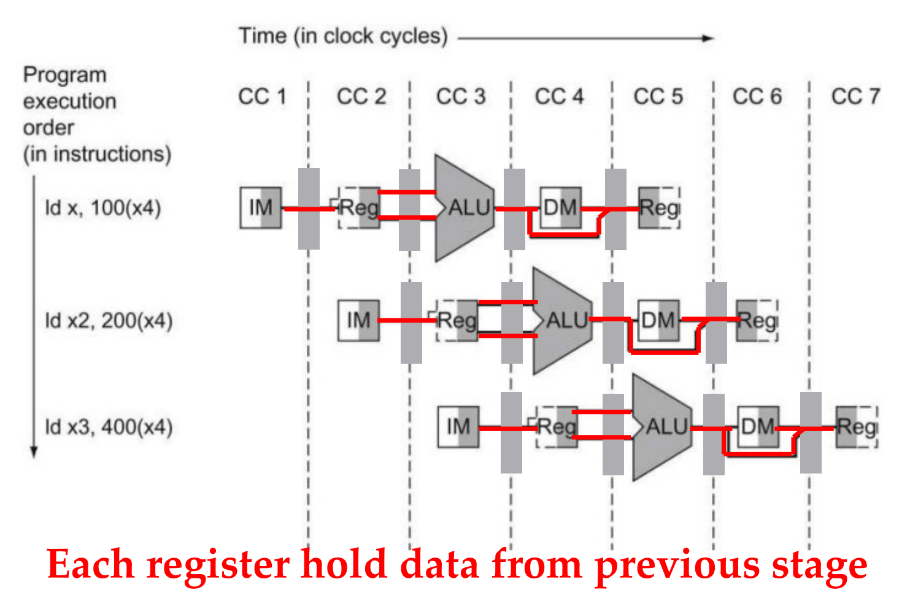

在数据通路上表现如下：

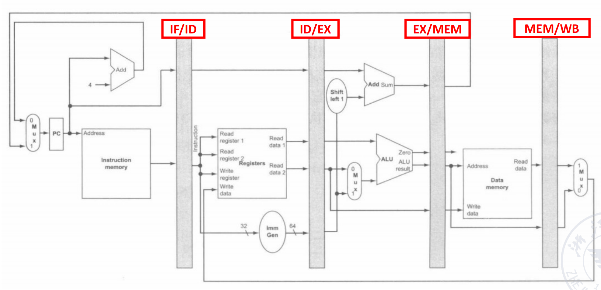

> [!NOTE]
>
> 上面的 datapath 在执行一些指令的时候还是有可能存在问题的；例如，在一个 ld 指令中，我们从 inst 中获取了 WB 的目标寄存器，但是在上图中丢失了，我们可能需要将这个寄存器地址不断向后传：
> 
> 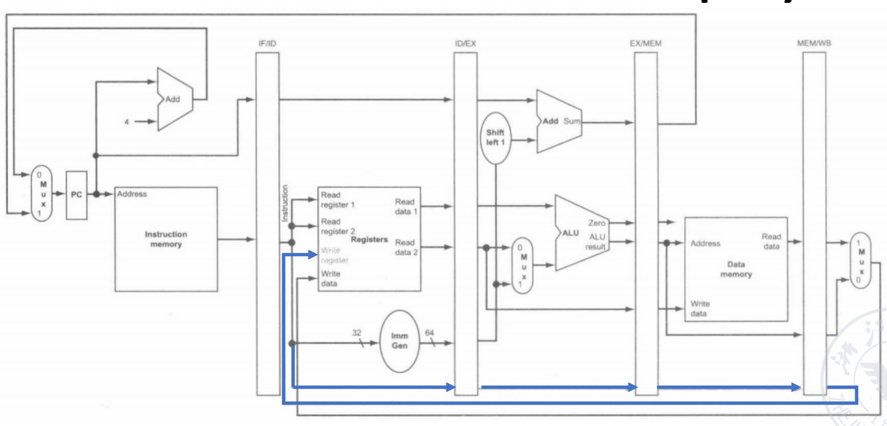

当然，针对不同的指令我们对于在 datapath 上可能“走向不同的分路”，这就需要控制信号，伪代码如下：

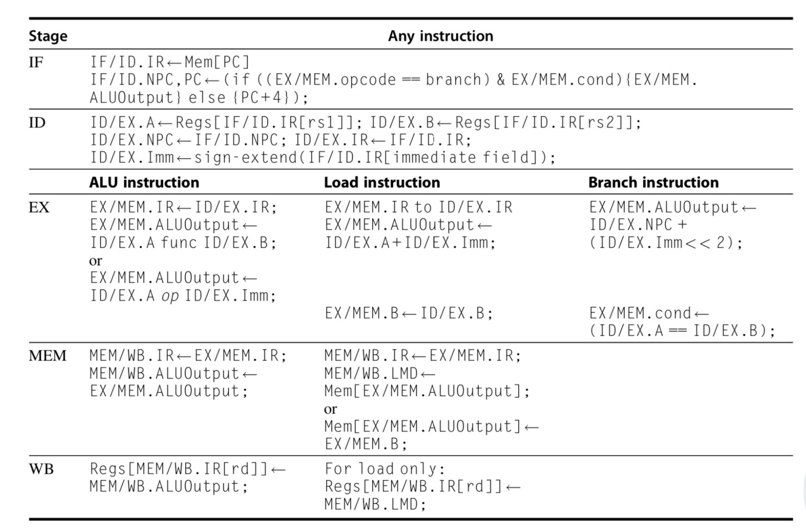

### Understand Pipelined Control Signals

以下面的指令为例：

```asm title="demo.asm"
ld x10, 40(x1)
sub x11, x2, x3
add x12, x3, x4
ld x13, 48(x1)
add x14, x5, x6
```

首先看看常见的流水线图的表示形式：

> [!NOTE]- Multiple-Clock-Cycle Pipeline Diagram of Five Instructions
>
>  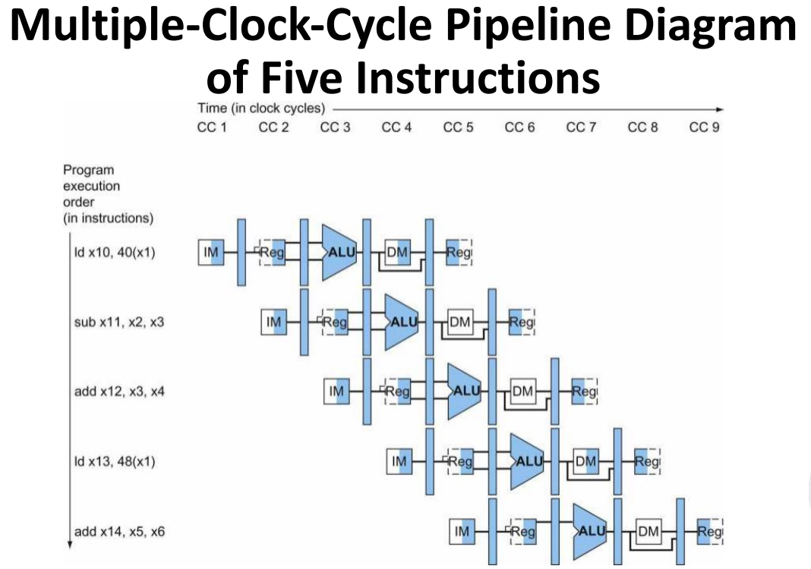

> [!NOTE]- Traditional Multiple-Clock-Cycle Pipeline Diagram
>
> 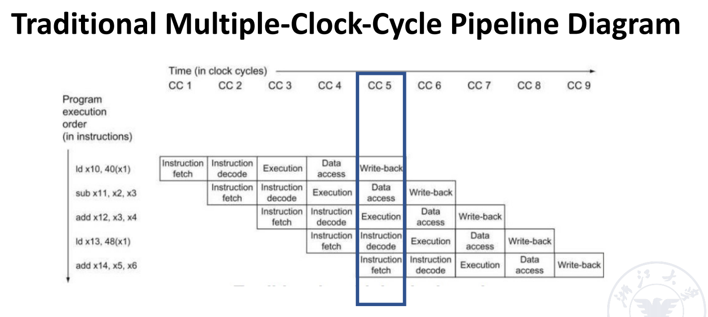

> [!NOTE]- Single-Clock-Cycle Pipeline Diagram
>
> 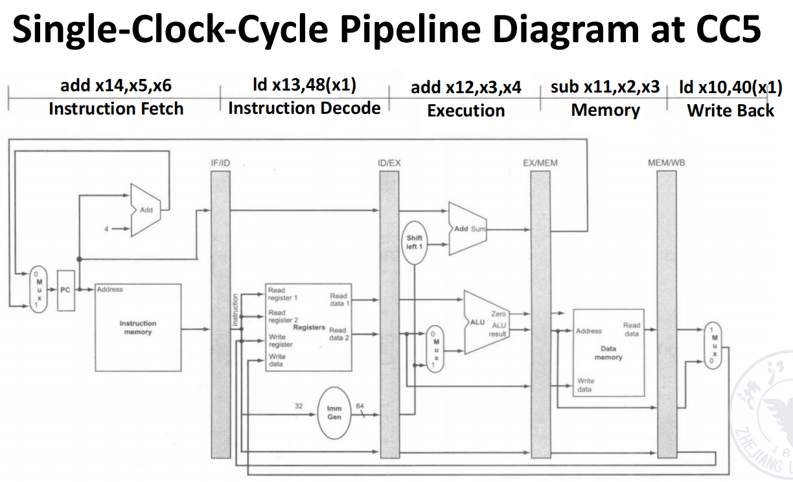

#### Review of control lines

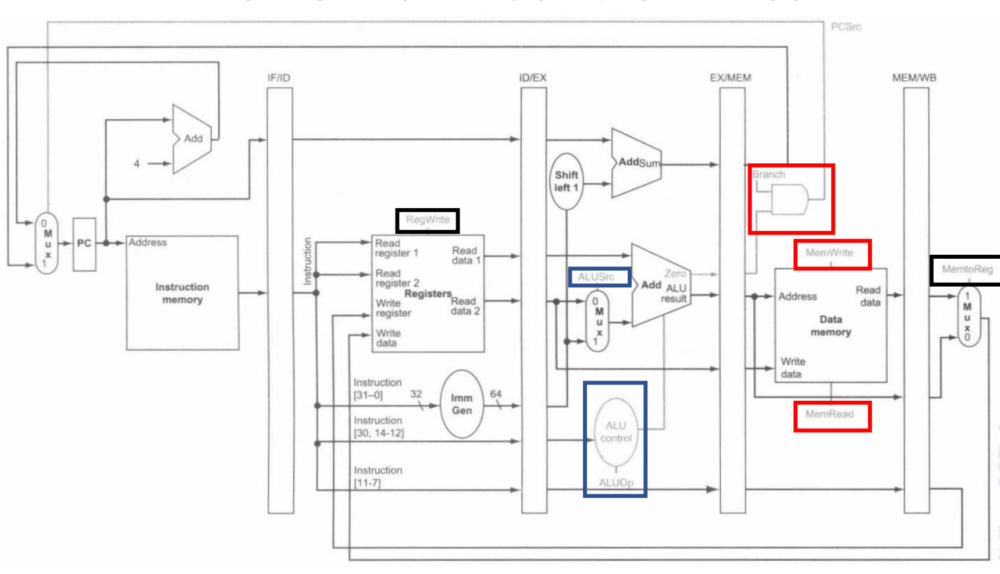

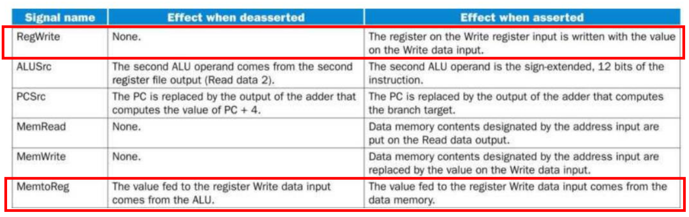

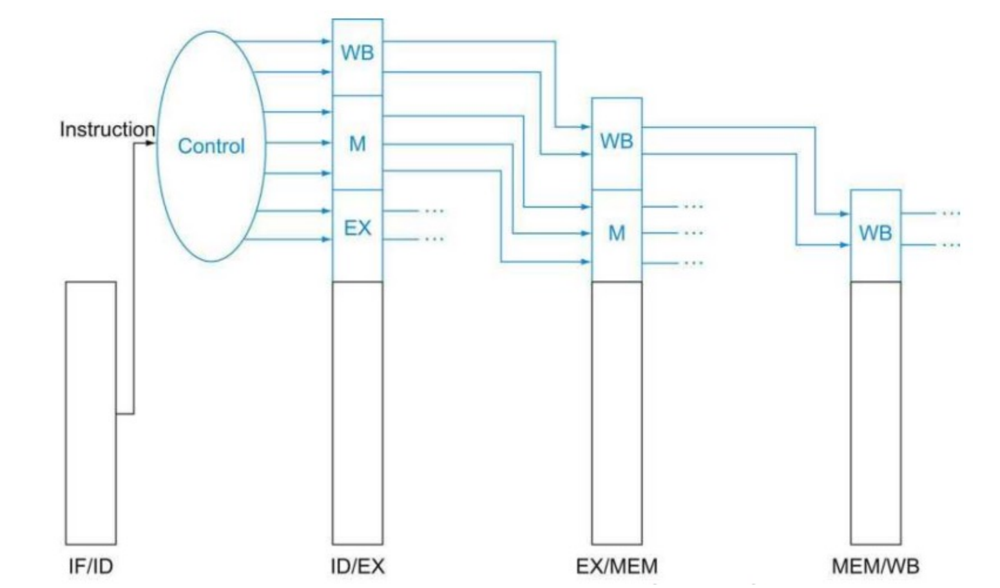

上图表示，在 ID 阶段我们通过解码指令获取 7 条控制信号，两条用于 EX 阶段、三条用于 MEM 阶段、两条用于 WB 阶段。

最终形成的 **Pipelined Datapath with the Control Signals**

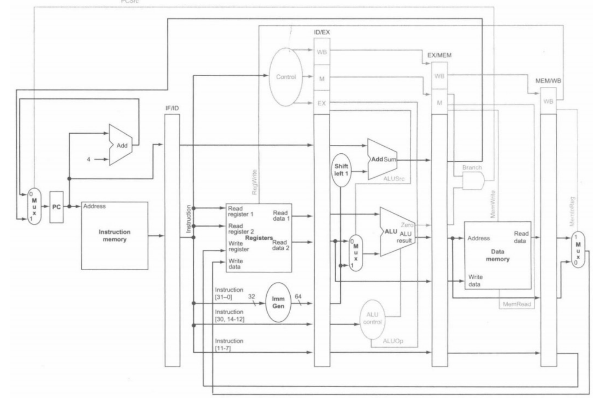

## Performance evaluation of Pipelining

### Throughput (TP)

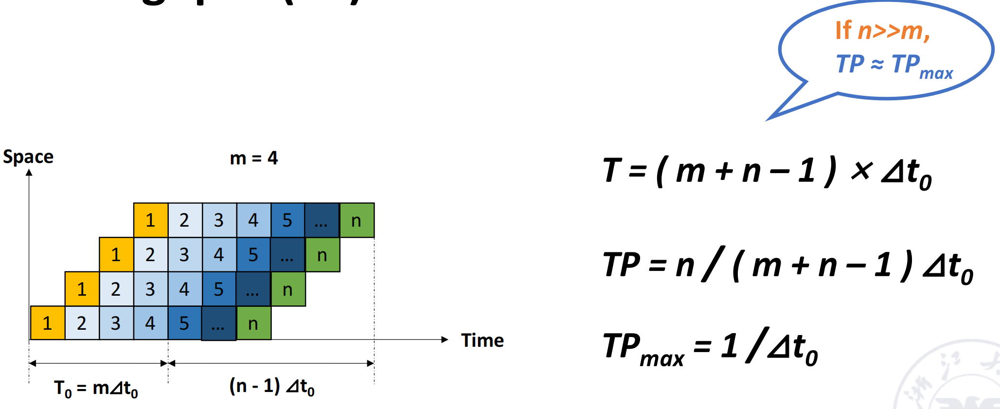

注意单位是 $(n/p/m)s^{-1}$ 。

实际上各阶段的用时并不相同，用时最长的为瓶颈阶段，其用时为： $\Delta t_{0} = max(\Delta t_{1}, \Delta t_{2} \dots, \Delta t_{m})$ 。

> [!NOTE] 优化流水线瓶颈阶段
>
> - 将瓶颈阶段进一步细分为可以流水线操作的更小阶段 (Subdivision)；
> - 重叠执行不同指令的瓶颈阶段 (Repetition)

### Speedup (Sp)

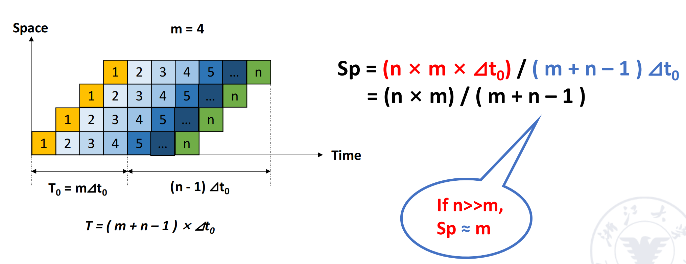

注意没有单位。

### Efficiency (η)

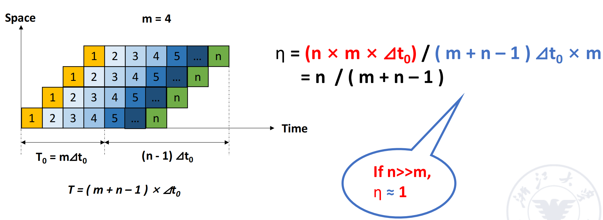

注意结果保留百分数。

> [!QUESTION] How Pipelining Improves Performance?
> 
> - [-] Decreasing the execution time of an individual instruction ×
> - [x] Increasing instruction throughput

## Hazard

### Structal Hazards

> A required resource is busy -> Use Instruction and data memory simultaneously.


- Problem: Two or more instructions in the pipeline compete for access to a single physical resource
- Solution
    - Instructions take it in turns to use resource, some instructions have to stall
    - Add more hardware to machine (Can always solve a structural hazard by adding more hardware)

### Data Hazards (important in sysII)

> [!DEFINITION] Data Hazards
>
> Data dependency between instructions, need to wait for previous instruction to complete its data read/write 
> -> Instruction depends on result from previous.


- Problem: Instruction depends on result from previous.

#### Solution 1: "Stall"

Wait for several cycles.

> [!QUESTION] How to stall?
>
> NOP instruction: `addi x0, x0, 0`
>
> 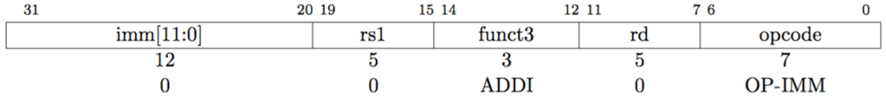or <div style="text-align: center;"><p></p></div>

#### Solution 2: “forwarding”

Adding extra hardware to retrieve the missing item early from the internal resources.

##### EX hazard

- if (EX/MEM.RegWrite and (EX/MEM.RegisterRd ≠ 0) and (EX/MEM.RegisterRd = ID/EX.RegisterRs1)) 
    - ForwardA = 10
- if (EX/MEM.RegWrite and (EX/MEM.RegisterRd ≠ 0) and (EX/MEM.RegisterRd = ID/EX.RegisterRs2)) 
    - ForwardB = 10

##### MEM hazard

- if (MEM/WB.RegWrite and (MEM/WB.RegisterRd ≠ 0) and (MEM/WB.RegisterRd = ID/EX.RegisterRs1)) 
    - ForwardA = 01
- if (MEM/WB.RegWrite and (MEM/WB.RegisterRd ≠ 0) and (MEM/WB.RegisterRd = ID/EX.RegisterRs2)) 
    - ForwardB = 01

##### Double Data Hazard

> 作为特殊的 MEM hazards 处理。

##### Forwarding Conditions

Detecting the Need to Forward:

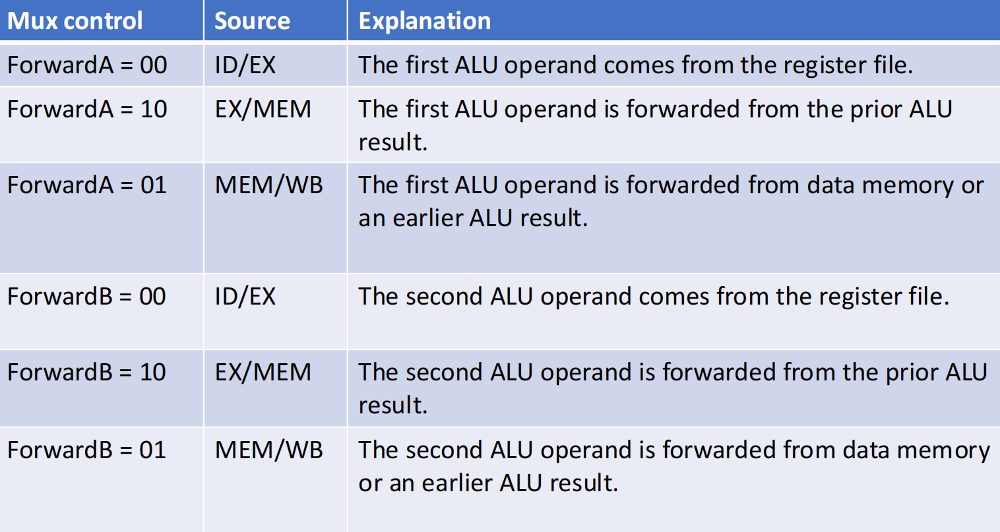


> [!warning] 
>
> 由于一些限制，我们实现的版本是：
>

> [!NOTE]- When can we forward?
>
> 在 Multiple-Clock-Cycle Pipeline Diagram of Five Instructions 中表现为：可以向左下方传递，但是不能向右下方传递（如 load-use data hazard）。
> 
> 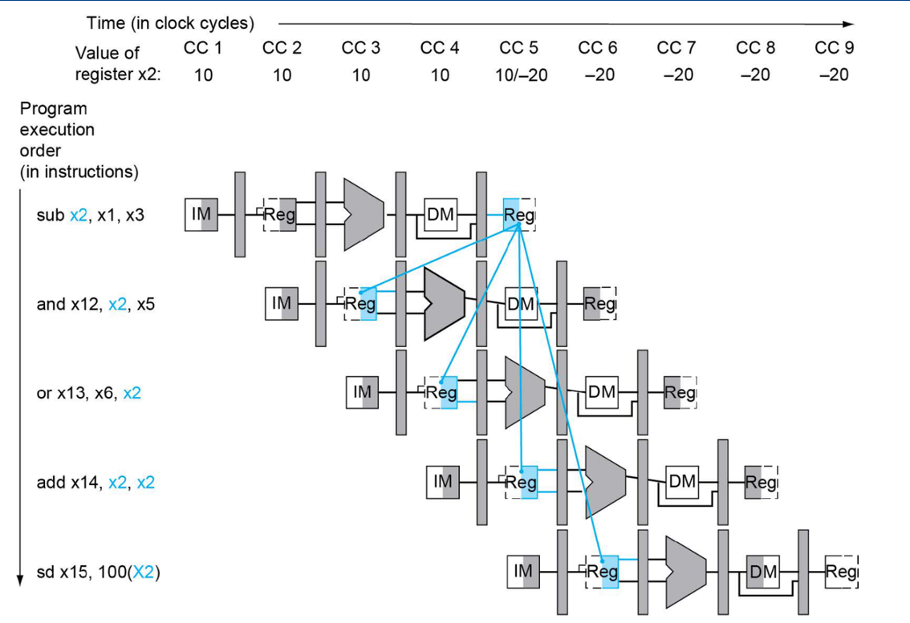
>
> 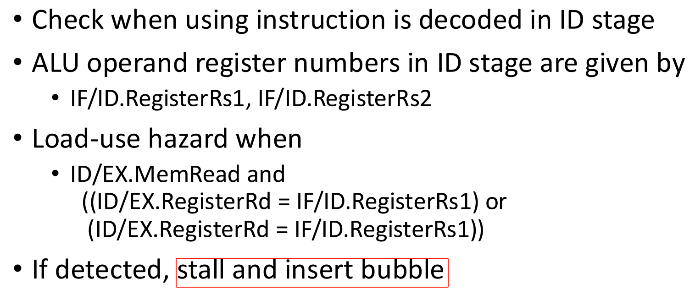

#### Solution 3: "Double bubble"


### Control Hazards (期末不用太管)

Flow of execution depends on previous instruction.

#### Solution 1: "Stall"

等待，直到控制指令计算完成。

#### Solution 2: "Prediction"

预测分支的跳转情况：
- 简单：总是认为（不）发生跳转；
- 复杂：分析，如果是往低地址，大概率需要跳转；
- 动态：记录历史跳转情况。

#### Solution 3: "Delayed Decision"

将 branch 前的无关指令移动到 branch 之后的 bubble 处（分支延迟槽）执行，减少为了等待而插入的无意义 bubble 代码

> [pbfx - control hazards](PBFX.md#control%20hazards)

### Multiple Issue

**ILP:** Instruction-Level Parallelism.

- Pipelining: executing multiple instructions in parallel. To increase ILP
    - Deeper pipeline
        - the number of segment in a pipelining is called the depth of the pipeline.
        - Less work per stage -> shorter clock cycle
    - Multiple issue
        - Replicate pipeline stages -> multiple pipelines
        - Start multiple instructions per clock cycle
        - CPI < 1, so use Instructions Per Cycle (IPC)
            - E.g., 4GHz 4-way multiple-issue
            - 16 BIPS, peak CPI = 0.25, peak IPC = 4
    - But dependencies reduce this in practice

Comparison of the spatiotemporal diagrams (时空图) of instructions executed by single-issue and multiple-issue processors。

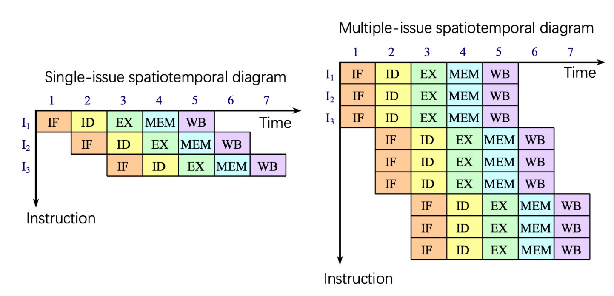

#### Two types of multiple-issue

- Static multiple issue
    - **Compiler** groups instructions to be issued together
        - it must remove some/all hazards
    - Packages them into “issue slots”
        - no dependencies with a packet
    - Compiler detects and avoids hazards
        - pad with NOP if necessary
- Dynamic multiple issue
    - **CPU** examines instruction stream and chooses instructions to issue each cycle
        - avoiding structal and data hazards
    - Avoids the need for compiler scheduling
        - Compiler can help by reordering instructions
    - CPU resolves hazards using advanced techniques at runtime (Speculation, i.e. Guess)
        - allow cpu to execute instructions out of order to avoid stalls
        - but commit result to register in order
    - why not just let the compiler schedule code ?
        - not all stalls are predicable
        - can't always schedule around branches
        - Different ISA implementation
- But Multiple Issue not works as much as we’d like:
    - Programs have real dependencies that limit ILP
    - Some dependencies are hard to eliminate
        - e.g., pointer aliasing
    - Some parallelism is hard to expose
        - Limited window size during instruction issue
    - Memory delays and limited bandwidth
    - Hard to keep pipelines full

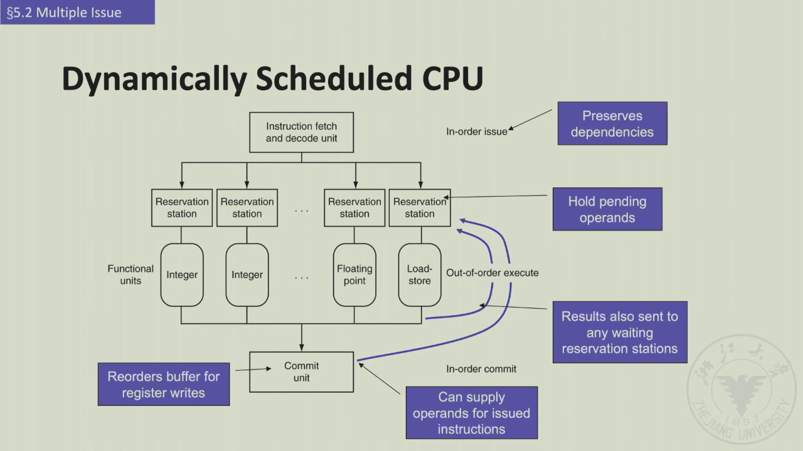

#### Two types of multiple-issue processor

- Superscalar
    - The number of instructions which are issued in each clock cycle is **not fixed**. It depends on the specific circumstances of the code. (1-8, with upper limit)
    - Suppose this upper limit is n, then the processor is called **n-issue**.
    - It can be **statically scheduled** through the compiler, or **dynamically scheduled** based on Tomasulo algorithm.
    - This method is the most successful method for general computing at present.
- VLIW (Very Long Instruction Word)
    - The number of instructions which are issued in each clock cycle is **fixed (4-16)**, and these instructions <u>constitute a long instruction or an instruction packet</u> 
    - In the instruction packet, the parallelism between instructions is explicitly expressed through instructions
    - Instruction scheduling is **done statically by the compiler**
    - It has been successfully applied to digital signal processing and multimedia applications

#### Super-Pipeline

- Each pipeline stage is further subdivided (like deeper pipeline)
- Multiple instructions can be time-shared in one clock cycle

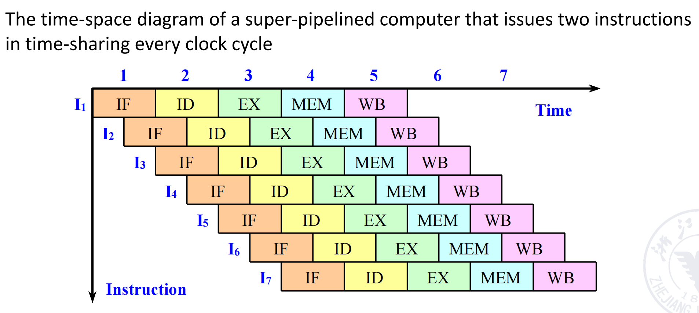

For a super-pipelined computer that can flow out n instructions per clock cycle, these n instructions are not flowed out at the same time, but one instruction is flowed out every 1/n clock cycle.

<div style="text-align: center;"><p></p></div>
