---
tags:
  - notes
comments: true
dg-publish: true
---

## Process concept

- How to use computer resources, such as CPU, memory
- A process is **a program[^1] in execution**

[^1]: program: passive entity (bytes stored on disk as part of an executable file) becomes a process when it’s loaded in memory.


## Memory Layout of a C Program

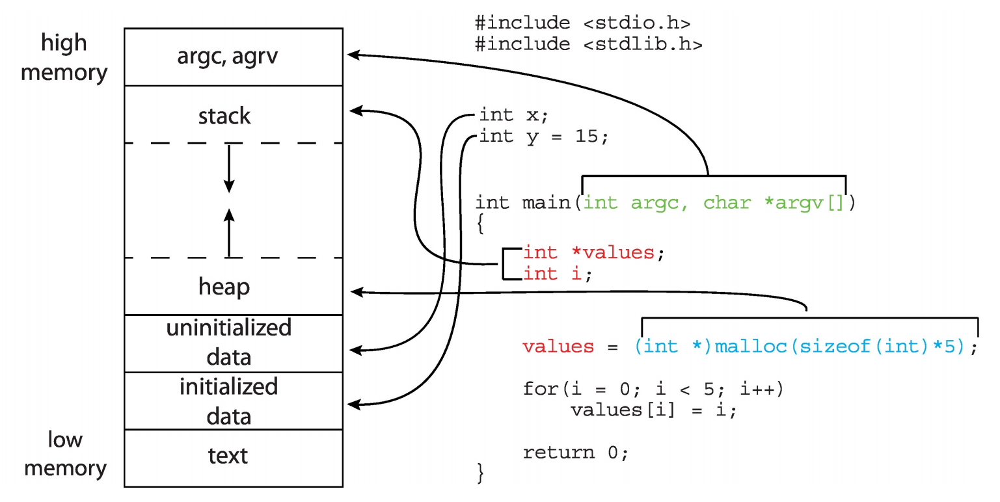

## Process Control Block (PCB)

Information associated with each process (also called **task control block**):
- Allocate a PCB on new process creation; 
- Free the PCB on process termination. 
- Each process has and only has a PCB.

```c title="PCB"
struct PCB {  
    int pid;  
    // Process state – running, waiting, etc.
    enum { running, ready, waiting } status;  
    // Scheduling information - priorities,schedule queue pointers
    int priority;  
    struct PCB *next_ready;
    // Program counter – location of instruction to next execute
    void *PC;
    // CPU registers – contents of all process-centric registers
    // Memory-management information: page tables, etc.  
    // Accounting information – CPU used, clock time elapsed since start, time limits
    // I/O status information: list of open files and so on.
}
```

> [!KNOWLEDGE]
>
> In Linux, PCB represented by the C structure `task_struct`.

## Process State

- New: The process is being created
- Running: Instructions are being executed
- Waiting: The process is waiting for some events to occur
- Ready: The process is waiting to be assigned to a processor
- Terminated: The process has finished execution

（下面这个图 swb 老师说必考）

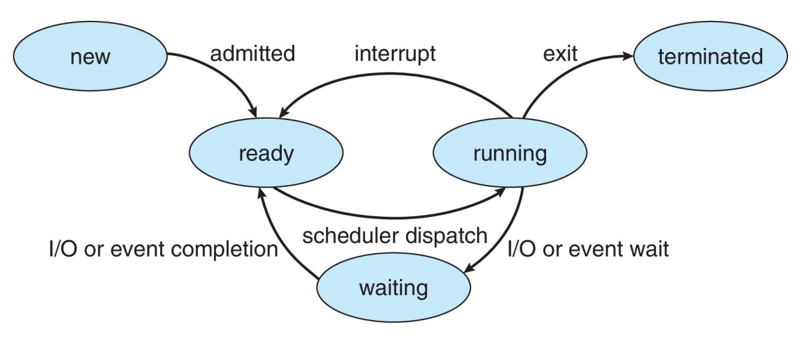

### new (Process Creation)

A process may create new processes, in which case it becomes a parent, we obtain a tree of processes.

#### fork()

- fork() creates a new process
    - The child is is a copy of the parent, but: It has a different pid (and thus ppid); Its resource utilization (so far) is set to 0
- **fork() returns the child’s pid to the parent, and 0 to the child**
- Both processes continue execution after the call to fork()

- Pros
    - Simplicity: Windows CreateProcess requires 10 parameters.
    - Division of Labor: fork builds the skeleton, exec gives it life.
    - Connectivity: Maintains relationships between processes.
- Cons
    - Complexity
    - Poor performance
    - Security issues

#### fork() return values

> [!QUESTION]
>
> How does fork() return two values (Return new_pid to parent and zero to child) ?

For parent process, fork is just a `syscall`, similar to write; user mode context (registers) saved:
- When: kernel_entry; 
- Where: per-process kernel stack, more specifically pt_regs
- copy the user space code; new_pid is returned to parent via syscall return value (**saved in pt_regs**)

For child process,also via pt_regs, pt_regs[0] = 0; set the return value to 0
- When will child process start to run and from where?
    - When: scheduled (switch to) 
    - where: from ret_to_fork
- ret_from_fork -> ret_to_user -> `kernel_exit` who restores the pt_regs
 
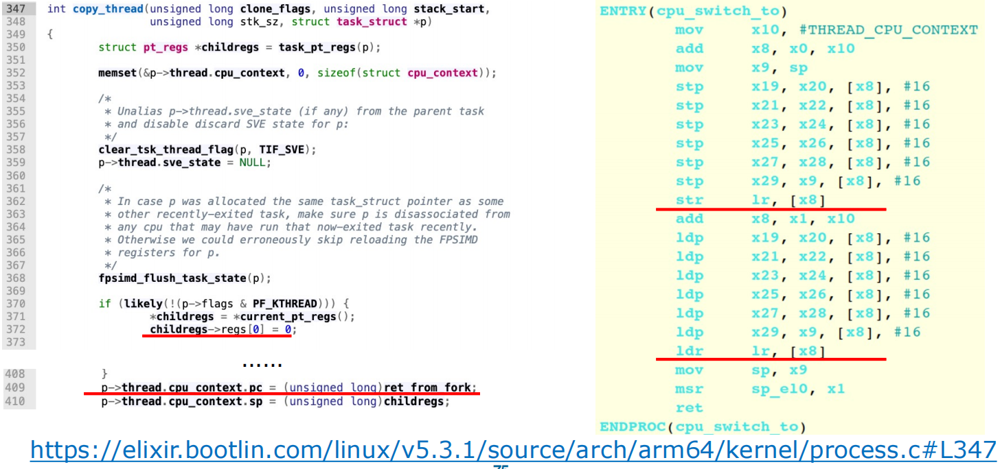

> [!HELP]
>
> 我们需要谨记两点：
> - `fork()` 后的子进程是接在产生其的指令之后进行的；
> - `fork()` 在父进程的值为子进程的 pid，而在子进程中值为 0

> [!EXAMPLE]- 下面 fprintf 将输出什么内容？
>  
> ```c
> #include <stdio.h>
> #include <unistd.h>
> #include <sys/types.h>
> int main() {
>     int a = 12;
>     pid_t pid = fork();
>     if (pid == -1) {
>         printf("error");
>     }
>     if (pid > 0) { // PARENT
>         sleep(3); // ask the OS to put me in Waiting
>         printf("a = %d\n", a);
>         while (1);
>     } else { // CHILD
>         a += 3;
>         while (1);
>     }
> }
> ``` 
>
> parent 和 child 是两个进程，互不干扰。所以最后输出 `12` 。
>
> 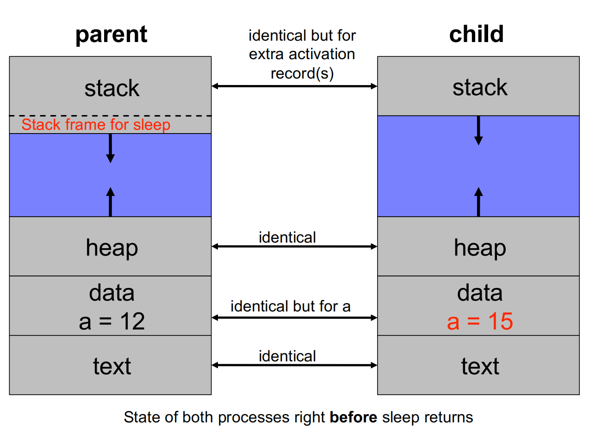

> [!EXAMPLE]- 下面将输出多少个 `hello` ?
> 
> ```c
> #include <stdio.h>
> #include <unistd.h>
> #include <sys/types.h>
>  int main() {
>     pid_t pid1, pid2;
>     pid1 = fork();
>     printf("hello\n");
>     pid2 = fork();
>     printf("hello\n");
>  }
> ```
>
> fork() 1 -pid1-> 2 -> printf -pid2-> 4 ->printf ；故输出 2+4 次。

> [!EXAMPLE]- 下面一共创建了多少个进程？
>
> ```c
> #include <stdio.h>
> #include <unistd.h>
> #include <sys/types.h>
> 
> int main(int argc, char* arg[]) {
>     fork();
>     if (fork()) {
>         fork();
>     }
>     fork();
> }
> ```
> 
> 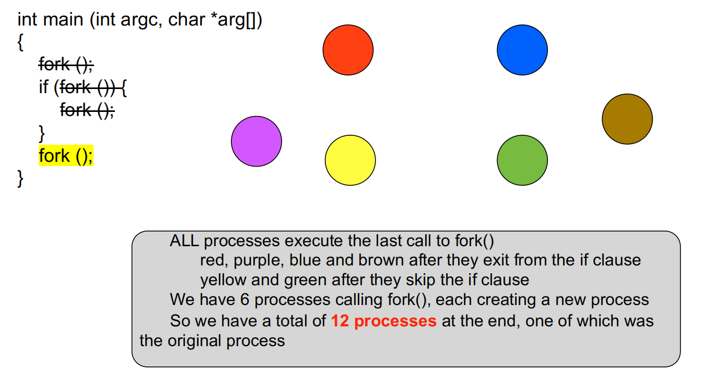
>

> [!QUESTION]
>
> 1. `fork()` 结束后，子进程处于什么状态？
> 2. `fork()` 的下一行的 pc 存在哪？
>
> Ready.

#### The exec*() Family of Syscalls

The “exec” system call **replaces the process image** by that of a specific program

> [!EXAMPLE]-
>
> ```c
> #include <stdio.h>
> #include <unistd.h>
> #include <sys/types.h>
> #include <sys/wait.h>
> 
> int main(int argc, char* arg[]) {
>     if (fork() == 0) { // runs ls
>         char* const argv[] = { "ls", "-l","./", NULL };
>         execv("/bin/ls", argv);
>     } else {
>         wait(NULL);
>     }
>     // sleep(1);
>     printf("Parent process\n");
> }
> ```
> 
> 执行上诉代码我们可以发现，（子进程）执行了 `ls` 命令；但是只输出了一次 `Parent process` ；也就是说，子进程在执行 `execv` 后整个程序其实就被替换了，之后的内容不会再执行。
> 
> 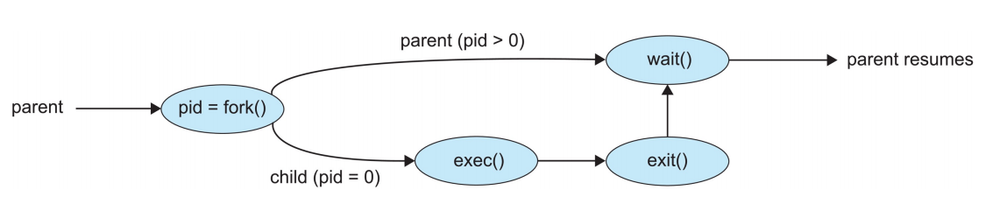

### Ready & Wait (to learn)

Process scheduler selects among ready processes for next execution on CPU core.Maintains scheduling queues of processes
- **Ready queue** – set of all processes residing in main memory, 
ready and waiting to execute
- **Wait queues** – set of processes waiting for an event (i.e., I/O)

**Ready and Wait Queues**

<div style="display:flex; text-align: center; justify-content: space-between;">
    <div style="display: inline-block; width: 50%; margin: 0.5%;">
        
        <p></p>
    </div>
    <div style="display: inline-block; width: 50%; margin: 0.5%;">
        
        <p></p>
    </div>
</div>

### Waiting wait()

A parent can wait for a child to complete (`man 2 wait`)
- The `wait()` call
    - blocks until any child completes
    - returns the pid of the completed child and the child’s exit code
- The `waitpid()` call
    - blocks until a specific child completes
    - can be made non-blocking with WNOHANG options

### Terminated (Process Terminations)

- A process terminates itself with the **exit()** system call
    - This call takes as argument an integer that is called the process’ exit/return/error code
- All resources of a process are deallocated by the OS
    - physical and virtual memory, open files, I/O buffers, ...
- A process can cause the termination of another process
    - Using something called “signals” and the **kill()** system call

#### Zombie Process

- When a child process terminates, it remains as a **zombie** in an “undead” state, Until it is “reaped” (garbage collected) by the OS, because **PCB** cannot be deallocated by the child process.
    - They’re not really processes, they do not consume ~~resources~~ CPU
    - They only consume a slot in memory (PCB), which may eventually fill up and cause fork() to fail

#### Getting rid of zombies

A zombie lingers on until:
- its <u>parent has called wait()</u>  for the child, or
- its <u>parent dies</u> 

1. When a child exits, a SIGCHLD signal is sent to the parent
2. The parent associates a handler to SIGCHLD
3. The handler calls wait()
4. This way all children deaths are “acknowledged”

#### Orphans

- An **orphan** process is one whose parent has died
- In this case, the orphan is “adopted” by the process with **pid 1**
- The process with pid 1 does handle child termination with a handler for SIGCHLD that calls wait, so an orphan never becomes a zombie

## Signal

### Processes and Signals

- A process can receive signals, i.e., software interrupts
- Signals have many usages, including process synchronization
- The OS defines a number of signals, each with a name and a number, and some meaning (using `man 7 signal`)

### Manipulating Signals

- Each signal causes a default behavior in the process (e.g., a SIGINT signal causes the process to terminate)
- But most signals can be either ignored or provided with a user-written handler to perform some action
- Signals like <u>SIGKILL and SIGSTOP</u>  cannot be ignored or handled by the user, for security reasons

## context switch

When CPU switches to another process, the system must <u>save the state of the old process and load the saved state for the new process</u>  via a **context switch.**

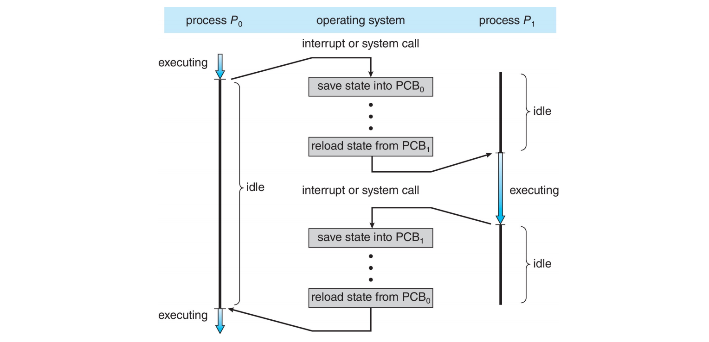

Context of a process represented in the **PCB (task_struct in Linux)**.

- Context switching between two kernel threads, When and where is the context (regs) saved?
    - When: **In context_switch, more specifically in cpu_switch_to**
    - Where: **In PCB, more specifically in thread_struct**
    - All regs are running kernel code, termed kernel context

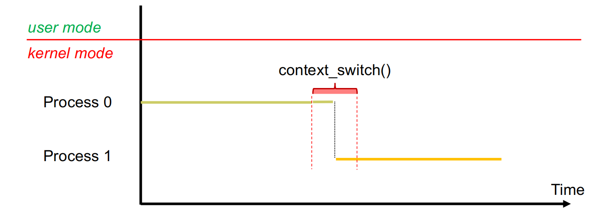

- Context switching between two user threads
    - Context switching has to occur in kernel mode (why?  )
    - When and where is the user context (regs) saved?
        - **When: kernel_entry;** 
        - **Where: per-thread kernel stack, more specifically pt_regs**
        - **when to restore:** kernel_exit
    - When and where is the kernel context (regs) saved?
        - When: cpu_switch_to; 
        - Where: thread_struct

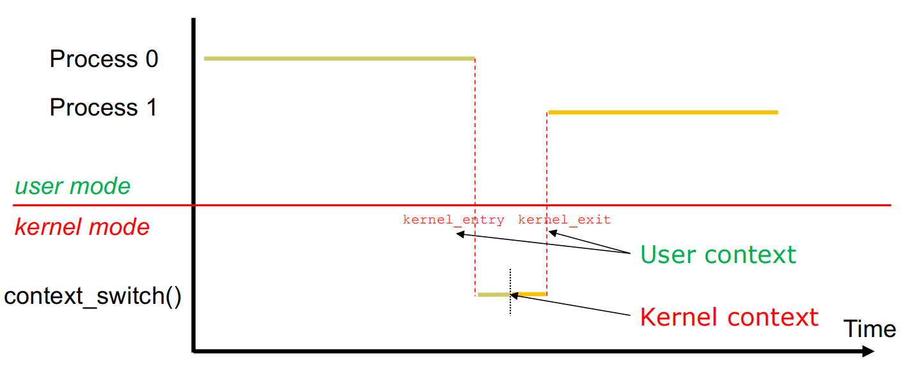

What's about calling System call?

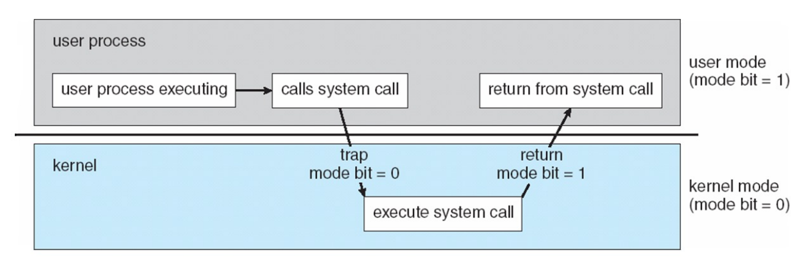

`lr` (on arm64) : **link register**, holding return address

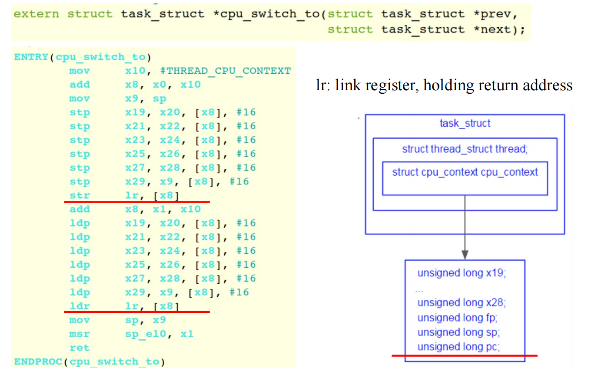

> 而在我们实现的 linux 内核中，充当这一功能的是 mepc/sepc/ra(x1) .

### pt_regs (process trace)

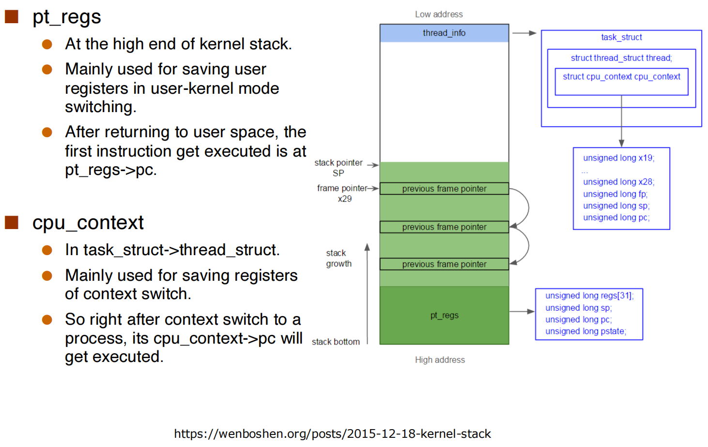

> 上图中的 stack 是 kernel space 的内存布局；而我们之前所看到的是 user space 的内存布局。

> [!QUESTION]-
>
> Where does cpu_switch_to() return to? When is the value set?
> 
>> [!check]- 
>> 
>> Return to the caller of cpu_switch_to à eventually to schedule(). If Process 1 calls schedule() to give up CPU, it eventually returns to **right after schedule()** 

> [!QUESTION]-
>
> https://www.cs.cornell.edu/courses/cs414/2007sp/homework/hw1_soln.pdf
> 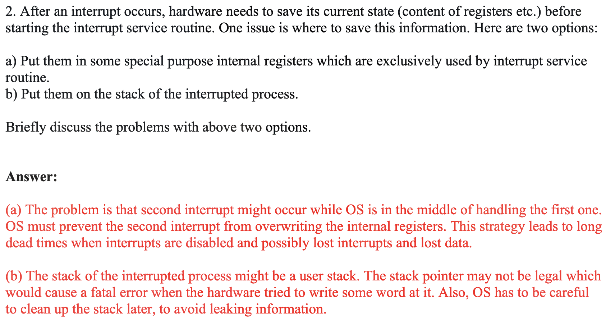

## Thread

Why threads?
- Multiple tasks of an application can be implemented by threads
    - E.g., update display, fetch data, spell checking
- Process creation is heavy-weight while thread creation is **light-weight**
- Threads can **simplify code**, increase efficiency
- Kernels are generally multithreaded

Thread may be provided either at the user level, or by the kernel
- **User threads** are supported above the kernel and managed without kernel support
    - Three thread libraries: POSIX Pthreads, Win32 threads, and Java threads
- **Kernel threads** are supported and managed directly by the kernel
    - All contemporary OS supports kernel threads
- A relationship must exist between user threads and kernel threads

models:
- many to one
- one to one (used most)
- many to many
- two levels
