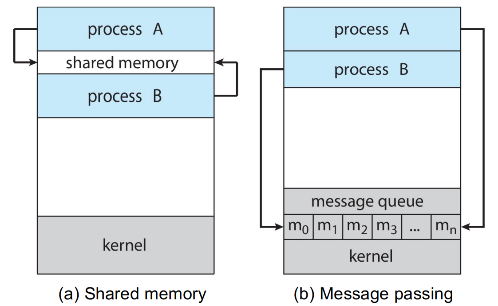
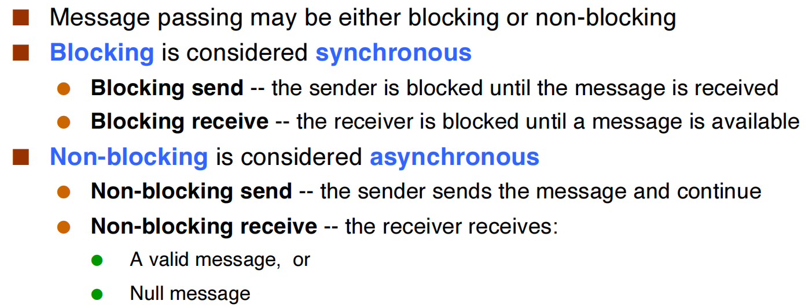
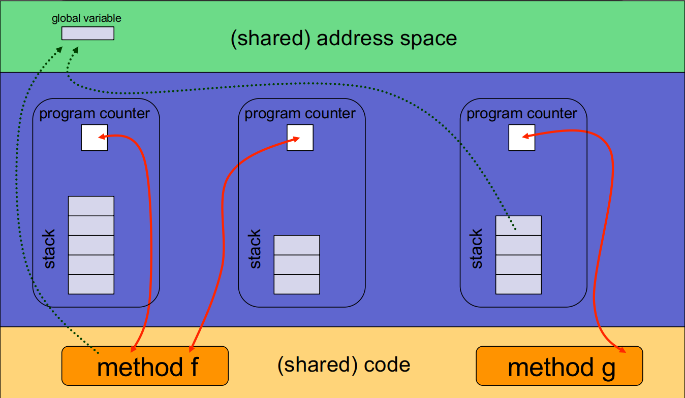
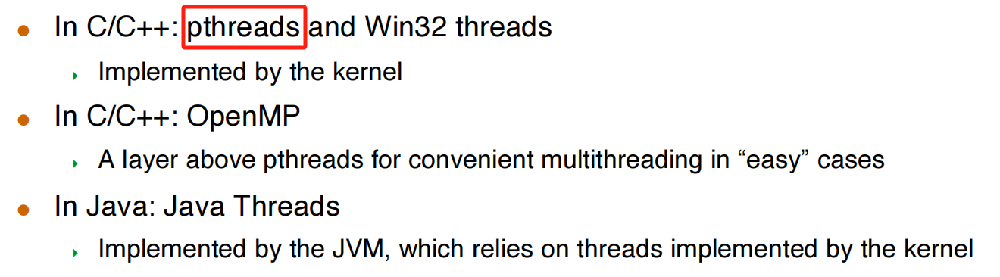
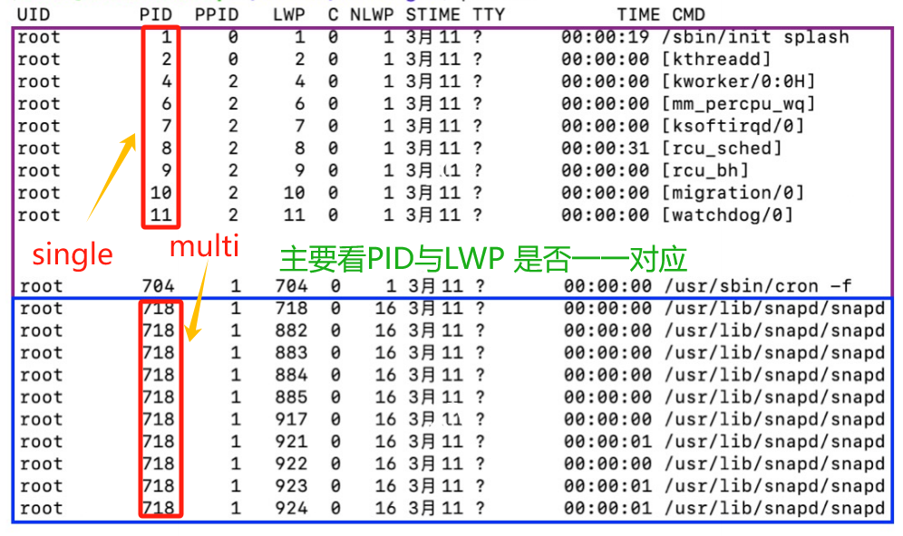
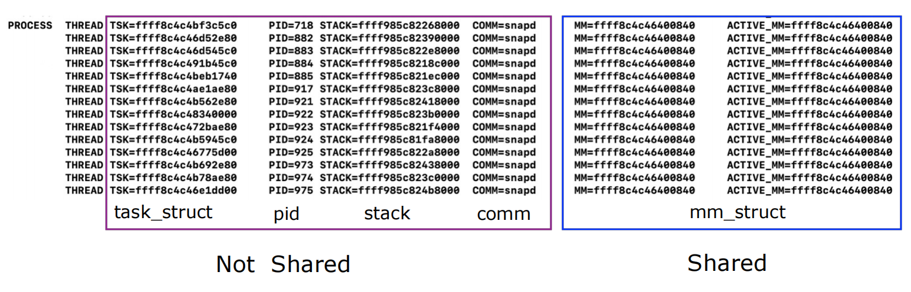
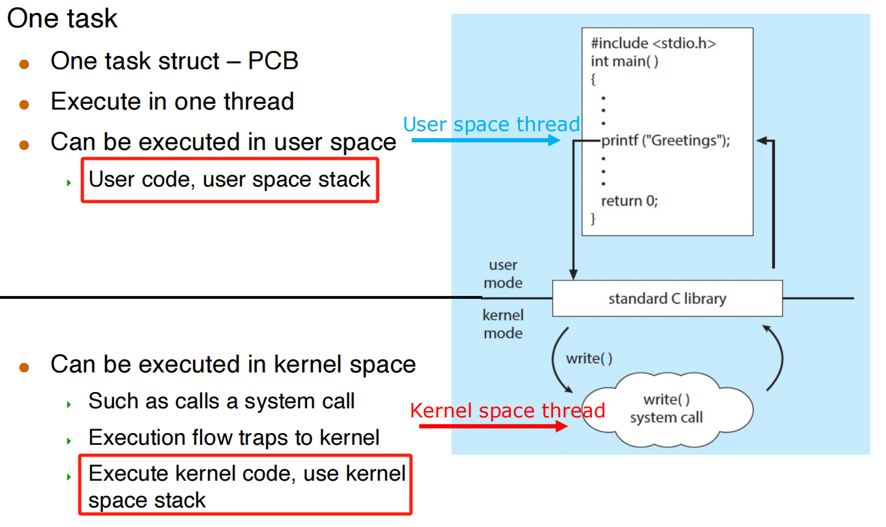

---
tags:
  - notes
comments: true
dg-publish: true
---

## Inter-Process Communications (IPCs)

- Processes within a system may be independent or cooperating
- Independent process: process that cannot affect or be affected by the execution of another process
- Cooperating process: processes that can affect or be affected by other processes, including sharing data
- **4 Reasons for cooperating processes**: information sharing, computation 
speedup, modularity, convenience, Security

### Two models of IPC

- **Shared memory**
    - Low-overhead: a few syscalls initially, and then none 
    - More convenient for the user since we’re used to simply reading/writing from/to RAM
    - More difficult to implement in the OS
        - Note that this is really contrary to the memory protection idea central to multi programming!
        - Major issues is to provide mechanism that will allow the user processes to synchronize their actions when they access shared memory
- **Message passing**
    - High-overhead: one syscall per communication operation
    - Useful for exchanging small amounts of data
    - Sometimes cumbersome for the user as code is sprinkled with send/recv operations
    - Simple to implement in the OS
 

### Synchronization

### Pipes

- Ordinary pipes – cannot be accessed from outside the process that created it. Typically, a parent process creates a pipe and uses it to communicate with a child process that it created. 
- Named pipes – can be accessed without a parent-child relationship.

#### ordinary pipes

#### Named pips

- Named Pipes are more powerful than ordinary pipes
- Communication is bidirectional
- No parent-child relationship is necessary between the communicating processes
- Several processes can use the named pipe for communication
- Provided on both UNIX and Windows systems

#### Unix pipes

- In UNIX, a pipe is mono-directional
    - Two pipes must be used for bi-directional communication
- One talks of the write-end and the read-end of a pipe
- The “pipe” command-line feature, ‘|’, corresponds to a pipe

## Threads

- A thread is a basic unit of execution within a process
- Each thread has its own
    - Thread ID
    - Program counter
    - Register set
    - Stack
- It shares the following with other threads within the same process 
    - Code section
    - Data section
    - Heap (dynamically allocated memory)
    - Open files and signals
- **Concurrency**: A multi-threaded process can do multiple things at once

> [!NOTE] Single-threaded vs. Multithreaded
> 

> [!QUESTION]
>
> 在 multihreaded process 中，某一线程能否访问其他线程的栈？
> 
> 一般不会，但是不阻止。

### Advantages

- **Economy:** 
    - Creating a thread is cheap
        - Code, data and heap are already in memory
    - Context-switching between threads is cheap
- **Resource Sharing**:
    - Threads naturally share memory
        - Having concurrent activities in the same address space is very powerful
    - But fraught with danger
- **Responsiveness**:
    - A program that has concurrent activities is more responsive
    - This is true of processes as well, but with threads we have better sharing and economy
- **Scalability:**
    - Running multiple “threads” at once uses the machine more effectively

### Drawbacks

- Weak isolation between threads: 
    - If one thread fails (e.g., a segfault), then the process fails.
- Threads may be more memory-constrained than processes
    - Due to OS limitation of the address space size of a single process
- Threads do not benefit from memory protection
    - Concurrent programming with Threads is hard

### Multi-Threading Challenges

- Deal with data dependency and synchronization
- Dividing activities among threads
- Balancing load among threads
- Split data among threads
- Testing and debugging

### User Threads vs. Kernel Threads

#### Many-to-One Model

- **Advantage**: multi-threading is efficient and low-overhead
    - No syscalls to the kernel
- **Drawback:**
    - cannot take advantage of a multi-core architecture!
    - if one threads blocks, then all the others do!

#### One-to-One Model (used on linux, windows and so on)

- **Advantage:** Removes both drawbacks of the Many-to-One Model
    - Creating a new threads requires work by the kernel
- **Drawback:** Not as fast as in the Many-to-One Model; expensive

#### Many-to-Many Model & Two-Level Model

> difficult to shedule

### Thread Libraries

Thread libraries provide users with ways to create threads in their own programs.

#### Pthreads:

- May be provided **either as user-level or kernel-level**
- A **POSIX standard (IEEE 1003.1c) API** for thread creation and synchronization
- **Specification**, not implementation
- API specifies behavior of the thread library, implementation is up to development of the library
- Common in UNIX operating systems (Linux & Mac OS X)

#### OpenMP

- Set of compiler directives and an API for C, C++, FORTRAN 
- Provides support for parallel programming in shared-memory environments
- Identifies parallel regions – blocks of code that can run in parallel

## Threading Issues

### Semantics of fork() and exec()

### Signals

- We’ve talked about signals for processes
    - Signal handlers are either default or user-specified
    - signal() and kill() are the system calls
- In a multi-threaded program, what happens? Multiple options
    - [ ] Deliver the signal to the thread to which the signal applies
    - [ ] Deliver the signal to every thread in the process
    - [ ] Deliver the signal to certain threads in the process
    - [ ] Assign a specific thread to receive all signals
- Most UNIX versions: a thread can say which signals it accepts, and which signals it doesn’t accept

### Safe Thread Cancellation

One potentially useful feature would be for a thread to simply 
terminate another thread. Two possible approaches:
- **Asynchronous cancellation**
    - One thread terminates another immediately
- **Deferred cancellation**
    - A thread periodically checks whether it should terminate

### Linux threads

Linux does not distinguish between PCB and TCB (Kernel data structure: task_struct).

In Linux, a thread is also called a **light-weight process (LWP)**

The **clone()** syscall is used to create a thread or a process
- Shares execution context with its parent
- pthread library uses clone() to implement threads

> [!NOTE] Single-threaded process vs. multi-threaded process
>
> 

> [!NOTE] What's shared for Threads within Process ?
>
> 

### User thread to kernel thread mapping

> 整个进程只需要一个 control block，且放在 kernel space 中；进程可以是多线程的。

> [!SUMMARY]
>
> - Same task_struct (PCB) means same thread
>     - Also viewed as 1:1 mapping; One user thread maps to one kernel thread
>     - But actually, they are the same thread
> - Can be executed in user space
>     - User code, user space stack
> - Can be executed in kernel space
>     - Kernel code, kernel space stack

