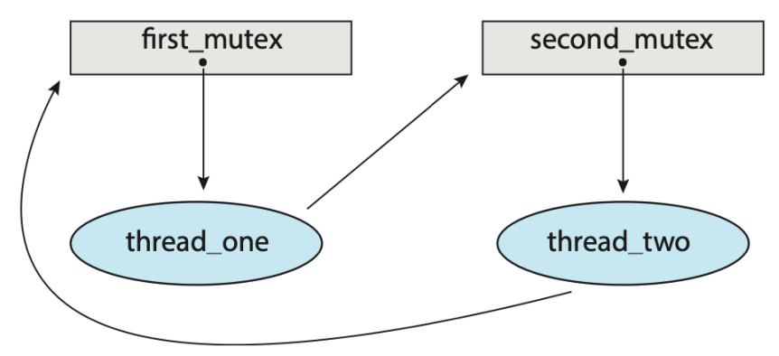
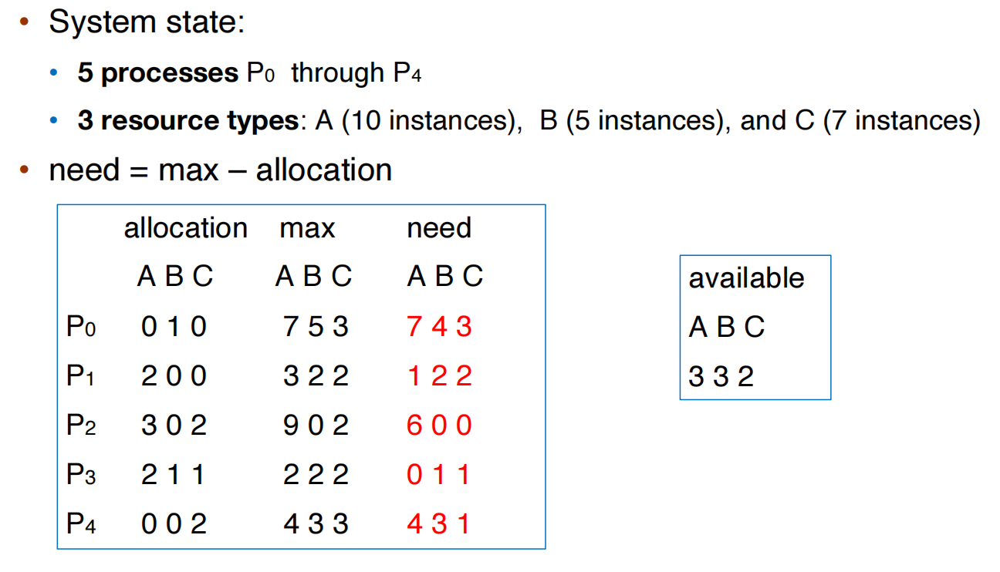
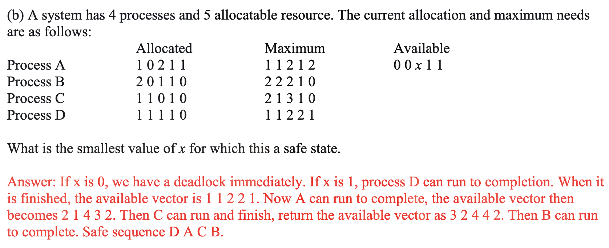

---
tags:
  - notes
comments: true
dg-publish: true
---

## Intro

```c title="example.c"
#include <stdio.h>
#include <stdlib.h>
#include <pthread.h>

int counter = 0;
static int loops = 1e7;
// pthread_mutex_t pmutex = PTHREAD_MUTEX_INITIALIZER;

void* worker(void* arg) {
    int i;
    printf("%s: begin\n", (char*)arg);
    for (i = 0; i < loops; i++) {
        // pthread_mutex_lock(&pmutex);
        counter++;
        // pthread_mutex_unlock(&pmutex);
    }
    printf("%s: done\n", (char*)arg);
    return NULL;
}

int main() {
    pthread_t p1, p2;

    printf("main: begin (counter = %d)\n", counter);
    pthread_create(&p1, NULL, worker, "A");
    pthread_create(&p2, NULL, worker, "B");
    pthread_join(p1, NULL);
    pthread_join(p2, NULL);
    printf("main: done with both (counter = %d)\n", counter);
    return 0;
}
```

在我们的预期中，上面的程序应当是两个线程 p1 p2 一起数数，每个人数 1e6 次，共 2e6 次；但是实际运行结果如下：

```bash
$ gcc example.c -o tmpC && ./tmpC
main: begin (counter = 0)
A: begin
B: begin
B: done
A: done
main: done with both (counter = 1034720)
```

`counter++;` 是一条 C 语言语句，但是需要多条汇编指令（取决于 ISA）；如果 p1 执行某条指令时，被 interrupt 或者 p2 读取了 counter 的值（此时 p1 还没有将计算的结果写回）；那么不知不觉中，数的次数就偏少了，这称为 Race Condition。

> [!DEFINITION] Race Condition
>
> Several processes (or threads) access and manipulate the same data concurrently and the outcome of the execution depends on the particular order in which the access takes place, is called a **race-condition**.

为此，引入 critical section。

## Critical section

### Problem

Each process has a critical section segment of code (E.g., to change common variables, update table, write file, etc.)

```c title="general structure of a progress"
// An example is presented in the comments to the code above
while (true) {
    // entry section
    /* critical section */
    // exit section
    /* remainder section */
}
```

 - Only one process can be in the **critical section**
 - Each process must ask permission to enter critical section in **entry section**
 - The permission should be released in **exit section**
 - The remaining code is the **remainder section**

### solution

What about Preventing interrupts?
- Single-core system: works well
- Multiple-processor system: not feasible

#### Three Requirements for Solutions

1. **Mutual Exclusion**
    - Only one process can execute in the critical section.
2. **Progress**
    - No deadlock (there must a progress in critical section unless no progress wish to enter its critical section).
3. **Bounded waiting**
    - No starvation (every progress has chance to  enter its critical section).

#### Peterson's solution

Peterson’s solution solves **two-processes** synchronization, and **only works for two processes case**.

It assumes that LOAD and STORE are **atomic** (execution can't be interrupted, but it usually can't be guaranteed by hardware automatically).

So the two processes share two variables:
- boolean **flag[2]**: whether a process is ready to enter the critical section
- int **turn**: whose turn it is to enter the critical section


We can prove that Peterson's solution satisfies the three requirements of the solution.

> [!USELESS]
>
> Although useful for demonstrating an algorithm, Peterson’s solution is not guaranteed to work on modern architectures. (Since it requires too much, sometimes be wrong and works only for two.)

> https://www.cs.cornell.edu/courses/cs414/2007sp/homework/hw2_soln.pdf
> 

### Hardware Support for synchronization

Uniprocessors: disable interrupts

#### Memory barriers (memory fences)

Memory models are the memory guarantees a computer architecture makes to application programs. They are either Strongly ordered or Weakly ordered.

<u>A memory barrier is an instruction that forces any change in memory to be propagated (made visible) to all other processors.</u> 

**Four basic varieties of memory barriers in linux:**
- Write (or store) memory barriers
- Address-dependency barriers (historical)
- Read (or load) memory barriers
- General memory barriers
- Implicit varieties:
    - ACQUIRE operations
    - RELEASE operations

**Explicit/Implicit Memory Barriers in Linux:** TODO, may be not important.

#### Hardware Instructions

Special hardware instructions that allow us to either test-and modify the contentof a word, or to swap the contents of two words atomically (uninterruptable)

##### test_and_set (TAS)

```c title="tas.c"
// The function is atomically; it is just one instruction
bool test_and_set(bool* target) { // passed parameter (pp)
    bool rv = *target;
    *target = true; // set the new value of pp to true
    return rv; // return the original value of pp, ensure if target is used, another thread can jump out `while();` that is, another thread is busying waiting.
}

void use_lock() {
    bool lock = true;
    do {
        while (test_and_set(&lock)); // get lock if lock is not used; else do nothing
        /* critical section */
        lock = false; // release lock
        /* remainder section */
    } while (true);
}
```

##### compare_and_swap (CAS)

```c title="cas.c"
// The function is atomically
int compare_and_swap(int* value, int expected, int new_value) {
    int temp = *value;
    if (*value == expected) // swap happens only under this condition
        *value = new_value;
    return temp; // return the original value of passed *value
}

void use_lock() {
    int lock = 0;
    while (true) {
        while (compare_and_swap(&lock, 0, 1) == 0); // get lock if lock is not used; else do nothing
        /* critical section */
        lock = 0;
        /* remainder section */
    }
}
```

**in practice:**
- x86
    - `lock cmpxchg <destination operand>, <source operand>`
- arm
    - `LDREX` and `STREX` instructions used together
    - to implement atomic operations the programmer must retry the operation (both LDREX and STREX) until the exclusive monitor signals a success.

#### Atomic Variables

One tool is an **atomic variable** that provides atomic (uninterruptible) updates on basic data types such as integers and booleans.
- For example, the increment() operation on the atomic variable sequence ensures sequence is incremented without interruption: `increment(&sequence);`;

### Mutex Lock (spinlock)

Mutex locks protect a critical section by first `acquire()` a lock then `release()` the lock; calls to `acquire()` and `release()` must be atomic. These two functions can be implement using test_and_set or compare_and_swap.
 
```c title="mutexLock/spinLock.c"
static bool available = false;
void acquire() {
    while (!available); // busy wait
    available = false;
}
void release() {
    available = true;
}

while (true) {
    acquire lock
    critical section
    release lock
    remainder section
}
```

> [!WIKI] [busy waiting](https://en.wikipedia.org/wiki/Busy_waiting)
>
> In computer science and software engineering, **busy-waiting, busy-looping or spinning** is a technique in which a process repeatedly checks to see if a condition is true, such as whether keyboard input or a lock is available. Spinning can also be used to generate an arbitrary time delay, a technique that was necessary on systems that lacked a method of waiting a specific length of time. Processor speeds vary greatly from computer to computer, especially as some processors are designed to dynamically adjust speed based on current workload.[1] Consequently, spinning as a time-delay technique can produce inconsistent or even unpredictable results on different systems unless code is included to determine the time a processor takes to execute a "do nothing" loop, or the looping code explicitly checks a real-time clock.

This solution requires busy waiting; so called a **spinlock** . In certain circumstances on multicore systems, spinlocks are in fact the preferable choice for locking.

What if we have N threads?
- N-1 threads loops in all their CPU time
- A huge **waste of CPU time and power**

To avoid wasting, it can just yield:

```c title="yield_CPU.c"
bool flag = 0;
void lock() {
    while (test_and_set(&flag, 1) == 1)
        yield(); // give up the cpu
}
void unlock() {
    flag = 0;
}
```

### Semaphore

```c title="semaphore_simple.c"
void wait(S) {
    while (S <= 0); // busy wait
    S--;
}
void signal(S) {
    S++;
}
```

- semaphore stands for how many resources we can use.
- **Counting semaphore** – integer value can range over an unrestricted domain
- **Binary semaphore** – integer value can range only between 0 and 1
    - Same as a mutex lock

#### Semaphore w/ waiting queue:

> `w/` 是 `with` 的意思

```c title="semaphore_wq.c"
typedef struct {
    int value;
    struct list_head* wating_queue;
} semaphore;

void wait(semaphore* s) {
    s->value--;
    if (s->value < 0) {
        // add this process to s->waiting_queue
        block(); //place the process invoking the operation on the appropriate waiting queue
    }
};
void signal(semaphore* s) {
    s->value++;
    if (s->value <= 0) {
        // reomve a process P from s->waiting_queue
        wakeup(P); // remove one of processes in the waiting queue and place it in the ready queue
    }
}
```

Busy waiting changes:


```c title="semaphore_wq in practice"
typedef struct __lock_t {
    int flag;  // 0 means not locked
    int guard; // 0 means not available to flag
    queue_t* q;
} lock_t;

void lock_init(lock_t* m) {
    m->flag = 0;
    m->guard = 0;
    queue_init(m->q);
}

void lock(lock_t* m) {
    while (test_and_set(&m->guard, 1) == 1)
        ; //acquire guard lock by spinning
    if (m->flag == 0) {
        m->flag = 1; //lock is acquired
        m->guard = 0;
    } else {
        queue_add(m->q, gettid());
        m->guard = 0; // 
        park(); // release the processor
    }
}

void unlock(lock_t* m) {
    while (test_and_set(&m->guard, 1) == 1)
        ; //acquire guard lock by spinning
    if (queue_empty(m->q))
        m->flag = 0;
    else
        wakeup(queue_remove(m->q));
    m->guard = 0;
}
```

- m->guard 的作用是：保护 m->flag
- 14-15 行的实现了：spinLock
- 为什么不能够互换 21/22 行：执行到 21/22 行时，说明 guard = 1；互换后执行到 `park()` 时，该线程将 “拿着 lock 去 sleep”；m->guard 永远为 1，其他线程一旦进入 `lock()` 就无法跳出 14 行循环。（课上记的，好像有点问题？）

#### mutex vs. semaphore

- mutex(spinLock)
    - pros: no blocking
    - cons: waste CPU time on looping
    - Good for **short** critical section.
- semaphore
    - pros: no looping
    - cons: context switch is time-consuming
    - Good for **long** cirtical section


> 长和短是相对 context switch 的长度而言的。

#### deadlock and starvation

- **Deadlock**: two or more processes are waiting indefinitely for an event that can be caused by only one of the waiting processes
- **Starvation**: indefinite blocking; a process may never be removed from the semaphore’s waiting queue

#### Priority Inversion

a higher priority process is **indirectly** preempted by a lower priority task.

##### example

- three processes, PL, PM, and PH with priority PL < PM < PH
- PL holds a lock that was requested by PH ➱ PH is blocked
- PM becomes ready and preempted the PL
- It effectively "inverts" the relative priorities of PM and PH

##### solution

**priority inheritance**: temporary assign the highest priority of waiting process (PH) to the process holding the lock (PL)

### reader-writer block (todo)

## Examples

### Bounded-Buffer Problem

#### description

- Two processes, the producer and the consumer share n buffers
    - the producer generates data, puts it into the buffer
    - the consumer consumes data by removing it from the buffer
- The problem is to make sure:
    - the producer won’t try to add data into the buffer if it is full
    - the consumer won’t try to remove data from an empty buffer
- aka producer-consumer problem

#### solution

- n buffers, each can hold one item
- semaphore mutex initialized to the value 1
- semaphore full-slots initialized to the value 0
- semaphore empty-slots initialized to the value N

```c title="solution.c"
/* The producer process: */
do {
    //produce an item
    …
    wait(empty-slots);
    wait(mutex);
    //add the item to the buffer
    …
    signal(mutex);
    signal(full-slots);
} while (TRUE)

/* The consumer process: */
do {
    wait(full-slots);
    wait(mutex);
    //remove an item from buffer
    …
    signal(mutex);
    signal(empty-slots);
    //consume the item
    …
} while (TRUE);
```

### Readers-Writers Problem

#### description

• A data set is shared among a number of concurrent processes
    • readers: only read the data set; they do not perform any updates
    • writers: can both read and write
• The readers-writers problem:
    • allow multiple readers to read at the same time (shared access)
    • only one single writer can access the shared data (exclusive access)

#### solution

• semaphore mutex initialized to 1
• semaphore write initialized to 1
• integer readcount initialized to 0

```c title="solution.c"
/* The writer process */
do {
    wait(write);
    //write the shared data
    …
    signal(write);
} while (TRUE);

/* The structure of a reader process */
do {
    wait(mutex);
    readcount++;
    if (readcount == 1) //first reader
        wait(write);    //block write
    signal(mutex)
    //reading data
    …
    wait(mutex);
    readcount--;
    if (readcount == 0)
        signal(write);
    signal(mutex);
} while (TRUE);
```

### Dining-Philosophers Problem (to learn)

#### description

- Philosophers spend their lives thinking and eating
    - They sit in a round table, but don’t interact with each other
- They occasionally try to pick up 2 chopsticks (one at a time) to eat
    - **One chopstick between each adjacent two philosophers**
    - Need both chopsticks to eat, then release both when done
- Dining-philosopher problem represents multi-resource synchronization  

#### solution

Semaphore chopstick[5] initialized to 1.

> For more exercise: https://www.cs.cornell.edu/courses/cs414/2007sp/homework/hw2_soln.pdf

## Linux Synchronization (Todo)

## Deadlock

### Deadlock problem

> [!DEFINITION] Deadlock
>
> a set of blocked processes each holding a resource and waiting to acquire a resource held by another process in the set

> [!WIKI] [deadlock_cs](https://en.wikipedia.org/wiki/Deadlock_(computer_science))
>
> In concurrent computing, deadlock is any situation in which **no member of some group of entities can proceed** because each waits for another member, including itself, to take action, such as sending a message or, more commonly, releasing a lock.

```c title="deadLock.c"
pthread_mutex_t first_mutex;
pthread_mutex_t second_mutex;
void deadLock_init() {

    pthread_mutex_init(&first_mutex, NULL);
    pthread_mutex_init(&second_mutex, NULL);
}

void* do_work_one() {
    pthread_mutex_lock(&first_mutex);
    pthread_mutex_lock(&second_mutex);
    // do work
    pthread_mutex_unlock(&second_mutex);
    pthread_mutex_unlock(&first_mutex);
    pthread_exit(0);
}

void* do_work_two() {
    pthread_mutex_lock(&second_mutex);
    pthread_mutex_lock(&first_mutex);
    // do work
    pthread_mutex_unlock(&first_mutex);
    pthread_mutex_unlock(&second_mutex);
    pthread_exit(0);
}
```



### System model

#### Resource-Allocation Graph

- Two types of nodes:
    - P = {P1, P2, …, Pn}, the set of all the **processes** in the system
    - R = {R1, R2, …, Rm}, the set of **all resource types** in the system
- Two types of edges:
    - **Request edge**: directed edge Pi ➞ Rj
        - Pi has requested an instance of resource type Rj and is currently waiting for that resource.
    - **Assignment edge**: directed edge Rj ➞ Pi
        - An instance of resource type Rj has been allocated to thread Pi
- legend 

> [!EXAMPLE]
>
> - dead Lock 
>
> - no dead Lock 
> 
>> [!HELP]
>>
>> 一个 resource 只要有一个 instance 是空闲的，就可以被分配。
>
>> [!SUMMARY]
>>
>> - If graph contains no cycles ➠ no deadlock
>>
>> - If graph contains a cycle 
>>     - If only one instance per resource type ➠ deadlock
>>     - If several instances per resource type ➠ possibility of deadlock

#### Four Conditions of Deadlock

- **Mutual exclusion**: only one process at a time can use a resource
- **Hold and wait**: a process holding at least one resource is waiting to acquire additional resources held by other processes
- **No preemption**: a resource can be released only voluntarily by the process holding it, after it has completed its task
- **Circular wait**: there exists a set of waiting processes {P0, P1, …, Pn}
    - P0 is waiting for a resource that is held by P1
    - P1 is waiting for a resource that is held by P2 … 
    - Pn–1 is waiting for a resource that is held by Pn
    - Pn is waiting for a resource that is held by P0

### Handling deadlocks
#### Deadlock prevention

- How to **prevent mutual exclusion**
    - Not required for sharable resources
    - Must hold for non-sharable resources
    - In general, however, we cannot prevent deadlocks by denying the mutual-exclusion condition, because <u>some resources are intrinsically non-sharable.</u>  
- How to **prevent hold and wait**
    - Whenever a process requests a resource, it doesn’t hold any other resources
        - Require process to request all its resources before it begins execution
        - Allow process to request resources only when the process has none
    - <u>Low resource utilization; starvation possible</u> 
- How to handle **no preemption**
    - If a process requests a resource not available
        - All resources the process is currently holding are preempted (Preempted resources are added to the list of resources it waits for)
        - Process will be restarted only when it can get all waiting resources
- How to handle **circular wait**
    - Impose a total ordering of all resource types (Require that each process requests resources in an increasing order)
    - Many operating systems adopt this strategy for some locks.
    - But fail to handle dynamic acquired lock.

#### Deadlock avoidance

**Deadlock avoidance**: require extra information about how resources are to be requested. (not practical)

Resource-allocation state: 
- The number of available and allocated resources
- The maximum demands of the processes

##### safe state

- There exists a sequence <P1, P2, …, Pn> of all processes in the system
- For each Pi, resources that Pi can still request can be satisfied by **currently available resources + resources held by all the Pj** (j < i)
- Safe state can guarantee no deadlock 

> [!EXAMPLE]
>
> - 下图的上半部分的情况是 safe 的，因为 Available 资源足够执行 P1，P1 释放后可以执行 P0 -> P2
> 
> 
>
> - 上图下半部分的情况是 unsafe 的，因为执行 P1 后不足以执行 P0。

##### Banker's algorithm

- Single instance of each resource type ➠ use **resource-allocation graph** (if cycle)
- Multiple instances of a resource type ➠ use the **banker’s algorithm**

- Banker’s algorithm is for **multiple-instance resource deadlock avoidance**
    - Each process must claim maximum use of each resource type in advance
    - When a process requests a resource it may have to wait
    - When a process gets all its resources it must release them in a finite amount of time

- **n processes, m types of resources**
    - available: an array of length m, instances of available resource
        - available[j] = k: k instances of resource type Rj available
    - max: `n*m` matrix
        - max [i,j] = k: process Pi may request at most k instances of resource Rj
    - allocation: `n*m` matrix 
        - allocation[i,j] = k: Pi is currently allocated k instances of Rj
    - need: `n*m` matrix
        - need[i,j] = k: Pi may need k more instances of Rj to complete its task
        - need [i,j] = max[i,j] – allocation [i,j]

> [!EXAMPLE]
>
> 题目本身只会给我们 system state 和 allocation, max 向量/矩阵。 
> 
> 
>
> 我们需要做的也很简单：
> 
> 1. 计算 need 矩阵和 available 向量。
> 2. 观察 available 向量能否满足某一个进程 Pi 对应的 need 向量（在上面的例子中，P3 可以都满足），执行下一步；如果都不能，则处于 unsafe state，结束。
> 3. 将 Pi 的 allocation 向量加到 available 上，并将其排除出矩阵；再次执行步骤 2，直到 need 为空。

> https://www.cs.cornell.edu/courses/cs414/2007sp/homework/hw2_soln.pdf
> 

#### Deadlock detection 

##### Single Instance Resources (Wait-for Graph)

find a cycle:


##### Multi-instance Resources

Just like Banker's algorithm.

#### Deadlock recovery

- Terminate deadlocked processes. options:
    - Abort all deadlocked processes
    - Abort one process at a time until the deadlock cycle is eliminated
- Resource preemption
    - Select a victim
    - Rollback
    - Starvation