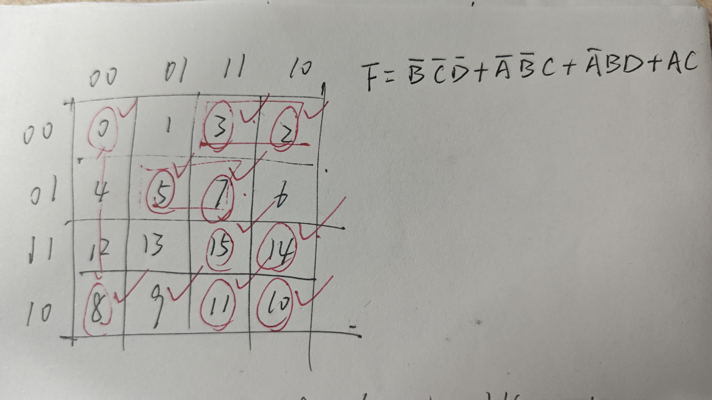

## I lab0-1

### I.1 反相器的电压传输特性 20%

#### I.1.1 截图除安装外的相关实验步骤 5%

打开后如下图，发现点击可以获取左边，拖动可以获得“斜率”。

#### I.1.2 描述执行 `ngspice inv.sp` 得到的输入输出关系 5%

随着 Vin 稳定增加，Vout 先维持在 1.8V，在某一时刻开始急剧下降至 0V。
#### I.1.3 观察 Vout，思考如果给 Vin 接入一个正弦变化的电压，输出的 Vout 是什么样的，可以手绘 Vout-T 的结果加以文字描述 5%

如图，我假设正弦周期为 4.0ns，那么 Vout 图像在 t 接近 $\frac{1}{4}T$ 时急剧下降，远离时急剧上升，其余时刻基本保持为 1.**8 V**
#### I.1.4 你认为对于该反相器，逻辑 0 和逻辑 1 的阈值应该设定为多少 V，即 Vin 输入的电压范围是多少可以认为输入的电压是 0/1 信号，Vout 输出的电压范围是多少可以认为输出的电压是 0/1 信号 5%

Vim 输入电压为 0 ~ 0.6V、Vout 输出电压为 1.8 V 可认为为 0 信号；
Vim 1.1V ~ 1.8 V、Vout 0 V 为 1 信号。

### I.2 Logisim 电路仿真 30%

#### I.2.1 截图除安装、保存外的相关实验步骤 10%

1. 进入安装位置打开 logisim-evolution

2. 按照例图绘制电路原理图如下

### I.3 遍历全部可能的输入，填写以下表格并总结该电路实现的功能 20%

| Input |     |     | Output |
| ----- | --- | --- | ------ |
| I0    | I1  | I2  | O      |
| 0     | 0   | 0   | 0      |
| 0     | 0   | 1   | 1      |
| 0     | 1   | 0   | 1      |
| 0     | 1   | 1   | 0      |
| 1     | 0   | 0   | 1      |
| 1     | 0   | 1   | 0      |
| 1     | 1   | 0   | 0      |
| 1     | 1   | 1   | 1      |
#### I.3.1 尝试总结输入输出关系和电路组成结构之间存在什么内在联系（选做）

（没搞懂要回答啥，总结不出来 `-_-` ）
## II lab0-2

### II.1 Verilog 练习 30%

- 化简下列卡诺图，写出对应的 Verilog 代码（只使用 AND、OR、NOT） （补全 src/lab0-3/syn 10%、src/lab0-3/submit 10%）
$F(A,B,C,D)=\sum_{m}(0,2,3,5,7,8,10,11,14,15)$

化简过程及结果如下（圈勾是上板验证，不必在意）

补齐代码见附件 lab0-3

- 上板验证 ，其中将开关 R15、M13、L16、J15 作为输入，LED 灯 H17 作为输出（给出 上板结果 10%）:

上板结果符合预期：（图中为 1111，即 15 的输入情况）

### II.2 仿真练习 20%

- 为该模块设计仿真激励文件（补全 src/lab0-3/sim 10%），分别用 verilator 和 vivado 进行仿真，解释仿真设计的思路，并提供仿真的波形截图， 两部分思路截图各 5%，共 10%

激励文件见附件 lab0-3/sim/testbench.v

**verilator 仿真** 成功

思路：根据之前的学习，我们 `make` 操作的目的就是执行了 `testbench.v` 文件，补全如下，之后依次执行 `make` `make wave` 即可

波形截图

**vivado 仿真** 成功

思路：`make bitstream` 后 `make vivado` （如下），上板（结果见上面的截图） 

- 尝试 verilator、vivado 波形窗口的各个按键，尝试理解每个按键的功能
（尽力局）

