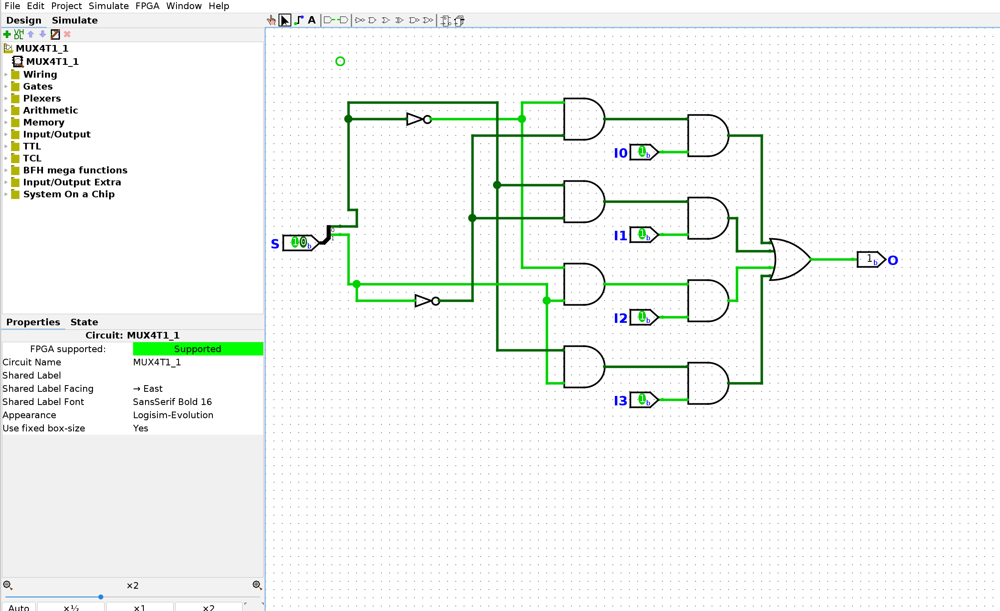
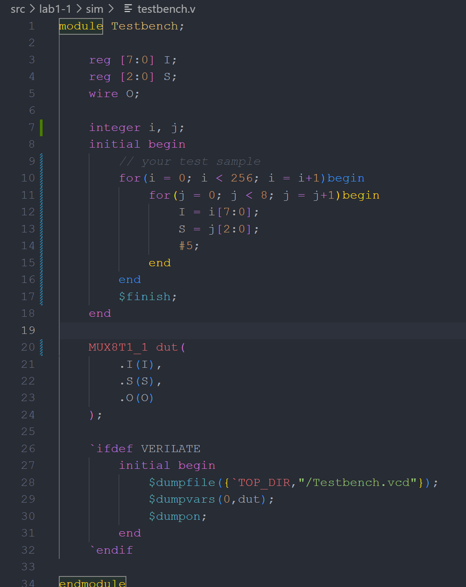
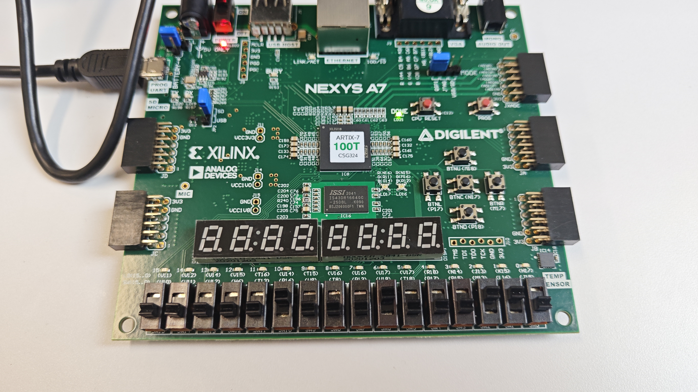
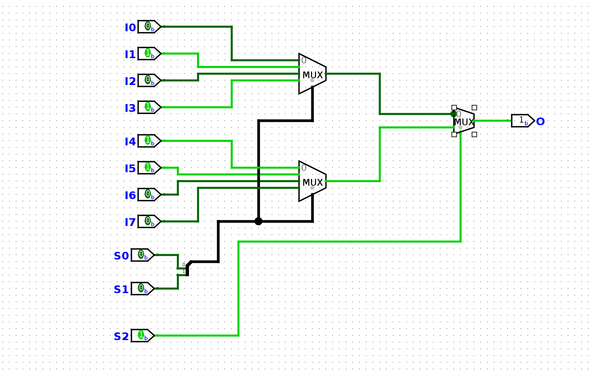
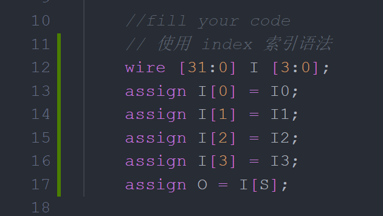
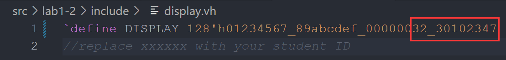
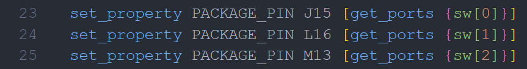
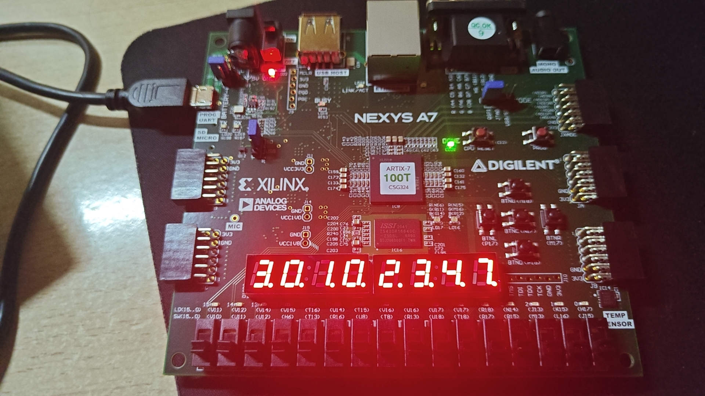

## lab 1-1(50%)

**请在实验报告中详细描述每一步的过程并配有适当的截图和解释，对于仿真设计和上板验证的结果也应当有适当的解释和照片 Total : 23%**

### 四路选择器原理图 3%
 根据实验指导绘制原理图
 - 
 
### 八路选择器代码解释 5%
 
 代码中我进行了注释，下面我将简略进行解释
 根据电路图（下方），我们可以发现主要通过实例化二选一、四选一选择器并调整好输入即可，其中两个四选一选择器的选择端输入一致，因为二选一时会排除这里的干扰
### TestBensh 设计 5%
利用循环语句遍历了所有可能的输入，共 2048 种
（突然间有颜色是新装了一个插件，请不要在意）

### 其余实验步骤及截图 10%
 **make wave 仿真波形图**

例如，如图当输入为 1 的有 S[2],I[1],I[3],I[4],I[5]时，在下图中即可知道
S[1:0] 为 2'b00 表示选择 I 0,I 4 的输入，S[2]为 1 表示选择 I 4 的输入，即输出为 1

**vivado 上板**
S[2],I[1],I[3],I[4],I[5] 为 1 时

S[2],I[1],I[2],I[6] 为 1 时

 使用 logisim 我画了一张电路图研究如何使用四选一设计八选一
 

**在实验中我们已经拥有了 Mux4（控制的信号数）T1_1（输入的位数），实际上它是由如 3.1 图中展示的结构组成，思考如下问题：**
### - Mux2T1_1 是两个 AND，一个 OR 和一个 NOT 组成的简单结构，它是由哪种 decoder 和 AND-OR 结构组成的 5%
1-to-2-line decoder 和 2 x 1 AND-OR 结构组成，根据电路图不难得知，下面的回答可以类推）

### - Mux4T1_1 是如何组成的 6%
2-to-4-line decoder 和 4 x 2 AND-OR 结构组成
### - Mux8T1_1 是如何组成的 6%
3-to-8-line decoder 和 8 x 4 AND-OR 结构组成
### - 那么 Mux2 m T1_n 是如何构成的呢 10%
$mn$-to- $2^{mn}$ -line decoder 和 $2^{m}$ x $2^{m-1}$ AND-OR 结构组成

## lab 1-2

**请在实验报告中详细描述每一步的过程并配有适当的截图和解释，对于仿真设计和上板验证的结果也应当有适当的解释和照片 Total 30%**

### 译码管设计 10%

根据实验指导中的表单我们可以知道表现 16 进制各数字的显示译码，故如下设计

定义了 register 一个数组用于存储传入的某一个16 进制对应信号，与 LE 析取后输出即可

当然由逻辑电路图我们也可以像下面这样补全代码，我在我的 submit 中提供了两种方案

### 复合多路选择器及语法分析比较 10%

我选择使用 index 索引法，因为给我的逻辑很直观，I[3:0] 就是 4 根电线束，每束有 32 根线罢了，而 S[1:0] 的值恰好就是它所选取的电线束的 index

在这里，index 索引即免去了 `if-else` 或 `case` 语法可能会漏掉某种情况的风险，又不用像 `?:` 语法那样嵌套使用可读性降低
### 综合实现数码管 10%

将 `display.vh` 中改为自己学号，准备工作基本完毕

下板示例图
（发现 sys 1-sp 24/repo/sys-project/lab 1-2/syn/top.v 中赋值 `.point(1'b1)`， 故小数点都没亮）

### 阅读 `repo/sys-project/lab1-2/sim/testbench.v` 的测试样例，尝试将 `for` 语句展开为初始化序列，然后写出你对 `for` 语句的理解 10%

展开如下：

在 for 循环中，i 遍历一定的取值，并以 `i[3:0]` 的形式从 `ingeter` 变为 4 位二进制信号并赋值给 `date` 

**对于各种多路选择器的写法进行比较，请写出你最喜欢的多路选择器语法，并给出理由 10%**

正如上面所说的，我选择使用 index 索引法，因为给我的逻辑很直观，线路组就是若干根电线束，每束有若干根线罢了，而 I[S] 的值恰好就是它所选取的电线束的 index

在这里，index 索引即免去了 `if-else` 或 `case` 语法可能会漏掉某种情况的风险，又不用像 `?:` 语法那样嵌套使用可读性降低

**有兴趣的同学请自行阅读 `repo/sys-project/lab1-2/syn` 的代码细节，分享你的心得体会。**

下面讲讲我看得懂得一些地方

- nexysa 7.xdc
    -  这里指明了控制七段管显示的开关目标
- top.v
    - 可见 `display` 的部分被分为了 4 个部分
    - `point` 被赋值为 `1b'1` ，故小数点不亮，修改为 `1b'0` 后下板，均亮  

