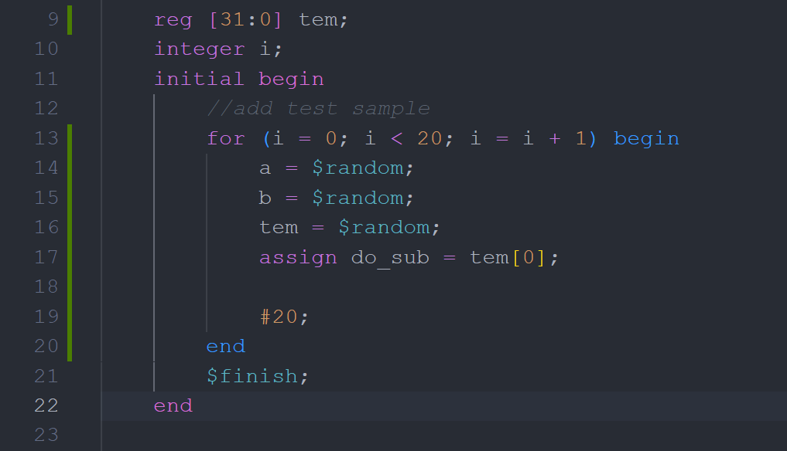
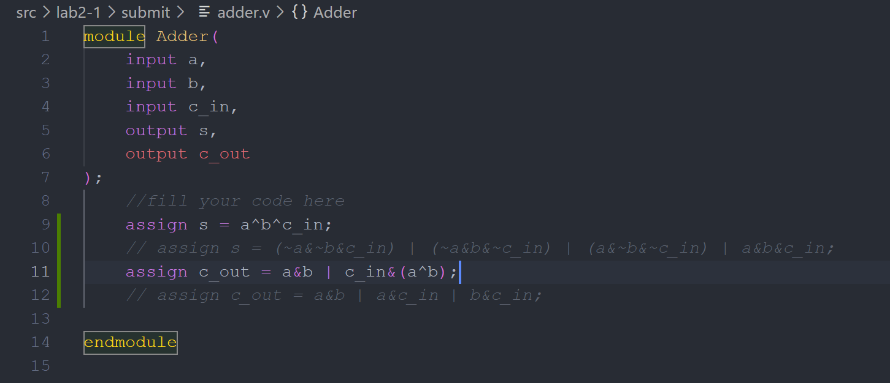
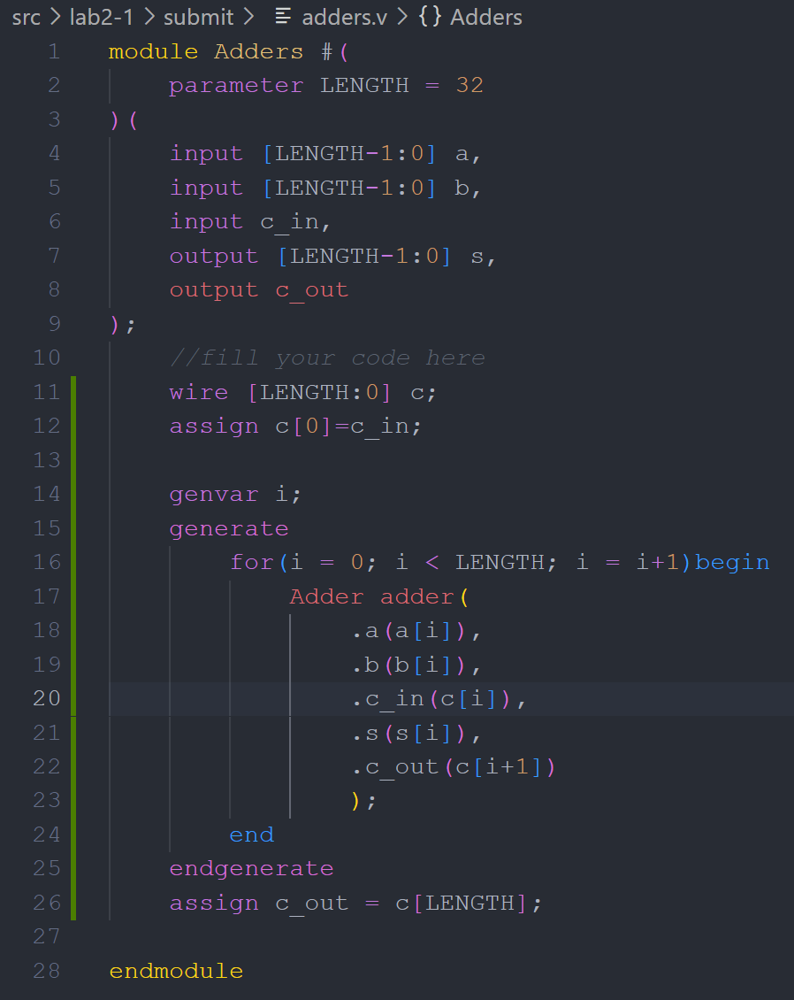
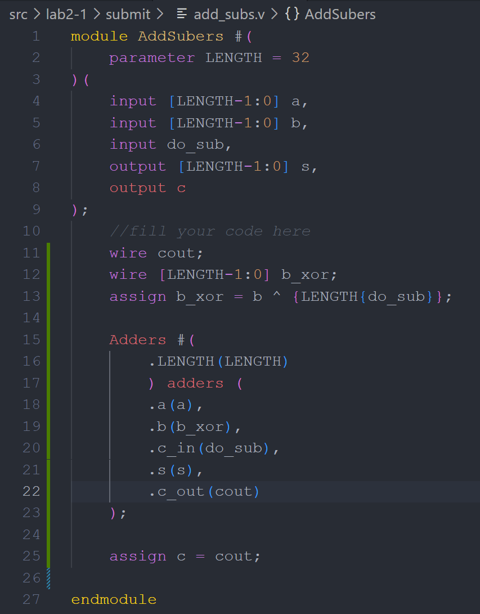
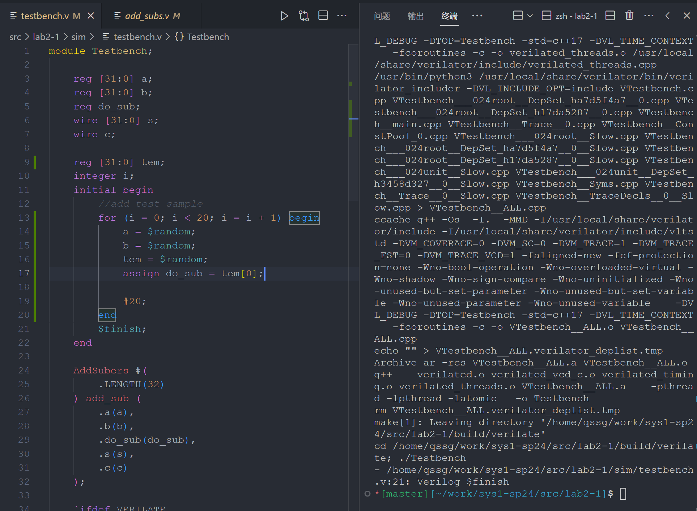

1. **请在实验报告中详细描述每一步的过程并配有适当的截图和解释，对于仿真设计和上板验证的结果也应当有适当的解释和照片。Total : 50%**
> - **使用 `for` 语句进行仿真和综合 15%**
>  - **使用 `$random()` 函数进行仿真样例生成 15%**
> （两个问题一起回答？）
> 如下图 `testbench.v`，使用 `for` 循环仿真 20 次随机数据
>   其中由于 `$random` 产生的是 32 位，取一个随机数 tem 的第 0 位作为随机的 do_sub
>  
>  （ps: 当使用括号时 vscode 报错想让我把文件扩展名改为.sv，当然不改一样能跑，为了不不会报错导致一片红我删去了括号）
>  - **综合实现全加减法器 20%**
>  - 如下依次为 Adder、 Adders、 AddSubers 的设计代码
>  - Adder 根据数据流描述法书写即可，也可用异或进行简化
>    
>  - Adders 即将上一个 Adder 的输出作为下一个的进位 c_in 输入  
>    
>  - AddSubers 则是使用 Adders 计算 a+b^{LENGTH{do_sub}}+do_sub
>        
>  **仿真**
> 在 make (verilate) 后无 error
> 

1. **思考如下问题：**
    
    - **对于 `repo/sys-project/lab2-1/syn/top.v` 中的 `reg [63:0] adder [0:7]`，请依次替换为下面的四种格式**
      
    > reg [0:63] adder [0:7];
    > reg [0:63] adder [7:0];
    > reg [63:0] adder [0:7]; // 与原本无区别（?）
    > reg [127:0] adder [0:7];
    
    **通过仿真或者综合下板观察 adder 的每个 bit 会被初始化为何值？请尝试对每一种格式都进行仿真或者综合，并对 `readmemh` 如何初始化一维向量数组的每个 bit 给出结论。25%**

- adder 的每个位的初始化值取决于数据文件中的数据以及声明 adder 数组的方向
- `$readmemh`从文件中按十六进制读取数据，并根据向量的声明方式（位宽和方向）填充数据。
- 如果向量的位宽大于数据文件中的数据位数，未被填充的位将被置为0。

    - **请思考相对于超前进位加法器，行波进位加法器存在什么缺点？10%**

    行波进位加法器的主要缺点是速度较慢；在行波进位加法器中，每一位的进位必须等待前一位计算完成并生成进位信号后才能进行；在进行多位数加法时，进位信号的传递延迟会累积，从而显著增加加法操作的总体时间
    
    而超前进位加法器可以同时获得 s 和 c，进行下一轮运算不再需要等待上一轮的 s 计算完毕
    
    - **如何表示运算溢出？请给出溢出表示的布尔代数（用 `Adder_32` 的输入与输出计算）。15%**

$Overflow= C_{out}⊕C_{30\rightarrow31}$ ​

这里，$C_{out}$是从最高位加法的进位输出， $C_{30\rightarrow31}$ 是指从第30位到第31位的进位输出