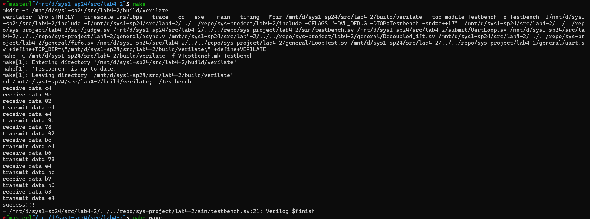
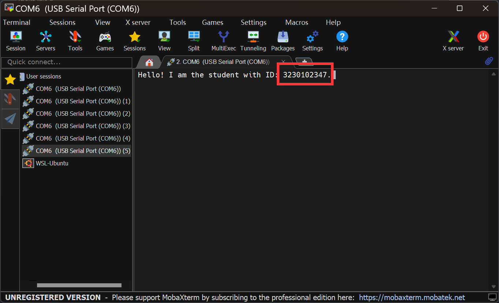
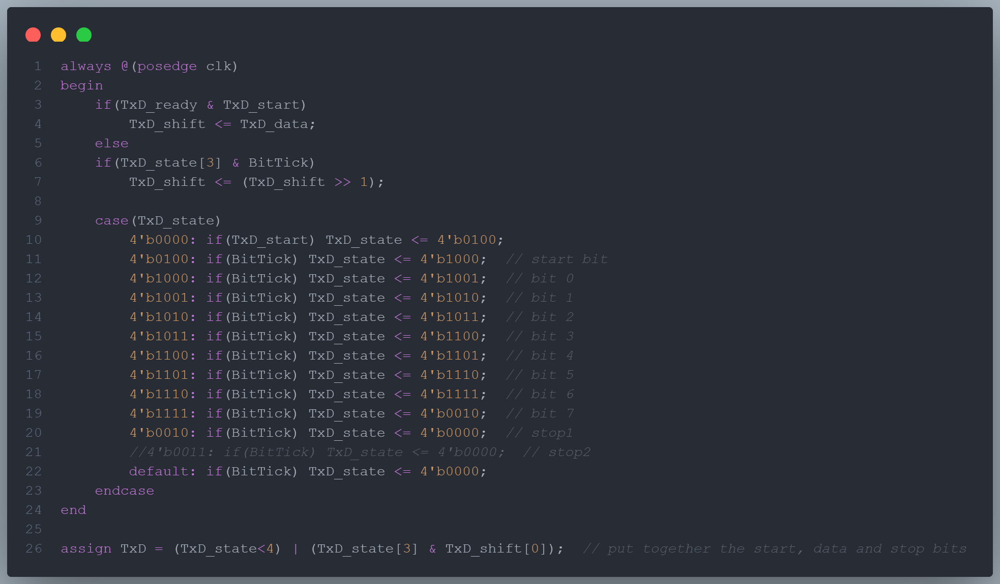
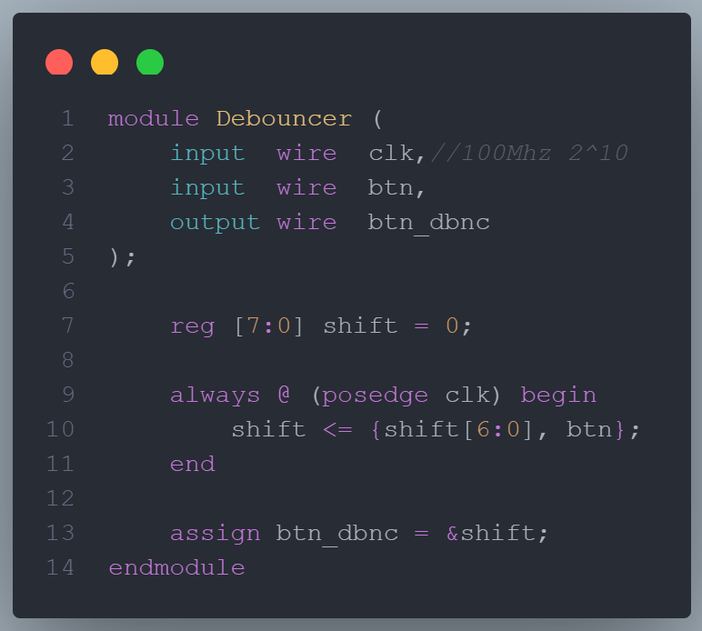

## 1. 请在实验报告中详细描述每一步的过程并配有适当的截图和解释，对于仿真设计和上板验证的结果也应当有适当的解释和照片

### 仿真通过，输出`success!!!`

执行 `make/make verilate` 后如图，仿真通过

### 下板测试，可以通过回环测试，要求会话窗口输出自己的学号

生成比特流下板测试，会话窗口输出如下：

****

## 2. 阅读代码和理论，设计 async_transmitter 的有限状态机，并描述 async_transmitter 的大致工作流程

### async_transmitter 的有限状态机设计

为了设计 async_transmitter 的有限状态机，我们参考原 verilog 代码如下：

不难发现 TxD_state 在中间八个执行内容是相似的，即都是发送数据位，故做合并，设计 FSM 如下：

#### 状态定义

- IDLE：空闲状态，将必要数据复原，等待开始信号 TxD_start。

- START_BIT：发送起始位，通常是一个低电平信号。

- DATA_BITS：发送数据位，从最低位到最高位（LSB first）。

- STOP_BIT：发送停止位，通常是一个或两个高电平信号。

#### 输入

- clk：时钟信号。

- TxD_start：开始传输的触发信号。

- TxD_data：待发送的数据（8位）。

#### 输出

- TxD：串行输出数据线。

- TxD_busy：表示传输器是否忙碌。

#### 状态转换

- IDLE

    - 进行必要的复原操作

    - 如果 TxD_start 为高，则转到 START_BIT 状态。

    - 否则保持在 IDLE。

- START_BIT

    - 发送一个起始位（0），然后转到 DATA_BITS 状态。

- DATA_BITS

    - 依次发送 TxD_data 的每一位，从最低位开始。

    - 发送完所有数据位后，转到 STOP_BIT 状态。

- STOP_BIT

    - 发送一个或两个停止位（1），根据具体协议。

    - 发送完停止位后，转到 IDLE 状态。

#### 输出逻辑

- 在 START_BIT、DATA_BITS 和 STOP_BIT 状态中，合并后由TxD 输出对应的位值

- TxD_busy 在除 IDLE 状态外的所有状态中保持高电平，表示传输器正在工作

### async_transmitter 的工作流程

- 等待触发：在 IDLE 状态下等待 TxD_start 信号。

- 开始传输：收到 TxD_start 后，输出起始位（低电平）。

- 数据发送：按顺序发送 TxD_data 的每一位，从最低位到最高位。

- 结束传输：发送停止位（高电平），标志数据发送完成。

- 重置等待：完成一次传输周期后，返回到 IDLE 状态，进行状态复原，等待下一次的 TxD_start 触发。

## 3. uart 数据线不可避免存在毛刺和电平扰动，思考 async_receiver 可以用什么办法来规避接受数据的毛刺

- 采用去抖电路减小扰动，如下

- 去除开头结尾的不稳定信号，保留中间相对稳定的信号

- 自然地，先去除两端不稳定信号再采用去抖电路减小扰动，即结合使用也是可行的