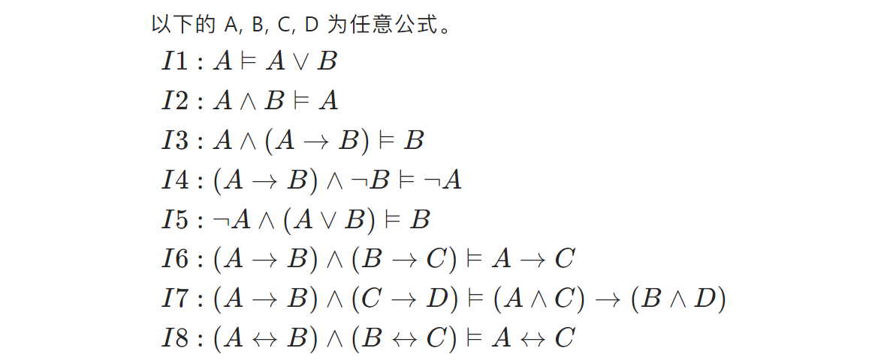

## I Introduction

### I.1 base notations

Our first building block is the notion of a **proposition**, which is simply a statement which is either true or false.

For example:

Notations we should know:

1. **Conjunction（合取）**: P∧Q (“P and Q”). True only when both P and Q are true.
2. **Disjunction（析取）**: P∨Q (“P or Q”). True when at least one of P and Q is true.
3. **Negation（取反/否）**: ¬P (“not P”). True when P is false.
4. **Implication（蕴涵词）**: P ⇒ Q (“P implies Q”). This is the same as “If P, then Q.”**
5. **two-way implication**  p↔q

$$
\begin{aligned}&(\mathrm{a})\:\forall x\forall yP(x,y)\implies\forall y\forall xP(x,y).&&\text{True}\\&(\mathrm{b})\:\forall x\exists yP(x,y)\implies\exists y\forall xP(x,y).&&\text{False}\\&(\mathrm{c})\:\exists x\forall yP(x,y)\implies\forall y\exists xP(x,y).&&\text{True}\\&(\mathrm{a})\:\forall x\:(P(x)\wedge Q(x))\stackrel{?}{\equiv}\:\forall x\:P(x)\wedge\forall x\:Q(x)\quad\textsf{T}\\&(\mathrm{b})\:\forall x\:(P(x)\vee Q(x))\stackrel{?}{\equiv}\:\forall x\:P(x)\vee\forall x\:Q(x)\quad\textsf{F}\\&(\mathrm{c})\:\exists x\:(P(x)\vee Q(x))\stackrel{?}{\equiv}\exists x\:P(x)\vee\exists x\:Q(x)\quad\textsf{T}\\&(\mathrm{d})\:\exists x\:(P(x)\wedge Q(x))\stackrel{?}{\equiv}\exists x\:P(x)\wedge\exists x\:Q(x)\quad\textsf{F}\end{aligned}
$$
(Detailed reason omission)

6. **quantifiers**: The universal quantifier ∀ (“for all”) and the existential quantifier ∃ (“there exists”).

> We often write a proposition in the form of something like **(∀x ∈ Z)(∃y ∈ Z)(x < y)**

7. **equivalent** is something like:

- ¬(P∧Q) ≡ (¬P∨ ¬Q)
- ¬(P∨Q) ≡ (¬P∧ ¬Q)

Of course, these two formulas should be remembered since they tell us how to negate conjunctions and disjunctions

8. about **P→Q**, the truth table is shown below:(`0` stands for **F** while `1` stands for **T**)

| P   | Q   | P→Q |
| :---: | :---: | :---: |
| 0   | 0   | 1   |
| 0   | 1   | 1   |
| 1   | 0   | 0   |
| 1   | 1   | 1   |

9. about **P↔Q**, the truth table is shown below:(`0` stands for **F** while `1` stands for **T**)

|  P  |  Q  | P↔Q |
| :-: | :-: | :-: |
|  0  |  0  |  1  |
|  0  |  1  |  0  |
|  1  |  0  |  0  |
|  1  |  1  |  1  |

10. We say that a sentence A **entails** another sentence B if in all models that A is true, B is as well, and we represent this relationship as **A ⊨ B.**

### I.2 proposition formula

（穷举定理我们在 [02-Proof](02-Proof.md) 中的 "Proof by Cases" 部分中将会使用到）

### I.3 logical equivalence

当命题 $A\longleftrightarrow B$ 是重言式时，称 A 逻辑等价于 B，记作 $A\equiv B$。

实际上，符号 ⊨ 也是，但是打不出来，所以一般用 $\equiv$ ；

逻辑等价：任何赋值情况下，A 和 B 都等值。

#### I.3.1 important logical equivalence

### I.4 logical implication

当命题公式 A $\to$ B 是重言式时，则称 A 逻辑蕴涵 B ，记作 A⊨B。

公式 A 的所有成真赋值都是公式 B 的成真赋值。

即任何赋值情况下，只要 A 为真，则 B 为真； $A \equiv B$ 即为 $A⊨B \land B⊨A$ 。

#### I.4.1 important logical implication

### I.5 The important properties of logical equivalence and logical implication

### I.6 ways to proof

### I.7 priority of operations

1. **括号 ()**：无论在哪个领域，括号始终具有最高的优先级，用于改变默认的优先级顺序。
2. **非 ~  !**：在逻辑运算中，否定（逻辑非、位非）通常具有较高的优先级。
3. **与 ∧**：这包括逻辑与（AND）、位与（&）。在没有括号改变顺序的情况下，它们通常在否定之后立即评估。
4. **异或 ⊕**：在某些情况下，需要考虑异或运算（XOR），它可能在与运算和或运算之间。
5. **或 ∨**：这包括逻辑或（OR）、位或（|）。它们在逻辑与之后进行评估。
6. **条件 →**：如蕴含（→）通常优先级较低。
7. **双条件↔**：双条件（↔）通常具有最低的优先级

## II signs in latex

|   符号    |  ¬   | ∧      |   ∨ | → | ↔ |
| :-----: | :--: | :------: | :---:|:---:|:---:|
| latex 公式 | \neg | \wedge |\vee|\to|\leftrightarrow|

## III Practice

> [!QUOTE]
> 
> We need a lot of insight into propositions rather than just grasping concepts

> For every real number k, there is a **unique** real solution to $x^{3}$ = k.

(∀k ∈ R) (∃x ∈ R)(x 3 = k)∧(∀y,z ∈ R)(((y 3 = k)∧(z 3 = k)) ⇒ (y = z)) .

