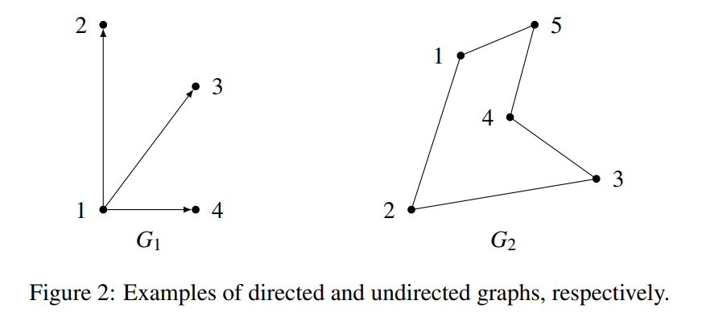
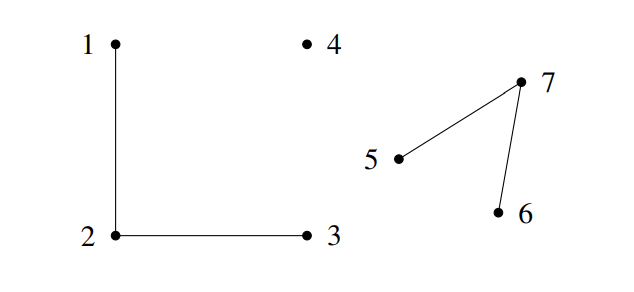
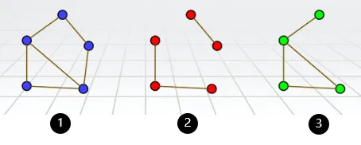
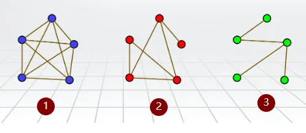
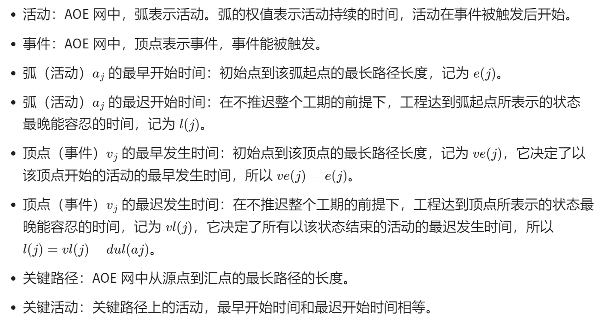
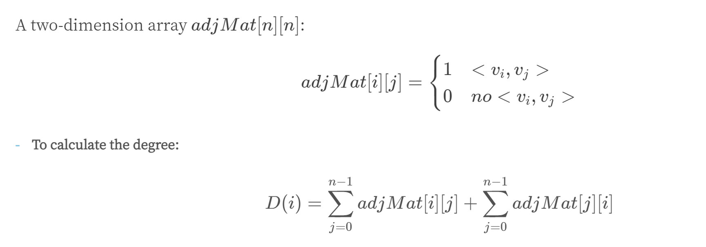
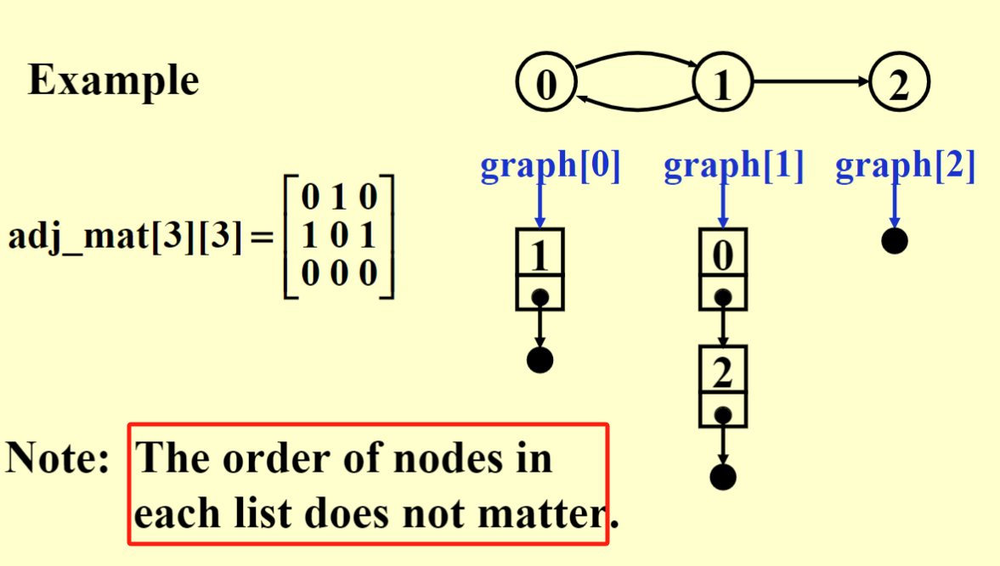
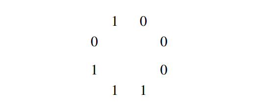

## I Introduction

> _**Seven Bridges Problem**_
> 
> For more information you can see:[Seven Bridges Problem](https://en.wikipedia.org/wiki/Seven_Bridges_of_K%C3%B6nigsberg)

### I.1 formal definitons

#### I.1.1 undirected/directed graph

> [!DEFINITION] Undirected graph
> 
> Formally, **a (undirected) graph** is defined by **a set of vertices V and a set of edges E**. The vertices correspond to the little circles in Figure 1 above, and the edges correspond to the line segments between the vertices. In Figure 1, V = {A,B,C,D} and E = {{A,B},{A,B},{A,C},{B,C},{B,D},{B,D},{C,D}}. However, note that here **E is a multiset (a set where an element can appear multiple times).** This is because in the Königsberg example there are multiple bridges between a pair of banks. We will generally not consider such a situation of multiple edges between a single pair of vertices, so **in our definition, we require E to be a set, not a multi-set. What this means is that between any pair of vertices there is either 0 or 1 edge. If there are multiple edges between a pair of vertices, then we collapse them into a single edge.**
> More generally, we can also define a **directed graph**. If an edge in an undirected graph represents a street, then an edge in a directed graph represents a one-way street. To make this formal, let V be a set denoting the vertices of a graph G.
> 
> For example, we can have V = {1,2,3,4}. Then, the set of (directed) edges E is a subset of V ×V, i.e. E ⊆ V ×V. (Recall here that U ×V denotes the Cartesian product of sets U and V, defined as U ×V = {(u, v) : u ∈ U and v ∈V}.) Continuing with our example, let E = {(1,2),(1,3),(1,4)}. Then, the corresponding graph is given below.
> 
>
> We conclude that **a graph is thus formally specified as an ordered pair G = (V,E)** , where V is the vertex set and E is the edge set.

#### I.1.2 degree

-  If G is **undirected**, then the degree of vertex u ∈ V is the number of edges incident to u, i.e., **degree(v)/d(v) = |{v ∈ V : {u, v} ∈ E}|**. A vertex u whose degree is 0 is called an isolated vertex, since there is no edge which connects u to the rest of the graph.
- A **directed graph**, on the other hand, has two different notions of degree due to the directions on the edges. Specifically, the **in-degree** d-(v) of a vertex u is the number of edges from other vertices to u, and the **out-degree** d+(v) of u is the number of edges from u to other vertices.
- if d(v) == 1, we name this node "pendant node".
- if : for every v ∈ V, d(v) is same to others, then we call this graph "regular graph".

> for example, G 2 (shown above) is a regular graph.

#### I.1.3 (Simple) Paths, walks, and cycles

**(simple) paths:** Let G = (V,E) be an undirected graph. A path in G is a sequence of edges {v1, v2},{v2, v3},...,{vn−2, vn−1},{vn−1, vn}. In this case we say that there is a path between v1 and vn.


**cycles:** In this class, we assume a path is simple, meaning v1,..., vn are distinct. if you wanted drive from house 1 to 3 via house 2, why would you visit house 2 more than once? A cycle (or circuit) is a sequence of edges {v1, v2},{v2, v3},...,{vn−2, vn−1},{vn−1, vn},{vn, v1}, where v1,..., vn are **distinct**.

**walk:** Suppose now that your aim is not to go from 1 to 3 as quickly as possible, but to take a leisurely stroll from 1 to 3 via the sequence {1,2},{2,1},{1,4},{4,3}. A sequence of edges with possibly repeated vertices, such as this one, is called a walk from 1 to 3.

Analogous to the relationship between paths and cycles, **a tour** is a walk which starts and ends at the same vertex. For example, {1,2},{2,3},{3,1} is a tour.


just understand them and you don't have to remember the concepts of them.

**Connectivity:** A graph is said to be connected if there is a path between any two distinct vertices.



Note that any graph (even a disconnected one) always consists of a collection of connected components, i.e., sets V1,...,Vk of vertices, such that all vertices in a set Vi are connected. For example, the graph above is not connected, but nevertheless consists of three **connected components** : V1 = {1,2,3}, V2 = {4}, and V3 = {5,6,7}.

### I.2 Definition supplement

#### I.2.1 拟路径

顶点 v1 到 vm 的 **拟路径**：$v_1,e_1,v_2,e_2,v_3,\ldots,v_{m-1},e_{m-1},v_m$，其中 $e_i=<v_i,v_{i+1}>$ 或 $e_i=\{v_i,v_{i+1}\}\text{。}$

拟路径的边数称为拟路径的 **长度** 。

> 课程笔记中缺少了一些会在数据结构(Data Structure) 中使用到的定义，根据课程 PPT 补充。

#### I.2.2 subgraph

- G1=<V1,E1>，G2=<V2,E2>
- V1⊆V2，E1⊆E2，称 G1 是 G2 的 **子图** (subgraph)
- 如果 G1 是 G2 的子图，且 G1≠G2，则 G1 是 G2 的 **真子图** 
- 如果 G1 是 G2 的子图，且 V1=V2，则 G1 是 G2 的 **生成子图** (spanning subgraph)

例如，下方 2 为 1 的生成子图，3 为 1 的真子图



#### I.2.3 complement graph

- G1=<V1,E1>，G2=<V2,E2>
- V1=V2，E1∩E2=∅， <V1,E1∪E2> 是完全图，则称 G1, G2 互为补图

例如，1 为完全图， 2、3 互为补图



#### I.2.4 isomorphic

设 G1=<V1,E1>，G2=<V2,E2>，如果 |V1|=|V2|，|E1|=|E2| ，且可以将 G1 中 V1 中所有的结点一一对应地置换为 V2 中的结点名后得到的图等于 G2，则称 G1, G2 **同构** (isomorphic)

例如，下面两个图同构


#### I.2.5 Directed Acyclic Graph(DAG)

有向无环图 (DAG) 是一种特殊的有向图，它在图中没有环，即从任意顶点出发，不可能经过若干条边回到该顶点。这样的图形结构具有以下特点：

1. **有向**：图中的每条边都有一个方向，从一个顶点指向另一个顶点。

2. **无环**：图中没有形成闭环的路径，也就是说，从任意顶点开始，不可能通过一系列边回到该顶点。

3. **顶点排序**：由于没有环，DAG 中的顶点可以有一种特殊的排序，称为[拓扑排序](https://oi-wiki.org/graph/topo/)。在这种排序中，对于每一条有向边 uv，顶点 u 在排序中都位于顶点 v 之前。

#### I.2.6 Topological sorting


> [!DEFINITION] 从 [oi-wiki](https://oi-wiki.org/graph/topo/) 上的摘录的关于拓扑排序的笔记
>
> A _topological order_ is a linear ordering of the vertices of a graph such that, for any two vertices, i , j , if i is a predecessor of j in the network then i precedes j in the linear ordering.

在一个 [DAG（有向无环图）](https://oi-wiki.org/graph/dag/) 中，我们将图中的顶点以线性方式进行排序，使得对于任何的顶点 u 到 v 的有向边 <u,v> ，都可以有 u 在 v 的前面，这样一个过程我们可以看作是拓扑排序：

1. 从图中选择一个入度为零的点

2. 输出该顶点，从图中删除此顶点及其所有的出边

3. 重复上面两步，直到所有顶点都输出，拓扑排序完成

如果某一时刻图中不存在入度为零的点，此时说明图是有环图，拓扑排序无法完成；因此“能拓扑排序的图 == 有向无环图”。

##### I.2.6.1 Activity On Vertex Network (AOV 网)

在 AOV 网中， <u>顶点表示活动，弧表示活动间的优先关系</u> 。AOV 网中不应该出现环，这样就能够找到一个顶点序列，使得每个顶点代表的活动的前驱活动都排在该顶点的前面，这样的序列称为拓扑序列（一个 AOV 网的拓扑序列不是唯一的），由 AOV 网构造拓扑序列的过程称为拓扑排序。

- 前驱活动：有向边起点的活动称为终点的前驱活动（只有当一个活动的前驱全部都完成后，这个活动才能进行）。

- 后继活动：有向边终点的活动称为起点的后继活动。

> [!TIP]
>
> 检测 AOV 网中是否带环的方式是构造拓扑序列，看是否包含所有顶点

##### I.2.6.2 Activity On Edge Network (AOE 网)

AOE 网是一个 **带权** 的有向无环图，其中， <u>顶点表示事件，弧表示活动持续的时间</u> 。

通常，AOE 网可以用来估算工程的完成时间。AOE 网应该是无环的，且存在唯一入度为零的起始顶点（源点），以及唯一出度为零的完成顶点（汇点）。

###### I.2.6.2.1 AOE 网相关概念



###### I.2.6.2.2 求解关键路径


##### I.2.6.3 Kahn algorithm

先来自 [Wikipedia](https://en.wikipedia.org/wiki/Topological_sorting#Kahn's_algorithm) 的伪代码

```c
L ← Empty list that will contain the sorted elements 
S ← Set of all nodes with no incoming edges 
while S is not empty do 
    remove a node n from S 
    insert n into L 
    for each node m with an edge e from n to m do 
        remove edge e from the graph 
        if m has no other incoming edges then 
            insert m into S 
if graph has edges then 
    return error (graph has at least one cycle) 
else 
    return L (a topologically sorted order)
```

也就是说，从一个图中，我们准备两个空集合 S & L

1. 取入度为 0 的所有顶点放入 S 中
2. 在 S 不为空的情况下，任取一个顶点 v 放入 L 中，并断开与 v 相连的所有边，重复步骤 1 直到 S 依旧为空
3. 当 S 为空时，结束

     - 若图中任然有边，说明原图不是 DAG；
     - 若图中无边，L 就是拓扑排序的结果。


###### I.2.6.3.1 implement of kahn algorithm

实现部分使用了 C++，读者自行阅读 [实现](https://oi-wiki.org/graph/topo/#%E5%AE%9E%E7%8E%B0)；~~如果有时间写一个 C 版本的放在这。~~

#### I.2.7 Adjacency Matrix & Adjency link

**邻接矩阵（Adjacency Matrix）** 是一种表示图的方法。

对于一个有 n 个顶点的图，其邻接矩阵是一个 n×n 的矩阵 A，其中 $A[i][j]$ 的值表示顶点 i 和顶点 j 之间的连接情况，即



（图片截图于 [Pipipi の blog](https://www.foreverhyx.top/2024/03/06/fundamental-of-data-structure-note/#6-Graph)）

- 对于无向图
    - 如果顶点 i 和顶点 j 之间有一条边，则 $A[i][j] = A[j][i] = 1$
    - 如果没有直接连接，则为 0
    - 由于是无向图，邻接矩阵是 <u>对称</u> 的
- 对于有向图
    - 如果从顶点 i 到顶点 j 有一条弧，则 $A[i][j]$ 为 1
    - 如果不存在这样的弧，则为 0
    - 在有向图中，邻接矩阵可能不对称

> [!INFO]
>
> 邻接矩阵可以用于各种图算法中，例如深度优先搜索（DFS）、广度优先搜索（BFS）、Dijkstra 算法和 Floyd-Warshall 算法等。它提供了一个简单的方式来检查两个顶点之间是否有一条边，以及获取一个顶点的所有邻接点

不难得知空间复杂度为 $O(N^{2})$，在数据较大时难以接受，可能更适合使用邻接表

**邻接列表（Adjacency List）** 是图的一种常见表示方法

实现：



- **顶点数组**：一个数组，用于存储图中的所有顶点。
- **邻接列表**：对于每个顶点，都有一个列表（通常是一个链表或数组），存储了所有与该顶点直接相连的其他顶点。在无向图中，如果顶点A与顶点B相连，那么A的邻接列表将包含B，同时B的邻接列表也将包含A。在有向图中，如果存在从A到B的边，则A的邻接列表将包含B，但不一定意味着B的邻接列表包含A。

邻接列表的优势在于它的空间效率。

对于有 V 个顶点和 E 条边的图，邻接列表只需要 O(V+2E) 的空间，这在 E 远小于 $V^{2}$  的情况下比邻接矩阵更节省空间。邻接列表也便于快速地访问一个顶点的所有邻接点，这对于图的遍历算法（如深度优先搜索或广度优先搜索）特别有用。

> 邻接列表的缺点是查找两个顶点之间是否存在边的时间复杂度较高，为 O(V)。如果需要频繁地进行这种查找操作，可能需要使用其他数据结构，如邻接矩阵或哈希表。

## II Revisiting the Seven Bridges of Koenigsberg: Eulerian Tours

Given a graph G(namely Seven Bridges Problem), is there a walk in G that uses each edge exactly once? We call any such walk in a graph an **Eulerian walk**. (In contrast, by definition a walk can normally visit each edge or vertex as many times as desired.)

Moreover, if an Eulerian walk is closed, i.e., it ends at its starting point, then it is called an **Eulerian tour**.

For this, define an **even degree graph** as a graph in which all vertices have even degree.

> [!THEOREM] THEOREM 5.1 _Euler’s Theorem_ (1736)
> 
> An undirected graph G = (V,E) has an Eulerian tour iff G is even degree, and connected (except possibly for isolated vertices).
> 
>> [!proof] proof
>> 
>> 其实很简单，根据题意，我们每条边都要走且只走一遍
>> 
>> - Only if :如果某个端点（非起点）有奇数条边，那总会有那么一个时刻进去了出不来；对于起点，那就是有一个时刻出去了没法进来；总之反证法可得
>> 
>> - if : 我们可以改为证明 **FindTour(G, s)**
>> 
>>> FINDTOUR is very simple: In even degree graph, it just starts walking from a vertex s ∈ V, at each step choosing any untraversed edge incident to the current vertex, until it gets stuck because there is no more adjacent untraversed edge.
>> 
>> 证明同样简单，如果卡在 t != s 处，那么说明进出 t 的次数是奇数，这与 even degree graph 定义相矛盾，故 t == s，也就是说一定会返回原点。

For more information such as algorithm EULER(G, s), you can visit [Fleury's algorithm & Hierholzer's algorithm](https://en.wikipedia.org/wiki/Eulerian_path#Fleury's_algorithm)

## III Planarity, Euler’s Formula, Coloring.

### III.1 Tree

Just like what we learn in Data Struct, so we pass it.

### III.2 Planar Graphs

A graph is planar if it **can** be drawn on the plane <u>without crossings</u>.

Just understand what "can" stands for since the first and second graphs below are the same, but drawn differently; the second drawing has crossings, the graph is still considered planar since it is **possible** to draw it without crossings.


The first one of them is the infamous “three houses-three wells graph,” also called K3,3, (This notation says there are two sets of vertices, each of size three and all edges between the two sets of vertices are present.) The second is the “complete” graph (every edge is present) with five nodes, or K5. The third is the four-dimensional cube. We shall soon see how to prove that all three graphs are non-planar.


If we define graph's vertices (their number will be denoted v here) and edges (their number is e), the faces of the graph (more precisely, of the drawing). The faces are the regions into which the graph subdivides the plane, then goes Euler's formula:

> [!THEOREM] THEOREM 5.2 _Euler's formula_
> 
> For every connected planar graph, v+ f = e+2
> 
>> [!Proof] Proof by induction on e
>> 
>> It certainly holds when e = 0, and v = f = 1. Now take any connected planar graph. Two cases: 
>> 
>> • If it is a tree, then f = 1 (drawing a tree on the plane does not subdivide the plane), and e = v − 1 (check homework). 
>> 
>> • If it is not a tree, find a cycle and delete any edge of the cycle. This amounts to reducing both e and f by one. By induction the formula is true in the smaller graph, and so it must be true in the original one.

If we define  $s_i$  as the number  of edges of face_i, then we get that:

$$
\sum_{i=1}^f  s_i  = 2e
$$

It is easy to learn that  $s_i \geq 3$,  solving for f and plugging into Euler’s formula we get **e ≤ 3v−6**.

This is an important fact, which helps us to konw that  $K_{5}$  is not planar.

What about  $K_{3,3}$  ?

As we can see in  $K_{3,3}$ , there is no triangle so  $s_i \geq 4$ , which turns out to be that: $e ≤ 2v−4$, so  $K_{3,3}$  is not planar.

This is made precise in the following famous result, due to the Polish mathematician Kuratowski (this is what “K” stands for)

> [!THEOREM] THEOREM 5.3
> 
> A graph is non-planar iff it contains  $K_{5}$  or  $K_{3,3}$ .
> 
>> [!proof] **Proof** 
>> 
>> for a short proof you may want to type “proof of Kuratowski’s theorem” in your favorite search engine

## IV Important classes of graphs

就像互联网一样，我们希望任何一个节点都能够访问到其余任何一个节点，这就要求我们的图是彼此连接的。但是连接太少（如 Trees 或者 link）会导致一处连接中断而大片失联；连接过多（如每一个节点都直接连接其他所有节点，即 Complete graphs）又在成本和复杂度上不切实际；因此，我们需要一个很好地结合双方特点的图形结构，即超立方体(hypercubes)。

下面我们将介绍三者，以 hypercubes 为主。

### IV.1 Complete graphs

As we can see, complete graphs contain the maximum number of edges possible.

Here, the notation Kn denotes the unique complete graph on n vertices.

Formally, we can write Kn = (V,E) for |V| = n and E = {{vi , vj} | vi ̸= vj and vi , vj ∈ V} in undirected graphs.


Finally, we can also discuss complete graphs for **directed graphs**, which are defined as you might expect: For any pair of vertices u and v, **both (u, v),(v,u) ∈ E**.

### IV.2 Trees

Formally, there are a number of equivalent definitions of when a graph G = (V,E) is a tree, including:

1. G is connected and contains no cycles.
2. G is connected and has n−1 edges (where n = |V|).
3. G is connected, and the removal of any single edge disconnects G.
4. G has no cycles, and the addition of any single edge creates a cycle.


In a rooted tree, there is a designated node called the root, which we think of as sitting at the top of the tree. The bottom-most nodes are called leaves, and the intermediate nodes are called internal nodes.

Note that in a rooted tree, a root is never a leaf. In particular, this differs from an unrooted tree; in an unrooted tree, leaves are any vertex of degree 1.

Then goes the same as what we learn in Data Struct, so we pass it.

### IV.3 Hypercubes

#### IV.3.1 definition

> [!note] direct  definitions
> 
> The vertex set of the n-dimensional hypercube G = (V,E) is given by V = $\{0,1\}^{n}$ , where recall $\{0,1\}^{n}$ denotes the set of all n-bit strings. In other words, each vertex is labeled by a unique n-bit string, such as 00110···0100. The edge set E is defined as follows: Two vertices x and y are connected by edge {x, y} if and only if x and y differ in exactly one bit position. 
> 
> For example, x = 0000 and y = 1000 are neighbors, but x = 0000 and y = 0011 are not.
>  More formally, x = x1x2 ... xn and y = y1y2 ... yn are neighbors if and only if there is an i ∈ {1,...,n} such that $x_{j} = y_{j}$ for all $j \neq i$, and $x_{i} \neq y_{i}$ . 
> 

 To help you visualize the hypercube, we depict the 1-, 2-, and 3-dimensional hypercubes below.


This kind of struct is useful in  [Karnaugh map](https://en.wikipedia.org/wiki/Karnaugh_map) .

> [!note] recursive definition
> 
> Define the 0-subcube (respectively, 1-subcube) as the (n−1)-dimensional hypercube with vertices labeled by 0x for x ∈ {0,1} n−1 (respectively, 1x for x ∈ {0,1} n−1 ). Then, the n-dimensional hypercube is obtained by placing an edge between each pair of vertices 0x in the 0-subcube and 1x in the 1-subcube.
> 
> 我们通过上面的图一到图二来理解：
> 
> 在图一中有两个节点：**0 和 1**，这其实就是上面所谓的 x，我们在前面一一分别加上 0 和 1，也就上面所谓的 **0 x、1 x** ，一共会出现了 4 个节点：**00、01；10、11** 。且我们应该将 0 x 与对应的 1x 之间加上边，这样构成了图二
> 
> 同理由图二构成图三，递归定义

We began this section by singing praises for the hypercube in terms of its connectivity properties; we now investigate these claims formally. Let us begin by giving two proofs of a simple property of the hypercube. ^^Each proof relies on one of our two equivalent (namely, direct and recursive) definitions of the hypercube.^^

> [!LEMMA] LEMMA 5.1
> 
> The total number of edges in an n-dimensional hypercube is $n*2^{n-1}$ .
> 
> 
> proof 2 can be got by induction

> [!THEOREM] THEOREM 5.4
> 
>  Let S ⊆ V be such that |S| ≤ |V −S| (i.e., that |S| ≤ 2\*n−1 ), and let ES denote the set of edges connecting S to V −S, i.e., $$E_{S} := \{\{u, v\} ∈ E | u ∈ S \land v ∈ V −S\}$$
>  Then, it holds that | $E_{S}$ | ≥ |S|.
>
>> [!PROOF] **Proof**  (~~I haven't got it yet~~)
>> 
>> We proceed by induction on n. Base case (n = 1): The 1-dimensional hypercube graph has two vertices 0 and 1, and one edge {0,1}. We also have the assumption $|S| ≤ 2^1−1 = 1$, so there are two possibilities. First, if |S| = 0, then the claim trivially holds. Otherwise, if |S| = 1, then S = {0} and V −S = {1}, or vice versa. In either case we have ES = {0,1}, so |ES| = 1 = |S|. Inductive hypothesis: Assume the claim holds for 1 ≤ n ≤ k. Inductive step: We prove the claim for n = k + 1. Recall that we have the assumption $|S| ≤ 2^k$ . Let S0 (respectively, S1) be the vertices from the 0-subcube (respectively, 1-subcube) in S. We have two cases to examine: Either S has a fairly equal intersection size with the 0- and 1-subcubes, or it does not. 
>> 
>> - Case 1: $|S_{0}| ≤ 2^{k-1}$ and $|S_{1}| ≤ 2^{k-1}$ .
>> 
>> In this case, we can apply the induction hypothesis separately to the 0- and 1-subcubes. This says that restricted to the 0-subcube itself, there are at least |S0| edges between |S0| and its complement (in the 0-subcube), and similarly there are at least |S1| edges between |S1| and its complement (in the 1-subcube). Thus, the total number of edges between S and V −S is at least |S0|+|S1| = |S|, as desired. 2. 
>> 
>> - Case 2: $|S_{0}| > 2^{k-1}$ 
>> 
>> In this case, S0 is unfortunately too large for the induction hypothesis to apply. However, note that since |S| ≤ 2 k , we have |S1| = |S|−|S0| ≤ 2 k−1 , so we can apply the hypothesis to S1. As in Case 1, this allows us to conclude that there are at least |S1| edges in the 1-subcube crossing between S and V −S. What about the 0-subcube? Here, we cannot apply the induction hypothesis directly, but there is a way to apply it after a little massaging. Consider the set V0 −S0, where V0 is the set of vertices in the 0-subcube. Note that |V0| = 2 k and $|V_{0} −S_{0}| = |V_{0}|−|S_0| = 2^k −|S_{0}| < 2^k −2^{k−1} = 2^{k−1}$ . Thus, we can apply the inductive hypothesis to the set V0 − S0. This yields that the number of edges between S0 and V0 −S0 is at least 2k − |S0|. Adding our totals for the 0-subcube and the 1-subcube so far, we conclude there are at least 2k − |S0|+|S1| crossing edges between S and V −S. However, recall our goal was to show that the number of crossing edges is at least |S|; thus, we are still short of where we wish to be. But there are a still edges we have not accounted for — namely, those in ES which cross between the 0- and 1-subcubes. Since there is an edge between every vertex of the form 0x and the corresponding vertex 1x, we conclude there are at least |S0| − |S1| edges in ES that cross between the two subcubes. Thus, the total number of edges crossing is at least $2^k −|S0|+|S1|+|S0| −|S1| = 2^k ≥ |S|$, as desired.

#### IV.3.2 de Bruijn sequence

A **de Bruijn sequence** is a 2n -bit circular sequence such that every string of length n occurs as a contiguous substring of the sequence exactly once.

For example, the following is a de Bruijn sequence for the case n = 3:



