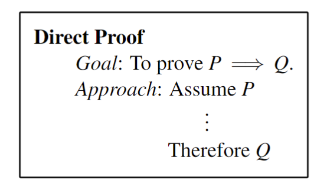
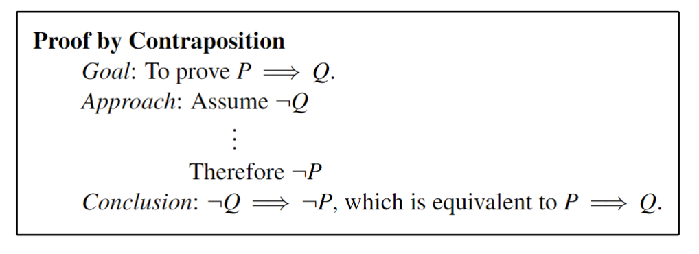
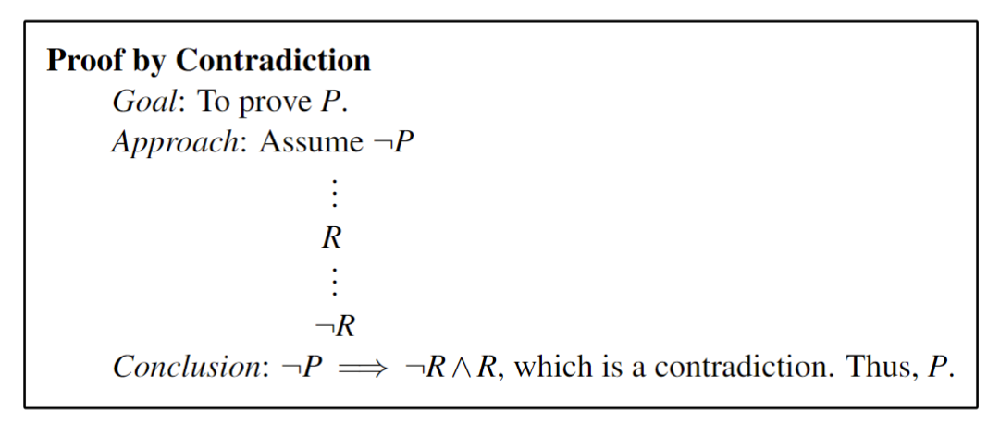
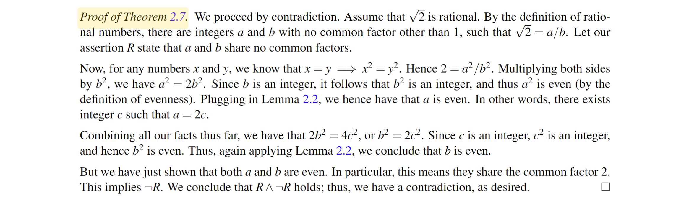
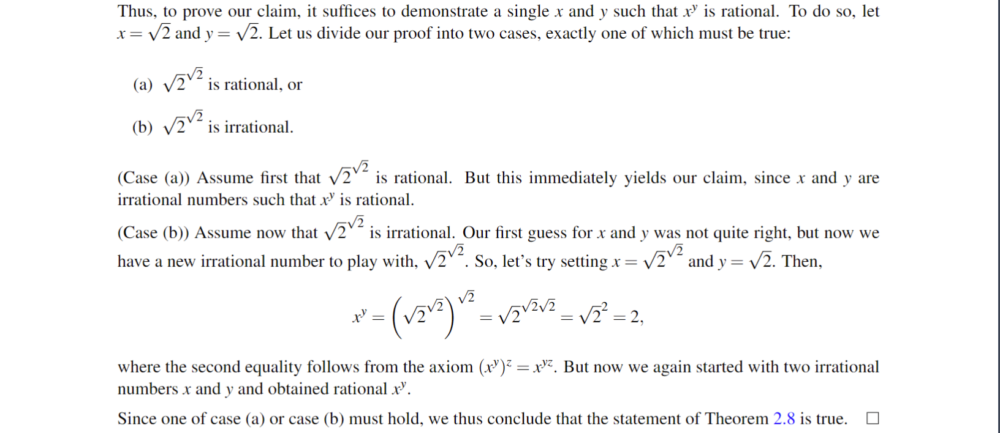
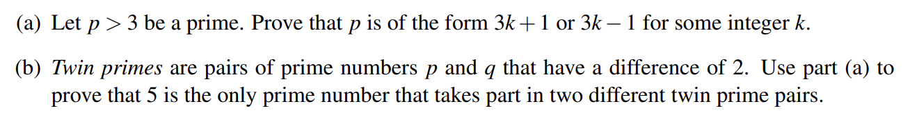

## I Four proof technologies

We will follow below (omitted for direct proof ):

> [!ATTENTION]
> 
> Note that the first line of our proof stated our proof technique — this is good practice for any proof, similar to how commenting code is good practice when programming.

### I.1 Direct proof（直接证明）

直接证明，即从已知条件 P 直接推理证明结论 Q，无需多言

> [!THEOREM 2.1]
> 
> the sum of the digits of n is divisible by 3 $\iff$ n is divisible by 3

这个定理我们自小学就听过会用，如何证明？

> [!PROOF OF T1]
>
> 取 $a_1、a_2、\cdots、a_{n} \in N^{+}$，那么 `the sum of the digits of n` 也就是 $\sum a_{k}$ ，任意一个整数可以表示为 
> 
> $$n=\sum_{k = 0}^{n} a_{k}*10^{k}=\sum a_{k}+\sum_{k=1}^{n}a_{k}*\omega_{k}$$ 
> 
> 其中 $\omega_{k}$ 是一个各位均为 9 的 k 位数，显然可被 3 整除，那么结论显然了。

### I.2 Proof by Contraposition（对位证明）

对位证明，既是求证其逆否命题（它与原命题的真假性是一致的）

> [!THEOREM 2.2]
> 
>  **(_Pigeonhole Principle_)** Let n and k be positive integers. Place n objects into k boxes. If n > k, then at least one box must contain multiple objects

^44f2f4

这是“鸽巢原理”，也就是我们熟知的“抽屉原理”，反证法当然可以，但我们尝试使用对位证明

> [!PROOF OF T2]
> proceed by contraposition
> 
> If all boxes contain at most one object, then the number of objects is at most the number of boxes,
>  i.e.(== namely), n ≤ k.

### I.3 Proof by Contradiction(矛盾证明)

矛盾证明（即反证法）也是比较熟悉的，即假设结论 Q 不成立，发现条件 P 是“不对的”，说明假设不成立，即结论 Q 成立。

> [!THEOREM 2.3]
> 
> There are infinitely many prime numbers.
> A subsidiary result that is useful in a more complex proof is called a **lemma**.
> 
> some of famous lemmas: the Pumping Lemma and the Lifting Lemma.

understand a simple lemma before we start to :

> [!Lemma 1]
> 
> Every natural number greater than one is either prime or has a prime divisor
>> `one` is standing for `1`

简单来说即“所有大于 1 的整数不是素数就是素数的倍数”

> [!PROOF OF T 3 ]
> proceed by contradiction
> 
>  Suppose that Theorem 2.6 is false, i.e. that there are only finitely many primes, say k of them. 
>  
>  Then, we can enumerate them: p1, p2, p3, . . . , pk. Now, define number q := p1 p2 p3 . . . pk + 1, which is the product of all primes plus one. We claim that q cannot be prime. Why? Because by definition, it is larger than all the primes p1 through pk! By Lemma 2.1, we therefore conclude that q has a prime divisor, p. This will be our statement R. 
>  
>  Next, because p1, p2, p3, . . . , pk are all the primes, p must be equal to one of them; thus, p divides r := p1 p2 p3 . . . pk. Hence, p | q and p | r, implying p | (q − r). But q − r = 1, implying p ≤ 1, and hence p is not prime; this is the statement ¬R. We thus have R ∧ ¬R, which is a contradiction, as desired.

同时我们也可以发现一个结论：小于一个有限数的所有素数的乘积加 1 后一定也是素数，那么我们就可以推出无数个素数来（当然，不能保证覆盖到每个素数）

> [!EXAMPLE]
> 
> How to prove that $\sqrt{ 2 }$ is an irrational number? 
> 

> **Exercise 1**
> 
> Prove that if there are n ≥ 2 people at a party, then at least 2 of them have the same number of friends at the party. Assume that friendships are always reciprocated: that is, if Alice is friends with Bob, then Bob is also friends with Alice.
> 
> **proof** proceed by contradiction using [_Pigeonhole Principle_](02_Proof.md#^44f2f4)
> 
> Suppose the contrary that everyone has a different number of friends at the party. Since the number of friends that each person can have ranges from 0 to n−1, we conclude that for every i ∈ {0,1,...,n−1}, 
> there is exactly one person who has exactly i friends at the party.
> In particular, there is one person who has **n−1** friends (i.e., friends with everyone), is friends with a person who has **0** friends (i.e., friends with no one). This is a contradiction since friendship is mutual.

### I.4 Proof by Cases（案例证明）

> Specifically, the idea behind a **proof by cases** is as follows:
>  
> Sometimes when we wish to prove a claim, we don’t know which of a set of possible cases is true, but we know that at least one of the cases is true. What we can do then is to prove the result in both cases; then, clearly the general statement must hold

简单来说，对于一个（存在性）命题，我们能够举出多种情况（能将所有可能性包括），并证明至少有一种是成立的，那么，这个命题成立（由穷尽定理不难得知）

> [!THEOREM 2.4]
> 
> There exist irrational numbers x and y such that xy is rational

> [!PROOF OF T 4] 
> proceed by cases
> 
> 
> 
> attention, we don't assert which x ($\sqrt{ 2 }$ or $\sqrt{ 2 }^{\sqrt{ 2 }}$) is right when y = $\sqrt{ 2 }$ , but one of them must satisfy the theorem.

## II Some lessons

- Lesson #1: When writing proofs, **do not assume** the claim you aim to prove!
- Lesson #2 is about the **number zero**: In particular, never forget to consider the case where your variables take on the value 0.
- Lesson #3 says to be careful when mixing **negative numbers and inequalities**.

## III Practice

---

**Q 1**

> 

The (a) is easy since an integer can be only $3k-1, 3k, 3k+1$ while $3k(>3)$ can't be a prime.

For (b):

  We can check all the primes up to 5 to see that of these, only 5 takes part in two twin prime pairs (3,5 and 5,7). What about primes > 5? For any prime m > 5, we can check if m+2 and m−2 are both prime. Note that if m > 5, then m+2 > 3 and m−2 > 3 so we can apply part (a) and we can do a proof by cases based on the two forms from part (a).

  Case 1: m is of the form 3k +1. Then m+2 = 3k +3, which is divisible by 3. So m+2 is not prime.

  Case 2: m is of the form 3k −1. Then m−2 = 3k −3, which is divisible by 3. So m−2 is not prime.

  So in either case, at least one of m+2 and m−2 is not prime.

