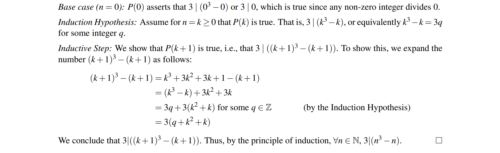
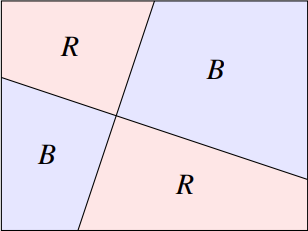
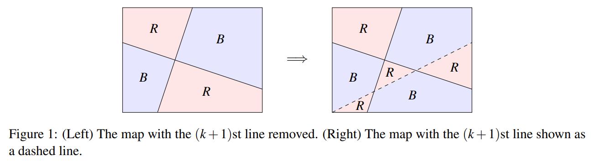
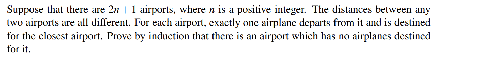
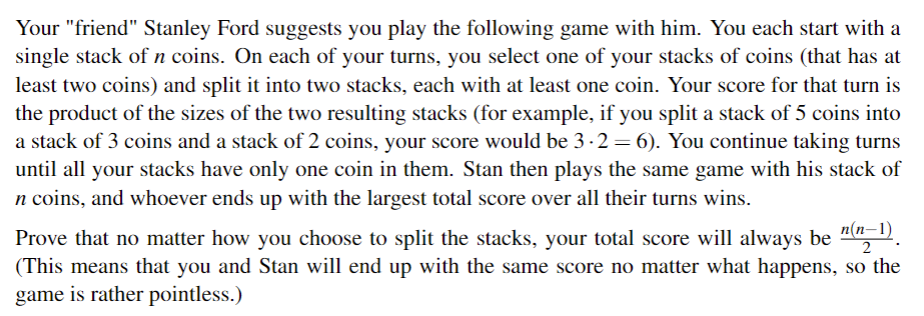
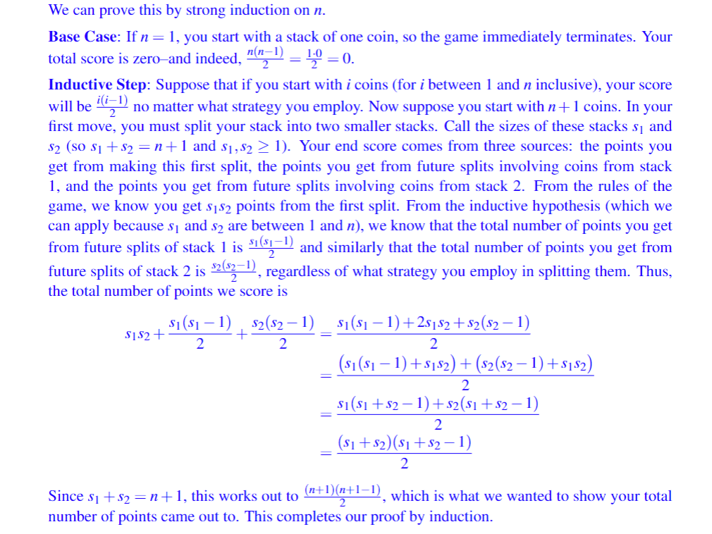

# ---
comments: true
dg-publish: true
tags:
- DMPT
- notes
---

## I Introduction

In short, mathematical induction just likes domino, one pushes another.

**three simple steps:**

1. **Base Case**: Prove that P(0) is true.
2. **Induction Hypothesis**: For arbitrary k ≥ 0, assume that P(k) is true.
3. **Inductive Step**: With the assumption of the Induction Hypothesis in hand, show that P(k + 1) is true

> **Theorem 3.1**
> 
> For all $n\in N, n^{3}-n$ is divisible by 3.
> 
> **proof** proceed by induction
> 
> (In fact, we can prove it by cases since $n^{3}-n=(n-1)n(n+1)$ , and one of the factors on the right side of the equation must be a multiple of 3, then we get it.)

We now consider a more advanced proof by induction, which establishes a simplified version of the famous _four color theorem_. But it is too difficult for us to prove. Let's change it easier:

> [!THEOREM 3.2] 
> 
>  (**_Two Color Theorem_**) our “map” is given by a rectangle which is divided into regions by drawing straight lines, such that each line divides the rectangle into two regions, then:using no more than two colors (say, red and blue) such that no two bordering regions have the same color(below is an example case)
> 

> [!PROOF] 
> 
> proceed by induction
> 
> we set <u>n</u> as the number of lines
> 
> 1. <u>Base Case</u> (n = 0):  Clearly P(0) holds, since if we have n = 0 lines we can color the entire map using a single color.
>
> 2. <u>Induction Hypothesis</u>:  For some arbitrary n = k ≥ 0, assume P(k).
> 
> 3. <u>Inductive Step</u>: Whenever we add a line, that is, P(k+1), we can always prove that P(k+1) is true by swapping parts of red and blue (as shown below)

## II Strengthening the Induction Hypothesis

Sometimes, our Induction Hypothesis is too “weak”; it does not give us enough structure to say anything meaningful, for example:

> [!THEOREM 3.3]
> 
> For all n ≥ 1, the sum of the first n odd numbers is a perfect square.

In fact, we can not prove it directly. The reason is that this claim <u>did not capture the true structure</u> of the underlying fact we were trying to prove — it was too <u>vague</u>. As a result, our Induction Hypothesis wasn’t strong enough to prove our desired result.

Let us try to show the following <u>stronger claim</u>.

> [!THEOREM 3.3'] 
> 
> For all n ≥ 1, the sum of the first n odd numbers is $n^{2}$ .
> (It is easy to prove by induction)

## III Strong Induction

Sometimes we can solve the question difficultly by using P(k) solely, that's why strong induction appears.

**strong induction:** we assume the stronger statement that P(0), P(1), . . . , and P(k) are all true (i.e. that $\land_{i=0}^{k} P(i)$ is true)

> [!attention]
> 
> Is there a difference between the power of strong and weak induction, i.e., <u>can strong induction prove statements which weak induction cannot?</u>
> 
> **No!** Intuitively, this can be seen by returning to our dominoanalogy.

Then, next one:

> [!THEOREM 3.4] 
> 
> Every natural number n > 1 can be written as a product of one or more primes.
> 
> **proof** proceed by induction and cases
> 
> Let P(n) be the proposition that n can be written as a product of primes. We will prove that P(n) is true for all n ≥ 2. 
> 
> 1. Base Case (n = 2): We start at n = 2. Clearly P(2) holds, since 2 is a prime number. 
> 
> 2. Induction Hypothesis: Assume P(n) is true for all 2 ≤ n ≤ k.
>
> 3. Inductive Step: Prove that n = k +1 can be written as a product of primes. We have two cases: either k +1 is a prime number, or it is not.
>
>> **For the first case**, if k +1 is a prime number, then we are done since k +1 is trivially the product of one prime (itself). 
>> 
>> **For the second case**, if k + 1 is not a prime number, then by definition k + 1 = xy for some x,y ∈ Z + satisfying 1 < x, y < k + 1. By the Induction Hypothesis, x and y can each be written as a product of primes (since x, y ≤ k). But this implies that k +1 can also be written as a product of primes.
> Then, we get it.

(Recursion, programming and induction are also mentioned here, but these will be covered in `FDS`, so we'll skip them)

## IV False proofs

Let's look at one of history's most famous false proofs which makes us laugh:

> **False theorem**
> 
> All horses are the same color
> 
> **proof** proceed by induction
> 
> 1. Base Case (n = 1): P(1) is certainly true, since if you have a set containing just one horse, all horses in the set have the same color.
> 
> 2. Induction Hypothesis: Assume P(n) holds for some arbitrary n ≥ 1. 
> 
> 3. Inductive Step: Given a set of n + 1 horses {h1,h2,...,hn+1}, we can exclude the last horse in the set and apply the induction hypothesis just to the first n horses {h1,...,hn}, deducing that they all have the same color. <u>Similarly, we can conclude that the last n horses {h2,...,hn+1} all have the same color. </u>But now the “middle” horses {h2,...,hn} (i.e., all but the first and the last) belong to both of these sets, so they have the same color as horse h1 and horse hn+1. It follows, therefore, that all n+1 horses have the same color. We conclude, by the principle of induction, that all horses have the same color.

## V Practice

---

**Q 1** _Airports_

> 
>
> 简而言之，奇数个机场两两相距不同，一定有一个机场 A 到任意机场 B 的距离比剩余机场其一 C 到 B 的距离要远，因而没有飞机降落在 A。

我们使用数学归纳法证明：

1. $n=1$ 时，即三个机场，不妨设 a,b,c 且 ab 之间的距离最近，则没有飞机去c

2. $n=k$ 时，假设成立

3. 当 $n=k+1$ 时我们先去掉相距最近的两个机场(a,b)，又回到了 $n=k$ 的情况，不妨设没有飞机去的是 z，现在我们把 a,b 加回来，他俩的飞机不可能去 z，那么 $n = k+1$ 命题依旧成立，命题得证。

---

**Q 2** _Coins game_

>  
>
> 简而言之，一堆硬币每次分成两堆，个数相乘为小得分；继续分直到所有堆都只有一个硬币，所得总分为小得分相加，但是总得分终会是 $\frac{n(n-1)}{2}$ 

不难发现其实这与我们证明 Theorem 4 是类似的，将未证明情况转变为已证明情况，下面是参考解答：

---

**Q 3** _Grid Induction_

> Pacman is walking on an infinite 2 D grid. He starts at some location (i, j) ∈ N 2 in the first quadrant,and is constrained to stay in the first quadrant (say, by walls along the x and y axes).Every second he does one of the following (if possible):
> 
> (i) Walk one step down, to (i, j − 1).
> (ii) Walk one step left, to (i − 1, j).
> 
> Prove by induction that no matter how he walks, he will always reach (0, 0) in finite time.

这道题很简单，我们甚至可以加强命题：P 由 $(i, j)$ 一定经过 i+j 步后到达 $(0,0)$ （证明略）

