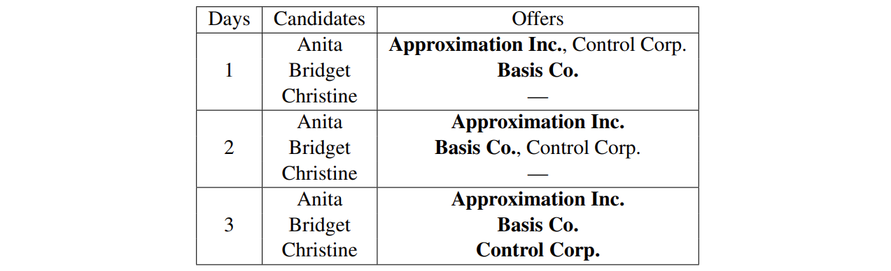
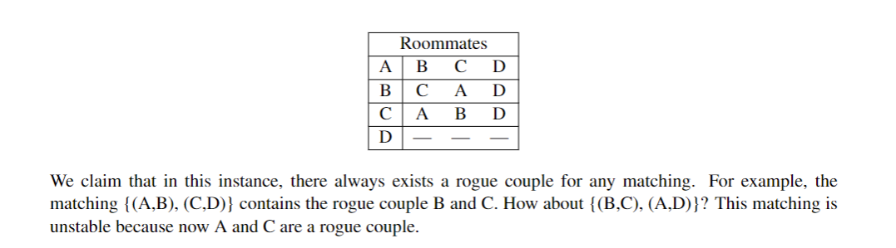

## I Introduction

The Stable Matching Problem is described below

## II The Propose-and-Reject Algorithm

(a.k.a. the Gale-Shapley algorithm)

We think of the algorithm as proceeding in “days” to have a clear unambiguous sense of discrete time.

> [!progress]
> 
> **Every Morning**: Each job proposes (i.e. makes an offer) to the most preferred candidate on its list who has not yet rejected this job. 
> 
> **Every Afternoon**: Each candidate collects all the offers she received in the morning; to the job offer she likes best among these, she responds “maybe” (she now has it in hand or on a string), and to the other offers she says “no” (i.e., she rejects them). (This is just a way for us to virtually model that there are no “exploding offers” and a job can’t withdraw an offer once an offer is made.) 
> 
> **Every Evening**: Each rejected job crosses off the candidate who rejected its offer from its list. 
> 
> The above loop is repeated each successive day until there are no offers rejected. At that point, each candidate has a job offer in hand (i.e. on a string); and on this day, each candidate accepts their offered job (i.e. the job offer she has in hand) and the algorithm terminates.

Let’s understand the algorithm by running it on our example above.

(bold type indicates the offer accepted by the candidate)

## III Properties of the Propose-and-Reject Algorithm

There are two properties we wish to show about the propose-and-reject algorithm:

- First, that it doesn’t run forever, i.e., **it halts**; (it is easy to prove)
- and second, that it outputs a “**good**” (i.e., stable) matching.

We are going to talk about how good it is.

### III.1 Stability

> [!concept] 
> 
> A matching is unstable  if there is <u>a job and a candidate who both prefer working with each other over their current matching</u> . We will call  such a pair a **rogue couple**. So a matching of n jobs and n candidates is stable if it has no rogue couples.
> 
> Why?
> 
> Because in such a situation, the rogue candidate could just renege on their official offer and the rogue job/employer could just fire the person that they officially hired to hire their preferred rogue candidate instead. Then one job is suddenly empty and one innocent person just got fired. This is not what we want to see happening. We want everyone to be happy enough that they all want to follow through on their final accepted offers.

Consider the following matching for the example above:

> {(Approximation Inc., Christine), (Basis Co., Bridget), (Control Corp., Anita)}

Why is this matching unstable?

(Hint: Approximation Inc. and Bridget are a rogue couple)

  Here is a stable matching for our example:

> {(Basis Co., Anita), (Approximation Inc., Bridget), (Control Corp., Christine)}.

Why is (Approximation Inc., Anita) not a rogue couple here?

You just need to verify according to the concepts above.

In fact, not all matches can have a stable match result, the following is a counterexample:

### III.2 Terminatability

We can't acknowledge that a algorithm is wonderful if it can't terminate. Now we will prove that the stable matching algorithm will always terminate in at most $(n-1)^{2}+1$ times.

Recall that there is always a candidate who receives only one proposal (on the last day). Other than that candidate, every other candidate can reject up to n − 1 jobs. Thus, there’s a total of $(n-1)^{2}$ rejections. Conceptually, in the worst case scenario, there would be exactly one rejection per day; if we were to hand out none, then the algorithm would terminate. On the final day, the candidate who is proposed to only once receives their offer. Thus, the process takes at most $(n-1)^{2}+1$ days.

### III.3 Analysis

We do know about what is a stable match.

We now prove that the propose-and-reject algorithm always outputs a stable matching.

**Observation:** Each job begins the algorithm with its first choice being a possibility; as the algorithm proceeds, however, its best available option can only get worse over time. In contrast, ^^each candidate’s offers can only get better with time.^^  At some point, the jobs and the candidates must “meet” in the middle, and intuitively such a matching should be stable.

> [!LEMMA  4.1]
> 
> **(_Improvement Lemma_)** If job J makes an offer to candidate C on the kth day, then on every subsequent day C has a job offer in hand (on a string) which she likes at least as much as J.

We can prove it by induction.

> [!THEOREM 4.1] 
> 
> (**_The Well-Ordering Principle_**) If S ⊆ N and $S\ne \emptyset$, then S has a smallest element.

That is,  a non-empty set of integers must have a minimum value, which is obvious.

> [!LEMMA ]
>
> The propose-and-reject algorithm always terminates with a matching.

We can prove it by contradiction.

Then comes what we are looking for:

> [!THEOREM 4.2]
>
> The matching produced by the algorithm is always stable.
>
> **proof**
>  

### III.4 Optimality

To offer the **best service** (and to displace the current approach), you would ideally strive for ^^some notion of optimality^^ in the solutions you obtain.

> [!DEFINITION 4.1]
> 
> **(_Optimal candidate for a job_)** For a given job J, the optimal candidate for J is the highest rank candidate on J’s preference list that J could be paired with in any stable matching.
> [!DEFINITION 4.2]
> 
> **(_Optimal job for a candidate_)** For a given candidate C, the optimal job for C is the highestranked job on C’s preference list that C could be paired with in any stable matching.
> [!THEOREM 4.3]
> 
> The matching output by the Propose-and-Reject algorithm is job/employer optimal.

The proof process is omitted, which you can see [here](https://www.eecs70.org/assets/pdf/notes/n4.pdf)

## IV Practice

---

**Q 1** _Universal Preference_

当大家的“志愿选择”一模一样会发生什么？

下面给出了回答；我们更多地把这道题用于加深对 stable match algorithm 的理解。

> 

---

**Q 2**  _Pairing Up_

> Prove that for every even n ≥ 2, there exists an instance of the stable matching problem with n jobs and n candidates such that the instance has at least $2^{n/2}$ distinct stable matchings.

Just begin from n = 2.

For the following preferences:

both S = {(J1,C1),(J2,C2)} and T = {(C1, J2),(C2, J1)} are stable pairings.

So we get to know that:

is accessable to have a total of $2^{n/2}$ stable matchings.

---

**Q 3** _Build-Up Error?_

> **False Claim:** If every vertex in an undirected graph has degree at least 1, then the graph is connected.

Proof? We use induction on the number of vertices n ≥ 1.

**Base case:** There is only one graph with a single vertex and it has degree 0. Therefore, the base case is vacuously true, since the if-part is false.

**Inductive hypothesis:** Assume the claim is true for some n ≥ 1.

**Inductive step:** We prove the claim is also true for n+1. Consider an undirected graph on n vertices in which every vertex has degree at least 1. By the inductive hypothesis, this graph is connected. Now add one more vertex x to obtain a graph on (n+1) vertices.

All that remains is to check that there is a path from x to every other vertex z. Since x has degree at least 1, there is an edge from x to some other vertex; call it y. Thus, we can obtain a path from x to z by adjoining the edge {x, y} to the path from y to z. This proves the claim for n+1.

但是我们很容易举出一个反例：V = {1,2,3,4} with  E = {{1,2},{3,4}}

数学归纳法哪里有问题？

这个解法假定 n 的时候成立没错，但是它直接在假想 n 成立的情况下去构建 n+1 时的图，这是不对的。

我们回看之前使用的数学归纳法，应当是从 n+1 情况出发，然后将证明转变成 n 或者更小的数的情况，而非从 n 出发！简而言之，应当遵循以下原则：

> _shrink down, grow back_ （减小来，再加回去）

在这里，我们就是要从 n+1 个度至少为 1 的端点的图出发，去掉任意一个端点，看看在端点至少都为 1 的情况下图是否还是连接的。

然后我们很容易找到反例，最直接的，一颗足够大的树（根的子树均不少于 2 个端点）我们去掉根，每个端点都至少一个度，但是显然已经不连接了。

---

**Q 4** _Proofs in Graphs_

Three proofs are difficult so I don't write them down, but you can get them from [here](https://www.eecs70.org/assets/pdf/hw2-sol.pdf) if you like.

