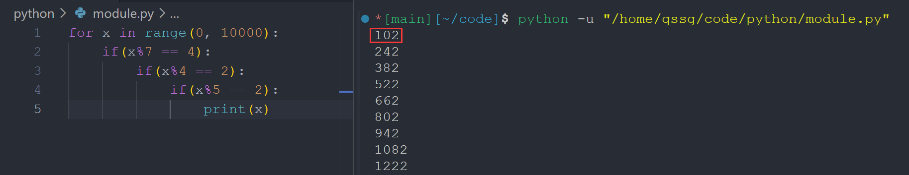

> note 6 讲的就是模数和欧几里得算法，这里简单介绍一些比较少讲解到的知识点。

---

## I Introduction

1. **模运算**：

    - **概念和性质**：模运算将数值限制在预定义的范围{0,1,…,N-1}内，当数值超过范围时，会“循环”回到范围起始。
    - **运算规则**：模运算下的加法、减法和乘法规则。
    - **应用场景**：例如时钟的12小时循环、一周的7天循环等
    - **性质** ：If a ≡ c (mod m) and b ≡ d (mod m), then a+b ≡ c+d (mod m) and a·b ≡ c·d (mod m) 
2. **幂运算**：
    - **幂运算定义**：计算xy (mod m)，其中x,y,m是自然数，m>0。
    - **重复平方算法**：利用重复平方算法高效计算幂运算。该算法利用y可以表示为2的幂次形式，即y=2^a或y=2^a+1，并利用x^2^a=(x^a)^2和x^2^a+1=x*(x^a)^2的性质，通过递归实现快速幂运算。算法复杂度为O(n)，其中n是y的位数。
3. **模运算除法**

> [!QUESTION]
>
> 8x ≡ 9 (mod 15). 解整数 x

两边同除 8？x ≡ 9/8 (mod 15) 看起来一头雾水

但是我们想要的不就是 x ≡ 整数 (mod 15) 嘛，左边如何变成这样呢？考虑模数的循环性，我们只要左右两侧同乘 **x 系数的逆元** 即可，即 2，那么就有

`x ≡ 16 x ≡ 18 ≡ 3 (mod 15).`

我们一般认为 x 应该小于模数 15，所以应该是唯一的，即 3

4. **乘法逆元**：
    - **定义**：若 gcd(x,m)=1，则 x 在模 m 下存在唯一逆元 x^(-1)使得 x\*x^(-1)≡1(mod m)。
    - **条件**：只有与m互质的整数才有乘法逆元
    - **计算**：使用扩展欧几里得算法计算乘法逆元。该算法是欧几里得算法的扩展，不仅能计算gcd(x,m)，还能找到整数a和b，使得gcd(x,m)=ax+bm。当gcd(x,m)=1时，b即为x的乘法逆元。
5. **欧几里得算法与唯一分解定理**： ^a22607
    - **关系**：欧几里得算法与唯一分解定理之间的关系。
    - **证明**：使用欧几里得算法证明唯一分解定理。唯一分解定理表明任何正整数n都可以唯一分解为质数的乘积。证明的关键在于利用欧几里得算法的性质，即gcd(x,y) = gcd(y,x mod y)。通过递归地使用该性质，可以证明唯一分解定理。

6. **中国剩余定理**：

    - **原理**：
      - 一个好的取 b_i 的方法是 $b_{i} = \prod_{j\neq i}n_{j}$ 
      - **唯一解**：对于互质的模 n1,n2,…,nk，给出满足多个同余方程的唯一解。利用乘法逆元，构造解 x = a1_b1 + a2_b2 + … + ak\*bk，其中 bi = N/ni * (N/ni)^(-1)(mod ni)，N 是所有模的乘积。该解是唯一存在的，且可以通过模运算的分配律证明其正确性。

---

一些在程序上的算法

```c title="欧几里得算法求最大公因数"
int gcd(int m, int n)
{
    if (m == n)
    {
        return m;
    }
    else if (m < n)
    {
        int t = m;
        m = n;
        n = t;
    }
    while (n != 0)
    {
        int re = m % n;
        m = n;
        n = re;
    }
    return m;
}
```

```c title="欧几里得算法求幂"
double Pow(double x, int a)
{
    if (a == 0)
    {
        return 1;
    }
    else if (a == 1)
    {
        return x;
    }
    if (a % 2 == 0)
    {
        return Pow(x * x, a / 2);
    }
    else
    {
        return Pow(x * x, a / 2) * x;
    }
}
```

## II Practices

---

**Q 1** _Celebrate and Remember Textiles_

> 原题十分啰嗦，这里给出解释版本
>
> 解方程（求最小正整数X）
>
> $$\begin{cases} x\equiv 4(mod 7) \\ x\equiv 2(mod 4) \\ x\equiv 2(mod 5) \end{cases}$$

法一：使用中国剩余定理

过程如下：


法二：我们使用编程来遍历所有可能



（当然将三个条件用 `and` 连接放一起也可以 ）

---

**Q 2** _Euler’s Totient Theorem_

在 [cryus 的笔记](https://cyrus28214.top/post/7bd4548aa0da/) 中讲解得很清楚了

---

**Q 3** _Sparsity of Primes_

> Prove that for any positive integer k, there exists k consecutive positive integers such that none of them are prime powers.

运用假设法：

回顾我们上面讲到的


那么我们可以知道任何一个合数至少可以分解成两个质数之乘积；如果这个数不是质数幂，那么我们总能找到两个不同的质数 $q_{i 1} \neq q_{i 2}$ 使得 $n+i \equiv (mod\quad q_{i 1}*q_{i 2})$ ，那么我们就可以理解下面的解答了


