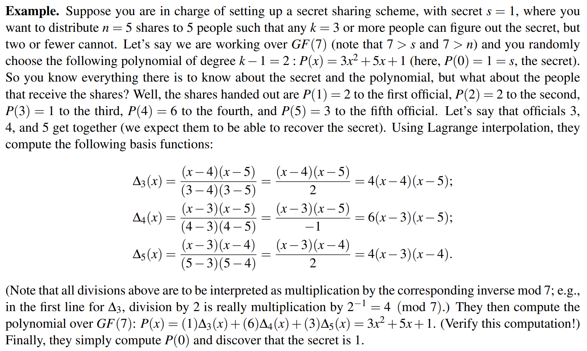
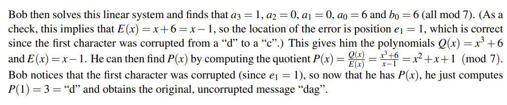

## I Introduction

对于多项式我们了解不少，只提两个性质

- n 次多项式至多有 n 个根；
- 给定横坐标互异的 n+1 个定点能够唯一确认 n 次多项式。

## II Polynomial Interpolation

> 多项式插值是一种数学方法，它通过一系列的点集来构造一个多项式函数，使得这个多项式精确地通过每一个给定的点。这种方法在数学、工程、物理和计算机科学等领域非常有用，特别是在只有有限数量的点可用时，用于近似未知函数

多项式插值其实我们很久之前就接触过，最简单的一个多项式插值就是更具两点坐标确定一条直线方程。

最简单的多项式插值是线性插值，它通过两个点拟合一条直线。但是，当给出两个以上的点时，就需要更高阶的多项式来插值所有点。

### II.1 Lagrange Polynomials

最常见的多项式插值形式是 _拉格朗日多项式_ ，它是一个不超过 n 阶的多项式，可以精确通过 n+1个点。对于点集(x_0, y_0), (x_1, y_1), …, (x_n, y_n)，拉格朗日多项式 L(x)定义为：

$L(x) = y_0 * l_0(x) + y_1 * l_1(x) + … + y_n * l_n(x)$

其中 $l_i(x)$ 是 _拉格朗日基多项式_：

$$l_i(x) = (x - x_0) / (x_i - x_0) * … * (x - x_{i-1}) / (x_i - x_{i-1}) * (x - x_{i+1}) / (x_i - x_{i+1}) * … * (x - x_n) / (x_i - x_n) = \alpha $$
亦即
$$\frac{\prod_{j \neq i} x−x_{j}}{\prod_{j\neq i} (x_{i} −x_{j})}$$

拉格朗日基多项式具有性质

$$\begin{cases}
l_i(x_j) = 1\quad 当i = j \\ l_i(x_j) = 0\quad 当i ≠ j
\end{cases}$$
这确保了 L(x)精确通过所有给定的点（在线性代数中我们有所涉及）
### II.2 linear-algebra
不难发现这不就是我们解线性方程组嘛，线性代数中讲解很多，不再赘述。
## III Application
> [!QUESTION]
>
> 某组织将机密文件放入密码箱中并规定：
> 
> - 只有 n 个人掌握了关于密码的信息
> 
> - 当汇集任意 k (<= n) 个人的信息时一定能够获得准确的密码
>
> - 当汇集任意少于 k 个人的信息时一定不能够获得准确的密码
>
> 如何实现？
一个很好的办法就是：利用 **多项式**
我们先随机选取一个 k-1 次多项式，从其上挑选 n 个互不相同的点的坐标作为信息分发给 n 个人；我们知道 k 个人的信息一定可以确定该多项式，而 k-1 个人的信息不能，这样就达到了目的；至于密码的存储，不妨作为某一特定横坐标的纵坐标即可；一般的，我们选择 0 作为这一特定横坐标，下面是一个例子：

