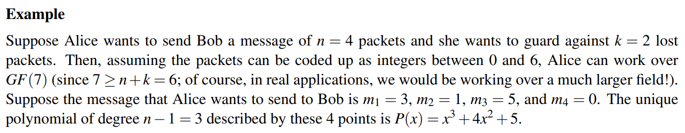
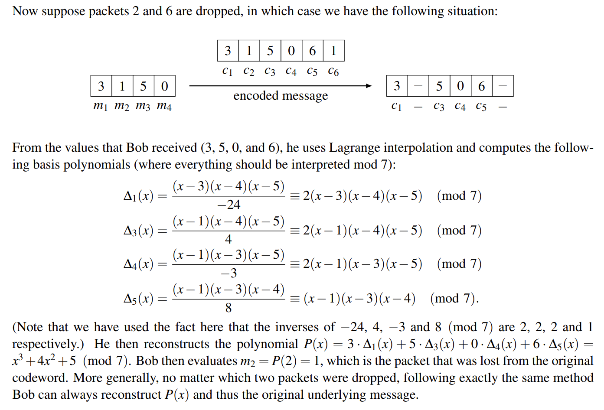
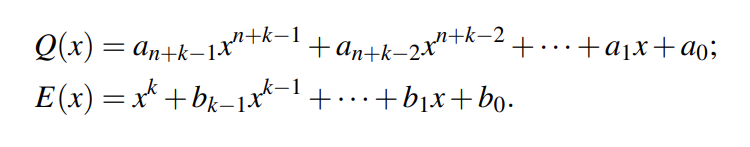
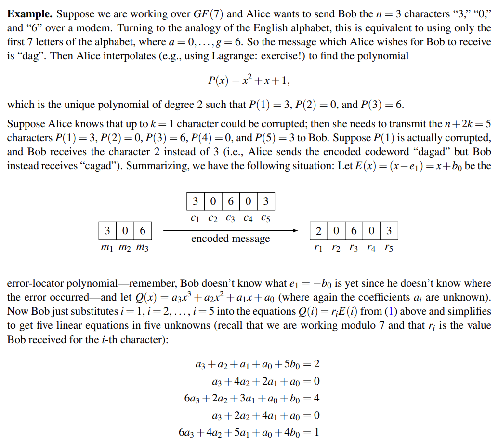
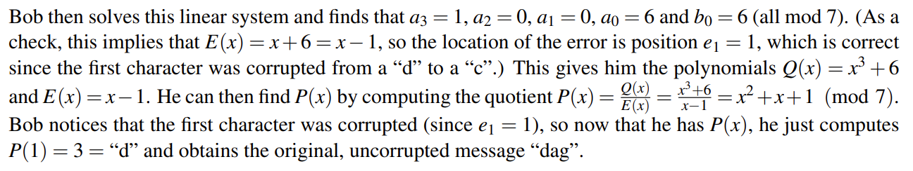

## I Introduction

> [!QUOTE]
>
> n [computing](https://en.wikipedia.org/wiki/Computing "Computing"), [telecommunication](https://en.wikipedia.org/wiki/Telecommunication "Telecommunication"), [information theory](https://en.wikipedia.org/wiki/Information_theory "Information theory"), and [coding theory](https://en.wikipedia.org/wiki/Coding_theory "Coding theory"), **forward error correction** (**FEC**) or **channel coding**[[1]](https://en.wikipedia.org/wiki/Error_correction_code#cite_note-1)[[2]](https://en.wikipedia.org/wiki/Error_correction_code#cite_note-2)[[3]](https://en.wikipedia.org/wiki/Error_correction_code#cite_note-:0-3) is a technique used for [controlling errors](https://en.wikipedia.org/wiki/Error_control "Error control") in [data transmission](https://en.wikipedia.org/wiki/Data_transmission "Data transmission") over unreliable or noisy [communication channels](https://en.wikipedia.org/wiki/Communication_channel "Communication channel").
> 
> The central idea is that the sender encodes the message in a [redundant](https://en.wikipedia.org/wiki/Redundancy_(information_theory) "Redundancy (information theory)") way, most often by using an **error correction code** or **error correcting code** (**ECC 纠错码**). [[4]] (https://en.wikipedia.org/wiki/Error_correction_code#cite_note-4) [[5]] (https://en.wikipedia.org/wiki/Error_correction_code#cite_note-Hamming-5) The redundancy allows the receiver not only to [detect errors](https://en.wikipedia.org/wiki/Error_detection "Error detection") that may occur anywhere in the message, but often to correct a limited number of errors. Therefore a [reverse channel](https://en.wikipedia.org/wiki/Reverse_channel "Reverse channel") to request re-transmission may not be needed. The cost is a fixed, higher forward channel bandwidth.
>
> ---
>
> When we work with numbers modulo a prime m, we say that we are working over a _finite field_ , denoted by Fm or GF(m) (for [Galois Field](https://en.wikipedia.org/wiki/Finite_field)).
> 
> 来自[维基百科](https://en.wikipedia.org/wiki/Error_correction_code)

There are, very roughly speaking, (at least) two distinct flavors of error correcting codes: _algebraic codes（代数码）_, which are based on polynomials over finite fields, and _combinatorial codes（组合码）_, which are based on graph theory.

In this note we will focus on **algebraic codes**, and in particular on so-called Reed-Solomon codes (named after two of their inventors).

## II Some kinds of errors

### II.1 Erasure Errors（擦除错误）

顾名思义，数据包在传输过程中部分丢失了，我们如何应对？

根据上一篇 note 的 application 部分，我们可以给出一个解决方法：

我们估计最大丢包率（不妨设传输 n+k 个包时至多丢失 k 个包），再相应地额外发送包，保证在丢包最多的情况下接收方（至少接收到了 n 个包）依旧能够获得正确信息；同时一般数据包具有标头，以便接收方知道具体丢失了那些包（暂时倒是用不上）。

### II.2 General Errors

更为棘手的情况是，如果我们的数据包不是丢失了，而是被篡改了（或者说损坏了），而我们并不知道哪些被修改了，该如何恢复信息呢？

同样假设我们传输过程中至多 k 个包会被修改，那么我们需要额外传输的包由 k 个变为了 2k 个，也就是说发送方应发送至少 n+2k 个包；下面将说明其可行性：

> [!INFO]
>
> _error-locator polynomial_ : $E(X) = (x-e_{1})(x-e_{2})\dots(x-e_{k})$

设存储信息的多项式为 P(X)，那么 P(i) 就可以对应接收方接收到的信息

我们记： _Q(X) = P(X)E(X)_，不难发现，E(X)的次项最大为 k，Q(X) 的最大为 n+k，不妨设：

接收方将 n+2 k 组数据带入其中，不难发现就是 n+2 k 元线性方程组！那么很好理解为甚么 n+2 k 是一个临界值了；如何证明我们解出来的 P(X)是唯一的？一个办法是看线性方程组的解是否唯一，或者其解空间是否存在某种特征？这是线性代数的事情了，我们按下不表。下面是笔记中给出的例子。

