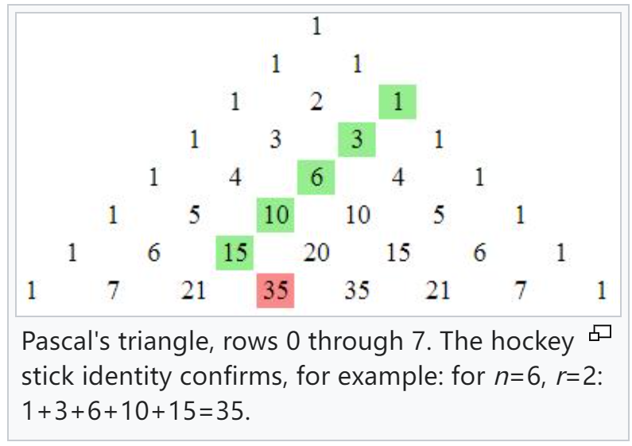

> 这篇 note 主要讲关于排列组合的一些内容，我们在高中已经学习过不少，所以讲的比较简洁，同样是罗列一些知识点

---

## I 一些组合数公式

_unnamed formula_

（只是我不想去查这是什么公式罢了）

$$
(^{n+1}_{r+1}) = (^{n}_{r})+(^{n}_{r+1})
$$

不难理解，就是就 <u>某一项被选上与否</u> 分了两种情况。

_Hockey-stick identity_

$$
(^{n+1}_{r+1}) = (^{n}_{r})+(^{n-1}_{r})+\dots+(^{r+1}_{r})+(^{r}_{r})
$$

之所以叫这个名字是因为其在杨辉三角（外国一般称为 Pascal's triangle ）中的形状十分像一个曲棍球棒

不难理解，上面的公式可以理解为：

从 n -1 个中选择 r+1 个等同于

- 选择第 n+1 个，从剩下的 n 个中选择 r 个
- 不选 n + 1 选 n，从剩下的 n-1 个中选 r 个
- …… 
- 不选后面的选 r+1，从剩下 r 个中选择 r 个

将上面所有加起来便得证

_Derangement_

> [!DEFINITION 10.1]
>
> In [combinatorial](https://en.wikipedia.org/wiki/Combinatorics "Combinatorics") [mathematics](https://en.wikipedia.org/wiki/Mathematics "Mathematics"), a **derangement（紊乱）** is a [permutation](https://en.wikipedia.org/wiki/Permutation "Permutation") of the elements of a [set](https://en.wikipedia.org/wiki/Set_(mathematics) "Set (mathematics)") in which  <u>no element appears in its original position</u> . In other words, a derangement is a permutation that has no [fixed points](https://en.wikipedia.org/wiki/Fixed_point_(mathematics) "Fixed point (mathematics)").

回忆一下，高中或许见过这样的题目：n 个人互相送礼物，每人送一份且得一份，不得拿自己的礼物，问有多少种送的方法？（记作 **D(n)** ）就是这个了，我个人愿意把这个称为错位排序，简称错排。

不加证明地，我们给出：

$$
D_{n}=\begin{cases}
0\quad\quad\quad\quad\quad\quad\quad\quad\quad\quad n=1\\ 1\quad\quad\quad\quad\quad\quad\quad\quad\quad\quad n=2 \\ (n-1)(D_{n-1}+D_{n-2})\quad n\geq 3
\end{cases}\quad\quad =\quad n!\sum_{k=0}^{n}\frac{(-1)^{k}}{k!}
$$

