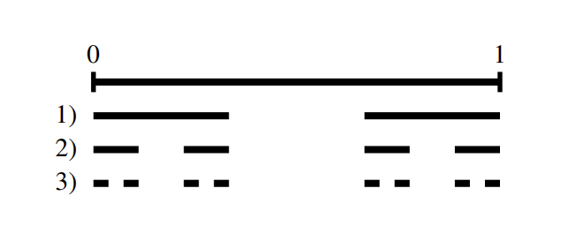

## I Cantor’s Diagonalization

> [!NOTE]
>
> _Cardinality（基数或势）_ 即集合中元素的个数

> [!CITE]
>
> 格奥尔格·康托尔（Georg Cantor）是第一个系统地研究无穷的数学家，他提出了无穷集合之间可以有不同的势，即存在不同“等级”的无穷。
> 
> 康托尔的对角化方法，也称为对角线论证法，它主要用于证明实数集是不可数的，这是康托尔关于无穷集合理论的一个重要贡献。对角化方法也被用于其他数学证明，特别是在证明某些集合的无限性质时。

康托尔的对角线论证法的基本思想是通过构造一个不可能在给定列表中的元素来证明一个集合的基数大于或小于另一个集合。这个方法最著名的应用是证明实数集是不可数的，（其实也证明了实数集的基数大于自然数集的基数）下面是其推导过程：

假设有人声称他们已经列出了所有的实数，我们将这些实数表示为一个无限矩阵，其中每一行代表一个实数的无限小数展开，但是行数是有限的，例如：

0.123456789...

0.987654321...

0.333333333...

0.141592653...

0.123456789...

0.987654321...

0.333333333...

⋮​

0.141592653...

考虑构建一个新的数 x，它是这样获得的：以小数点开始为例，取第一个数的第一位小数加 k（ k != 9 且 k!= 0 即可；不妨令 k = 1）后对 9 取模作为 x 的第一位小数；取第二个数的第二位小数……由于实数“有限”，我们总能构造出 x 与所提出的任何有限个实数均不同（毕竟与每一个数都至少有一位小数不同），说明无法给出一个有限集合包括所有实数，也就是说实数集是无限集合。

## II Cantor set

> [!DEFINITION ]
>
> The Cantor set is a remarkable set construction involving the real numbers in the interval [0,1]. The set is defined by repeatedly removing the middle thirds of line segments infinitely many times, starting with the original interval.
>
> 

简而言之，就是将 [0, 1] 这一闭区间每次移出中间的 1/3 长度，产生两个集合，他们的长度原集合的 1/3；无数次地分下去，将得到无数个集合，这些集合取并集就是康托尔集合；这同样证明了 [0, 1] 之间的实数有无穷多个。

> 事实上，在康托尔之前，人们往往将无限集合的基数认为是相同的，但是康托尔将无限划分了等级，其中最低级为与整数集/自然数集同级的集合（就像极限种无穷小同样分高阶无穷小，等价无穷下等等），有兴趣可以自行了解。

