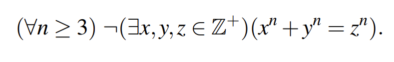

## I Self-Reference

回想一下你是否曾写过这样的程序（以 C 语言为例）：

```c
void function(){
  ...A
  functiong();
  ...B
}
```

无疑，这个程序如果不能在 A 中终止的话将无止境地运行下去，除非有什么强行终止了它；原因很简单，它自己调用了自己。

在我们推理的时候也是如此，如果给出的命题引用了自己(self-reference)，那么很可能形成悖论(Paradox)，一个很简单的例子

> “这句话是假的”

### I.1 Quines and the Recursion Theorem

同样地我们给出下面的伪代码，它定义了一个函数 `Quine` 并传入参数 `s` ，执行内容为定义函数 `s` 并传入参数 `s` ；不难发现执行内容会无止境地执行下去

```pseudocode
(Quine, "s"):
    (s, "s")
```

### I.2 The Halting Problem

> note 中讲解的不太好理解，先用 GPT 的回答放在这，打算后面系统学习图灵机等等再来理解。

停机问题（The Halting Problem）是计算机科学和数学中的一个著名问题，特别是在理论计算机科学和递归理论中。它是由阿兰·图灵（Alan Turing）在1936年首次提出的，是决定理论中的一个典型例子，表明有些问题是不可能解决的。

停机问题的定义如下：

**给定一个任意程序和它的输入，判断这个程序在给定输入下是否会最终停止（即正常结束运行）还是将永远运行下去（即陷入无限循环）。**

图灵证明了这个问题的不可解性，他的证明方法是通过构造一个矛盾来展示。以下是停机问题不可解的证明概述：

1. **假设存在一个可以解决停机问题的图灵机**：我们假设存在一个图灵机H，它能够判断任何程序P和输入I是否会在有限时间内停止。
2. **构造一个新图灵机D**：设计一个图灵机D，它接受另一个图灵机P的描述作为输入。D的工作方式是，首先用P的描述和P的输入I作为输入调用H。如果H判断P会在输入I下停止，那么D进入一个无限循环；如果H判断P不会停止，那么D停止。
3. **引发矛盾**：现在，我们让D以其自身的描述作为输入运行。根据H的判断，有两种情况：
    - 如果D会在其自身描述作为输入时停止，那么根据D的定义，它应该进入无限循环。
    - 如果D会在其自身描述作为输入时进入无限循环，那么根据D的定义，它应该停止。

无论哪种情况，都会导致一个矛盾，因此我们的假设（存在一个可以解决停机问题的图灵机H）是错误的。

因此，停机问题是不可解的，这意味着没有算法可以准确地判断任意程序是否会在任意输入下停止。

## II Godel’s Incompleteness Theorem

### II.1 Fermat’s Last Theorem

> [!CITE]
>
> “费马大定理”（Fermat’s Last Theorem），这是数学史上一个非常著名的未解决问题，由法国数学家皮埃尔·德·费马（Pierre de Fermat）在1637年提出；定理内容是：
> 
> 
> 
> 费马在他的笔记边缘写道他发现了一个“真正奇妙的证明”，但是这个证明太长了，无法写在页边的空白处（谁知道真的假的）。
> 
> 遗憾的是，费马没有留下任何证明的记录，因此这个猜想成为了数学界数百年的难题；直到1994年，英国数学家安德鲁·怀尔斯（Andrew Wiles）才最终证明了这个定理。

### II.2 Formal System

> 形式系统还没搞明白，先 ~咕咕咕~ 了

