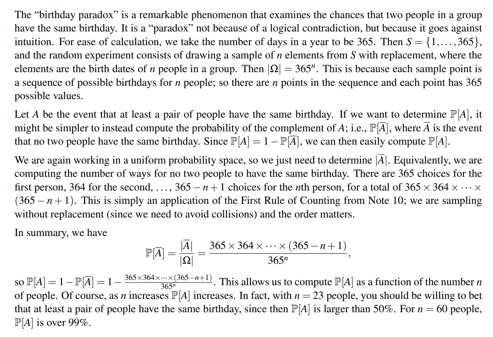
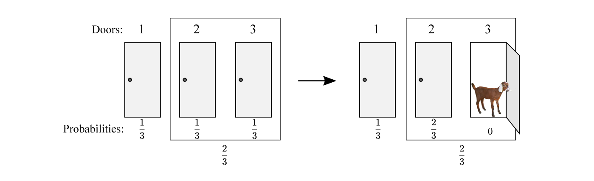

## I Random Experiments & Probability Spaces

> [!QUOTE]
> 
> Each element of the **sample space** is assigned a probability which tells us how likely the outcome is to occur when we actually perform the experiment.
> 
> Typically, a **random experiment** consists of drawing a sample of k elements from a set S of cardinality n.

A probability space is a sample space Ω, together with a probability P[ω] (often also denoted as Pr[ω]) for each sample point ω, such that

-  (Non-negativity): 0 ≤ P[ω] ≤ 1 for all ω ∈ Ω. 
-  (Sum to 1): ∑ ω∈Ω P[ω] = 1, i.e., the sum of the probabilities over all outcomes is 1.

Formally, an event A made of some sample from Ω is just a subset of the sample space Ω, i.e., A ⊆ Ω

For any event A ⊆ Ω, we define the probability of A to be

$$
P[A]=\sum_{\omega \in A}P[\omega]
$$

## II Example

对于普通的古典概型大家在高中就已经学习过，不再涉及，这里记录几个比较有意思的例子：

### II.1 Birthday Paradox（生日悖论）

比较长，就放张截图，但是结论就是，23 个人中，有两人同一天生日概率就是 50%以上；60 个人中，有两人同一天生日的概率就达到了 99% ! !

### II.2 The Monty Hall Problem

详细内容可以自行搜索；概括就是：嘉宾(contestant) 要进行三（A、B、C）选一获奖(price) ，选择（假如选择了 A）过后主持人(hoster) 告诉 ta 剩下两个中错误的那个（例如是 C），那么 ta 应该继续选择 A 还是改选 B 呢？对于有所选择的地方我们认为每种可能性相同：嘉宾最初的选择是随机的，如果嘉宾一开始选对了，则主持人从剩余两个门随机选取。

看起来，二者（A、B ）似乎并没有区别，毕竟只是将 C 排除了？

但是你看看，A 是最开始就选了的，$\frac{1}{3}$ 没跑了；C 已经被排除了，概率肯定是 0；那你看看这个 B 的概率不就是 $\frac{2}{3}$ 嘛。

那无疑，选 B。

有点奇怪，但是……这个条件概率我们会在后面讲解；因为 hoster 排除错误的选项这个概率为 1 ，导致了概率的改变。

## III Words

下面是一些常见的名词

1. H(head)/T(tail)  硬币正/反面
2. Coin 硬币
3. Fair Coin 公平硬币
4. Fair Dice 公平骰子
5. Loaded Coin 作弊硬币
6. Loaded Dice 作弊骰子
7. Toss 抛掷
9. Roll Die/Dice 掷骰子（后者为 pl）
10. Heads 正面
11. Tails 反面
12. Side 面
13. Face Value 面值
14. Probability Space 概率空间
15. Sample Space 样本空间
16. Event 事件
17. Outcomes 结果
18. Equally Likely 等可能
19. Combinations 组合
20. Permutations 排列
21. $(^{n}_{x}) := C^{x}_{n}$
22. Roulette 轮盘赌注

