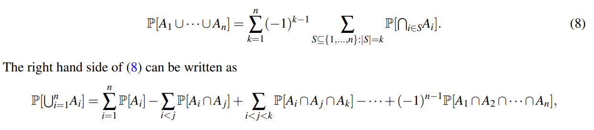

## I Conditional Probability

> [!definition 14.1]
> 
> (_**Conditional Probability**_). For events A,B ⊆ Ω in the same probability space such that P[B] > 0, the conditional probability of A given B is 

$$
P[A|B] = \sum_{\omega \in A \cap B} P[\omega| B] = \frac{P[A \cap B]}{P[B]}
$$

> [!EXAMPLE]
>
> _Card Dealing_  在没有大小王的扑克（52 张，<u>以后我们默认如此</u> ）中随机抽两张牌，第一张为 A，那么第二张依旧为 A 的概率为？
>
> 答案：$\frac{\frac{4*3}{52*51}}{\frac{4}{52}} = \frac{3}{51}$

## II Bayesian Inference （贝叶斯推理）

> [!INFO]
>
> Conditional probability is at the heart of a subject called **_Bayesian inference_** , used extensively in fields such as machine learning, communications and signal processing. Bayesian inference is a way to update knowledge after making an observation.

We may have an estimate of the probability of a given event A. After event B occurs, we can  <u>update</u>  this estimate to P[A | B]. In this interpretation, P[A] can be thought of as a _prior probability_: our assessment of the likelihood of an event of interest, A, before making an observation. It reflects our prior knowledge. P[A | B] can be interpreted as the _posterior probability_ of A after the observation. It reflects our updated knowledge.

## III Important example

Here comes an important example.

> [!EXAMPLE]
>
> A pharmaceutical company is marketing a new test for a certain medical disorder. According to clinical trials, the test has the following properties:
>
> - When applied to an affected person, the test comes up positive in 90% of cases, and negative in 10% (these are called “false negatives”).
> 
> - When applied to a healthy person, the test comes up negative in 80% of cases, and positive in 20% (these are called “false positives”).
>
> Suppose that the incidence of the disorder in the US population is 5%; this is our prior knowledge. When a random person is tested and the test comes up positive, how can we update the probability that the person has the disorder?
> [!HELP]
>
> 用新冠疫情作为解释：我们的检测试剂对于未感染者的准确率为 80%，对于感染者准确率为 90%，现在实际上一群足够多的人中有%5 (prior probability) 的人被感染，那么我们给这些人做检测观察到的感染率 (posterior probability) 为？
> 
> 韦恩图如下
>
> 

这个过程我们使用高中条件概率的知识就可以解决，方法如下；但这不是我们讲述的重点，所以不做详细讲解；但还请仔细观看，我们再下面仍然会使用到。

## IV Bayes’ Rule and Total Probability Rule

> [!DEFINITION]
>
> Equations (1) and (2) are very useful in their own right. The former is called _**Bayes’ Rule**_ and the latter is called the **_Total Probability Rule_**. Sometimes, we use Equation (3) directly.

### IV.1 Example (Balls and Bins)

Is the answer $\frac{2}{3}$ , since we know that there are a total of three white balls, two of which are in Bin 1?

No! we can see the picture shown below:

Yes! The answer is $\frac{4}{9}$. Now we use Bayes’ Rule and Total Probability Rule to solve it:

Of course, we can use Equation (3) directly.

### IV.2 Generalization

> [!Definition 14.2] 
> 
> (_**Partition of an event**_). We say that an event A is partitioned into n events A1,...,An if 1. A = A1 ∪A2 ∪··· ∪An, and 2. Ai ∩Aj = ∅ for all $i \neq j$ (i.e., A1,...,An are mutually exclusive)

## V Combinations of Events

> [!QUOTE]
>
> 

In this section, we discuss some situations where it can be done.

Let’s start with _independent events_, for which intersections are quite simple to compute.

### V.1 Independent events

We all know that independent events A&B means that P[A∩B] = P[A]×P[B].

Then we can get that $P[A] = P[A|B]$ since A has nothing to do with B; by a symmetrical argument, we also have P[B | A] = P[B] provided  <u>P[A] > 0</u>.

> [!EXAMPLE]
>
> _**Pairwise Independent but Not Mutually Independent Events**_  Suppose you toss a fair coin twice and let A be the event that the first flip is H and B be the event that the second flip is H. Now let C be the event that both flips are the same (i.e., both H’s or both T’s).
> 
> then I want to tell you that even though A, B and C are not mutually independent, every pair of them are independent. You can prove it easily.

### V.2 Intersections of Events

> [!THEOREM14.1]
>
> ( _**Product Rule a.k.a chain rule**_ ) 

#### V.2.1 The Monty Hall Problem Revisit

We use it to solve the problem in last note: [The Monty Hall Problem](../notes/13-Introduction-of-Discrete-Probability.md#Example)

#### V.2.2 Poker Hands

> [!INFO]
>
> In poker, players form sets of **five** playing cards, called hands, according to the rules of the game. Each hand has a rank, which is compared against the ranks of other hands participating in the showdown to decide who wins the pot.
> 
> 
> 
> -- come from [wiki/List_of_poker_hands](https://en.wikipedia.org/wiki/List_of_poker_hands)

Let’s use the Product Rule to compute the probability of a flush in a different way. This is equal to 4×P[A], where A is the probability of a _Hearts flush_.

We can write $A = \cap^{5}_{i=1} A_{i}$ , where Ai is the event that the ith card we pick is a Heart. So we have

$$
P[A] = P[A_{1}]×P[A_{2} | A_{1}]×··· ×P[A_{5} | \cap^{4}_{i=1}Ai ]
$$

### V.3 Unions of Events

Suppose that you are in Las Vegas, and you spy a new game with the following rules. You pick a number between 1 and 6. Then three dice are thrown. You win if and only if your number comes up on at least one of the dice. Since every number owns same probability namely $\frac{1}{6}$ , so the probability

of winning is $\frac{1}{6}*3 = \frac{1}{2}$ , right?

No!

Well, suppose instead that the casino rolled six dice, and again you win if and only if your number comes up at least once. Then the analogous calculation would say that you win with probability $\frac{1}{6}*6 = 1$ , i.e., certainly! The situation becomes even more ridiculous when the number of dice gets bigger than 6 …

> [!THEOREM 14.2]
>
> (_**Inclusion-Exclusion**_). Let A1,...,An be events in some probability space, where n ≥ 2. Then, we have
> 

Using Inclusion-Exclusion,  we can get that the probability for you to win is nearly 0.42, rather than 0.5.

> [!THEOREM 14.3]
>
> 

## VI Practice

---

**Q 1** _Roll die_

If we roll a regular, 6-sided die 5 times. What is the probability that at least one value is observed more than once?

> [!HINT]
>
> It's easier to get the opposite.

The answer is $P[A] = 1-P[\overline{A}]=1-\frac{A^{5}_{6}}{6^{5}}=1-\frac{5!}{6^{4}}$

---

**Q 2** _Independent Complement_

Let Ω be a sample space, and let A,B ⊆ Ω be two independent events, then prove or disprove

(a) A and B must be independent.

(b) A and B must be independent.

(c ) A and A must be independent.

(d) It is possible that A=B

Solution:

