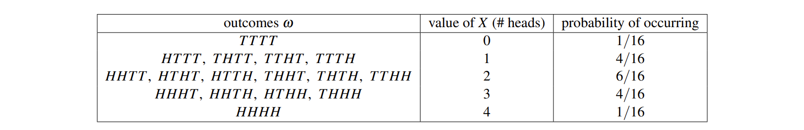
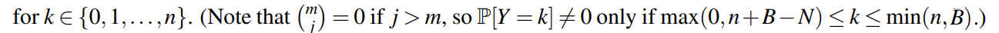
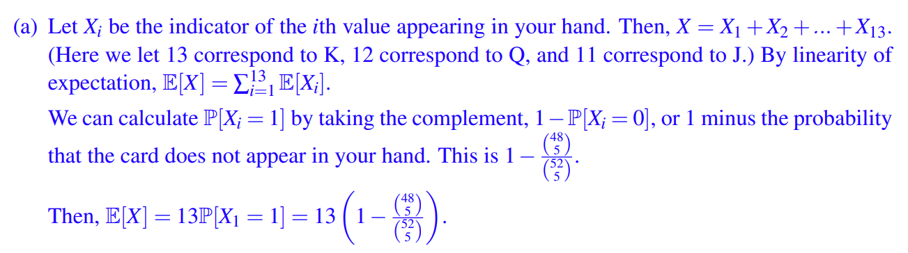
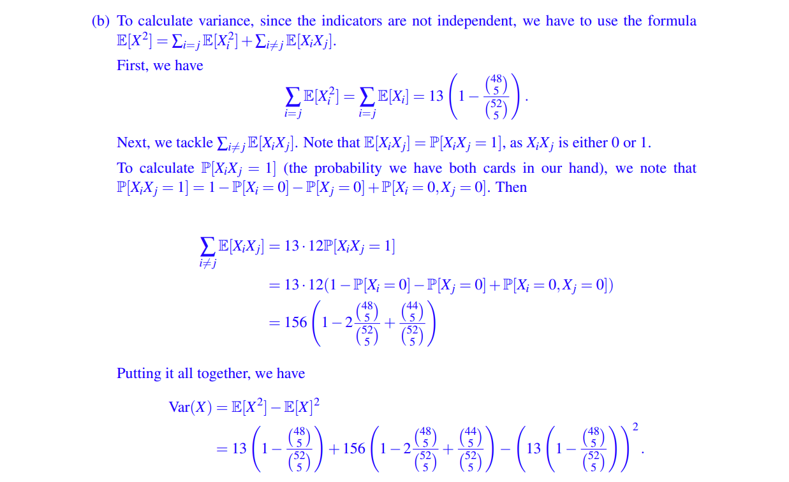
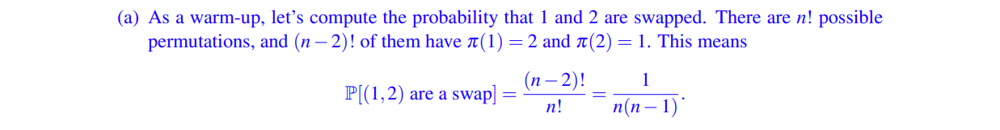
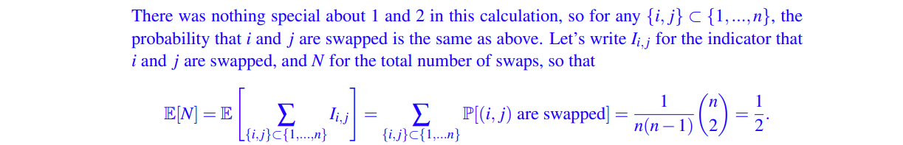

If we toss a fair coin n times, then there are $2^{n}$ possible outcomes, each of which is equally likely and has probability $\frac{1}{2^{n}}$ .

But now we want to know what is the number of heads in n coin tosses; call this number X. For n = 4, the result is shown in the following picture

## I Random Variables（随机变量）

> [!DEFINITION 15.1]
>
>  ( _Random Variable_ ). A random variable X on a sample space Ω is a **function** X : Ω → R that assigns to each sample point ω ∈ Ω a real number X(ω).(abbreviated r.v.).

As we see from the example above, a random variable X typically does not have a definitive value, but instead only has a _probability distribution_ over the set of possible values X can take, which is why it is called random.

Until further notice, we will restrict our attention to random variables that are  <u>discrete</u> , i.e., they take values in a range that is finite or countably infinite.

> [!ATTENTION]
>
> Note that the term “random variable” is really something of a misnomer: it is a **function** so there is nothing random about it and it is definitely not a variable!

### I.1 Fixed Points of Permutations（固定点排列）

> [!DEFINITION 15.2]
>
> _Permutation_ : In mathematics, a permutation of a set is, loosely speaking, an arrangement of its members into a sequence or linear order, or if the set is already ordered, a rearrangement of its elements. The word "permutation" also refers to the act or process of changing the linear order of an ordered set.
> [!QUESTION]
>
> Suppose we collect the homeworks of n students, randomly shuffle them, and return them to the students. How many students receive their own homework?

这是一个比较经典的问题，即讨论将一个序列重排后没有改变位置的点的数量，我们将这个数字设为 $X_{n}$ ，下面是当 n = 3 时的映射情况：

## II Probability Distribution（概率分布）

Since a random variable is defined on a probability space, we can calculate these probabilities given the probabilities of the sample points. Let a be any number in the range of a random variable X. Then the set $\{\omega \in\Omega: X(\omega)=a\}$ is an event in the sample space (because it is a subset of Ω). We usually abbreviate this event to simply **“X = a”** , and the probability of it is P[X = a].

> [!DEFINITION 15.3]
>
> (_Distribution_ ). The distribution of a discrete random variable X is the collection of values {(a,P[X = a]) : a ∈ A }, where A is the set of all possible values taken by X.

### II.1 Bernoulli Distribution（两点分布/伯努利分布）

A simple yet very useful probability distribution is the Bernoulli distribution of a random variable which takes value in {0,1}:

$$
P[X = i] = \begin{cases}
p,\enspace \,\qquad(i=1) \\ 1-p,\quad(i=0)
\end{cases}
$$

We say that X is distributed as a Bernoulli random variable with parameter p, and write

$$
X ∼ Bernoulli(p)\quad or\quad X ∼ Ber(p).
$$

### II.2 Binomial Distribution（二项分布）

If we conduct Bernoulli Distribution for n times, we find that the

$$
P[x=i] = (^{n}_{i})p^{i}(1-p)^{n-i},\quad for\quad i= 0,1,2 \dots,n
$$

which is named Binomial Distribution and we write

$$X ∼ Bin(n, p),$$
### II.3 Hypergeometric Distribution（超几何分布）

Consider an urn containing N = B + W balls, where B balls are black and W are white. Suppose you randomly sample n ≤ N balls from the urn , and let X denote the number of black balls in your sample.
- if you put it back i.e. get ball  <u>with replacement</u>, that is Binomial Distribution
- if you don't put it back i.e.  <u>without replacement</u>, then we call it  **Hypergeometric Distribution**
we can get that

$$
\begin{cases}
P[Y=k] = \frac{|E_{k}|}{|\Omega|} \\ |\Omega| = (^{N}_{n}) \\ |E_{k}| = (^{B}_{k})(^{N-B}_{n-k})
\end{cases}
$$

This probability distribution is called the hypergeometric distribution with parameters N,B,n, and write:   $Y ∼ Hypergeometric(N, B, n)$

> [!ATTENTION]
>
> 

## Multiple Random Variables and Independence

> [!DEFINITION 15.4]
>
> The _joint distribution_ of two discrete random variables X and Y is the collection of values {((a,b),P[X = a,Y = b]) : a ∈ A , b ∈ B}, where A is the set of all possible values taken by X and B is the set of all possible values taken by Y.

Given a joint distribution of X and Y, the distribution P[X = a] of X is called the marginal distribution of X, and can be found by summing over the values of Y.

$$
P[X=a] = \sum_{b \in B} P[X= a, Y = b]
$$

and if P[X=a, Y=b] = P[X=a]P[Y=b], we say that X = a and Y = b are independent for all values a,b.

## Expectation（期望）

我们在高中应当都已经学习过 **数学期望** ，因此这里只陈列重要结论而省略证明过程。

> [!DEFINITION 15.5]
>
> (_Expectation_). The expectation of a discrete random variable X is defined as
>  $E(X) = \sum_{a \in A} a×P[X = a]$
> [!THEOREM (many)]
>
> (15.1) For any two random variables X and Y on the same probability space, we have  $E[X+Y] = E[X] + E[Y]\quad E[cX] = cE[X]$
>
> (15.2) $E[f(x)] = \sum_{x}f(x)P_{X}[X=x]$## Practice

---

**Q 1** _Diversify Your Hand_

You are dealt 5 cards from a standard 52 card deck. Let X be the number of distinct values in your hand. For instance, the hand (A, A, A, 2, 3) has 3 distinct values.
- (a) Calculate E[X]. (Hint: Consider indicator variables Xi representing whether i appears in the hand.) 
- (b) Calculate Var(X)

> [!HELP]
>
> 答案的想法很奇特（个人认为），记 P[X_i = 0] 为 i 代表的牌不出现的概率，那么 1-P[X_i = 0] 就是某张牌出现的概率，此时 values += 1，那我们看作两点分布即可，即 E[X_i] = P [X_i != 0]
(b) 没看懂 qwq

---
**Q 2** _Swaps and cycles_
We’ll say that a permutation π = (π(1),...,π(n)) contains a **swap** if there exist i, j ∈ {1,...,n} so that π(i) = j and π(j) = i, where i ̸= j.
- (a) What is the expected number of swaps in a random permutation? 

In the same spirit as above, we’ll say that π contains a **k-cycle** if there exist i_1,...,i_k ∈ {1,...,n} with π(i_1) = i_2,π(i_2) = i_3,...,π(i_k) = i_1.
- (b) Compute the expectation of the numbe of k-cycles.
We can find that **swap** is a 2-cycles,
Let's take k numbers (1, 2, ... , k) for example, as they in cycle (with $(k-1)!$ kinds of permutations, the rest of the numbers (k+1, k+2, ... , n) have $(n-k)!$ kinds of permutations.
Since k numbers are not special, we get $( ^{n}_{k})$ kinds of k numbers.
Ok, then we get that the expectation of k-cycles is:
$$

\frac{(k-1)!(n-k)!}{n!}* (^{n}_{k} ) = \frac{1}{k}

$$

