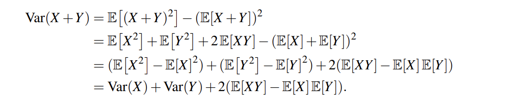
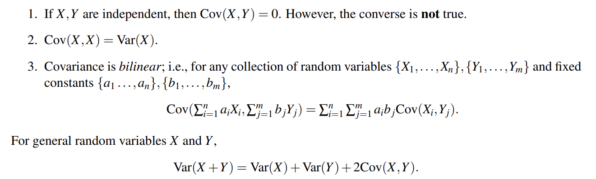
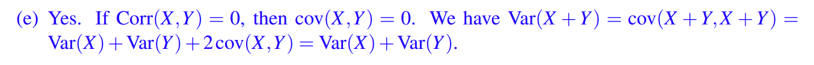
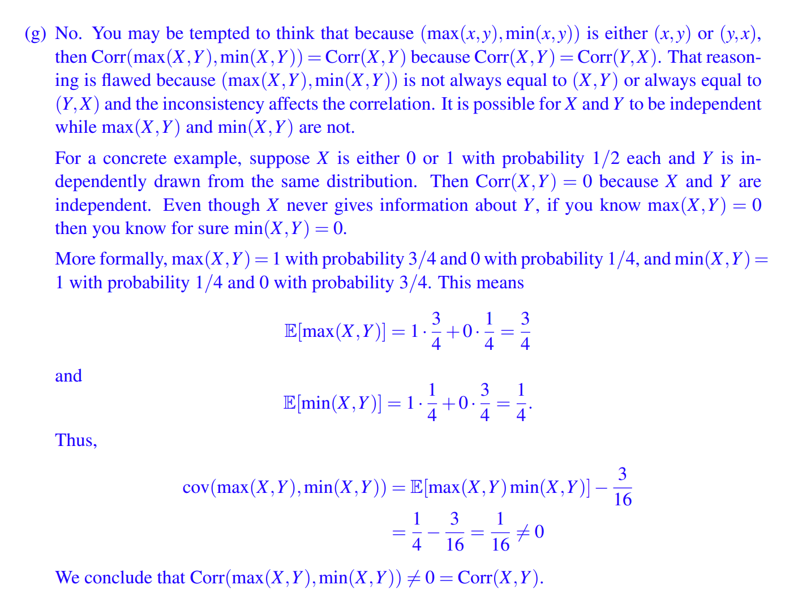

## I Random Variables: Variance and Covariance

### I.1 Variance（方差）

> [!QUOTE]
>
> In [probability theory](https://simple.wikipedia.org/wiki/Probability_theory "Probability theory") and [statistics](https://simple.wikipedia.org/wiki/Statistics "Statistics"), the **variance** is a way to measure how far a [set](https://simple.wikipedia.org/wiki/Set "Set") of numbers is spread out. Variance describes how much a [random variable](https://simple.wikipedia.org/wiki/Random_variable "Random variable") differs from its [expected value](https://simple.wikipedia.org/wiki/Expected_value "Expected value"). The variance is defined as the average of the [squares](https://simple.wikipedia.org/wiki/Square_(mathematics) "Square (mathematics)") of the differences between the individual (observed) and the expected value.

> [!DEFINITION 16.1]
>
> (_Variance_). For a r.v. X with expectation E[X] = µ, the variance of X is defined to be $Var(X) = E[(X − µ)^{2}]$ . The square root $σ(X) := \sqrt{ Var(X) }$ is called the standard deviation of X.

> [!THEOREM 15.3]
>
> For a r.v. X with expectation E[X] = µ, we have $Var(X) = E[X^{2}]-\mu^{2}$ .
> and $Var[cX] = c^{2}Var[X]$ .
>
> and we can even get that:
>
> 

### I.2 Covariance

> [!DEFINITION 16.2]
>
> (_Covariance_). The covariance of random variables X and Y , denoted Cov(X,Y), is defined as 
> 
> $$Cov(X,Y) = E[(X − \mu_{X} )(Y − \mu_{Y} )] = E[XY]−\mu_{X}\mu_{Y}$$ 
> 
> where µX = E[X] and µY = E[Y].

here are some important facts about covariance:

An example for  `the converse is not true` is given in Q 1 (a).

> [!DEFINITION 16.3]
>
> (_Correlation_). Suppose X and Y are random variables with σ(X) > 0 and σ(Y) > 0. Then, the correlation of X and Y is defined as 
> 
> $$Corr(X, Y) = \frac{Cov(X, Y)}{\sigma(X)\sigma(Y)} \in [-1, 1]$$

看到这里，其实已经可以回忆起高中学习的线性规划了。

## II Practice

---

**Q 1** _Double-Check Your Intuition Again_

> (a) You roll a fair six-sided die and record the result X. You roll the die again and record the result Y. 
> 
> - (i) What is cov(X +Y,X −Y)? 
> 
> - (ii) Prove that X +Y and X −Y are not independent. 

> [!INFO]
>
> 协方差的双线性
>
> - cov(aX+bY,cZ)=ac⋅cov(X,Z)+bc⋅cov(Y,Z)
> 
> - cov(X+Y,cZ)=c⋅cov(X,Z)+c⋅cov(Y,Z)

对于(i)

$$
\begin{split}
Cov(X+Y, X-Y)&=Cov(X,X)+Cov(Y,X)-Cov(X,Y)-Cov(Y,Y) \\ &= Cov(X,X)-Cov(Y,Y) \\&=Var(X) - Var(Y)\quad\quad // X、Y的方差是相同的 \\ &= 0
\end{split}
$$

对于 (ii) ，X+Y 和 X-Y 肯定有关系，我们举一个反例即可：

例如 $P[X+Y = 5, X-Y = 0] = 0\quad != P[X+Y=5]* P[X-Y=0]$

>For each of the problems below, if you think the answer is "yes" then provide a proof. If you think the answer is "no", then provide a counterexample. 

> (b) If X is a random variable and Var(X) = 0, then must X be a constant? 

yes, just need to know how to calculate Var(X).

> (c) If X is a random variable and c is a constant, then is Var(cX) = cVar(X)?

no

> (d) If A and B are random variables with nonzero standard deviations and Corr(A,B) = 0, then are A and B independent? 

no, just see (a)

> (e) If X and Y are not necessarily independent random variables, but Corr(X,Y) = 0, and X and Y have nonzero standard deviations, then is Var(X +Y) = Var(X) +Var(Y)? The two subparts below are optional and will not be graded but are recommended for practice. 

> (f) If X and Y are random variables then is E[max(X,Y)min(X,Y)] = E[XY]? 

yes, it is obvious since max(X,Y)min(X,Y) = XY is always true.

> (g) If X and Y are independent random variables with nonzero standard deviations, then is Corr(max(X,Y),min(X,Y)) = Corr(X,Y)?

It is difficult.

