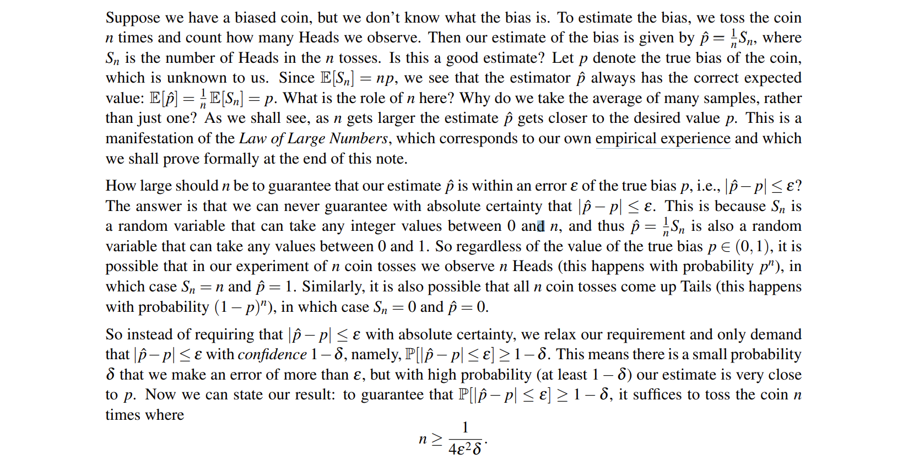
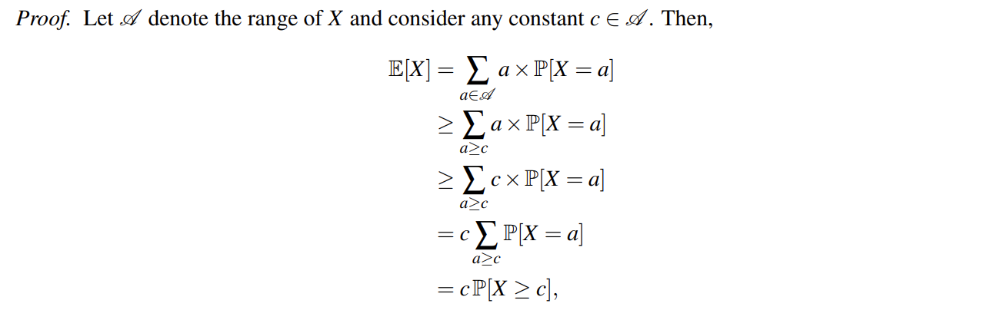
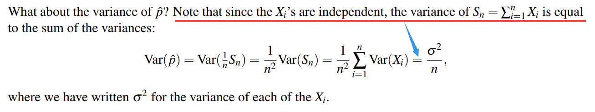
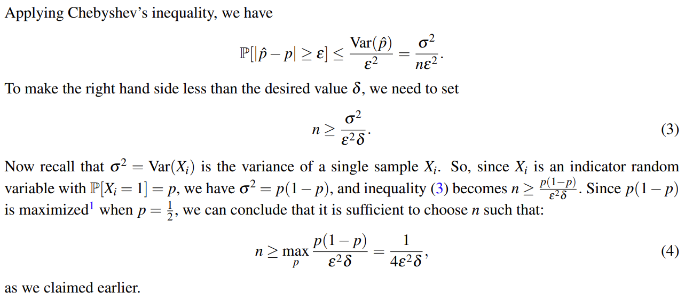

> [!ATTENTION]
>
> 在阅读下面的内容前，您可能需要先修读   <u>微积分 - 极限</u> 部分内容以便更好理解下面的讲解  

我们有时说一个东西的概率为 p ，但在 empirical experience（实践实验，与理论推理相对应） 中，我们要进行多少次才有足够的把握让实验概率 $\hat{p}$ 与 p 足够接近呢？下面的论述给出的答案：

不难看出，这与微积分中证明极限存在时取 n 足够大的情况是一样的。

对于上边最后的结论，我们下面将一步一步进行证明。

## I Markov’s Inequality（马尔可夫不等式）

> [!THEOREM 17.1]
>
> (_Markov’s Inequality_). For a nonnegative random variable X (i.e., X(ω) ≥ 0 for all ω ∈ Ω) with finite mean, $P[X ≥ c] ≤ \frac{E[X]}{c}$ , for any positive constant c.
>
> proof is shown below:
> 
> 

> [!INFO]
>
> _Indicator function_
>
> $$I_{A} = \begin{cases}1,\quad if\ x \in A \\ 0,\quad if\ x \not\in A \end{cases}\quad or\quad  I\{\epsilon\} = \begin{cases}1,\quad if\ \epsilon\ is\ true \\ 0,\quad if\ \epsilon\ is\ false \end{cases}$$

## II Chebyshev’s Inequality（切比雪夫不等式）

> [!THEOREM 17.2]
>
> (_Chebyshev’s Inequality_) For a random variable X with finite expectation E[X] = µ, $P[|X − µ| ≥ c] ≤ \frac{Var(X)}{c^{2}}$ , for any positive constant c.

The proof of Chebyshev's Inequality is easy since we just need to take

$$|X − \mu| ≥ c \implies |X-\mu|^{2} \geq c^{2}$$
using Markov’s Inequality，so we get that
$$

P[|X-\mu| \geq c] = P[|X - \mu|^{2} \geq c^{2}] \leq \frac{E[(X-\mu)^{2}]}{c^{2}} = \frac{Var(X)}{c^{2}}

$$
take $c = k\sigma$ where $\sigma = \sqrt{ Var(X) }$ , we get that
$$P[|X-\mu| \geq k\sigma] \leq \frac{1}{k^{2}}$$

which is of great importance.

## III Estimating the Bias of a Coin

Now, let's solve the problem come up with at the begin.

## IV Law of Large Numbers（大数定律）

> [!THEOREM 17.3]
>
> (_Law of Large Numbers_) . Let X1,X2,..., be a sequence of i.i.d. (independent and identically distributed) random variables with common finite expectation E[Xi ] = µ for all i. Then, their partial sums Sn = X1 +X2 +···+Xn satisfy
>
>  $$P\left[ |\frac{1}{n}S_{n}-\mu|\geq\epsilon \to 0  \right]\quad as\quad n \to \infty $$
>
> for every ε > 0, however small.

That means if n is big enough, $\frac{S_{n}}{n} \to \mu$ .

