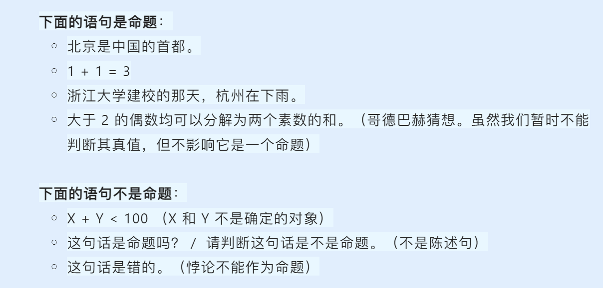
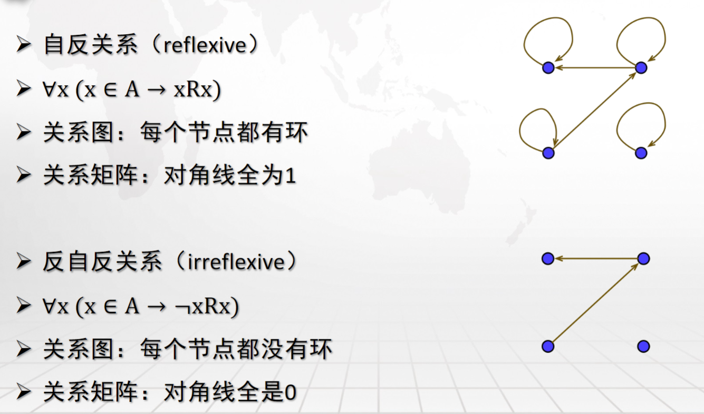
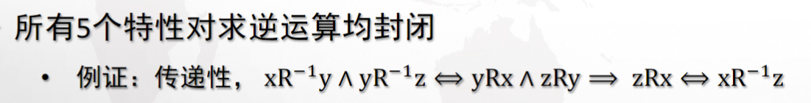
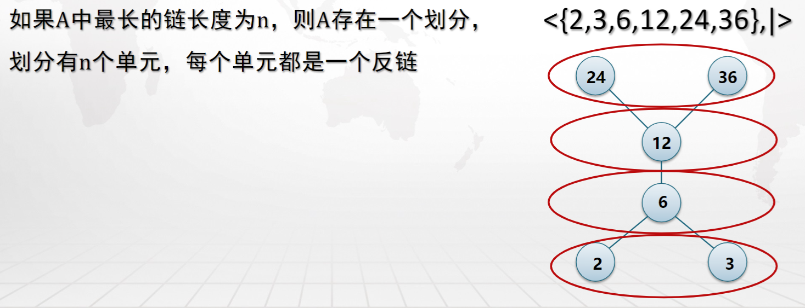
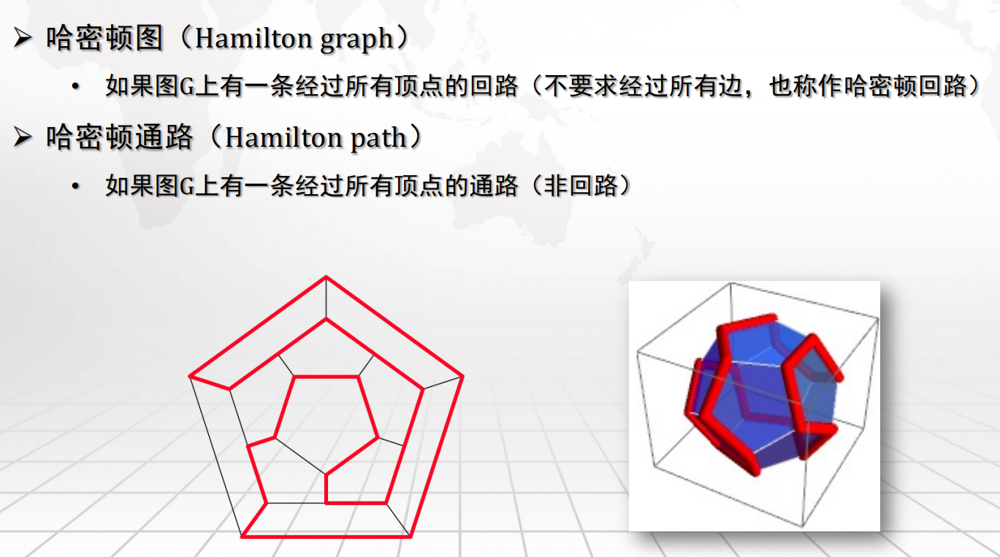
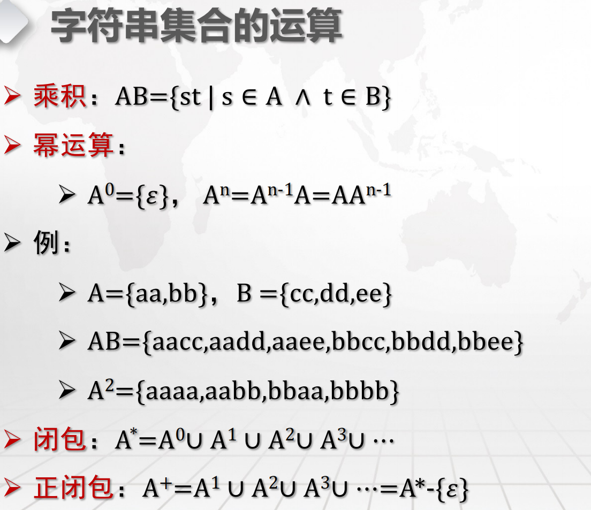
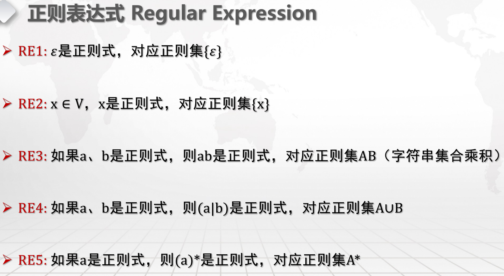
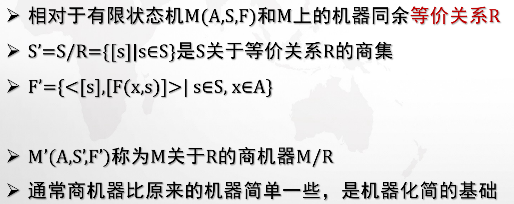
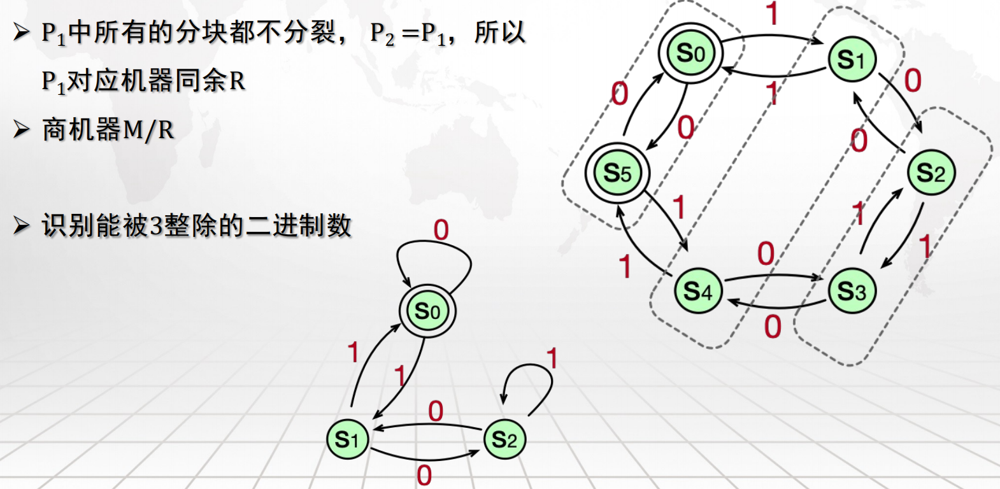
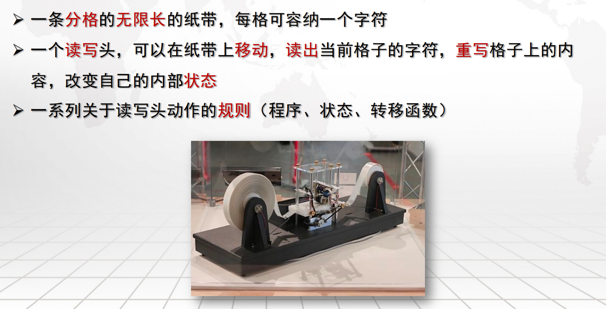

真到了期末周，感觉还是要看看课内的笔记。

> 这里放一些信安原中讲到的的零碎知识点，包括：
> 
> - 最开始学习时没有听明白的
> 
> - 相比于 [xyx 学长笔记](https://www.yuque.com/xianyuxuan/coding/crs-csmath)有所不同/增添的 
> 
> 如果后续系统学习了再搬去各个章节；标题代表 PPT 出处。

## 离散数学

---

### Mathematical logic（数理逻辑）

> 命题是数理逻辑中最基本的概念。对确定的对象做出判断的陈述句称为命题（proposition）。
 
- 识别要点：**陈述句，判断，确定的对象**。

-  <u>悖论（自相矛盾）不能作为命题</u> 。

如果这个判断是正确的，称命题为真（true），否则称命题为假（false）。

真、假是命题的属性，称为真值。

#### proposition formula

按照定义，以下都不是命题公式：

  ⅰ. (qp)
    
  ⅱ. (p1  $\land$ (p2 $\land$ ...
    
  ⅲ. p $\land$ q

（穷举定理我们在 [Proof by Cases（案例证明）](02_Proof.md#Proof%20by%20Cases（案例证明）) 中将会使用到）
#### logical equivalence

当命题 $A\longleftrightarrow B$ 是重言式时，称 A 逻辑等价于 B，记作 $A\equiv B$。

逻辑等价：任何赋值情况下，A 和 B 都等值。

##### important logical equivalence

#### logical implication

当命题公式 A $\to$ B 是重言式时，则称 A 逻辑蕴涵 B ，记作 A⊨B。

公式 A 的所有成真赋值都是公式 B 的成真赋值。即任何赋值情况下，只要 A 为真，则 B 为真。

##### important logical implication

#### The important properties of logical equivalence and logical implication

#### ways to proof

#### priority of operations

1. **括号 ()**：无论在哪个领域，括号始终具有最高的优先级，用于改变默认的优先级顺序。

2. **非 ~  !**：在逻辑运算中，否定（逻辑非、位非）通常具有较高的优先级。

3. **与 ∧**：这包括逻辑与（AND）、位与（&）。在没有括号改变顺序的情况下，它们通常在否定之后立即评估。

4. **异或 ⊕**：在某些情况下，需要考虑异或运算（XOR），它可能在与运算和或运算之间。

5. **或 ∨**：这包括逻辑或（OR）、位或（|）。它们在逻辑与之后进行评估。

6. **条件 →**：如蕴含（→）通常优先级较低。

7. **双条件↔**：双条件（↔）通常具有最低的优先级

### 集合论（第十课 PPT）

#### 集合的基本运算

> [!QUESTION]
>
> 

#### 关系

> 对于关系的判定从图论的角度来看可能会更加好理解

如何理解下面红框中的两个推论：

首先理解下面两组定义：

- 由逻辑蕴涵 $P\to Q$ 当且仅当 $P=1  \land Q= 0$ 时为假 => A 为空时，$x \in A$ 恒为假，即 $P=0$ ，故（反）对称关系中推导式恒为真，故自反且反自反

- 对于 $E_{A}$ ，只有指向自己的边，任意两个节点之间都没有边！那当然是对称和反对称都满足了

---

---

---

结合传递关系的定义：

- $x,y,z \in A$ 本身为假，故该式恒真，故传递

-  在 R 中 $1\to2 ,1\to 3$ ，确实找不到不符合传递的两个节点，故传递

- 这些充要条件可以记忆

---

##### 等价关系

如果 A 上的一个二元关系具有自反、对称、传递性，则称它是一个 **等价关系**（equivalent relation）

例如：

- 三角形的相似、全等
- 亲戚关系
- $x\equiv y \operatorname{mod} k$
##### 序关系

如果 A 上的一个二元关系具有反自反、反对称、传递性，则称其为一个 **序关系** (ordered relation)。

例如：

- 自然数集 $\mathbb{N}$ 上的“小于或等于”关系是序关系，有序集记作 < $\mathbb{N}$, ≤>。
- 集合 A 的幂集 ρ(A) 上的“包含”关系是序关系，有序集记作 <ρ(A), $\subseteq$ >。
- 正整数集合 $\mathbb{Z^+}$ 上的“整除”关系是序关系，有序集记作 < $\mathbb{Z^+}$, |>。

---
#### 哈斯图——元

最小（大）元与极小（大）元的区别是：

- **最** 要求所有元素均可以比较即均可表述为 <u>小于或等于</u> 

- **极** 则只需要那些可以比较的都符合 <u>小于或等于</u> 即可

> 如果一个集合中所有元素两两不可比较，那我们可以说所有元素都是极小（大）元

> [!NOTE]
>
> - B 的最大（小）元必为 B 的极大（小）元
>
> - B 不一定存在最大（小）元，但存在则是唯一的
>
> - 如果 B 是有限集，则 B 必存在极大（小）元，但未必唯一

一个例子：

---
#### 运算

> [!NOTE]
>
> 我们通过有向图不仅可以描述关系，还可以描述运算 A&B（&表示某一运算符；A、B 具有相同的顶点，U 表示对应完全图；毕竟图本身就可以用集合来描述）：
> 
> - 并运算：A 添加 A 中没有但是 B 中有的边
> 
> - 差运算：A 删减 AB 中都含有的边
>
> - 交运算：保留 AB 中都含有的边
>
> - 补运算：相当于 U - A
>
> - 逆运算：相当于把有向图的边全部反过来

- 在一个每一个节点都有环的图中添加若干条边，每个节点依旧有环

- 在一个每一个节点都没有环的图中删去若干条边，依旧没有环

- 只要知道 $\neg y \overline{R}x \equiv yRx$ 就没啥问题了

- 两个图中节点都至多只指向自己，取它们的相同边，自然也只有指向节点自己的边

- 不难得证

---

一层划分为一个单元，不难验证

---

### 图论（第十二课 PPT）

#### 欧拉图&欧拉路径

---

#### 哈密顿通路

---

#### 邻接矩阵

---

#### 路径矩阵

> 我们用析取 $\land$ 表示矩阵相乘，合取 $\lor$ 表示矩阵相加

---

#### 二分图

> 二分图可以将所有顶点分为两个集合，集合内部的顶点之间不存在边

> oi-wiki 中有更加具体的讲解，单看 PPT 上的讲解应该是难以理解的

---

#### 平面图

---
#### 子图&生成子图

---

#### 树

### 代数系统（第十三课 PPT）
#### 代数结构的类型

- 运算满足结合律的代数结构称为 **半群（semigroup）**
- 含有幺元的半群称为 **独异点（monoid）**
- 每个元素都有逆元（即，一定没有零元）的独异点称为 **群（group）**
- 满足交换律的群称为 **交换群** 或 **阿贝尔群（Abel group）**

- 代数结构 <R, +, \*> 是一个 **环（ring）**，如果它满足：

- <R, +> 是阿贝尔群
- <R, \*> 是半群
- * 对 + 可分配：a*(b+c) = (a\*b)+(a\*c)，(b+c)\*a = (b\*a)+(c\*a)

- 代数结构 <F, +, *> 是一个 **域（field）**，如果它满足：

- <F, +, *> 是环
- <F-{0}, *> 是阿贝尔群

#### 同构

#### 同态映射(homomorphism)

- **单一同态**：如对于 <R,+> 和 <R, \*> ，存在单一同态映射 $f(x)=2^{x}$ 有 $f(x+y)=2^{x+y}=2^x*2^y=f(x)*f(y)$；如果后者改为 $<R^{+},*>$ ，则为同构映射，两个代数结构是同构的

-  **满同态** ：如计算字符串长度的 strlen 函数

---

#### 同余关系

---

> [!ATTENTION]
>
> 判断一个代数结构是什么（期末必考）

^11f963

 

### 形式系统（第十三、四课 PPT）

---

递归定义：

---

---

> [!NOTE]
>
> **语法分类**
>
>> 若：A 为非终结符，abc 为任意字符串且 c 不为空串
> 
> - _0 型语言_ ：对产生式没有任何约束（无限制）
>     - PSG：Phrase Structure Grammar
>     - 产生递归可枚举语言
>     - 被图灵机识别
>
> - _1 型语言_ ：所有产生式形如 `aAb ⊢ acb` （A 是非终结符，a，b，c 是任意串，但 c 不能为空串）
>     - CSG：Context Sensitive Grammar
>     - 产生上下文相关语言
>     - 被线性有界自动机识别
>
> - _2 型语言_ ：所有产生式左部是一个非终结符，形如 `A ⊢ b`
>     - CFG：Context Free Grammar
>     - 产生上下文无关语言
>     - 被下推自动机识别
>     - 为大多数程序设计语言的语法提供理论基础
>     
> - _3 型语言_ ：所有产生式左部是一个非终结符，右部最多一个非终结符，且只能在最右端
>     - RG：Regular Grammar
>     - 产生正则语言
>     - 被有限状态自动机识别
>     - 可以用正则表达式表示
>     - _Kleen 定理_：字母表 A 上的形式语言 L 是正则的当且仅当存在一个有限状态机 M 使得 L=L(M)
>  
>> 满足：**L3 ⊂ L2 ⊂ L1 ⊂ L0**

^c97dab

---
 
上面所提到的 `识别` 就是：

---

**BNF（Backus-Naur Form）范式** :

---

---

  

下面是一些例子：

---

> 状态转移就是根据当前状态和当前输入决定下一状态，我们在 sys1 中完成了有限状态自动机(FSM)，应该是能够比较好理解的；但是暂时还没有做笔记，那里能够帮我们更好地去学习，等后面来补齐（ ~~挖坑~~ ）

---

---

---

> [!HINT]
>
> M 表示六元组有限状态机，而在状态(state)集合中，c 表示 carry（执行，或者可以认为是进位），n 和 s 很好理解，图中红色字表示对应的输出

---
#### 机器同余 => 商机器(quotient machine)

> [!HELP]
>
> 回想代数系统中的 [同余关系](18_Misc.md#同余关系) ，有限状态机中的 [Equivalent State](../../Computer_system/CS-I/notes/04-Sequential%20Logic%20Design.md#Equivalent%20State) ；机器同余作为等价关系
> R，自然利用了等价状态将一部分状态合并了；在有向图中，就好比图的节点和边减少了（所以商机器比原机器简单）
> 
> 这一过程被认为 $S' = \frac{S}{R}$ （节点减少），$F'=\{<[s],[F(x,s)]>|s\in S,x\in A\}$ （边减少），重新生成的机器就叫做商机器
> 
> 

#### 相融关系 R 的迭代算法

> [!EXAMPLE]
>
> 
>
> 重复上述步骤直到不能划分，即为商机器；图中的样例机器用于判断一个二进制数能否被 3 整除
>
> 

---

#### 形式语言

##### 短语结构语法（Phrase Structure Grammar, PSG）

1. **四元组G=<V, S, v0, ⊢>**：
    
    - G 代表一个短语结构语法系统。
    - V 是字符集，包含了所有在语法中使用的符号，包括终结符和非终结符。
    - S 是终结符集合，是 V 的一个子集，通常表示词汇项，如单词。
    - N=V-S 是非终结符集合，表示语法中的构造块，如短语或句子成分。
    - ⊢是产生式关系，表示符号之间可以进行的替换规则。
2. **产生式关系（⊢）**：
    
    - 产生式是短语结构语法中的基本规则，形式为 w ⊢ w′，其中 w 和 w′是符号串。
    - w 称为产生式的左部，w′称为右部。
    - 这个关系表明，左部的符号串可以被右部的符号串替换。
3. **初始符 v0**：
    
    - v0 属于非终结符集合 N，是语法中的一个特定符号，通常用作语法推导的起点。
    - 它代表了一个完整的句子或更大的语言单位。

---

> [!NOTE]
>
> 0/1/2 型形式语言见 [语法分类](#^c97dab)

#### 图灵机

> 我们用纸袋移动来模仿读写头移动

**状态转移函数——规则**

> [!NOTE]
>
> **计算规则的限制：**
> - 规则数量有限
> - 确保动作确定性，即任意两条规则前两项不能完全相同
> - 任何规则的第一项不能为 $S_{H}/S_{Y}/S_{N}$，因为这三个状态时应该停机

> [图灵机的例子](attachments/15.pdf#page=18)

---

#### 识别、枚举和判定

 

---

#### 哥德尔编码（Gödel Numbering）

- 将任何形式语言 L 编码为自然数的集合

- 将语言上的运算变换为自然数的运算

- 形式系统的问题变换为数论问题

##### 编码过程

> 我们证明过 [素数有无穷多个，任意正整数可唯一分解为若干个素数](02-Proof.md #Proof %20by%20Contradiction(矛盾证明))

其中 p (i) 表示从小到大的第 i 个素数（由于素数的个数是无限的，所以对于任意长的字符串都 ok）

**重要结论**：如果字母表 A 是可数的（可以对应自然数的子集），则 A 上的所有形式语言 L 都是可数的

> [!EXAMPLE]
>
> 

由于任意整数分解为素数的方式是唯一的，也就是说，对于固定的字符集 A，字符串 w 与哥德尔编码 G 是 **一一对应** 的

---

#### 通用图灵机

而图灵机的功能无非就是对输入进行处理以输出，**通用图灵机是存在的**

#### 停机问题

是否有算法能够判定某个图灵机 M 在输入 I 下是否停机？

否，停机问题是不可计算问题

---

#### 哥德尔不完备定理

> [!THEOREM ]
>
>  _Gödel Incomplete Theorem_ 
>  
>  任何包含自然数定义的形式系统都是不完全的，也就是存在不能证明为真也不能证明为假的命题

> [证明](attachments/15.pdf#page=34)

## 概率论

> 一个很好的 [偷懒方法](https://www.yuque.com/xianyuxuan/coding/uifky8)

下面是一些看课件过程中的小笔记：

**证明概率独立性**

**建立概率模型**

> [!solution]
>
> 

**离散概率下的 CDF 图形**

**和的期望/方差**

$\mathbb{E}\left[W_n\right]=\mathbb{E}\left[X_1\right]+\mathbb{E}\left[X_2\right]+\cdots+\mathbb{E}\left[X_n\right].$

$$
Var[W_n]=\sum_{i=1}^nVar[X_i]+2\sum_{i=1}^{n-1}\sum_{j=i+1}^nCov[X_i,X_j]=\sum_{i=1}^n\sum_{j=1}^nCov[X_i,X_j]
$$

如果 $X_{i}$ 互不相关，则有 $Cov[X_{i}, X_{j}] = 0$，结果就变成线性替换了；但是 $X_{i}$ 和 $X_i$ 本身肯定相关，不用担心。

****

Central Limit Theorem
