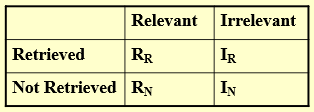
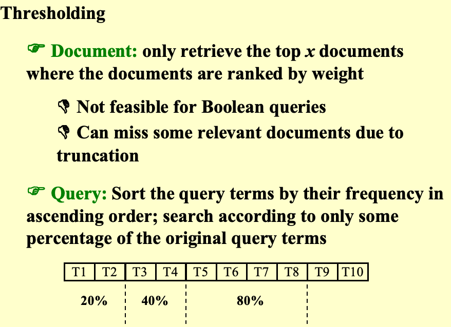
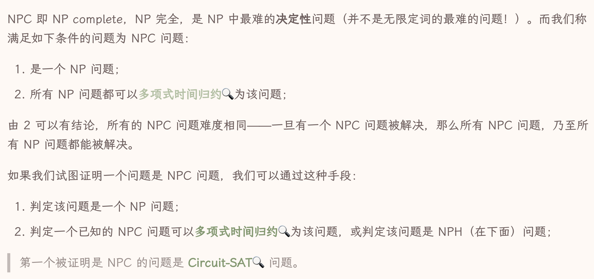
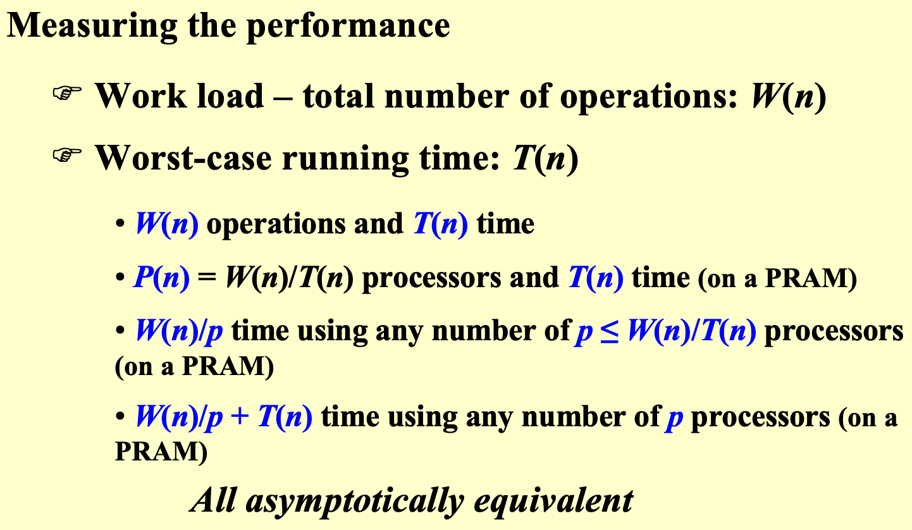

---
tags:
  - notes
comments: true
dg-publish: true
---

为了考试，速通 PPT，简单记录考程序填空代码（也有一些考过的程序填空题）。

> 部分程序填空题答案来自 [HYLUZ](https://www.hyluz.cn/)；
> 
> 也可见这都是几年前的题目，还在用还在用。

## AVL Tree

### RL_Roatation

```c title="RL"
typedef struct TNode *Tree;
struct TNode {
    int key, h;
    Tree left, right;
};

Tree RL_Rotation( Tree T )
{
    Tree K1, K2;

    K1 = T->right;
    K2 = K1->left;
    K1->left = K2->right;
    T->right = K2->left;
    K2->right = K1;
    K2->left=T;
    /* Update the heights */
    K1->h = maxh(Height(K1->left), Height(K1->right)) + 1;
    T->h = maxh(Height(T->left), Height(T->right)) + 1;
    K2->h = maxh(K1->h, T->h) + 1;

    return K2;
}
```

## Amortized Analysis

### MultiPop

```c title="multiPop"
Algorithm(int k, Stack S){
    while ( !IsEmpty(S) && k>0 ) {
        Pop(S);
        k--;
    } /* end while-loop */ 
} // T = min (sizeof(S), k)
```

但是摊还下来 T(n) = O(n)/n = O(1)

## Red-Black Tree

### IsRBT

```c title="IsRBT"
typedef enum { red, black } colors;
typedef struct RBNode *PtrToRBNode;
struct RBNode{
    int Data;
    PtrToRBNode Left, Right, Parent;
    int BlackHeight;
    colors Color;
};
typedef PtrToRBNode RBTree;

// Please fill in the blanks.
bool IsRBT( RBTree T ) {
    int LeftBH, RightBH;
    if ( !T ) return true;
    if ( T->Color == black ) T->BlackHeight = 1;
    else {
         if ( T->Left && ________) return false; // blank 1
         if ( T->Right && (T->Right->Color == red) ) return false;
    }
    if ( !T->Left && !T->Right ) return true;
    if (________) { // blank 2
        if ( T->Left ) LeftBH = T->Left->BlackHeight;
        else LeftBH = 0;
        if ( T->Right ) RightBH = T->Right->BlackHeight;
        else RightBH = 0;
        if ( LeftBH == RightBH ) { 
            ________; // blank 3
            return true;
        }
       else return false;
    }
    else return false;
}
// (T->Left->Color == red)
// IsRBT( T->Left ) && IsRBT( T->Right )
// T->BlackHeight += LeftBH
```

## B+ Tree

### Insert

```c title="Insert"
Btree  Insert ( ElementType X,  Btree T ) 
{ 
    Search from root to leaf for X and find the proper leaf node;
    Insert X;
    while ( this node has M+1 keys ) {
            split it into 2 nodes with (M+1)/2 and (M+1)/2 keys, respectively;
            if (this node is the root)
                create a new root with two children;
            check its parent;
    }
} // T(M,N)=O((M/logM)logN); T_Find(M,N)=O(logN)
```

### FindKey

```c title="FindKey"
static int order = DEFAULT_ORDER;
typedef struct BpTreeNode BpTreeNode;
struct BpTreeNode {
    BpTreeNode** childrens; /* Pointers to childrens. This field is not used by leaf nodes. */
    ElementType* keys;
    BpTreeNode* parent;
    bool isLeaf; /* 1 if this node is a leaf, or 0 if not */
    int numKeys; /* This field is used to keep track of the number of valid keys.
    In an internal node, the number of valid pointers is always numKeys + 1. */
};
bool FindKey(BpTreeNode * const root, ElementType key){
    if (root == NULL) {
        return false;
    }
    inti= 0;
    BpTreeNode * node = root;
    while (____) { // 空 1
       i= 0;
        while (i < node->numKeys) {
            if (____) i++; // 空 2
            else break;
        }
        node = node->childrens[i];
    }
    for(i = 0;i< node->numKeys; i++){
        if(node->keys[i] == key)
        return true;
    }
    return false;
}
// !(node->isLeaf)
// key >= node->keys[i]
```


## Leftist Heap

```c title="leftistHeapNode"
struct TreeNode {
    ElementType Element;
    PriorityQueue Left;
    PriorityQueue Right;
    int Npl;
};
```

### priorityQ merge

```c title="priorityQueue merge"
PriorityQueue Merge ( PriorityQueue H1, PriorityQueue H2 ){
    if ( H1 == NULL ) return H2;    
    if ( H2 == NULL ) return H1
    // 将较小的值的根作为合并后的根   
    if (H1->Element < H2->Element) return Merge1( H1, H2 );
    else return Merge1( H2, H1 );
}

static PriorityQueue Merge1( PriorityQueue H1, PriorityQueue H2 ) { 
    /* H1 is a single node */
    if ( H1->Left == NULL ) H1->Left = H2;
    /* H1->Right is already NULL and H1->Npl is already 0 */
    else {
        H1->Right = Merge( H1->Right, H2 );     /* Step 1 & 2 */
        if ( H1->Left->Npl < H1->Right->Npl )
            SwapChildren(H1);    /* Step 3 */
        H1->Npl = H1->Right->Npl + 1;
    } /* end else */
    return H1;
} // Tp = O(log N)
```

当然也可以合并为一个：

```c title="PriorityQueue Merge"
PriorityQueue Merge ( PriorityQueue H1, PriorityQueue H2 ){
    if ( H1 == NULL ) return H2;    
    if ( H2 == NULL ) return H1
    // 将较小的值的根作为合并后的根   
    if (H1->Element < H2->Element)
        swap(H1, H2);
    /* H1 is a single node */
    if ( H1->Left == NULL )
        H1->Left = H2;
    else {
        H1->Right = Merge( H1->Right, H2 );     /* Step 1 & 2 */
        if ( H1->Left->Npl < H1->Right->Npl )
            SwapChildren(H1);    /* Step 3 */
        H1->Npl = H1->Right->Npl + 1;
    }
}
```

---

## Binomial Queues

### implement

```c title="BinQueue implement"
typedef struct BinNode *Position;
typedef struct Collection *BinQueue;
typedef struct BinNode *BinTree;  /* missing from p.176 */

struct BinNode { 
    ElementType Element;
    Position LeftChild;
    Position NextSibling;
};

struct Collection { 
    int CurrentSize;  /* total number of nodes */
    BinTree TheTrees[MaxTrees];
};
```

### Merge

```c title="BinQueue Merge"
BinQueue  Merge( BinQueue H1, BinQueue H2 )
{    BinTree T1, T2, Carry = NULL;     
    int i, j;
    if ( H1->CurrentSize + H2-> CurrentSize > Capacity )  ErrorMessage();
    H1->CurrentSize += H2-> CurrentSize;
    for ( i=0, j=1; j<= H1->CurrentSize; i++, j*=2 ) {
        T1 = H1->TheTrees[i]; T2 = H2->TheTrees[i]; /*current trees */
        switch( 4*!!Carry + 2*!!T2 + !!T1 ){
        /* 变为 Carry T2 T1 的三位二进制数 */ 
        case 0: /* 000 */
        case 1: /* 001 */  break;    
        case 2: /* 010 */  
            H1->TheTrees[i] = T2; H2->TheTrees[i] = NULL; break;
        case 4: /* 100 */  
            H1->TheTrees[i] = Carry; Carry = NULL; break;
        case 3: /* 011 */  
            Carry = CombineTrees( T1, T2 );
            H1->TheTrees[i] = H2->TheTrees[i] = NULL; break;
        case 5: /* 101 */  
            Carry = CombineTrees( T1, Carry );
            H1->TheTrees[i] = NULL; break;
        case 6: /* 110 */  Carry = CombineTrees( T2, Carry );
            H2->TheTrees[i] = NULL; break;
        case 7: /* 111 */  H1->TheTrees[i] = Carry; 
            Carry = CombineTrees( T1, T2 ); 
            H2->TheTrees[i] = NULL; break;
        } /* end switch */
    } /* end for-loop */
    return H1;
}
```

### DeleteMin

```c title="BinQueue DeleteMin"
ElementType  DeleteMin( BinQueue H )
{    BinQueue DeletedQueue; 
    Position DeletedTree, OldRoot;
    ElementType MinItem = Infinity;  /* the minimum item to be returned */    
    int i, j, MinTree; /* MinTree is the index of the tree with the minimum item */

    if ( IsEmpty( H ) )  {  PrintErrorMessage();  return –Infinity; }

    for (i= 0;i< MaxTrees; i++) {  /* Step 1: find the minimum item */
        if( H->TheTrees[i] && H->TheTrees[i]->Element < MinItem ) { 
        MinItem = H->TheTrees[i]->Element;  MinTree = i;    } /* end if */
    } /* end for-i-loop */
    DeletedTree = H->TheTrees[ MinTree ];  
    H->TheTrees[ MinTree ] = NULL;   /* Step 2: remove the MinTree from H => H’ */ 
    OldRoot = DeletedTree;   /* Step 3.1: remove the root */ 
    DeletedTree = DeletedTree->LeftChild;   free(OldRoot);
    DeletedQueue = Initialize();   /* Step 3.2: create H” */ 
    DeletedQueue->CurrentSize = ( 1<<MinTree ) – 1;  /* 2^MinTree – 1 */
    for ( j = MinTree – 1; j >= 0; j – – ) {  
        DeletedQueue->TheTrees[j] = DeletedTree;
        DeletedTree = DeletedTree->NextSibling;
        DeletedQueue->TheTrees[j]->NextSibling = NULL;
    } /* end for-j-loop */
    H->CurrentSize  – = DeletedQueue->CurrentSize + 1;
    H = Merge( H, DeletedQueue ); /* Step 4: merge H’ and H” */ 
    return MinItem;
}
```

### Find

The functions `BinQueue_Find` and `Recur_Find` are to find `X` in a binomial queue `H`. Return the node pointer if found, otherwise return NULL.

```c title="BinQueue Find"
BinTree BinQueue_Find( BinQueue H, ElementType X )
{
    BinTree T, result = NULL;
    int i, j; 

    for( i=0, j=1; j<=H->CurrentSize; i++, j*=2) {  /* for each tree in H */
        T= H->TheTrees[i];
        if ( X >= T->Element ){/* if need to search inside this tree */
            result = Recur_Find(T, X);
            if ( result != NULL ) return result;
        } 
    }
    return result;
}

BinTree Recur_Find( BinTree T, ElementType X )
{
    BinTree result = NULL;
    if ( X==T->Element ) return T;
    if ( T->LeftChild!=NULL ){
        result = Recur_Find(T->LeftChild, X);
        if ( result!=NULL ) return result;
    } 
    if ( T->NextSibling!=NULL )
        result = Recur_Find(T->NextSibling, X);
    return result;
}
```

### DeleteRoot

The function `DeleteRoot` is to delete the root of a subtree with index `Ind` from a binomial queue `H`. The rest of the subtree is then stored as a new binomial queue and returned.

> 其实就是少了找最小根的那一步。

```c title="BinQueue_DleteRoot"
BinQueue DeleteRoot( BinQueue H, int Ind )
{
    BinTree OldRoot, SubTree;
    BinQueue NewBinQ;
    int i;
    
    OldRoot = H->TheTrees[Ind];
    SubTree = OldRoot->LeftChild;
    free(OldRoot);
    NewBinQ = Initialize();
    NewBinQ->CurrentSize = ________; // 空 1 ：等号后面
    for (________) { // 空 2：循环逻辑
        NewBinQ->TheTrees[i] = SubTree;
        SubTree = SubTree->NextSibling;
        NewBinQ->TheTrees[i]->NextSibling = NULL;
    }
    return NewBinQ;
}
// (1<<Ind) - 1
// i=Ind-1;i>=0;i--
```

---

## Inverted File Index

这里有两种分布式的策略，其一是**根据单词的字典序进行分布式 (Term-partitioned index)**，其二是**根据文档进行分布式 (Term-partitioned index)**。

显然根据单词的内容进行分布式，能够提高索引效率，但是这样的话，我们就需要将所有形式接近的单词都存储在一个地方，这样就会造成单点故障，容灾能力很差，所以这种方式并不是很好。

而第二种办法则有较强的容灾性能。即使一台机器无法工作，也不会剧烈影响到整个系统的工作。

> [!NOTE] 评估标准
>
> 
> $\begin{aligned}&1.Precision\text{(准确率)}:\quad P=R_R/(R_R+I_R)\\&\text{准确率表示在搜索到的信息中,相关的(用户想要的)信息的占比。}\\&2.Recall\text{(召回率)}:R=R_R/(R_R+R_N)\\&\text{召回率表示在相关的(用户想要的)信息中,搜索到的占比。}\end{aligned}$



---

## Backtracing

### Eight Queens（八皇后问题）

Find a placement of  8 queens on an 8 x 8 chessboard such that no two queens attack. Two queens are said to attack iff they are in the same row, column, diagonal, or antidiagonal of the chessboard.

### The Turnpike Reconstruction Problem（收费公路重建问题）

Given N points on the x-axis with coordinates $x1 <  x2 < …< x_N$ .  Assume that x1 = 0.  There are $N(N–1)/2$ distances between every pair of points, reconstruct a point set from the distances.

```c title="Reconstruction"
bool Reconstruct ( DistType X[], DistSet D, int N, int left, int right ){ /* X[1]...X[left-1] and X[right+1]...X[N] are solved */
    bool Found = false;
    if (Is_Empty(D))
        return true; /* solved */
    D_max = Find_Max(D);
    /* option 1：X[right] = D_max */
    /* check if |D_max-X[i]| \in D is true for all X[i]’s that have been solved */
    OK = Check(D_max,N, left, right ); /* pruning */
    if (OK) { /* add X[right] and update D */
        X[right] = D_max;
        for ( i=1; i<left; i++ )  Delete(|X[right]-X[i]|, D);
        for ( i=right+1; i<=N; i++ )  Delete( |X[right]-X[i]|, D);
        Found = Reconstruct (X, D, N, left, right-1);
        if (!Found) { /* if does not work, undo */
            for ( i=1; i<left; i++ )  Insert( |X[right]-X[i]|, D);
            for ( i=right+1; i<=N; i++ )  Insert( |X[right]-X[i]|, D);
        }
    }
    /* finish checking option 1 */
if (!Found) { /* if option 1 does not work */
        /* option 2: X[left] = X[N]-D_max */
        OK = Check( X[N]-D_max, N, left, right );
        if ( OK ) {
            X[left] = X[N] – D_max;
            for ( i=1; i<left; i++ )  Delete( |X[left]-X[i]|, D);
            for ( i=right+1; i<=N; i++ )  Delete( |X[left]-X[i]|, D);
            Found = Reconstruct (X, D, N, left+1, right );
            if (!Found) {
                for ( i=1; i<left; i++ ) Insert( |X[left]-X[i]|, D);
                for ( i=right+1; i<=N; i++ ) Insert( |X[left]-X[i]|, D);
            }
        }
        /* finish checking option 2 */
    } /* finish checking all the options */   
    return Found;
}
```

上面的是 PPT 上的伪代码，感觉比较丑陋；下面是 [Chap 6 | “Backtracking”](https://sh17c.top/LessonsNotes/D2CX_AdvancedDataStructure/Chap06/#_1) 中提到的伪代码，在写编程题时更为常见。

```c title="BackTracing"
void BackTracing(参数) {
    if (终止条件) {
        存放结果;
        return;
    }
    for (选择：本层集合中元素（树中节点孩子的数量就是集合的大小）) {
        处理节点;
        BackTracking(下一个参数); 
        撤销处理;
        BackTracking(下一个参数); 
    }
}
```

### Template

```c title="Backtracing"
bool Backtracking (int i){
    Found = false;
    if (i > N)
        return true; /* solved with (x1, …, xN) */
    for ( each xi \in Si ) { 
        /* check if satisfies the restriction R */
        OK = Check((x1, ... , xi) , R ); /* pruning */
        if (OK) {
            Count xi in;
            Found = Backtracking( i+1 );
            if ( !Found )
                Undo(i); /* recover to (x1, …, xi-1) */
        }
        if (Found) break; 
    }
    return Found;
}
```

### Tic-tac-toe（井字棋）

> 规则我就不介绍了，真不会的话可以自己搜索了。

在此处，我们（站在 Computer 的角度上）使用 Minimax Strategy；即是说，Computer 与 Human 在进行一场零和博弈；对于某一决定博弈结果的属性，一方尽量使其最小，另一方尽量使其最大。

例如，在下面的图片中，取这个“属性”为 f(P) ，其与 Computer 获胜的概率成正相关，故
"The human is trying to minimize the value of the position P, while the computer is trying to maximize it."


> [!TIP]
>
> W 是 P 状态下，能够获胜的摆盘方式。对于棋子较少时，可以从反面出发。因为井字棋的获胜摆盘方式只有 8 种（从固定视角看）。
> 
> 在上图中，红圆占据了两种，故蓝色方还有 8-2=6 种方式获胜；蓝叉占据了 4 种，红色方还有 8-4=4 种方式获胜。

### α-β pruning（α-β剪枝）


一般来说，在实施 α-β pruning 后，时间复杂度能够由 O(n) 降至 O(sqrt(n))

---

## Divide & Conqueer

**Master Theorems**

形式一：

$$
\begin{aligned}&\text{对于形如 }T(N)=aT(N/b)+f(N)\text{ 的递推式}:\\&1.\text{ 若 }f(N)=O(N^{(\log_ba)-\varepsilon}),\text{ for }\varepsilon>0,\text{ 那么 }T(N)=\Theta(N^{\log_ba});\\&2.\text{ 若 }f(N)=\Theta(N^{\log_ba}),\text{ 那么 }T(N)=\Theta(N^{\log_ba}\log N);\\&3.\text{ 若 }f(N)=\Omega(N^{(\log_ba)+\varepsilon}),\text{ for }\varepsilon>0\text{ 且 }af(\frac Nb)<cf(N),\\&\text{ for }c<1\text{ and }\forall N> N_0,\text{ 那么 }T(N)=\Theta(f(N));\end{aligned}
$$

形式二：

$$
\begin{aligned}&\text{对于形如 }T(N)=aT(\frac Nb)+f(N)\text{ 的递推式}:\\&
1.\text{ 若 }af(\frac Nb)=k f(N)\text{ for fixed }k<1\text{,那么 }T(N)=\Theta(f(N));\\&
2.\text{ 若 }af(\frac Nb)=Kf(N)\text{ for fixed K}>1\text{,那么 }T(N)=\Theta(N^{\log_ba})\\&
3.\text{ 若 }af(\frac Nb)=f(N),\text{ 那么 }T(N)=\Theta(f(N)\log_bN);\end{aligned}
$$

个人比较喜欢形式二，因为很好地表达了“主”定理的意思：取  

$$k = \lim_{ N \to \infty } \frac{af\left( \frac{N}{b} \right)}{f(N)}$$

k 与 1 的关系表示了 $af\left( \frac{N}{b} \right) 与 f(N)$ 之间的相对关系，表明了谁是“主”导，而且好记。

形式三：

$\begin{gathered}T(N)=a\:T(N/b)+\Theta(N^k\log^pN),\mathrm{where~}a\geq1,b>1,\mathrm{~and~}p\geq0\mathrm{~is}\\T(N)=\begin{cases}O(N^{\log_ba})&\mathrm{if~}a>b^k\\O(N^k\log^{p+1}N)&\mathrm{if~}a=b^k\\O(N^k\log^pN)&\mathrm{if~}a<b^k\end{cases}\end{gathered}$

### Closet Points Problem

```python title="pseudo code"
/* points are all in the strip */
/* and sorted by y coordinates */
for (i= 0;i< NumPointsInStrip; i++ )
    for ( j =i+ 1; j < NumPointsInStrip; j++ ) 
        if ( Dist_y( Pi , Pj ) > δ )
            break;
        else  if ( Dist( Pi , Pj ) < δ )
            δ = Dist( Pi , Pj );
```

## Greedy Algorithm

### Activity Selection Problem

Given a set of activities S=a1​,a2​,...,an​ that wish to use a resource (e.g. a classroom). Each ai​ takes place during a time interval [si​,fi​).

Activities ai​ and aj​ are compatible if si​≥fj​ or sj​≥fi​ (i.e. their time intervals do **not overlap**).

**Goal:** Select a maximum-size subset of mutually compatible activities.

- Assume f1​≥f2​≥...≥fn​.

> 这实际上是一个一维平铺问题，使用贪婪算法的话，从前向后，每次选取不冲突的活动中，最早结束的那个活动即可。

### Huffman's Algorithm

下面的伪代码来自 PPT ，看不懂在干什么；haffman's code 本身很好理解：按照出现频率排序，每次选择最低频率的两个作为二叉树的两个节点并合出其父节点；依次类推直到构建一颗完整的二叉树，所有词都

```c title="Huffman"
void Huffman ( PriorityQueue heap[],  int  C ){
    consider the C characters as C single node binary trees,
    and initialize them into a min heap;
    for (i= 1;i< C; i++ ) { 
       create a new node;
       /* be greedy here */
       delete root from min heap and attach it to left_child of node;
       delete root from min heap and attach it to right_child of node;
       weight of node = sum of weights of its children;
       /* weight of a tree = sum of the frequencies of its leaves */
       insert node into min heap;
   }
} // T=O(C logC)
```

## Dynamic Programming

### Fibonacci

```c title="Fib"
int  Fib( int N ) 
{ 
    if ( N <= 1 ) 
        return  1; 
    else 
        return  Fib( N - 1 ) + Fib( N - 2 ); 
}

int  Fibonacci ( int N ) 
{   int  i, Last, NextToLast, Answer; 
    if ( N <= 1 )  return  1; 
    Last = NextToLast = 1;    /* F(0) = F(1) = 1 */
    for (i= 2;i<= N; i++ ) { 
        Answer = Last + NextToLast;   /* F(i) = F(i-1) + F(i-2) */
        NextToLast = Last; Last = Answer;  /* update F(i-1) and F(i-2) */
    }
    return  Answer; 
}

```

### Ordering Matrix Multiplications


```c title="OptMatrix"
/* r contains number of columns for each of the N matrices */ 
/* r[0] is the number of rows in matrix 1 */ 
/* Minimum number of multiplications is left in M[ 1 ][ N ] */ 
void OptMatrix( const long r[ ], int N, TwoDimArray M ) 
{   int  i, j, k, L; 
    long ThisM; 
    for(i= 1;i<= N; i++ )   M[i][i] = 0; 
    for( k = 1; k < N; k++ ) /* k = j -i*/ 
        for(i= 1;i<= N - k; i++ ) { /* For each position */ 
            j =i+k; M[i][j] = Infinity; 
            for (L = i; L < j; L++ ) { 
                ThisM = M[i][L] + M[L+1][j] + r[i-1] * r[L] * r[j]; 
                if (ThisM < M[i][j])  /* Update min */ 
                M[i][j] = ThisM; 
            }  /* end for-L */
        }  /* end for-Left */
}
```

$T(N) = O(N^3)$

### Optimal Binary Search Tree

Given  N  words  w1 < w2 < …… < wN, and the probability of searching for each  wi  is  pi .  Arrange these words in a binary search tree in a way that minimize the expected total access time. $T(N)=\sum_{i=1}^Np_i\cdot(1+d_i)$

如果我们记：

$$
\begin{aligned}&T_{ij}::=\text{OBST for }w_i,......,w_j\text{ ( i<j )}\\&c_{ij}::=\text{cost of }T_{ij}\text{ ( }c_{ii}=0\text{ )}\\&r_{ij}::=\text{root of }T_{ij}\\&w_{ij}::=\text{weight of }T_{ij}=\sum_{k=i}^jp_k(w_{ii}=p_i)\end{aligned}
$$


### All-Pairs Shortest Path

Floyd-Warshall 算法


```c title="AllPairs"
/* A[ ] contains the adjacency matrix with A[i][i] = 0 */ 
/* D[ ] contains the values of the shortest path */ 
/* N is the number of vertices */ 
/* A negative cycle exists iff D[i][i] < 0 */ 
void AllPairs( TwoDimArray A, TwoDimArray D, int N ) 
{   int  i, j, k; 
    for (i= 0;i< N; i++ )  /* Initialize D */ 
         for( j = 0; j < N; j++ )
     D[i][j] = A[i][j]; 
    for( k = 0; k < N; k++ )  /* add one vertex k into the path */
         for(i= 0;i< N; i++ ) 
     for( j = 0; j < N; j++ ) 
        if( D[i][k] + D[k][j] < D[i][j] ) 
        /* Update shortest path */ 
         D[i][j] = D[i][k] + D[k][j]; 
}
```

$T(N)=O(N^3)$, faster in a dense graph.

---

### Decode

> 建议看清题目，不然就像某位同学一样填反了……，下图中是正确填空。


## NP-Completeness


> [wikipedia](https://en.wikipedia.org/wiki/NP-hardness)

### halting problem

```c
Loop( P ) {  
/* 1 */ if ( P(P) loops )   print (YES);
/* 2 */ else infinite_loop();
}

Loop(Loop); // contradiction
```

### NP complete



> [isshikih 的笔记](https://note.isshikih.top/cour_note/D2CX_AdvancedDataStructure/Lec10/#%E6%A6%82%E8%BF%B0)

### 规约 (Reduce)


> 符_号 $A \leq_p B$ 的含义是 A no harder than B，A 可以被规约为 B 。
> 
> 图片来自某手写笔记，来源不详，如有不当请留言或者联系我。

A language L1 is polynomial-time reducible to a language L2 ( L1 ≤P L2 ) if there exists a polynomial-time computable function  f : {0, 1}* → {0,1}* such that for all $x \{0, 1\}*,  x \in L1  \iff  f (x) \in L2$.

### CP 2 VCP


**proof**: G has a clique of size K iff $\overline{G}$ has a vertex cover of size |V| - K. 

## Approximate

### Approximate Bin Packing

Given N items of sizes  S1 , S2 , …, SN , such that $0 < S_{i} \leq1$ for all $1 \leq i \leq N$ .  Pack these items in the fewest number of bins, each of which has **unit capacity**.

- NextFit
	- $\leq 2M-1$
- FirstFit
	- $\leq 1.7M$
- BestFit
	- $\leq 1.7 M$
- First Fit Decreasing(offline)
	- $\leq \frac{11M + 6}{9}$

```c title="Fit"
void FirstFit ( )
{   while ( read item ) {
        scan for the first bin that is large enough for item;
        if ( found )
    place item in that bin;
        else
    create a new bin for item;
    } /* end-while */
}

void FirstFit ( )
{   while ( read item ) {
        scan for the first bin that is large enough for item;
        if ( found )
    place item in that bin;
        else
    create a new bin for item;
    } /* end-while */
}
```

### The Knapsack Problem

- fractional version
	- greedy with maximum profit density pi / wi 
- 0-1 version
	- $p_{max}$ 表示价值最高的物品 

### The K-center Problem

```c title="greedy - 2r"
Centers  Greedy-2r ( Sites S[ ], int n, int K, double r )
{   Sites  S’[ ] = S[ ]; /* S’ is the set of the remaining sites */
    Centers  C[ ] = empty;
    while ( S’[ ] != empty ) {
        Select any s from S’ and add it to C;
        Delete all s’ from S’ that are at dist(s’, s)  2r;
    } /* end-while */
    if ( |C|  K ) return C;
    else ERROR(No set of K centers with covering radius at most r);
}
```

```c title="smarter solution"
Centers  Greedy-Kcenter ( Sites S[ ], int n, int K )
{   Centers  C[ ] = ;
    Select any s from S and add it to C;
    while ( |C| < K ) {
        Select s from S with maximum dist(s, C);
        Add s it to C;
    } /* end-while */
    return C;
}
```

## Local search

```c
SolutionType Gradient_descent()
{   Start from a feasible solution S \in FS ;
    MinCost = cost(S);
    while (1) {
        S’ = Search( N(S) ); /* find the best S’ in N(S) */
        CurrentCost = cost(S’);
        if ( CurrentCost < MinCost ) {
            MinCost = CurrentCost;    S = S’;
        }
        else  break;
    }
    return S;
}
```

### The Vertex Cover Problem

```c title="metropolis"
SolutionType Metropolis() {   // Simulated Annealing
    Define constants k and T;
    Start from a feasible solution S \in FS ;
    MinCost = cost(S);
    while (1) {
        S’ = Randomly chosen from N(S); 
        CurrentCost = cost(S’);
        if ( CurrentCost < MinCost ) {
            MinCost = CurrentCost;    S = S’;
        }
        else {
            With a probability e^{-\Delta cost / (kT)}, let S = S’;
            else  break;
        }
    }
    return S;
}
```

### Hopfield Neural Networks

```c title="state flipping"
ConfigType State_flipping()
{
    Start from an arbitrary configuration S;
    while ( ! IsStable(S) ) {
        u = GetUnsatisfied(S);
        su = - su;
    }
    return S;
}
```

### The Maximum Cut Problem

不难发现是一个特殊的 HNN 问题。

**May not terminate in polynomial time:** stop if the improvement is not big enough:


### Hiring Problem

```c title="naive solution"
int Hiring ( EventType C[ ], int N )
{   /* candidate 0 is a least-qualified dummy candidate */
    int Best = 0;
    int BestQ = the quality of candidate 0;
    for ( i=1; i<=N; i++ ) {
        Qi = interview( i ); /* Ci */
        if ( Qi > BestQ ) {
            BestQ = Qi;
            Best = i;
            hire( i );  /* Ch */
        }
    }
    return Best;
} // worse case if candidate gets better and better => O(N(C_i + C_h))
```

```c title="random hiring"
int RandomizedHiring ( EventType C[ ], int N )
{   /* candidate 0 is a least-qualified dummy candidate */
    int Best = 0;
    int BestQ = the quality of candidate 0;

    randomly permute the list of candidates;

    for ( i=1; i<=N; i++ ) {
        Qi = interview( i ); /* Ci */
        if ( Qi > BestQ ) {
            BestQ = Qi;
            Best = i;
            hire( i );  /* Ch */
        }
    }
} // E = O(N*C_i + ln(N)*C_h)
```

```c title="hire once"
int OnlineHiring ( EventType C[ ], int N, int k )
{
    int Best = N;
    int BestQ = - \infty;
    for ( i=1; i<=k; i++ ) {
        Qi = interview( i );
        if ( Qi > BestQ )   BestQ = Qi;
    }
    for ( i=k+1; i<=N; i++ ) {
        Qi = interview( i );
        if ( Qi > BestQ ) {
            Best = i;
            break;
        }
    }
    return Best;
}
```


使用积分对最后的 Pr[S] 进行放缩得到：$\frac kN\ln\left(\frac Nk\right)\leq\Pr[S]\leq\frac kN\ln\left(\frac{N-1}{k-1}\right)$

## Parallel Algorithms

### The summation problem


> 右侧的空圆表示闲置的 processers

```c title="PRAM module"
for Pi ,  1 ≤ i ≤ n  pardo
    B(0, i) := A( i )
    for h = 1 to log n do
        if i ≤ n/2^h
            B(h, i) := B(h-1, 2i-1) + B(h-1, 2i)
        else stay idle
    for i = 1: output B(log n, 1); 
    for i > 1: stay idle
```



> 注意是第三条是小于等于（错过一次）。

```c title="Work-Depth (WD) Presentation"
for Pi ,  1 ≤ i ≤ n  pardo // use time 1
    B(0, i) := A( i )
for h = 1 to log n // use time log(n)
    for Pi, 1 ≤ i ≤ n/2h  pardo
        B(h, i) := B(h-1, 2i-1) + B(h-1, 2i)
for i = 1 pardo // use time 1
    output  B(log n, 1)
```

- T(n) = log(n) + 2
- W(n) = n + n/2 + n/4 + ... + 1 => 2n = O(n)
- 任何WD模型的algorithm，用 P(n) 个 processor，运行时间都至多为 $O\left( \frac{W(n)}{P(n)}+T(n) \right)$ （处理器充足可加速，不充足也能够运行）

【WD-presentation Sufficiency Theorem】An algorithm in the WD mode can be implemented by any P(n) processors within O(W(n)/P(n) + T(n)) time, using the same concurrent-write convention as in the WD presentation.


### Prefix-Sums

```c title="Prefix-Sums"
for Pi , 1 ≤ i ≤ n pardo // use time 1
    B(0, i) := A(i)
for h = 1 to log n // use time log(n)
    for i , 1 ≤ i ≤ n/2h pardW()o
        B(h, i) := B(h - 1, 2i - 1) + B(h - 1, 2i)
for h = log n to 0 // use time log(n)
    for i even, 1 ≤ i ≤ n/2h pardo
        C(h, i) := C(h + 1, i/2)
    for i = 1 pardo
        C(h, 1) := B(h, 1)
    for i odd, 3 ≤ i ≤ n/2h pardo
        C(h, i) := C(h + 1, (i - 1)/2) + B(h, i)
for Pi , 1 ≤ i ≤ n pardo // use time 1
    Output C(0, i)
```

- T(n) = 2log(n)+2 = O(log(n))
- W(n) = O(n)

### Merging => ranking
 
- binary search
	- T(n)=log(n)
	- W(n)=nlog(n)
- serial ranking (二者不等长)
	- T(n)=O(n+m)
	- W(n)=O(n+m)
- Parallel Ranking
	- T(n)=O(log(n))
	- W(n)=O(n)

### Maximum Finding

- summation problem 中 + 换为 max()
	- T(n)=log(n)
	- W(n)=O(n)
- compare all pairs
	- T(n)=1
	- W(n)=O(n^2)
- Doubly-logarithmic Paradigm
	- T(n)=O(log(log(n)))
	- W(n)=O(n)
- Random Sampling
	- T(n)=O(1)
	- W(n)=O(n)
	- Pr[wrong]= $O\left( \frac{1}{n^c}\right)$ & O(n) processers required.


