---
tags:
  - notes
comments: true
dg-publish: true
---

主要是 ADS 作业题&考试题，`(multi)` 表示 “题目表示多选” 。

判断/选择题答案在每题对应部分的最后，截图中的答案有概率错误。

> [Jianjun Zhou's Notebook](https://zhoutimemachine.github.io/note/courses/ads-hw-review/) 中出现的题目大概率不会再出现在此处（除非我对题解有新的想法/我觉得这道题不错/我这道题错了）。

## AVL Tree

全称 Adelson-Velskii-Landis (AVL) Trees, [Lecture 1 | AVL Trees & Splay Trees - Isshiki修's Notebook (isshikih.top)](https://note.isshikih.top/cour_note/D2CX_AdvancedDataStructure/Lec01/#avl-%E6%A0%91)

---

### 判断题

> [!QUESTION]
>
> Every subtree of an AVL tree is also an AVL tree.

**T**

---

> [!QUESTION]
>
> Consider an AVL tree. Immediately after we insert a node (without restoring the tree balance), the parent of the newly inserted node may become imbalanced.

假设一下 the parent of the newly inserted node 原来有 0/1 个子节点，都不可能 imbalanced 。

---

> [!QUESTION]
>
> 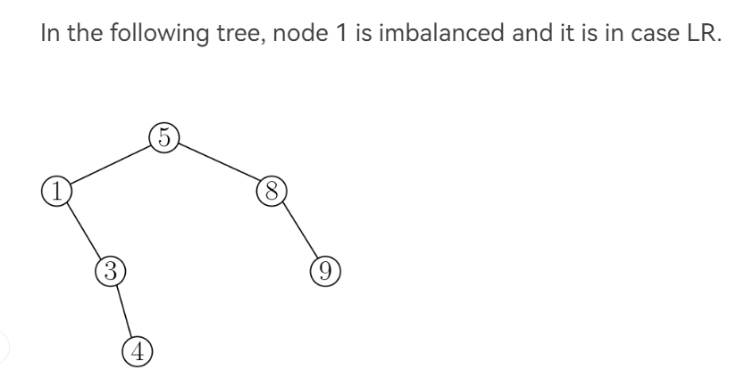

4 是 trouble maker，1 是 trouble finder。

**F**

---
### 选择题

> [!QUESTION]
>
> 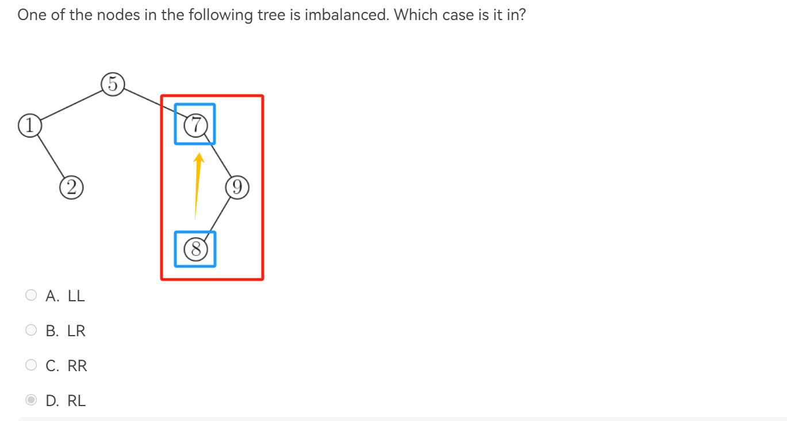

**D**

---

> [!QUESTION]
>
> (multi) Suppose that immediately after we delete a node from an AVL tree (without restoring the tree balance), some node u becomes imbalanced. Let T be the subtree rooted at u. How will the height of T change after we rebalance u? (Note that the root of T changes after rebalancing.)
>
> A.increases by 1 ; 
> B.does not change ; 
> C.decreases by 1 ; 

理解"Let T be the subtree rooted at u" 是（让 T 是以 u 为根的子树，即 u 本身在 T 中即可）；同时注意是删除，起初惯性认为是插入，单走一个 C 。

**BC**

---

> [!QUESTION]
>
> Consider an AVL tree of height 5. Which of the followings are the possible number of nodes in this tree? We assume that the height of a single node is 1.
> 
>   A.10 B.20 C.30 D.35

参考 [What is the minimum and maximum number of nodes of an AVL tree of height? - Quora](https://www.quora.com/What-is-the-minimum-and-maximum-number-of-nodes-of-an-AVL-tree-of-height)

最大节点数当然是满二叉树，为 $Max\_node(h) = 2^{h+1}-1$;
最小几点数经过推导，为 $Min\_node = Fib(h+2)-1$

**BC**

---

## Splay Tree

> [!NOTE] 摊还分析（势能法）
>
> - 开销大的操作应当倾向让势能降，开销小的操作应当倾向让势能升；
> - 势能高倾向于让某些操作开销大，势能低倾向于让某些操作开销小；
> - Φ(final)>Φ(initial)；
> 
> worst-case bound >= amortized bound >= average-case bound

---

### 判断题

> [!QUESTION]
>
> Let T be a BST. If we perform a splay operation on the node with the minimum key, then the root of the resulting tree has no left child.

在 splay tree 中，最小值被 splay 时，作为根节点，自然没有左节点。

**T**

---

> [!QUESTION]
>
> Suppose that the insertion operation of some data structure has a worst-case cost of Θ(n) and an amortized cost of O(logn). Starting with the empty structure, if we perform m insertion operations consecutively, the total cost may be as large as Θ($m^2$).

**F**

***

> [!QUESTION]
>
> The height of a splay tree with n nodes can be as large as Θ(n).

例如连续插入 123456789 到一个空树中。

**T**

---

> [!QUESTION]
>
> Suppose we have a potential function Φ such that for all Φ(Di​)≥Φ(D0​) for all i, but $Φ(D0)\neq0$. Then there exists a potential Φ′ such that Φ′(D0​)=0, Φ′(Di​)≥0 for all i≥1, and the amortized costs using Φ′ are the same as the amortized costs using Φ.

**T**

---
### 选择题

> [!QUESTION]
>
> 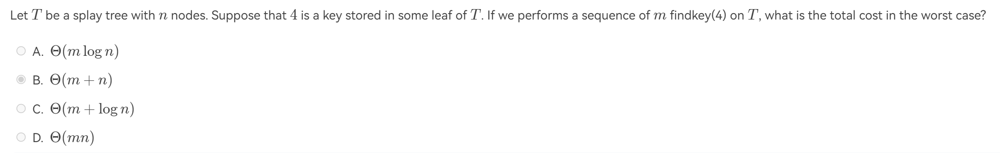

前面也提到了，splay tree 最坏的高度可以是 h = n，而 findkey(4) 在第二次之后一定是 O(1) 时间，故总共 O(n+m)

**B**

---

> [!QUESTION]
>
> (multi) Consider the dynamic array given in class. Which of the following potential functions will yield an amortized cost of O(1) for insertion? Select all the potential functions that work. To be rigorous, you may multiply all the following functions by a constant that is large enough. (Hint: recall that a good potential function must satisfy two certain conditions.)
> 
> 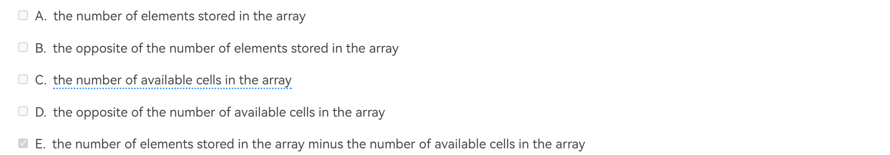

动态数组是说：起初数组大小为 1；当数组被填满后，将数组中的所有内容拷贝到另一个、大小为双倍的数组中。

回顾势能函数的要求（上面有），开销大的操作自然是发生在了填充最后一个数、数组转移的时候。

故选择 **E** （题目说的多选😇）

---

> [!QUESTION]
>
> 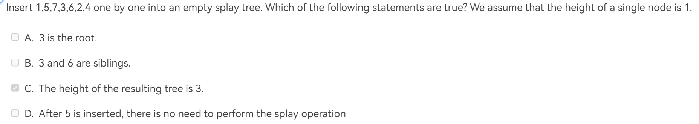

同样画出图来就好，[Splay Tree Visualzation (usfca.edu)](https://www.cs.usfca.edu/~galles/visualization/SplayTree.html)

**C**

---
## Rad Black Tree

> [!NOTE] Properties of RBTree
>
> 1. Every node is either red or black.
> 2. The root is black.
> 3. Every leaf (`NIL`) is black.
> 4. if a node is red, then both its children are black.
> 5. For each node, all simple paths from the node to descendant leaves contain the same number of black nodes.

> [!TIP]
>
> - **红黑树不存在只有一个非叶子节点的红色节点。**
> - **一个度为 1 的节点，它本身一定是黑色的，且它唯一的孩子一定是红色的。**
> - **一个有 N 个内部节点（不包括NIL）的红黑树，其最大高度为 $2\log_{2}(N+1)$。**
> - **`NIL` 节点被一个红色节点置换并不会改变一颗红黑树的黑高。**
> - **红色节点不能相邻（因为红色节点子节点只能是黑色）**

> [!HELP] [Deletion in RB Tree](https://www.bilibili.com/video/BV16m421u7Tb/?spm_id_from=333.337.search-card.all.click&vd_source=fbab6fd162a49f932342b74e9297a94a)
>
> 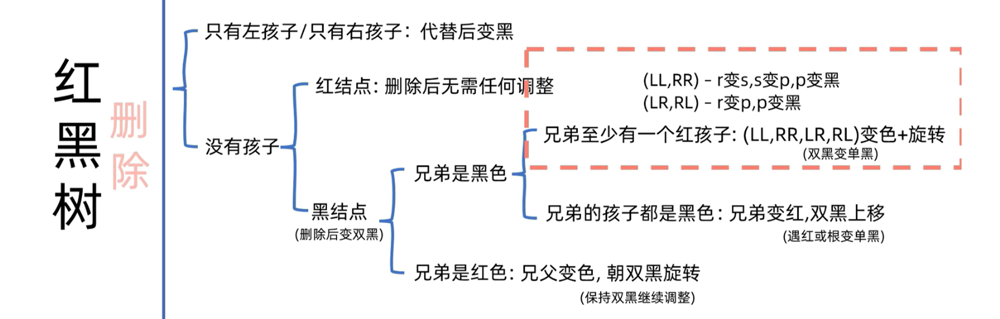

---

### 判断题

> [!QUESTION]
>
> The number of nodes, including the external nodes (NIL), in a red black tree must be odd.

算上 NIL ，红黑树一定是满二叉树（Full Binary Tree），节点数一定为奇数。

**T**

---

> [!QUESTION]
>
> Consider a node u of a Red-black tree in extended version. Let $h_{L}$ ​ and $h_{R}$ ​ be the height of the left and right subtrees of u, respectively. (We assume that the height of a single node is 1.) We have $\frac{1}{2}\leq\frac{h_{L}}{h_{R}}\leq2.$

这是红黑树性质的目的，保持“树”形态。

**T**

---

### 选择题

> [!QUESTION]
>
> Let u be an internal node in a red black tree. Suppose that one child of u is an internal node v, and the other is an external node (NIL). Which of the following statements are correct?
> 
> A.u must be red. B.u must be black.
> 
> C.v must be red. D.Both children of v are NIL

红黑树的性质

**BCD**

---

## Bplus Tree

> [!NOTE] property of B+ Tree
>
> - The root is either a leaf or has between 22 and M children.
> - All nonleaf nodes (except the root) have between ⌈M/2⌉ and M children.
> - All leaves are at the same depth.
> - 在空间最浪费的情况下是一棵 ⌈M/2⌉ 叉树，所以 B+ 树的深度是 O(⌈log⌈M/2⌉​N⌉).

---

### 判断题

> [!QUESTION]
>
> Consider an insertion in a B+ tree. We may need to update some keys stored in some internal nodes even if no leaf is split during the insertion.

想要更新 internal nodes 的值 <= 叶节点的第一个值改变 <= 新插入值插入叶节点第一个值（不可能，如果插入值小于某个叶节点第一个值，就会插入到前一个叶节点中）或者叶节点分裂（不合题意），故不可能。

**F**

---

> [!QUESTION]
>
> A B+ tree of order 3 is also called a 2-3 tree. Consider a 2-3 tree with 3 internal nodes. Its leaves can have a maximum number of 18 keys in total.

**T**

---
### 选择题

> [!QUESTION]
>
> Consider a B+ tree of order M. What is the maximum number of elements that are stored in an internal node?
> 
> A.M ; B.M−1 ; C.M+1 ; D.M/2

注意是一个内部节点。

**B**

---

> [!QUESTION]
>
> (multi) Consider a deletion in a B+ tree. Suppose that no underflow occurs after the deletion. How many elements in the internal nodes may be updated? Select all possible answers.
> 
> A.0 ; B.1 ; C.2 ; D.>2

借 [修佬的图](https://note.isshikih.top/cour_note/D2CX_AdvancedDataStructure/Lec02/#%E6%A6%82%E5%BF%B5_1) 一用：

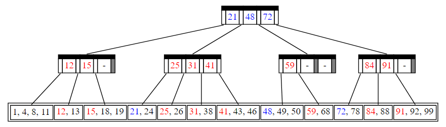

不难发现，对于叶节点上的每个值，在内部节点中至多出现一次；在不发生 underflow 的条件下，如果删除的是上面黑色的节点，内部节点不会更新；如果删除其他节点，则对应值所在节点更新，至多更新一次。

**AB**

---

## Leftist Heap

### 判断题

> [!QUESTION]
>
> A binary heap must be a leftist heap.

**T**

---
### 选择题

> [!QUESTION]
>
> 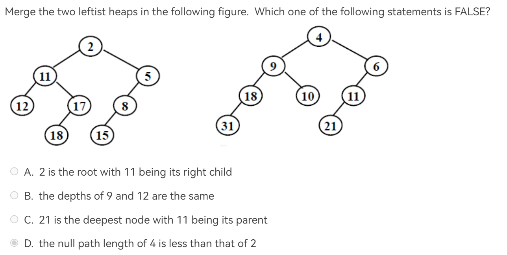

左式堆的合并，如果是选择判断，可能 [迭代式](https://note.isshikih.top/cour_note/D2CX_AdvancedDataStructure/Lec04/#%E8%BF%AD%E4%BB%A3%E5%BC%8F) 的演示图更方便理解，例如[Leftist tree - Wikipedia](https://en.wikipedia.org/wiki/Leftist_tree#Example)：

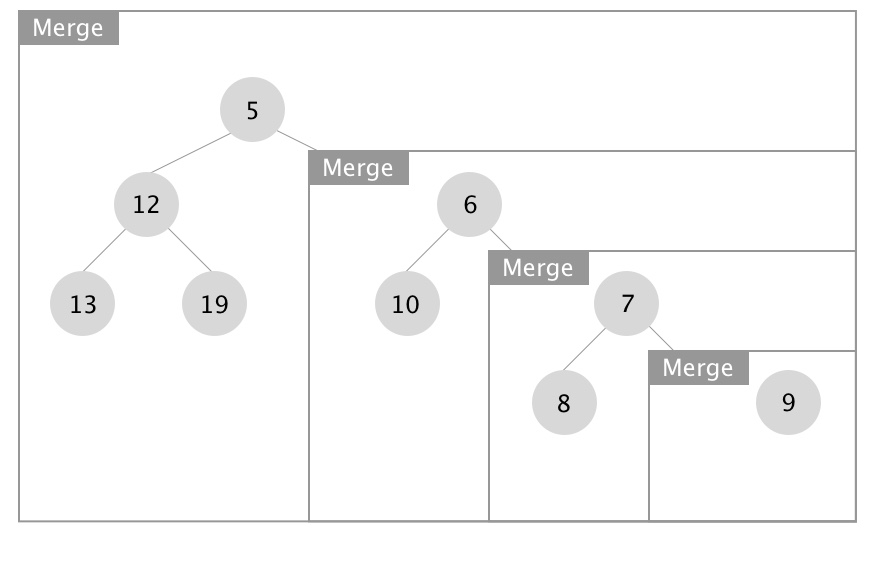

**D**

---

## Skew Heap

 $T_{amortized} = O(log N)$
 

 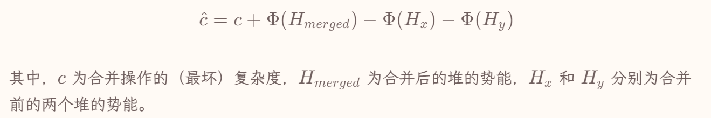

迭代式合并Skew heap 也适用，参考 [Skew heap - Wikipedia](https://en.wikipedia.org/wiki/Skew_heap#Non-recursive_merging) 。

---

### 判断题

> [!QUESTION]
>
> The result of inserting keys 1 to $2^k−1$ for any k > 4 in order into an initially empty skew heap is always a full binary tree.

> 解释来自 [Lecture 4 | Leftist Heap & Skew Heap - Isshiki修's Notebook ](https://note.isshikih.top/cour_note/D2CX_AdvancedDataStructure/Lec04/#%E5%90%88%E7%90%86%E6%80%A7%E5%88%86%E6%9E%90)

首先，从插入的元素的数量来看，是满足满二叉树的必要条件的。

而根据我们上面描述的，跳过肯定成立的初始情况，我们可以做一个简单的归纳，过程并不完整与严谨，但是大概就是这么个意思。

对于一个满二叉树，我们现在要插入一个数，显然这个数比树里任何一个都要大。而当这个数被插入后，它成为整个堆，或者说整个树最左侧的一条。而在接下来的交换过程中，它会不断被甩来甩去，最终经过 2^k 次后被甩到最右边，也就是迎接它的第一个孩子。显然，对于该层的所有节点来说都需要 2^k 次才会进入到最右侧路径。

（这个过程可以类比二进制数的自增，你可以根据这个节点的每个前驱分别是左孩子还是右孩子来分配对应的位子是 `0` 还是 `1`。）

**T**

---

> [!QUESTION]
>
> For a skewed heap with n nodes, the number of nodes on its right path must be O(logn).

注意不是 leftist heap 。

**F**

---

## Binomial Queue

> [!HELP]
>
> [Fibonacci Heaps or "How to invent an extremely clever data structure" - YouTube](https://www.youtube.com/watch?v=6JxvKfSV9Ns) 是一个很好的讲解 Fibonacci Queue 的视频，其中也提到了binomial queue。

二项堆理解起来很简单，维护一个森林，具有如下性质：

1. 森林中的树具有堆性质，且不存在两颗相同的树（如果存在，则合并）；
2. 每颗树的节点数为 $2^k$ ，称为 k 阶二项树 $B_{k}$；
3. $B_{k}$ 的根的子节点数为 k，且依次为 $B_{k-1}, B_{k-2} \dots B_{0}$；
4. $B_{K}$ 每一层节点数量为二项式展开系数。

二项堆是一个具有不重复但同构的若干棵树的森林，不妨将其视为二进制数进行合并；对于其他操作：Insert（单节点森林与原森林合并）、DeleteMin（由于性质 3，删除根节点后，其他子树仍然是二项树，合并以维护二项堆性质）。

对于合并，理论比较简单，实现起来还是有些绕的，见[Lecture 5 | Binomial Queue](https://note.isshikih.top/cour_note/D2CX_AdvancedDataStructure/Lec05/#%E9%98%9F%E5%88%97%E5%90%88%E5%B9%B6)

---

## Inverted File Index

> [!NOTE] 分布式策略
>
> 而这里有两种分布式的策略，其一是根据单词的字典序进行分布式，其二是根据文档进行分布式。
> 
> 显然根据单词的内容进行分布式，能够提高索引效率，但是这样的话，我们就需要将所有形式接近的单词都存储在一个地方，这样就会造成单点故障，容灾能力很差，所以这种方式并不是很好。
> 
> 而第二种办法则有较强的容灾性能。即使一台机器无法工作，也不会剧烈影响到整个系统的工作。

> [!NOTE] 评估标准
>
> 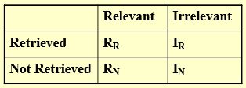
> $\begin{aligned}&1.Precision\text{(准确率)}:\quad P=R_R/(R_R+I_R)\\&\text{准确率表示在搜索到的信息中,相关的(用户想要的)信息的占比。}\\&2.Recall\text{(召回率)}:R=R_R/(R_R+R_N)\\&\text{召回率表示在相关的(用户想要的)信息中,搜索到的占比。}\end{aligned}$

---

### 判断题

> [!QUESTION]
>
> In distributed indexing, document-partitioned strategy is to store on each node all the documents that contain the terms in a certain range.

**F**

---

> [!QUESTION]
>
> When evaluating the performance of data retrieval, it is important to measure the relevancy of the answer set.

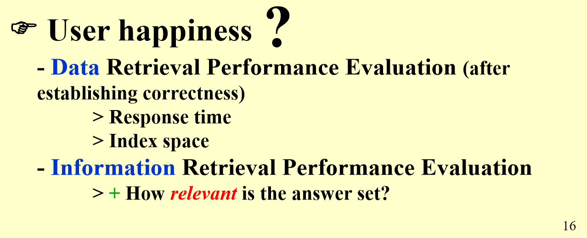

**F**

---

> [!QUESTION]
>
> Precision is more important than recall when evaluating the explosive detection in airport security.

这种结合现实的，那就是要看是“宁错杀不放过”（召回率）还是“宁缺毋滥”（准确率）。

**F**

---

> [!QUESTION]
>
> While accessing a term by hashing in an inverted file index, range searches are expensive.

**T**

---

## Backtracing

### 判断题

> [!QUESTION]
>
> Reall that in class we solved the "good path" problem using dfs + pruning. Note that this problem can also be solved by bfs + pruning. For any instance, dfs + prunning is at least as fast as bfs + pruning. (Hint: consider a case where leaves may have different depth.)

看看 leftist tree.

**F**

---

> [!QUESTION]
>
> - It is guaranteed that an exhaustive search can always find the solution in finite time. 

有些问题使用暴力搜索似乎无法解决。

**F**

---

### 选择题

> [!QUESTION]
>
> 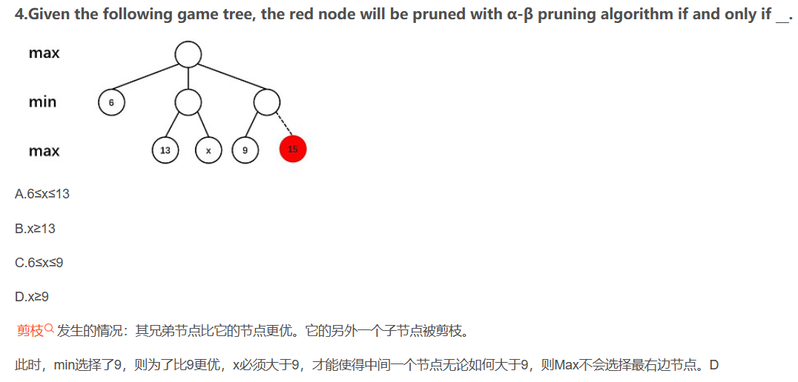

---

## Greedy Algothrim

### 判断题

> [!QUESTION]
>
> Let S be the set of activities in Activity Selection Problem. Then the earliest finish activity am​ must be included in all the maximum-size subset of mutually compatible activities of S.

贪婪解不一定是最优解，最优解不一定是贪婪解。

**F**

---

> [!QUESTION]
>
> Consider the data compression problem we discussed in the class this week. The optimal Σ-tree must be full. That is, every internal node of the tree must have two children.

应该就是指哈夫曼树，必定为满二叉树。

**T**

---

### 选择题

> [!QUESTION]
>
> (multi) 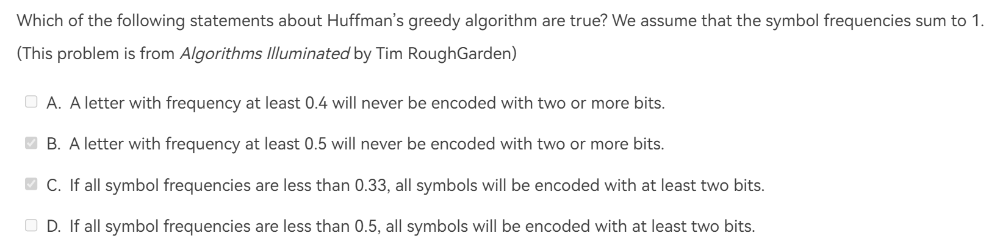

可能有的人有些误解：频率最高的那个字/词一定是用一个 bit 编码的。

但是不然。以频率最高为 0.4 为例：如果前面的合并过程中，有一个合并后的父节点频率为 `[0.4, 0.6)` ，即确保除这两个占大头外，还有一些字母可以被合并；那么 0.4 的字母都可能使用两个及以上的 bit 编码。

> [!TIP]
>
> 判断使用一位 bit 编码的条件：
>
> 1. 频率最高，记作 $f_0$；
> 2. 若频率第二高者为 $f_{1}$，则有 $1-f_{0}-f_{1} \leq f_{0}$；因为只有这样，在 $f_{0}$ 被合并之前，只有一个其他所有频率合并而成的聚合体，$f_{0}$ 自然就可以 1bit 编码了。

**BC**

---

> [!QUESTION]
>
> 

因为取 max，我们希望每个都不要太大，所以早结束的早开始干（~~怎么这么像我赶 ddl 的样子~~）；还有，这个题目又™的放在多选题里。

**A**

## Divide and Conquer

> [!QUESTION]
>
> 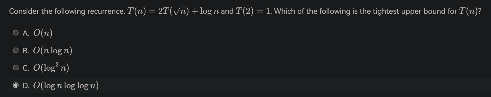

[recurrence relation - How to solve T(n)=2T(√n)+log n with the master theorem? - Computer Science Stack Exchange](https://cs.stackexchange.com/questions/96422/how-to-solve-tn-2t%E2%88%9Anlog-n-with-the-master-theorem)

**D**

---

