主要是 ADS 作业题&考试题，`(multi)` 表示 “题目表示多选” 。

判断/选择题答案在每题对应部分的最后，截图中的答案有概率错误；最后给的答案几经周转其实也不能说一定正确（我会声明或在最后给出的答案前加上 `-` 符号；例如 `-F` ），请自主甄别。

> [Jianjun Zhou's Notebook](https://zhoutimemachine.github.io/note/courses/ads-hw-review/) 中出现的题目大概率不会再出现在此处（除非我对题解有新的想法/我觉得这道题不错/我这道题错了）。

## AVL Tree

> [!TIP] AVL tree 节点数与树高的关系，下面以空树高 0 为例子：
>
> - 最大节点数 N(h) 当然是满二叉树情况下出现，为 $N(h) = 2^{h}-1$;
> - 最小节点数 n(h) 有递推式： $n(h) = n(h-1)+n(h-2)+1$; n(0)=0, n(1)=1

---

### 判断题

> [!QUESTION]
>
> Every subtree of an AVL tree is also an AVL tree.

**T**

---

> [!QUESTION]
>
> Consider an AVL tree. Immediately after we insert a node (without restoring the tree balance), the parent of the newly inserted node may become imbalanced.

假设一下 the parent of the newly inserted node （注意，不是 the grandparent of the newly inserted node）原来有 0/1 个子节点，都不可能 imbalanced 。

**F**

---

> [!QUESTION]
>
> 

4 是 trouble maker，1 是 trouble finder。

**F**

---

### 选择题

> [!QUESTION]
>
> 

**D**

---

> [!QUESTION]
>
> (multi) Suppose that immediately after we delete a node from an AVL tree (without restoring the tree balance), some node u becomes imbalanced. Let T be the subtree rooted at u. How will the height of T change after we rebalance u? (Note that the root of T changes after rebalancing.)
>
> A.increases by 1 ; 
> B.does not change ; 
> C.decreases by 1 ; 
> D.(this question does only have three choices)

理解"Let T be the subtree rooted at u" 是（让 T 是以 u 为根的子树，即 u 本身在 T 中即可）；同时注意是删除，起初惯性认为是插入，单走一个 C 。

**BC**

---

> [!QUESTION]
>
> Consider an AVL tree of height 5. Which of the followings are the possible number of nodes in this tree? We assume that the height of a single node is 1.
> 
>   A.10 B.20 C.30 D.35

见开头的 tip ，后面几题类似。

**BC**

---

> [!QUESTION]
>
> If the depth of an AVL tree is 6 (the depth of an empty tree is defined to be -1), then the minimum possible number of nodes in this tree is:
> 
> A.13 ; B.17 ; C.20 ; D.33

**D**

---

> [!QUESTION]
>
> If there are 21 nodes in an AVL tree, then the maximum depth of the tree is __. The depth of an empty tree is defined to be 0.
> 
> A.6 ; B.4 ; C.7 ; D.5

按照之前的结论反向推理：AVL 树要高 x，至少要 y 个节点。当然，要注意树深度的定义。要高 6，至少 20 个节点；要高 7，至少 33 节点。

**A**

---

> [!QUESTION]
>
> For the result of accessing the keys 3, 9, 1, 5 in order in the splay tree in the following figure, which one of the following statements is FALSE?
>
> 
> 
> A. 5 is the root ; B. 1 and 9 are siblings ; 
> 
> C. 6 and 10 are siblings ; D. 3 is the parent of 4

这个图真太难画了，不过熟练的话还是能在几分钟内画出来的（我的建议是在某一次变换中没有用到的子树用特殊形状表示节约时间），这里借 [Jianjun Zhou's Notebook](https://zhoutimemachine.github.io/note/courses/ads-hw-review/#hw1) 的图：

    

**D**

---

## Splay Tree & Amortize

> [!NOTE] 摊还分析（势能法）
>
> - 开销大的操作应当倾向让势能降，开销小的操作应当倾向让势能升；
> - 势能高倾向于让某些操作开销大，势能低倾向于让某些操作开销小；
> - Φ(final) >= Φ(initial)；更严格地说，
>
> 势能应当是针对某一数据结构的形态来定义的；每一步操作后的势能都应当不小于初始的势能，即 $\phi(D_{i})\geq \phi(D_{0})$
> 
> worst-case bound >= amortized bound >= average-case bound

---

> [!NOTE] Splay tree deletion
>
> 

---

### 判断题

> [!QUESTION]
>
> Let T be a BST. If we perform a splay operation on the node with the minimum key, then the root of the resulting tree has no left child.

在 splay tree 中，最小值被 splay （即通过旋转，直到为根节点）时，作为根节点，自然没有左节点。

**T**

---

> [!QUESTION]
>
> Suppose that the insertion operation of some data structure has a worst-case cost of Θ(n) and an amortized cost of $O(\log n)$. Starting with the empty structure, if we perform m insertion operations consecutively, the total cost may be as large as Θ($m^2$).

amortized cost 给出一个保证：对于**任意组合的一个连续 n 次操作**，若其总用时为 T(n)，那么用时上限 $amorized cost = \frac{T(n)}{n}$ 。

**F**

***

> [!QUESTION]
>
> The height of a splay tree with n nodes can be as large as Θ(n).

例如连续插入 123456789 到一个空树中。

**T**

---

> [!QUESTION]
>
> Suppose we have a potential function Φ such that for all Φ(Di​)≥Φ(D0​) for all i, but $Φ(D0)\neq0$. Then there exists a potential Φ′ such that Φ′(D0​)=0, Φ′(Di​)≥0 for all i≥1, and the amortized costs using Φ′ are the same as the amortized costs using Φ.

**T**

---

> [!QUESTION]
>
> amortized bounds are weaker than the corresponding worst-case bounds, because there is no guarantee for any single operation.

$worst-case \geq amortized \geq average-case$

**T**

---

### 选择题

> [!QUESTION]
>
> 

**D**

---

> [!QUESTION]
>
> 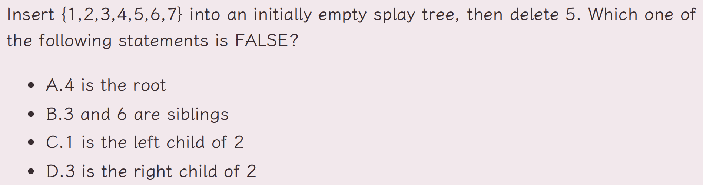

连续插入递增/减数列，splay tree 会成一条链表。

**D**

---

> [!QUESTION]
>
> 

前面也提到了，splay tree 最坏的高度可以是 h = n，而 findkey(4) 在第二次之后一定是 O(1) 时间，故总共 O(n+m)

**B**

---

> [!QUESTION]
>
> (multi) Consider the dynamic array given in class. Which of the following potential functions will yield an amortized cost of O(1) for insertion? Select all the potential functions that work. To be rigorous, you may multiply all the following functions by a constant that is large enough. (Hint: recall that a good potential function must satisfy two certain conditions.)
> 
> 

动态数组是说：起初数组大小为 1；当数组被填满后，将数组中的所有内容拷贝到另一个、大小为双倍的数组中。

回顾势能函数的要求（上面有），开销大的操作自然是发生在了填充最后一个数、数组转移的时候。

故选择 **E** （题目说的多选😇）

---

> [!QUESTION]
>
> 

同样画出图来就好，刚好是一颗完美二叉搜索树，可以用 [Splay Tree Visualzation (usfca.edu)](https://www.cs.usfca.edu/~galles/visualization/SplayTree.html) 模拟。

**C**

---

> [!QUESTION]
>
> When doing amortized analysis, which one of the following statements is FALSE?
>
>A. Aggregate analysis shows that for all n, a sequence of n operations takes worst-case time T(n) in total. Then the amortized cost per operation is therefore T(n)/n
>
> B. For potential method, a good potential function should always assume its maximum at the start of the sequence
>
> C. For accounting method, when an operation's amortized cost exceeds its actual cost, we save the difference as credit to pay for later operations whose amortized cost is less than their actual cost
>
> D. The difference between aggregate analysis and accounting method is that the later one assumes that the amortized costs of the operations may differ from each other

势能函数 $\Phi(x) \geq \Phi(initial)$ ，即在开始时应当是最小的；其它是对的，平时关注较少，稍加注意。

> 对于三种摊还分析方法的辨析，我比较认同[时清川的个人主页](https://sh17c.top/LessonsNotes/D2CX_AdvancedDataStructure/Chap01/#14) 的看法。

**B**

---

> [!QUESTION]
>
> 

因为从 A 中 pop 和 push B 操作了两遍，所以 $\Phi = 2|S_{A}|$ （没有答案验证，但是知道 A 是错误的，大致可以判断答案是 B）。

**B**

---

> [!QUESTION]
>
>  

---

## Rad Black Tree

> [!NOTE] Properties of RBTree
>
> 1. Every node is either red or black.
> 2. The root is black.
> 3. Every leaf (`NIL`) is black.
> 4. if a node is red, then both its children are black.
> 5. For each node, all simple paths from the node to descendant leaves contain the same number of black nodes.

> [!TIP]
>
> - **红黑树不存在只有一个非叶子节点的红色节点。**
> - **一个度为 1 的节点，它本身一定是黑色的，且它唯一的孩子一定是红色的。**
> - **一个有 N 个内部节点（不包括NIL）的红黑树，其最大高度为 $2\log_{2}(N+1)$。**
> - **`NIL` 节点被一个红色节点置换并不会改变一颗红黑树的黑高。**
> - **红色节点不能相邻（因为红色节点子节点只能是黑色）**

关于红黑树，可以看看

-  [【数据结构】史上最好理解的红黑树讲解，让你彻底搞懂红黑树](https://blog.csdn.net/cy973071263/article/details/122543826)；
    - 将红黑树等价为 4 阶 B 树
- 对于红黑树的删除，如果还没理解的可以再看 [Deletion in RB Tree](https://www.bilibili.com/video/BV16m421u7Tb/?spm_id_from=333.337.search-card.all.click&vd_source=fbab6fd162a49f932342b74e9297a94a)
    - 引入 “双黑节点”的概念，总结如下：

先视为正常的二叉树删除：如果被删除的点有两个子节点，则找到直接（前驱/后驱），替换后，再删除直接（前驱/后驱）。之后的删除分为以下分支情况：

红色虚线框中，s 表示被删除的黑色节点的兄弟（sibling），p 表示共有的父节点（parent），r 表示 s 的红色节点，图示如下：

    

---

### 判断题

> [!QUESTION]
>
> The number of nodes, including the external nodes (NIL), in a red black tree must be odd.

算上 NIL ，红黑树一定是满二叉树（Full Binary Tree），节点数一定为奇数。

**T**

---

> [!QUESTION]
>
> Consider a node u of a Red-black tree in extended version. Let $h_{L}$ ​ and $h_{R}$ ​ be the height of the left and right subtrees of u, respectively. (We assume that the height of a single node is 1.) We have $\frac{1}{2}\leq\frac{h_{L}}{h_{R}}\leq2.$

这是红黑树性质的目的，保持“树”形态。

**T**

---

> [!QUESTION]
>
> Is it true that the DELETE operation in a RED-BLACK tree of n nodes requires Ω(logn) rotations in the worst case?

**F**

---

> [!QUESTION]
>
> 

应该只有 13 颜色发生了变化。

**F**

---

> [!QUESTION]
>
> 

Red node can only have two or no internal black note(s).

**F**

---

### 选择题

> [!QUESTION]
>
> (multi) Let u be an internal node in a red black tree. Suppose that one child of u is an internal node v, and the other is an external node (NIL). Which of the following statements are correct?
> 
> A.u must be red. B.u must be black.
> 
> C.v must be red. D.Both children of v are NIL

红黑树的性质

**BCD**

---

> [!QUESTION]
>
> In the red-black tree that results after successively inserting the keys 41; 38; 31; 12; 19; 8 into an initially empty red-black tree, which one of the following statements is FALSE?
>
> A. 38 is the root
>
> B. 19 and 41 are siblings, and they are both red
>
> C. 12 and 31 are siblings, and they are both black
>
> D. 8 is red

建议还是手绘一遍，如果结果不对看 [RB 树模拟](https://www.cs.usfca.edu/~galles/visualization/RedBlack.html) 找原因；依旧是借用 [Jianjun Zhou's Notebook](https://zhoutimemachine.github.io/note/courses/ads-hw-review/#hw2) 的图：

    

**B**

---

> [!QUESTION]
>
> Two red-black trees are said to be different if they have different tree structures or different node colors. How many different red-black trees are there with 3 internal nodes?
> 
> A. 1; B. 2; C.3; D. more than 3;

**2**

---
## Bplus Tree

> [!NOTE] property of B+ Tree
>
> - The root is either a leaf or has between 2 and M children.
> - All nonleaf nodes (except the root) have between ⌈M/2⌉ and M children.
> - All leaves are at the same depth.
> - 在空间最浪费的情况下是一棵 ⌈M/2⌉ 叉树，所以 B+ 树的深度是 $O(⌈log_{⌈M/2⌉}​N⌉)$.

由上图我们可以看出来，内部节点的值是 “右侧的指针能够访问到的最小值”。

---

### 判断题

> [!QUESTION]
>
> Consider an insertion in a B+ tree. We may need to update some keys stored in some internal nodes even if no leaf is split during the insertion.

想要更新 internal nodes 的值 <- 叶节点的第一个值改变 <- 新插入值插入叶节点第一个值（不可能，如果插入值小于某个叶节点第一个值，就会插入到前一个叶节点中）或者叶节点分裂（不合题意），故不可能。

**F**

---

> [!QUESTION]
>
> A B+ tree of order 3 is also called a 2-3 tree. Consider a 2-3 tree with 3 internal nodes. Its leaves can have a maximum number of 18 keys in total.

**T**

---
### 选择题

> [!QUESTION]
>
> For a B+ tree with order M and N keys, the time complexity of find operations is $O(\log_MN)$

节点内部还得搜一遍呢。

**F**

---

> [!QUESTION]
>
> Consider a B+ tree of order M. What is the maximum number of elements that are stored in an internal node?
> 
> A.M ; B.M−1 ; C.M+1 ; D.M/2

注意是一个内部节点。

**B**

---

> [!QUESTION]
>
> (multi) Consider a deletion in a B+ tree. Suppose that no underflow occurs after the deletion. How many elements in the internal nodes may be updated? Select all possible answers.
> 
> A.0 ; B.1 ; C.2 ; D.>2

借 PPT 上的图一用：

不难发现，对于叶节点上的每个值，在内部节点中至多出现一次；在不发生 underflow 的条件下，如果删除的是上面黑色的值，内部节点不会更新；如果删除红色的值，则对应值所在节点更新，至多更新一次。

**AB**

---

> [!QUESTION]
>
> Insert 3, 1, 4, 5, 9, 2, 6, 8, 7, 0 into an initially empty 2-3 tree (with splitting). Which one of the following statements is FALSE?
>
> A. 7 and 8 are in the same node
>
> B. the parent of the node containing 5 has 3 children
>
> C. the first key stored in the root is 6
>
> D. there are 5 leaf nodes

学会手绘；我们学习的 B+ tree 和网上似乎有所不同，不建议使用网上的模拟。

    

**A**

---

> [!QUESTION]
>
> Which of the following statements concerning a B+ tree of order M is TRUE?
>
> A. the root always has between 2 and M children
>
> B. not all leaves are at the same depth
>
> C. leaves and nonleaf nodes have some key values in common
>
> D. all nonleaf nodes have between ⌈M/2⌉ and M children

A，考虑仅有根。B，所有叶必然同深。D，考虑根这个 nonleaf node。

**C**

---

> [!QUESTION]
>
> When insert three keys into a non-empty 2-3 tree, and if the tree gains height when the first key is in, then it is possible that the 2-3 tree will gain more height after the insertions of the next two keys.

**F**

---

## Leftist Heap

### 判断题

> [!QUESTION]
>
> In the leftist heap, the null path length of the right path will be less than or equal to the null path length of any other path originating from the root.

right path 是最短的。

**T**

---

> [!QUESTION]
>
> A binary heap must be a leftist heap.

**T**

---
### 选择题

> [!QUESTION]
>
> 

左式堆的合并，如果是选择判断，可能 [迭代式](https://note.isshikih.top/cour_note/D2CX_AdvancedDataStructure/Lec04/#%E8%BF%AD%E4%BB%A3%E5%BC%8F) 的演示图更方便理解，例如[Leftist tree - Wikipedia](https://en.wikipedia.org/wiki/Leftist_tree#Example)：

    

**D**

---

> [!QUESTION]
>
> 

题目来自 [Jianjun Zhou's Notebook](https://zhoutimemachine.github.io/note/courses/ads-hw-review/#hw4:~:text=%EF%BC%8C%E5%A6%82%E4%B8%8B%E5%9B%BE-,Q2%2D2,-.%20We%20can) ，在 [losningsforslag-ukeoppgave8.pdf (uio.no)](https://www.uio.no/studier/emner/matnat/ifi/INF4130/h17/losningsforslag/losningsforslag-ukeoppgave8.pdf) 的 Exercise 2 找到了过程，the worst case time complexity is O(N).

**D**

---

## Skew Heap

 $T_{amortized} = O(log N)$
 

 

根据heavy node的定义，我们有以下三个性质：

> [!NOTE]
>
> 1. 如果一个节点是 heavy node，并且在其右子树发生了合并（包括翻转），那么它**一定**变为一个 light node；
> 2. 如果一个节点是 light node，并且在其右子树发生了合并（包括翻转），那么它**可能**变为一个 heavy node；
> 3. 合并过程中，如果一个节点的 heavy/light 发生变化，那么它**原先**一定在堆的最右侧路径上；

迭代式合并Skew heap 也适用，参考 [Skew heap - Wikipedia](https://en.wikipedia.org/wiki/Skew_heap#Non-recursive_merging) 。

---

### 判断题

> [!QUESTION]
>
> The result of inserting keys 1 to $2^k−1$ for any k > 4 in order into an initially empty skew heap is always a full binary tree.

> 解释来自 [Lecture 4 | Leftist Heap & Skew Heap - Isshiki修's Notebook ](https://note.isshikih.top/cour_note/D2CX_AdvancedDataStructure/Lec04/#%E5%90%88%E7%90%86%E6%80%A7%E5%88%86%E6%9E%90)

首先，从插入的元素的数量来看，是满足满二叉树的必要条件的。

而根据我们上面描述的，跳过肯定成立的初始情况，我们可以做一个简单的归纳，过程并不完整与严谨，但是大概就是这么个意思。

对于一个满二叉树，我们现在要插入一个数，显然这个数比树里任何一个都要大。而当这个数被插入后，它成为整个堆，或者说整个树最左侧的一条。而在接下来的交换过程中，它会不断被甩来甩去，最终经过 2^k 次后被甩到最右边，也就是迎接它的第一个孩子。显然，对于该层的所有节点来说都需要 2^k 次才会进入到最右侧路径。

（这个过程可以类比二进制数的自增，你可以根据这个节点的每个前驱分别是左孩子还是右孩子来分配对应的位子是 `0` 还是 `1`。）

**T**

---

> [!QUESTION]
>
> For a skewed heap with n nodes, the number of nodes on its right path must be O(logn).

对于 skewed heap，其以 light node 为根的子树可以看作是一个 leftist heap ，满足题设；但是对于 heavy node ，则不然。

> The right path of a skew heap can be **arbitrarily** long. **T**

**F**

---

> [!QUESTION]
>
> For a skew heap with N nodes, the worst-case running time of all operations (insert/delete min/merge) is O(N).

**T**

---

### 选择题

> [!QUESTION]
>
> 

ACD 肯定对的，B 的话考虑 right path 不是 O(log N) 的情况。

**B**

---

> [!QUESTION]
>
> Merge the two skew heaps in the following figure. Which one of the following statements is FALSE?
>
> A. 15 is the right child of 8 ; B. 14 is the right child of 6
> 
> C. 1 is the root ; D. 9 is the right child of 3
>
> 

skew heap 练习手绘过程，结果如下：

    

**A**

---

> [!QUESTION]
>
> 

> 参见上面的 note。

**D**

---

> [!QUESTION]
>
> If a leftist heap can be implemented recursively, so can its counterpart skew heap.

**F**

---

## Binomial Queue

二项堆理解起来很简单，维护一个森林，具有如下性质：

1. 森林中的树具有堆性质，且不存在两颗相同的树（如果存在，则合并）；
2. 每颗树的节点数为 $2^k$ ，称为 k 阶二项树 $B_{k}$；
3. $B_{k}$ 的根的子节点数为 k，且依次为 $B_{k-1}, B_{k-2} \dots B_{0}$；
4. $B_{K}$ 每一层节点数量为二项式展开系数。

二项堆是一个具有不重复但同构的若干棵树的森林，不妨将其视为二进制数进行合并；对于其他操作：Insert（单节点森林与原森林合并）、DeleteMin（由于性质 3，删除根节点后，其他子树仍然是二项树，合并以维护二项堆性质）。

对于合并，理论比较简单，实现起来还是有些绕的，见[Lecture 5 | Binomial Queue](https://note.isshikih.top/cour_note/D2CX_AdvancedDataStructure/Lec05/#%E9%98%9F%E5%88%97%E5%90%88%E5%B9%B6)

> [!HELP]
>
> [Fibonacci Heaps or "How to invent an extremely clever data structure" - YouTube](https://www.youtube.com/watch?v=6JxvKfSV9Ns) 是一个很好的讲解 Fibonacci Queue 的视频，其中也提到了 binomial queue。

---

### 判断题

> [!QUESTION]
>
> To implement a binomial queue, the subtrees of a binomial tree are linked in increasing sizes.

子树之间使用 NextSibling 链接，但是 PPT 上是这样的……

图解给插右边：

代码给插左边：

有可能就是没有顺序（不保真），但是答案就是这个命题错误。

**F**

---

### 选择题

> [!QUESTION]
>
> 

没看懂怎么建堆然后删除 4 的，做出来的人和我说“先把 4 删了再建堆不就好了”；有道理，但如果真是这样的话这题也是该似了。

**D**

---
## Inverted File Index

### 判断题

> [!QUESTION]
>
> 

**C**

---

> [!QUESTION]
>
> Stop words should be ignored when creating inverted file indices, since they appear rarely in articles, and are not useful for indexing

停用词是用的太多而没有搜索意义的词，如 "a" "the"。

**F**

---

> [!QUESTION]
>
> In distributed indexing, document-partitioned strategy is to store on each node all the documents that contain the terms in a certain range.

**F**

---

> [!QUESTION]
>
> When evaluating the performance of data retrieval, it is important to measure the relevancy of the answer set.

**F**

---

> [!QUESTION]
>
> Precision is more important than recall when evaluating the explosive detection in airport security.

这种结合现实的，那就是要看是“宁错杀不放过”（召回率）还是“宁缺毋滥”（准确率）。

**F**

---

> [!QUESTION]
>
> 

~~宁错杀，不放过~~

**F**

---

~~接下来是系列题~~ 不建议纠缠，意义不大，凭感觉吧。

> [!QUESTION]
>
> While accessing a term by hashing in an inverted file index, range searches are expensive.

**T**

---

> [!QUESTION]
>
> While accessing a term by hashing in an inverted file index, range searches are inexpensive.

**F**

---

> [!QUESTION]
>
> While accessing a term stored in a B+ tree in an inverted file index, range searchings are expensive

**F**

---

> [!QUESTION]
>
> 

英语不太好，关键在于怎么理解 "Retrieved False Spam"：
- 按照上课的同样语境应该表示 “没能召回的‘垃圾邮件’”，那么答案是 D；
- 起初我以为是“召回**认为**不是垃圾邮件”，那么应该是 45%，但是没有这个选项，那应该还是第一种理解。

**-D**

---

## Backtracing

### 判断题

> [!QUESTION]
>
> Reall that in class we solved the "good path" problem using dfs + pruning. Note that this problem can also be solved by bfs + pruning. For any instance, dfs + prunning is at least as fast as bfs + pruning. (Hint: consider a case where leaves may have different depth.)

我要是 leftist tree 你用 dfs 和 bfs 能一样吗？

**F**

---

> [!QUESTION]
>
> It is guaranteed that an exhaustive search can always find the solution in finite time. 

我们在 backtracing 的伪代码中是存在这么一种情况的：如果在 game tree 的某一层的所有节点尝试后都 check 失败，说明不存在解。

也就是说，不是所有的问题都能够 "find the solution"。

**F**

---

> [!QUESTION]
>
> In a Turnpike Reconstruction Problem, given distance set D = { 1,2,3,4,5,6 } ,(x1,…, x4) = (0, 1, 4, 6) is the only solution provided that x1 = 0.

这个点的分布中心对称一下显然也可以；当然，万一是 {0, 2, 4, 6}，那就是对的了。

**F**

---

> [!QUESTION]
>
> For the Turnpike reconstruction algorithm of N points, assuming that the distance set D is maintained as an AVL tree, the running time is $O(N^2logN)$ if no backtracking happens.

**T**

---

> [!QUESTION]
>
> What makes the time complexity analysis of a backtracking algorithm very difficult is that the sizes of solution spaces may vary.

**F**

What makes the time complexity analysis of a backtracking algorithm very difficult is that the number of solutions that do satisfy the restriction is hard to estimate.（True）

---

> [!QUESTION]
>
> The 4-queen problem has exactly 2 distinct solutions.

**T**

---

### 选择题

> [!QUESTION]
>
> 

**C**
 

---

## Divide and Conquer

### 判断题

> [!QUESTION]
>
> The asymptotic upper bound for the recurrence T(n) = 2T(⌊n/2⌋ + 17) + n is T(n) = O(n log n).

别管什么向下和内部常数了，n 很大的时候可以忽视。

**T**

---

### 选择题

> [!QUESTION]
>
> 

**D**

---

> [!QUESTION]
>
> 

**A**

---

> [!QUESTION]
>
> 

不难得到最后 AB best, C => $O(N^{\log_{2}3})$ ; D => $O(N\log^2N)$ ；如何比较 CD？取商极限。

**C**

---

> [!QUESTION]
>
> 

>  [recurrence relation - How to solve T(n)=2T(√n)+log n with the master theorem?](https://cs.stackexchange.com/questions/96422/how-to-solve-tn-2t%E2%88%9Anlog-n-with-the-master-theorem)

**D**

---

> [!QUESTION]
>
> 

针对 C 项，注意到：$\frac{af\left( \frac{n}{b} \right)}{f(n)}=2* \frac{\frac{n}{2} / lg\left( \frac{n}{2} \right)}{n / lg(n)} = \frac{lg(n)}{lg(n)-lg(2)} \rightarrow 1$ ；由于是趋近，不符合形式二的第三个情况；趋近项目为 1，不存在 k/K 符合前两个情况。故不存在。

**C**

---

> [!QUESTION]
>
> 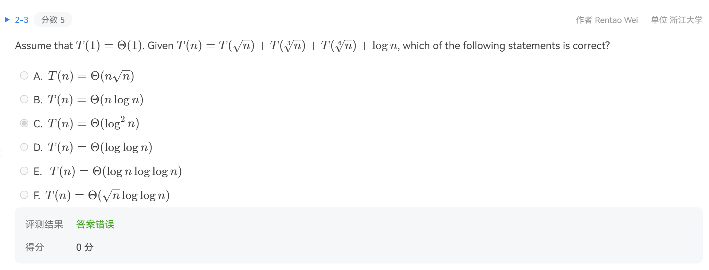

先看下面的这个推导：

同理我们可以得到：

$T(n)=T(n^{1/k})+\log m = \log n \sum_{i=0}^{\log \log n}\frac{1}{k^i}$

那么题目中的内容就可以：

$$
\begin{align}
T(n)&=T(n^{1/2})+T(n^{1/3})+T(n^{1/6})+\log n \\&= \log n \sum_{i=0}^{\log \log n}\left(\frac{1}{2^i}+\frac{1}{3^i}+\frac{1}{6^i} \right) = \log n\log \log n 
\end{align}
$$

**E**

---

> [!QUESTION]
>
> 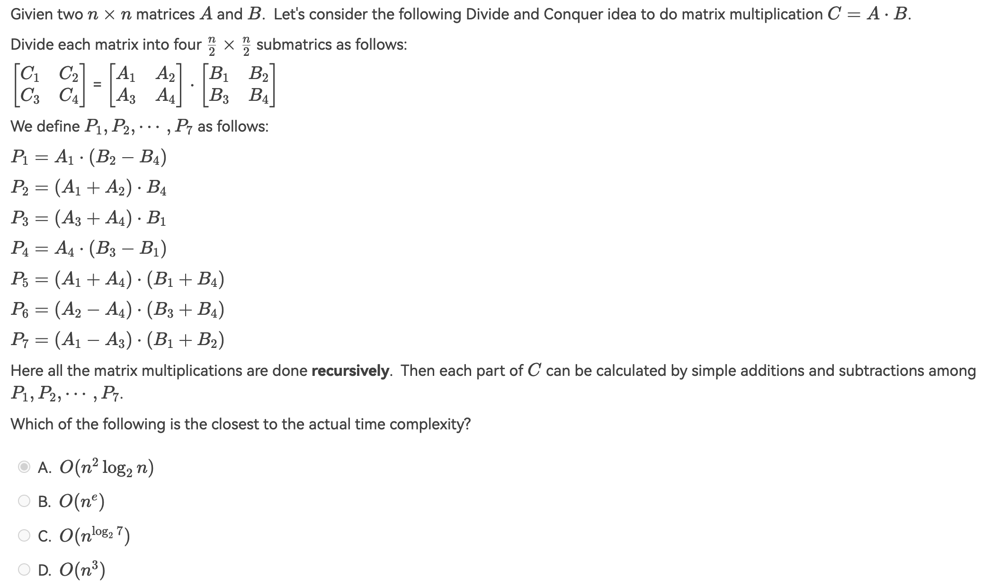

**C**

---

> [!QUESTION]
>
> How many of the following sorting methods use(s) Divide and Conquer algorithm?
> 
> - Heap Sort
> - Insertion Sort
> - Merge Sort
> - Quick Sort
> - Selection Sort
> - Shell Sort

分治算法的排序方法有 **2** 个：**Merge Sort** 和 **Quick Sort**

**2**

---

## Dynamic Programming

### 判断题

> [!QUESTION]
>
> In dynamic programming algorithms, some results of subproblems have to be stored even they do not compose the optimal solution of a larger problem.

**T**

---

> [!QUESTION]
>
> 

k 表示只考虑前 k 个节点得到的最短路。

**F**

---

### 选择题

> [!QUESTION]
>
> 

题目选项不难（D 处应该为 $R_{N-i}$），但是其他选项值得看一下。

**D**

---

> [!QUESTION]
>
> 

显然 j 从大到小推导。

**B**

---

> [!QUESTION]
>
> 
> 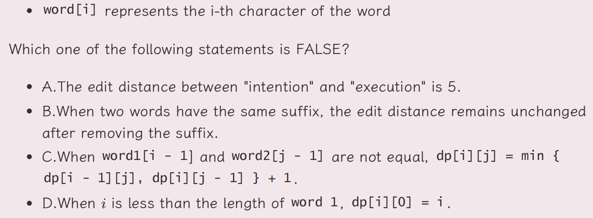

只能说 ABD 肯定对的，C 不会。

**C**

---

## Greedy Algothrim

### 判断题

> [!QUESTION]
>
> Let S be the set of activities in Activity Selection Problem. Then the earliest finish activity am​ must be included in all the maximum-size subset of mutually compatible activities of S.

贪婪解不一定是最优解，最优解不一定是贪婪解。

**F**

---

> [!QUESTION]
>
> Consider the data compression problem we discussed in the class this week. The optimal Σ-tree must be full. That is, every internal node of the tree must have two children.

应该就是指哈夫曼树，必定为满二叉树。

**T**

---

> [!QUESTION]
>
> Greedy algorithm works only if the local optimum is equal to the global optimum.

**T**

---

### 选择题

> [!QUESTION]
>
> 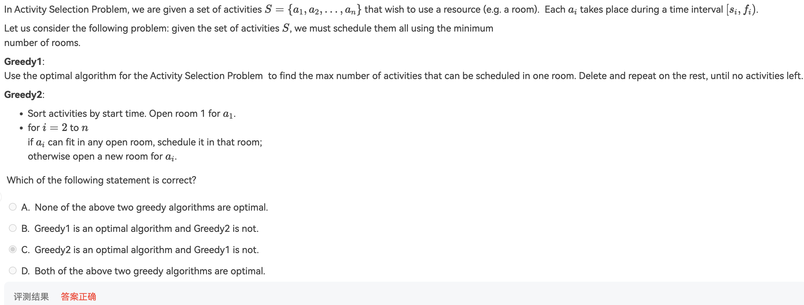

---

> [!QUESTION]
>
> (multi) 

可能有的人有些误解：频率最高的那个字/词一定是用一个 bit 编码的。

但是不然。以频率最高为 0.4 为例：如果前面的合并过程中，有一个合并后的父节点频率为 `[0.4, 0.6)` ，即确保除这两个占大头外，还有一些字母可以被合并；那么 0.4 的字母都可能使用两个及以上的 bit 编码。

> [!TIP]
>
> 判断使用一位 bit 编码的条件：
>
> 1. 频率最高，记作 $f_0$；
> 2. 若频率第二高者为 $f_{1}$，则有 $1-f_{0}-f_{1} \leq f_{0}$；因为只有这样，在 $f_{0}$ 被合并之前，只有一个其他所有频率合并而成的聚合体，$f_{0}$ 自然就可以 1bit 编码了。

**BC**

---

> [!QUESTION]
>
> 

因为取 max，我们希望每个都不要太大，所以早结束的早开始干（~~怎么这么像我赶 ddl 的样子~~）；还有，这个题目又™的放在多选题里。

**A**

---

> [!QUESTION]
>
> 

$\# characters = \frac{\#node+1}{2}$

**C**

---

## NP 
### 判断题

> [!QUESTION]
>
> If a problem can be solved by dynamic programming, it must be solved in polynomial time.

> [Why is the dynamic programming algorithm of the knapsack problem not polynomial?](https://cs.stackexchange.com/questions/52763/why-is-the-dynamic-programming-algorithm-of-the-knapsack-problem-not-polynomial) 

- 动态规划算法的时间复杂度可以是多项式时间，也可以是伪多项式时间。伪多项式时间是指算法的时间复杂度是多项式的，但其复杂度依赖于输入的数值大小，而不是输入的规模。

**F**

---

> [!QUESTION]
>
> 

**T**

---

> [!QUESTION]
>
> If a Probelm X is in P, then the problem $\bar{X}$ is also in P.

**T**

---

> [!QUESTION]
>
> Suppose that $X≤_{p}​Y$. If X is not in P, then Y is not in P.

也许其逆否命题更加好判断。

**T**

---

> [!QUESTION]
>
> 

myc 老师为了让大家记住也是煞费苦心了。

---

> [!QUESTION]
>
> Let X be a problem in NP. We know that both yes-instances (instances for which the answer is yes) and no-instances of X must have certificates.

> [Certificate (complexity)](https://en.wikipedia.org/wiki/Certificate_(complexity))

no-instances 不一定需要 certificates。

**F**

---

### 选择题

> [!QUESTION]
>
> 

A. 需要 iff
C. [co-NP](https://en.wikipedia.org/wiki/Co-NP)

**A**

---

## Approximate

### 判断题

> [!QUESTION]
>
> There are inputs that force any on-line bin-packing algorithm to use at least 5/3 the optimal number of bins.

**T**

---

> [!QUESTION]
>
> Unless P = NP, there is no $\rho$ -approximation for center-selection problem for any $\rho$ < 2.

PPT 上原话。

**T**

---

> [!QUESTION]
>
> Suppose ALG is an α-approximation algorithm for an optimization problem ∏ whose approximation ratio is tight. Then for every ε>0 there is no (α−ε)-approximation algorithm for ∏ unless P = NP. 

不应该随意扩大上面的断言；对于某一算法最优近似可能是有下界的，但是不能够保证所有算法对某一问题的近似下界都是同样的或者更高的。

**F**

---

> [!QUESTION]
>
> For any instance, a 2-approximation algorithm must give a solution better than a 3-approximation algorithm.

 **F**

---

> [!QUESTION]
>
> As we know there is a 2-approximation algorithm for the Vertex Cover problem. Then we must be able to obtain a 2-approximation algorithm for the Clique problem, since the Clique problem can be polynomially reduced to the Vertex Cover problem.

解释见 [Q1-2](https://zhoutimemachine.github.io/note/courses/ads-hw-review/#hw11)

**F**

---

> [!QUESTION]
>
> 

---

> [!QUESTION]
>
> To solve the vertex cover problem, there is a greedy algorithm that collects the vertex with the highest degree (i.e., the one covering the largest number of edges) and remove it from the graph at each stage. This greedy algorithm achieves an approximation ratio of 2.

偷了一个过程来：

结论是（不保真）：没有有限的近似比；即没有对应的贪婪近似算法。

**F**

---

> [!QUESTION]
>
> In the bin packing problem, we are asked to pack a list of items L to the minimum number of bins of capacity 1. For the instance L, let FF(L) denote the number of bins used by the algorithm **First Fit**. The instance L′ is derived from L by deleting one item from L. Then FF(L′) is at most of FF(L).

**F**

---

### 选择题

> [!QUESTION]
>
> 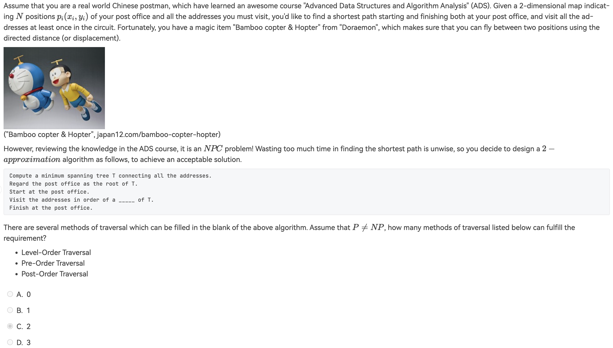

长得像 $\land$ 的最小生成树 => pre-order, post-order 。

**C**

---

> [!QUESTION]
>
> 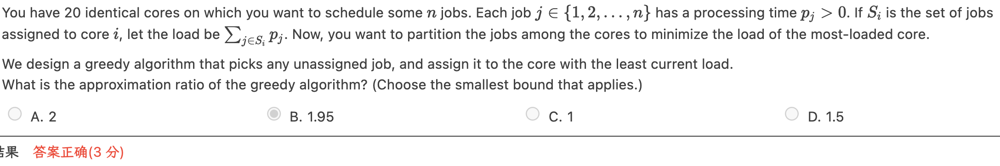

> 来自某大佬的推导：

---

> [!QUESTION]
>
> 

（看见这题，看见 yds，就知道该跳了）

**-B**

---
> [!QUESTION]
>
> 

**C**

---
> [!QUESTION]
>
> 

D 和 B,C 都矛盾了，不选你选谁？

**D**

---

> [!QUESTION]
>
> 

D. 有向无环图就是一颗树，一定能够在多项式时间找到最长路径；BC 是 ppt 结论。

**D**

---

## Local Search

### 判断题

> [!QUESTION]
>
> 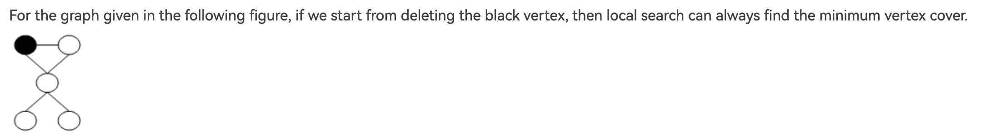

最少显然是 2 个点，且一定有中心的那个点；只要它不是第一个被删除的点，那么它一定不会被删除，一定会找到最优解。

**T**

---

> [!QUESTION]
>
> 

证明是不会的，但是上面的[右边](https://zhoutimemachine.github.io/note/courses/ads-hw-review/#hw12) 给出了很好的反例，说明了题目中使用的 local search 在 k-center problem 中的可控性较差。

---

> [!QUESTION]
>
> Starting from the following configuration of a Hopfield Neural Network, the state-filpping algorithm will terminiate at a stable configuration after at most 32 iterations.
> 

**T**

---

> [!QUESTION]
>
> In local search, if the optimization function has a constant value in a neighborhood, there will be a problem.

**T**

---

## Randomized Algorithms

### 判断题

> [!QUESTION]
>
> 

如果 a 本身已经排序完成才正确。

**F**

---

### 选择题

> [!QUESTION]
>
> The Online Hiring Algorithm ( hire only once )（题目给了伪代码，这里节省空间）. Assume that the quality input C[] is uniformly random. When N=271 and k=90, the probability of hiring the Nth candidate is __.

在伪代码中，我们将 Best 初始值赋值为 N；所以只需要所有比 N 厉害的人都在前 K 个或者前 N-1 个人中最厉害的都在前 K 个且 N 自己就是最厉害的：

$Pr[S_{N-1}]=\frac{K}{N} + \frac{K}{N-1}* \frac{1}{N}=\frac{1}{3}$

---

> [!QUESTION]
>
> 

**F**

---

## Parallel Algorithms

### 判断题

> In order to solve  the maximum finding problem by a parallel  algorithm  with T(n)=O(1) , we need work load $W(n)=Ω(n^2)$ in return.

random sampling 可以 W(n)=O(n)；而此处又使用了 Ω。

**F**

---

> [!QUESTION]
>
> 

T(n) = O(log(n)); W(n)=O(n)

**F**

---

> [!QUESTION]
>
> Recall the discussion about the Maximum Finding Problem (that is, to find the maximum among n numbers in an array), Common CRCW memory strategy is used to assure T(n)=O(1) for the parallel algorithm. Actually, we can also apply Arbitrary CRCW memory strategy to keep O(1) time complexity. Now let us consider a new memory strategy, namely the **C**oncurrent **R**ead **O**wner **W**rite (CROW). It means that each memory has an official "owner". Only the "owner" can write to the corresponding memory. Then there is no parallel algorithm that can solve the problem with T(n)=O(1) using CROW memory strategy.

**T**

---

### 选择题

> [!QUESTION]
>
> 

对于 D 选项：

- 如果最长的任务的长度 lm 超过了所有任务的总长度/机器数得到的平均长度 la，那么 $C_{max}$ 就是这个最长的长度 lm；
- 如果最长的任务不超过，那么最终取得 $C_{max}$ 的那台机器的最后一个任务的长度 l 一定不超过 lm；如果想要 $lm > 2OPT(C_max) \geq 2*la$ ；则 l 前面的任务总长度超过 la；又一定有一台机器目前的总任务长度小于 la；那么此时仍旧能够进行 local search，不应该 terminate。

**D**

---

> [!QUESTION]
>
> 

将依次进行的 merge 进行了并行，工作量不变，而只有 O(log(n)) 层，每层 O(log(n))。

**A**

---
> [!QUESTION]
>
> 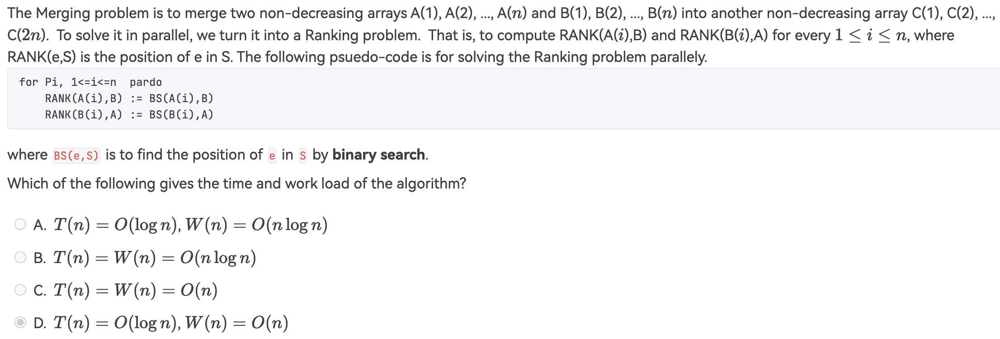

**A**

---

## External sort

### 判断题

> [!QUESTION]
>
> In external sorting, a k-way merging is usually used in order to reduce the number of passes and we will take the k as large as possible as long as we have enough amount of tapes. 

> [并行优化](https://note.isshikih.top/cour_note/D2CX_AdvancedDataStructure/Lec15/#%E5%B9%B6%E8%A1%8C%E4%BC%98%E5%8C%96)

**F**

---

> [!QUESTION]
>
> In general, for a k-way merge we need 2k input buffers and 2 output buffers for parallel operations in external sorting.

**T**

---

> [!QUESTION]
>
> In general, for a 3-way merge we need 6 input buffers and 2 output buffers for decreasing the number of passes.

目的不是减少 # passes ；而是为了并行。

**F**

---

### 选择题

> [!QUESTION]
>
> Given 100,000,000 records of 256 bytes each, and the size of the internal memory is 128MB.  If simple 2-way merges are used, how many passes do we have to do?

1. 先看起初最多能放多少个排列对象：$\frac{128*10^6}{256}=5*10^5$；
2. 再看最少能够获得多少顺串（runs）：$\frac{10^8}{5*10^5}=200$
3. 对于平均的 k way merge，我们至少需要 $1+\lceil \log_{k}\#runs \rceil$，代入数据得 9。

故答案为 9 。

---

> [!QUESTION]
>
> 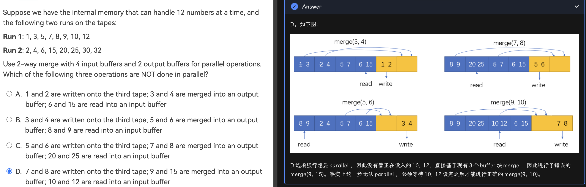

> 帮我理解了 buffer 的意思；答案来自 [Jianjun Zhou's Notebook](https://zhoutimemachine.github.io/note/courses/ads-hw-review/#hw15)

---

> [!QUESTION]
>
> 

T(N,k) = $n\log_{k}(n)*\log_{2}k = n\log(n)$

**A**

---

## Other

> 不知道放哪里的题。

### 判断题

> [!QUESTION]
>
> 

---

### 选择题

> [!QUESTION]
>
> 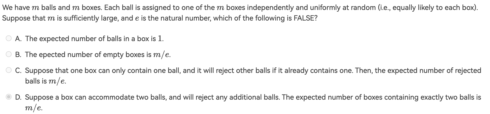

A 肯定对；B/C 等价，所以我选了 D。

**D**

