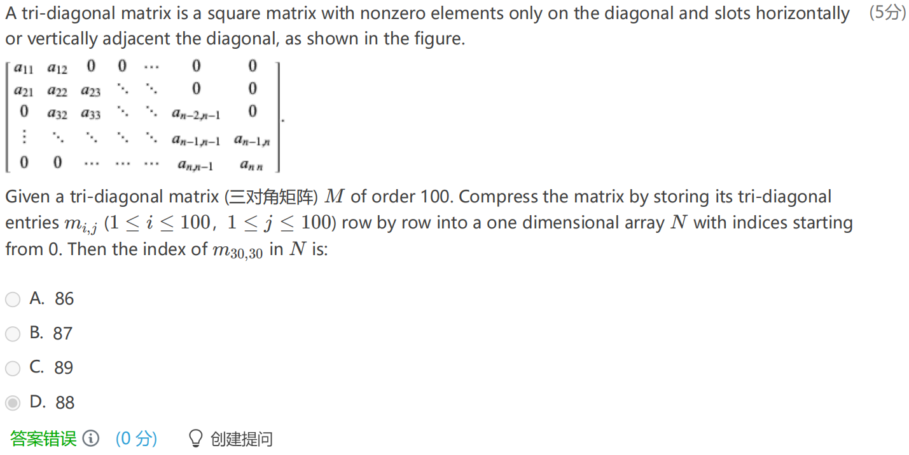
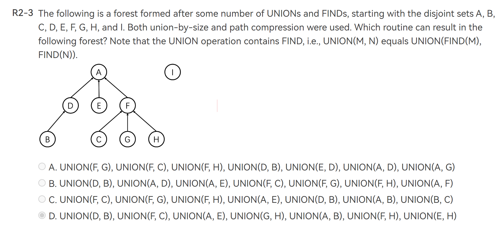
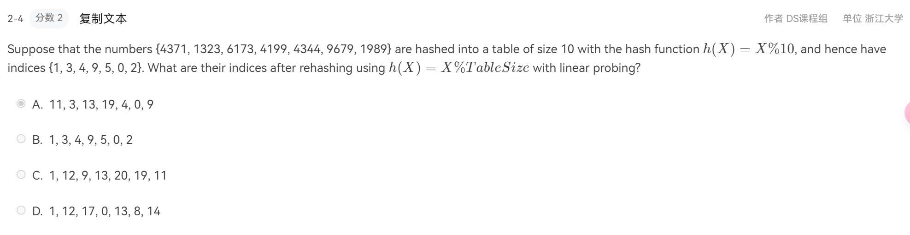

这是 FDS 的一些理论题的题库，多为 PTA 上的 HW 获得，也有一些前人的题库，在此也一并感谢。

主要是选择判断题，每题答案在最后给出；对于函数体和编程题，给出了 PTA 链接，但是不清楚是否只有我自己能访问，有待确认。

---

<!-- more -->

> [!ATTENTION]
>
> 为了作为复习性资料而具有可做性，我将所有**题干**部分放在了注释栏内，将每一道题的**答案**放在了最后面；截图中的答案仅为我提交的答案，不代表最终结果。

## I Algorithm Complexity Analysis

### I.1 判断题

> 

O 的含义是小于或等于。

**T**

> 

递归计算斐波那契数列，其时间复杂度依旧是一个斐波那契数列，为 $O(2^{N})$。

| time complexity |    space complexity     |      |
| :-------------: | :---------------------: | :--: |
|   recursively   | $O(F_{N})\sim O(2^{N})$ | O(N) |
|   lteratively   |          O(N)           | O(1) |

**F**

> (1-4) 
> 
> $n^{0.01}$ is $O(\log n)$

一开始没搞懂啥意思（听说在离散数学里面学了）在 [math.stackexchange.com](https://math.stackexchange.com/questions/2094165/is-n0-01-big-omega-or-big-o-of-logn) 上找到了解答。

两个回答，其一说明如何判断，其二指出如何计算

（也就是说当 $\alpha>0$ 时，$n^{\alpha} = \Omega(\log n)$ ）

**F**

> 

注意点：

- 别把 N\*2 看成了 N^2 问就是我一开始看错了……
- else 中当 i > N 之后后面的循环都不会进行了，不用统计
- 最低上限，取较小者。

> An algorithm may or may not require input, but each algorithm is expected to produce at least one result as the output.

**T**

> 

没说实现方式，数组还是链表？

**F**

### I.2 选择题

> 

[递归：主定理](https://note.jiepeng.tech/CS/FDS/chapter_3_complexity_analysis/time_complexity/#master-theorem)

简单来说记住下面就够了：

$$
\begin{aligned}&\mathrm{If~}T(n)=aT\left(\left\lceil\frac nb\right\rceil\right)+O(n^d)\text{ (for constants} \quad a>0,b>1,d\geq0),\mathrm{~then:}\\&T(n)=\begin{cases}O(n^d)&\mathrm{~if~}d>\log_ba\\O(n^d\log n)&\mathrm{~if~}d=\log_ba\\O(n^{\log_ba})&\mathrm{~if~}d<\log_ba&\end{cases}\end{aligned}
$$

或者我们使用更加简单的方法，手动递归，发现：

对于 P1: $T\left( \frac{N}{3^{k}}\right)=T(1)+k=T(1)$，P2 同理，就可以获得答案。

**B**

> 

矩阵压缩储存自行搜索

不难发现 $m_{30,30}$ 是第 $2+28*3+2=88$ 个数，但是数组 N 从 0 开始

**B**

---

## II [DS:List/Stack/Queue](https://www.foreverhyx.top/2024/03/06/fundamental-of-data-structure-note/#2-Data-Structure%3A-List%2FQueue%2FStack)

### II.1 判断题

> 

链表的节点数是可变的。

**T**

> For a sequentially stored linear list of length N, the time complexities for random query and inserting the first element are O(N) and O(1), respectively.

顺序/连续储存的线性表一般指数组实现的形式，查询为 O(1)，插入为 O(N)

**F**

### II.2 选择题

> 

Infix to postfix convertion，我们只是把操作符在 stack 中进行了操作。对于操作符压栈和出栈的决定，比较当前栈顶操作符 A 和当前决定的操作符 B 的优先级，如果 $A\geq B$ 则 A 出栈，继续向下比，直到 A < B 或者栈空的时候，将 B 压栈。若左括号，一定加入；并直到右括号出现才把左括号连带栈顶的操作符弹出。

**B**

> 

**C**

> 

不知道当时怎么想的……常见结构及操作复杂度如下；这里插入和删除只在最后面，所以略有不同。

**D**

> 

后面俩不用说，前面三个 `o` 看似 $A^{3}_{3} = 6$ ，但是在栈中是不一样滴。

**5** 种：123,132,231,213,321 （数字表示为入栈顺序）

**C**

> 判断一个循环队列QU（最多元素为MaxSize）为空的条件是（）。
>
> A.QU.front == QU.rear
>
> B.QU.front != QU.rear
>
> C.QU.front == (QU.rear + 1) % MaxSize
>
> D.QU.front != (QU.rear + 1) % MaxSize

由于我们一般初始化 front = rear = 0 ，所以 A 为空，C 为满。

**A**

> 

这里不一样，只说了 $front = rear$ ，所以我们通过内部元素个数来判断较好。

**B**

### II.3 函数/编程题

[Reverse Linked List](https://pintia.cn/problem-sets/1760564276676128768/exam/problems/type/6?problemSetProblemId=1760564276697100294&page=0)

[Pop Sequence](https://pintia.cn/problem-sets/1760564400743641088/exam/problems/type/7?problemSetProblemId=1760564400760418308&page=0)

---

## III [Tree](https://www.foreverhyx.top/2024/03/06/fundamental-of-data-structure-note/#3-Tree)

### III.1 判断题

> 

**T**

> It is always possible to represent a tree by a one-dimensional integer array.  

**T**

> There exists a binary tree with 2016 nodes in total, and with 16 nodes having only one child.

看下一题就懂了。

**F**

> For any nonempty binary tree, if we set $n_{i}$ as the number of nodes with i children, then we get that $n_0=n_2+1$

设 e 表示边的数量，n 表示总结点数，则有

$$
\begin{cases}
n = n_{0}+n_{1}+n_{2} \\ e = n-1 \\ e = n_{1}+ 2*n_{2}
\end{cases} \implies n_{0} = n_{2} +1
$$

**T**

### III.2 选择题

>

**in the process**，最终确实是 5 个没动，但是过程中只有 4 个。

**C**

> 

线索二叉树左右指针空了就连前驱和后驱，无论和前驱后驱之间本来是否直接连接。

**D**

> 

符号同前，有：

$$
\begin{cases}
e = n_{3}+n_{2}+n_{1}+n_{0}-1 \\ e= 3n_{3}+2n_{2}+n_{1}
\end{cases} \implies n_{0}=2n_{3}+n_{2}+1
$$

**D**

> 

这个……感觉一个一个推吧，做结论记一记也可以。

**C**

---

## IV [Binary (Search) Tree](https://www.foreverhyx.top/2024/03/06/fundamental-of-data-structure-note/#4-Binary-Search-Tree)

### IV.1 判断题

> For binary heaps with N elements, the BuildHeap function (which adjust an array of elements into a heap in linear time) does at most N - log(N+1)comparisons between elements.

应该是 2N-2 次，证明见 [StackExchange](https://cs.stackexchange.com/questions/133246/prove-that-in-binary-heap-buildheap-function-does-at-most-2n-2-comparison) 。

**F**

> There are more NULL pointers than the actual pointers in the linked representation of any binary tree.

**T** 

> The number of leaf nodes in a ternary tree (三叉树) is only related to the number of degree 2 nodes and that of degree 3 nodes, i.e it has nothing to do with the number of degree 1 nodes.

**T** 

> [!NOTE]
>
> 完全二叉树的叶子节点数为总节点数 N/2 向上取整
> In a binary search tree, the keys on the same level from left to right must be in sorted (non-decreasing) order.

**T**

> In a binary search tree which contains several integer keys including 4, 5, and 6, if 4 and 6 are on the same level, then 5 must be their parent.

根据上面的判断题可以知道 4 肯定在 5 左子树中，6 在 5 右子树中，但是不一定直接连在 5 上，也就是说不一定是 **parent** 。

**F**

> Given a binary search tree with 20 integer keys which include 10, 11, and 12, if 10 and 12 are on the same level, then 11 must be their common ancestor.

注意是common ancestor，不一定是parent

**T**

> If a complete binary tree with 137 nodes is stored in an array (root at position 1), then the nodes at positions 128 and 137 are at the same level.

换我这道题就问 127，万一有人不记得完全二叉树的数列从 1 开始用呢(bushi)

**T**

### IV.2 选择题

> 

看最后一个数定 root 。

**C**

> 

差不多就是在问：能够形成的二叉树的层数是多少？

**D**

> 

和前面那题一样。

**A**

> 

感觉就记住吧，考场上容易乱。

> Given a binary search tree with its preorder traversal sequence { 8, 2, 15, 10, 12, 21 }. If 8 is deleted from the tree, which one of the following statements is FALSE? 
>
> A.One possible preorder traversal sequence of the resulting tree may be { 2, 15, 10, 12, 21 }
>
> B.One possible preorder traversal sequence of the resulting tree may be { 10, 2, 15, 12, 21 }
>
> C.One possible preorder traversal sequence of the resulting tree may be { 15, 10, 2, 12, 21 }
>
> D.It is possible that the new root may have 2 children

删除搜索二叉树根节点，需要用中序遍历的前驱或后继替代根节点，对应AB两种情况

**C**

> 

这道题有点离谱，似乎上课没有讲过 _decision tree_ 相关知识点~~，但是也不排除我没听到~~

解释见 [数据结构英文习题解析-第五章 二叉搜索树Binary Search Tree](https://blog.csdn.net/Meraki__/article/details/135572553#:~:text=%E7%94%BB%E5%9B%BE%E5%8D%B3%E5%8F%AF-,5.,-Given-a-binary)

**A**

> In a max-heap with n (>1) elements, the array index of the minimum key may be
>
> A.1
> 
> B.⌊n/2⌋−1
> 
> C.⌊n/2⌋
>
> D.⌊n/2⌋+2

在完全二叉树中有子节点的是前 ⌊n/2⌋ 个节点，上面只有 D 选项是叶子节点，而在最大堆中最小项不可能有子节点

**D**

> 

前/后序遍历和中序遍历建立二叉搜索树的重点在于，前序/后序遍历的第一项/最后一项为根节点，然后利用根节点，分别找到左（右）子树的前/后序遍历和中序遍历，递归建树。

**B**

> 

在二叉搜索树中，最小值一定是“最靠左侧”的节点，而最大值一定是“最靠右侧”的节点，根据完全二叉树的结构，最小值一定在最左下角的那个，而最大值点可能还有一个左孩子。

**C**

---

## V [Disjointed Set](https://www.foreverhyx.top/2024/03/06/fundamental-of-data-structure-note/#5-Disjointed-Set)

### V.1 选择题

> 

**D**

> 

可以使用归纳法证明。

**A**

---

## VI [Graph](https://www.foreverhyx.top/2024/03/06/fundamental-of-data-structure-note/#6-Graph)

> 不记得哪里摘来的，待整理。

### VI.1 判断题

> 

欧拉回路是每条边只走一次，而不是每个顶点。

**F**

> Let P be the shortest path from S to T. If the weight of every edge in the graph is incremented by 2, P will still be the shortest path from S to T.

如果本来较长的路径(b)经过的边比较少，那么本来最短的路径(a) 的加权长度可能大于(b)的加权长度

**F**

> A minimum spanning tree exists iff G is connected.

**T**

> 

边数越多权重变化越大。

**F**

---

### VI.2 选择题

> 

割点是 ABDEI ，故 6 部分。

**C**

> 

最小生成树的 Prim's algorithm，将已访问点所能访问的最小的边的另一个点加入进来。

对于 Dense Graph（即边多的图）使用 Prim 比 Kruskal 更好。

**A**

> 

Back edge 没有画出来，就有很多可能了；但是在 depth-first search tree 中，两个子树之间是不可能存在 Back edge 的。

**C**

> 

按照 $\sum degree = 2 e$ 即可

**B**

> 

如何理解“In which order that the destinations must be obtained?”

其实就是问我们 Dijkstra sequence ；至于同时作为邻居，那么就从权重较小者开始了。

> [!UESLESS]
>
> 这道题复习的时候让 Chatgpt-4o 做了下，居然分毫不差，要知道我只能够截图询问；看来机器视觉确实有点牛。

**B**

> 

从 S 到 S 只有一种路径长 0 。

**A**

> 

很容易选 C，但是谁说这是一个连通图了呢？

**D**

---

> [!NOTE]
>
> 从连通图中获取最小生成树，原理是：
>
> 将边按照权重从小到大的顺序依次加入生成子图中；
>
> 如果出现成环情况，则丢弃该边；
>
> 如果达到n-1条边，说明当前生成子图就是最小生成树；
>
> 如果所有边用尽仍未有n-1条边，说明最小生成树不存在。

一步一步将权重小的边加进来即可。

**B**

---

由上一题易得。

**D**

---

手搓网络流罢，建议用铅笔改流量。

**A**

---

## VII Sort

### VII.1 判断题

> 

题目是问如果现在小区域进行了排序，可以较少快排的递归深度；这是不对的，因为大概率并没有改变和 pivot 的位置关系，而那才是影响递归深度的重点。

**F**

### VII.2 选择题

> 

就是从两个一组开始一步一步 Merge 。

**C**

> 

每次都要到中间才碰头

**C**

---

## VIII Hash

### VIII.1 选择题

> 

正常来说是 O(1)，冲突时 O(N)，所以不确定。

**D**

> 

Rehashing 是将哈希表大小变为翻倍后往大第一个质数。

**C**

---

## IX 参考文档

-  [Sakabann in CSDN](https://blog.csdn.net/Meraki__?type=blog)
- PTA_fds_hw 
- [yaoyaoling'notebook](https://yaoyaolingbro.github.io/notebook/ZJU_CS/FDS/homework/)
- [Tuenity in CSDN](https://so.csdn.net/so/search?q=%E6%95%B0%E6%8D%AE%E7%BB%93%E6%9E%84&t=blog&u=qq_43733499)

