---
tags:
  - notes
comments: true
dg-publish: true
---

## 课堂 PPT 测试题

### 第 14 章：静电场中的导体和电解质

    
    

---

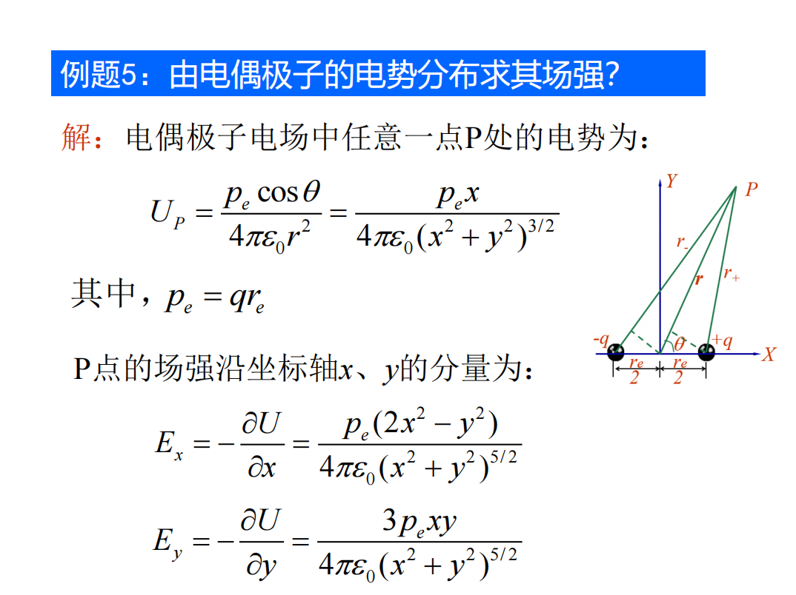

---

> [!QUESTION]
>
> 一块面积为 S 的金属大薄平板 A，带电量为 Q，在其附近平行放置另一块不带电的金属大薄平板 B，两板间距远小于板的线度。试求两板表面的电荷面密度，以及周围空间的场强分布。

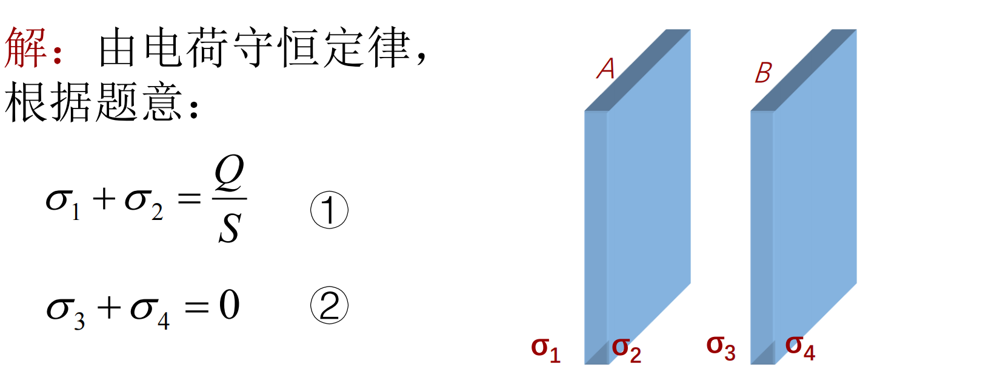

A/B 内部场强为 0，取向右为正，故有：

$$
\begin{cases}
\frac{\sigma_1}{2\varepsilon_0}-\frac{\sigma_2}{2\varepsilon_0}-\frac{\sigma_3}{2\varepsilon_0}-\frac{\sigma_4}{2\varepsilon_0}=0 \quad A内部 \\ \frac{\sigma_1}{2\varepsilon_0}+\frac{\sigma_2}{2\varepsilon_0}+\frac{\sigma_3}{2\varepsilon_0}-\frac{\sigma_4}{2\varepsilon_0}=0\quad B 内部 
\end{cases}  
$$

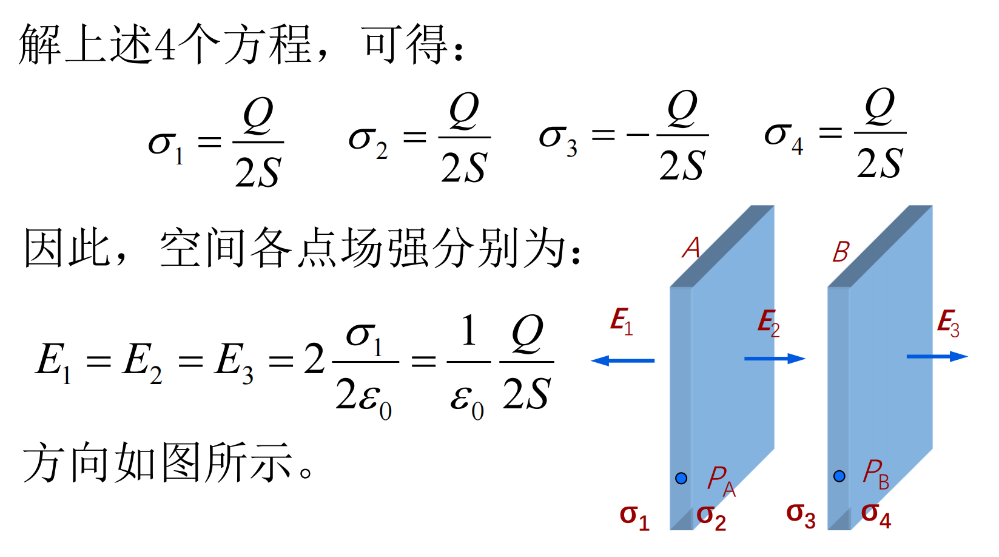

---

> [!QUESTION]
>
> 在内外半径分别为 R1 和 R2 的导体球壳内，有一个半径为 r 的导体小球，小球与球壳同心，让小球与球壳分别带上电荷量 q 和 Q。试求：
> 
> ㈠ 小球的电势 Ur，球壳内、外表面的电势；
> ㈡ 两球的电势差；
> ㈢ 若球壳接地，再次求小球与球壳的电势差。

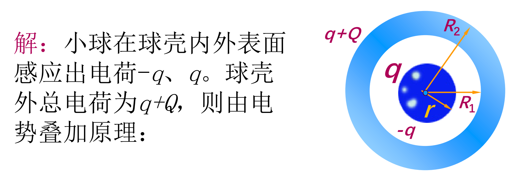

小球整体等势，所以我们求小球中心的电势即可： $U_r=\frac{1}{4\pi\varepsilon_0}(\frac{q}{r}-\frac{q}{R_1}+\frac{q+Q}{R_2})$

对于球壳表面，同样将电势叠加即可：$U_{R_1}=\frac{1}{4\pi\varepsilon_0}(\frac{q}{R_1}-\frac{q}{R_1}+\frac{q+Q}{R_2})=\frac{1}{4\pi\varepsilon_0}\frac{q+Q}{R_2} = U_{R_{2}}$

故电势差为：$U_r-U_{R_1}=\frac1{4\pi\varepsilon_0}(\frac qr-\frac q{R_1})$ 可以发现电势差与 Q 无关

（三） 若球壳接地，外表面电荷为 0，内表面 -q；内外表面电势均为 0；

---

> [!QUESTION]
>
> 

由 B 至接地，可以将其看作两个电容器并联：

$$
\begin{aligned}&U_{BA}=U_{BC}\to E_{BA}=2E_{BC}\to q_{B\text{上}}=2q_{B\text{下}}=\frac{2q}{3}\\&q_{A\text{下}}=-q_{B\text{上}}=-\frac{2q}{3},\:q_{C\text{上}}=-q_{B\text{下}}=-\frac{q}{3}\\ & C_{BA}=\varepsilon_0S/d,\:C_{BC}=\varepsilon_0S/2d,\to C=C_{BA}+C_{BC}=3\varepsilon_0S/2d\end{aligned}
$$
---

> [!QUESTION]
>
> 一个半径为 R 的电介质球被均匀极化后，已知电极化强度为 P,求：
> (1)电介质球表面上极化面电荷的分布；
> (2)极化面电荷在电介质球心处所激发的场强？
> 
> 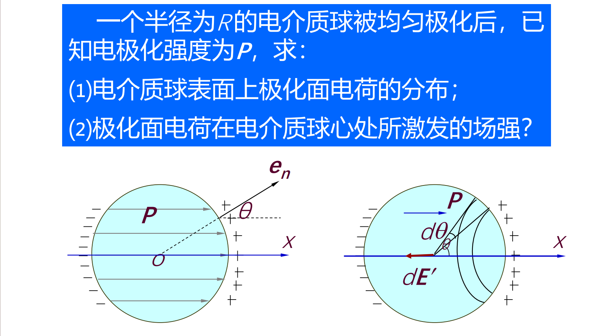

对于考试而言，把“极化”当作一个“场”，并记住[极化强度是如何影响电荷面密度](attachments/physics2-problems-9.png)的即可。

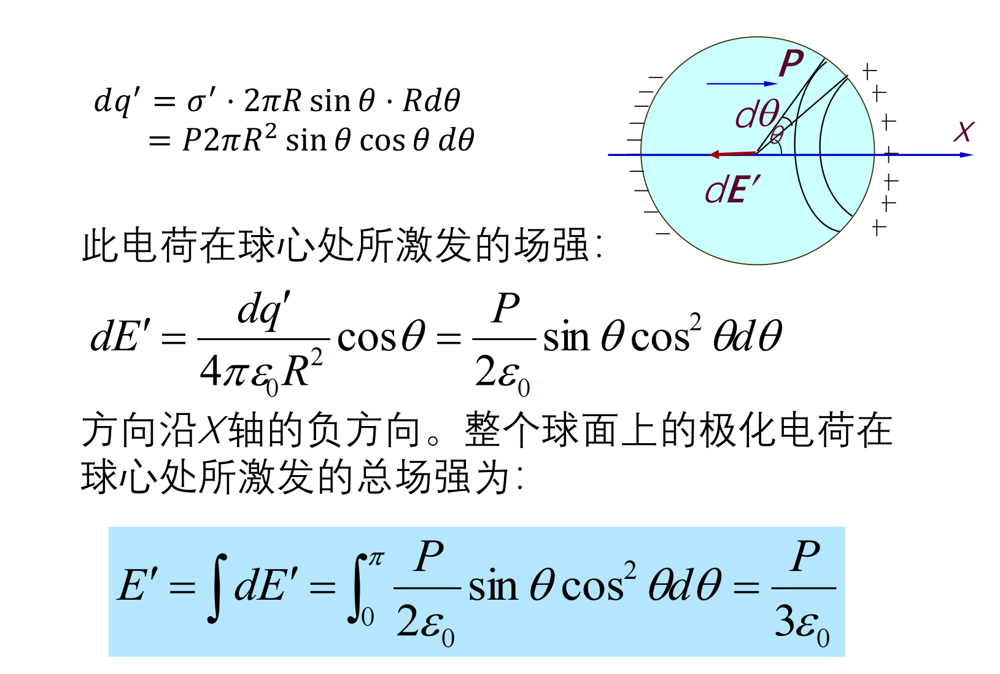

---

> [!QUESTION]
>
> 平行板电容器两极板面积 S，充有两层电介质，介电常数分别为ε1 、ε2，厚度分别为 d1、d2, 电容器两极板上自由电荷面密度为±σ。求：（1）在各层电介质内的电位移矢量和场强。（2）电容器的电容？

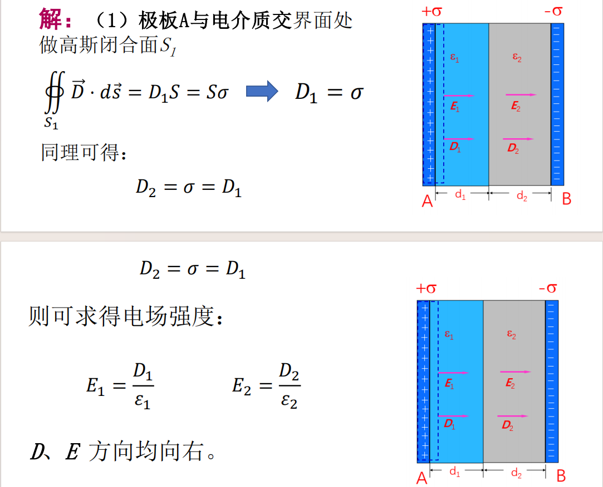
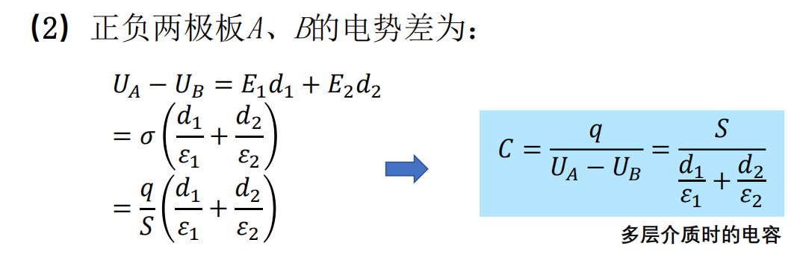

可以看作若干个电容器串联。

---

> [!QUESTION]
>
> 平行板电容器的极板是边长为 a 的正方形，间距为 d，两板带电±Q。如图所示，把厚度为 d、相对介电常量为εr 的电介质板插入一半。试求电介质板所受电场力的大小及方向。
>
> 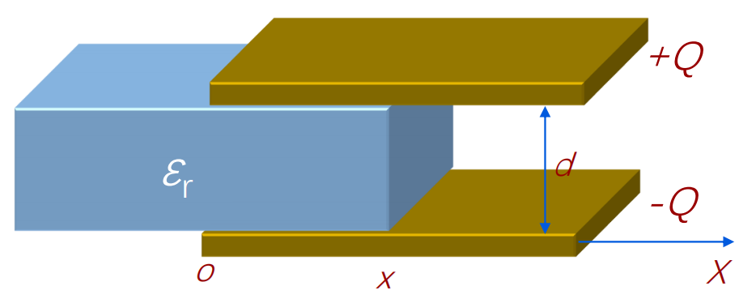

电解质受力？怎么求？势能求导。

$$
C(x)=\frac{\varepsilon_0\varepsilon_rxa}d+\frac{\varepsilon_0(a-x)a}d=\frac{\varepsilon_0a}d[a+(\varepsilon_r-1)x]
$$

此时，电容器的静电能为: $W(x)=\frac{Q^2}{2C}=\frac{Q^2d}{2\varepsilon_0a[a+(\varepsilon_r-1)x]}$

当电介质移动 dx 时，电场力 F 对电介质板所作的功等于电容器静电能的减少：

$$
F=-\frac{dW(x)}{dx}=\frac{(\varepsilon_r-1)Q^2d}{2\varepsilon_0a[a+(\varepsilon_r-1)x]^2}
$$

代入 x=a/2 得：$F(\frac a2)=\frac{2(\varepsilon_r-1)Q^2d}{\varepsilon_0a^3(\varepsilon_r+1)^2}$

---

---

### 第 15 章：电流和磁场

## tips

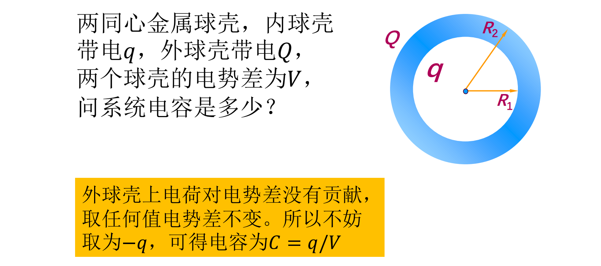

---

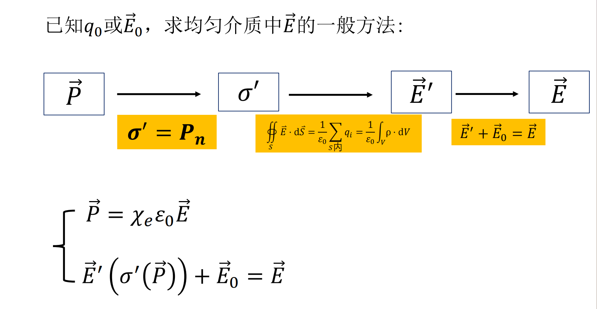

---

=> 孤立导体所带静电能：W= $\frac{1}{2}QU$ （利用其等势体的性质） 

---

> [!QUESTION]
>
> 计算均匀带电球体的静电能，设球的半径为R，所带电量为q，球外为真空。

$\text{已知电荷体密度为:}\quad\rho=\frac q{\frac43\pi R^3}\text{则均匀带电球体所激发的电场分布为:}$

$$\vec{E}=\begin{cases}\frac{1}{4\pi\varepsilon_0}\frac{q}{R^3}\frac{r}{r}&(r<R)\\\frac{1}{4\pi\varepsilon_0}\frac{q}{r^3}\frac{r}{r}&(r>R)&\end{cases}$$

用 $W=\frac12\iint_V\rho UdV$ 计算，得：

$$
\begin{aligned}&W=\frac12\iiint_V\rho UdV=\frac12\frac q{\frac43\pi R^3}\int_0^R(\frac{3q}{8\pi\varepsilon_0R}-\frac{qr^2}{8\pi\varepsilon_0R^3})4\pi r^2dr\\&=\frac3{20}\frac{q^2}{\pi\varepsilon_0R}\end{aligned}
$$

用 $W=\frac{\mathcal{E}_0}2\iiint_VE^2dV$ 计算，得：

$$
\begin{aligned}W&=\frac{\varepsilon_0}2\iiint_VE^2dV=\frac{\varepsilon_0}2\int_0^R(\frac1{4\pi\varepsilon_0}\frac{qr}{R^3})^24\pi r^2dr+\frac{\varepsilon_0}2\int_R^\infty(\frac1{4\pi\varepsilon_0}\frac q{r^2})^24\pi r^2dr\\&=\frac{q^2}{40\pi\varepsilon_0R}+\frac{q^2}{8\pi\varepsilon_0R}=\frac3{20}\frac{q^2}{\pi\varepsilon_0R}\end{aligned}
$$

---

> [!QUESTION]
>
> 一半径为 R 的无限长圆柱形导体，在其中距其轴线为 d 处挖去一半径为 r (2r＜R）、轴线与大圆柱形导体平行的小圆柱，形成圆柱形空腔，导体中沿轴均匀通有电流 I，如图所示。试求空腔内的磁感应强度 B。

由于挖空，不满足对称性，不方便使用安培环路定理。

对于挖空的部分，电流为 0，可以看作是空腔内同时存在等大反向的电流（这和高中求万有引力的补全是一致的）。

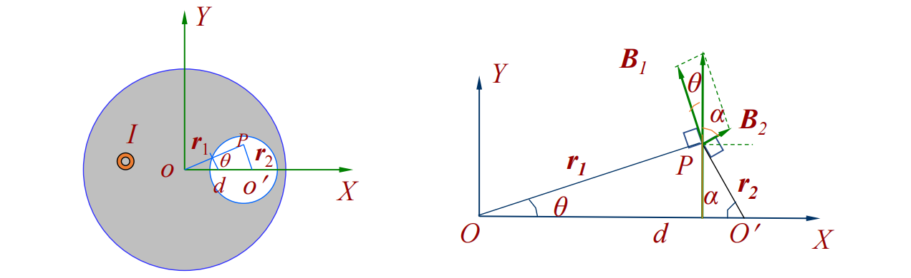

则有 $B_{1}=\frac{\mu_0jr_1}{2},B_{2}=\frac{\mu_0jr_2}{2}$，沿坐标轴分解得：

$$
\left\{\begin{matrix}
B_{1x}=-B_1\sin\theta=-\frac{\mu_0}2jr_1\sin\theta\\ 
B_{2x}=B_2\sin\alpha=\frac{\mu_0}2jr_2\sin\alpha\\
B_{1y}=B_1\cos\theta=\frac{\mu_0}2jr_1\cos\theta\\ 
B_{2y}=B_2\cos\alpha=\frac{\mu_0}2jr_2\cos\alpha 
\end{matrix}\right.
$$

𝑃点的磁感应强度𝑩的两个正交分量为：（最终沿 Y 轴正方向）

$$
\begin{aligned}&B_{x}=B_{1x}+B_{2x}=\frac{\mu_0j}2(r_2\sin\alpha-r_1\sin\theta)=0\\&B_{y}=B_{1y}+B_{2y}=\frac{\mu_0j}2(r_2\cos\alpha+r_1\cos\theta)=\frac{\mu_0j}2d\end{aligned} \implies B=\frac{\mu_0Id}{2\pi(R^2-r^2)}
$$

---

> [!QUESTION]
>
> 无穷大平行平面上有均匀分布的面电流，面电流密度为 i，i 的方向为电流流动的方向（i 为垂直于电流方向上单位长度的电流强度），求此平面外的磁感应强度 B的大小。

由对称性 => B 都平行于平面，且垂直于 i ；距离平面相同距离的点的磁感应强度等大。取长为 l 的一个矩形回路，有：

$B*2l = \mu_{0}i*l \implies B=\frac{\mu_{0}i}{2}$

> [!SUMMARY]
>
> 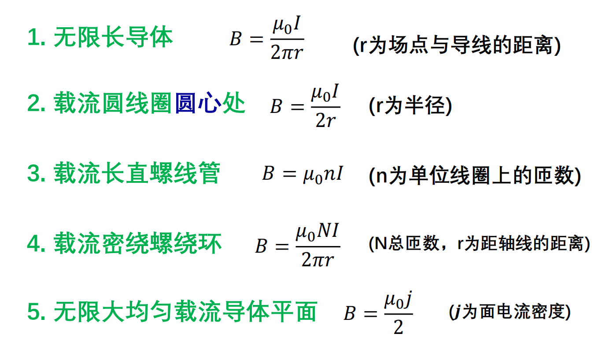

---

> [!QUESTION]
>
> 一根弯曲导线通有电流 I，弯曲部分是半径为 R 的半圆，两端直线部分的长度均为 l，载流导线位于与匀强磁场垂直的平面内，求作用在导线上的安培力。
> 
> 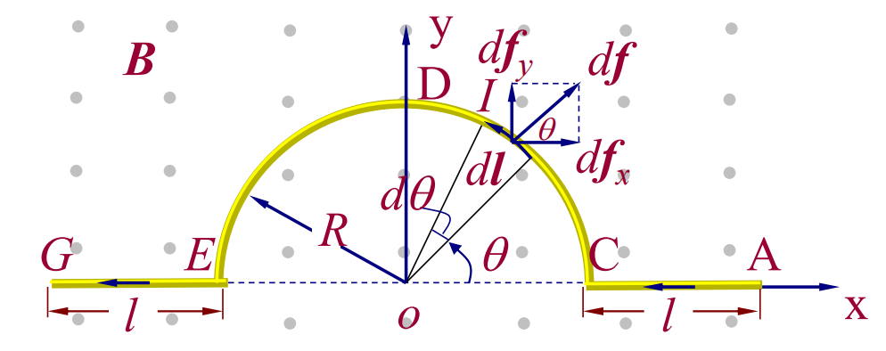

根据高中知识其实都知道所所受力等价于电流起点和终点之间连线代表电线所受到的力。$\overrightarrow{F}=2(l+R)IB \hat{y}$

---

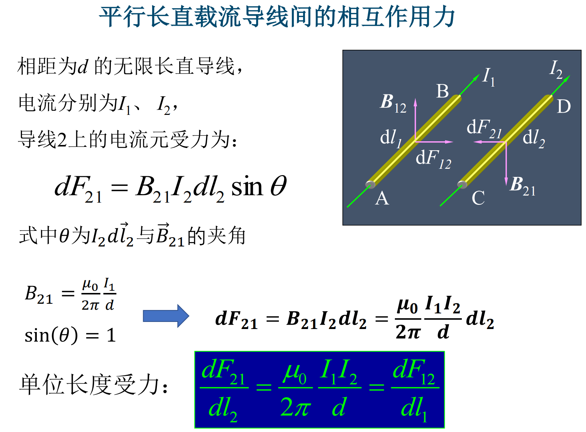