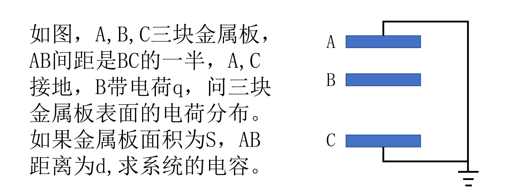
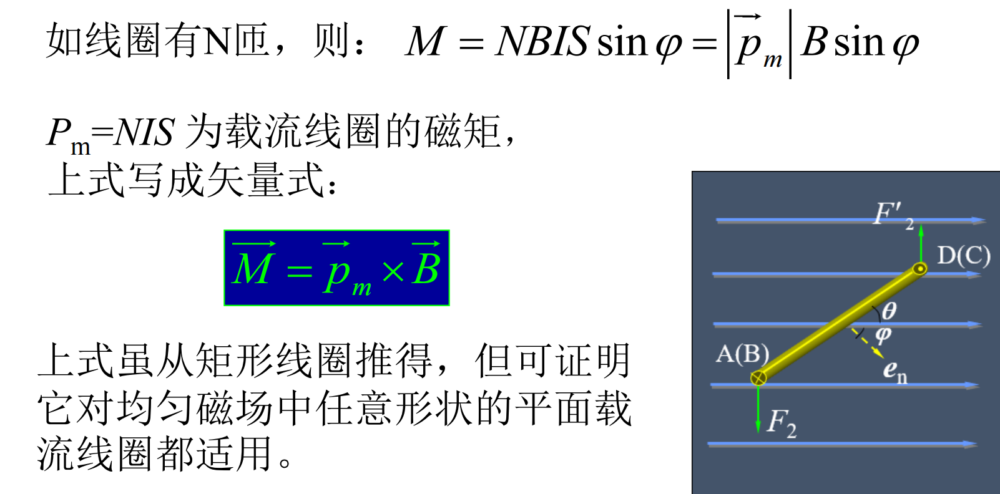
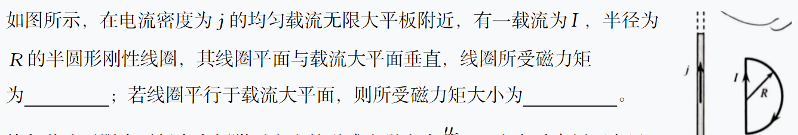
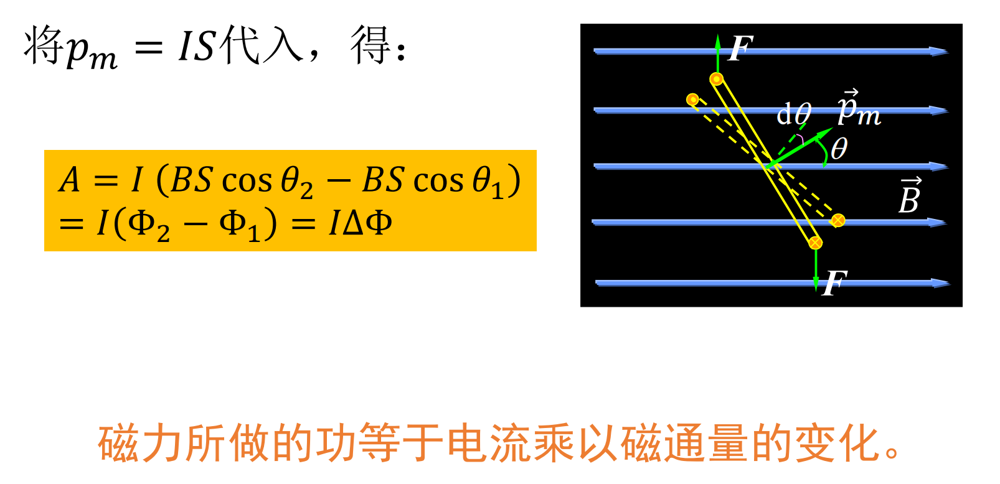
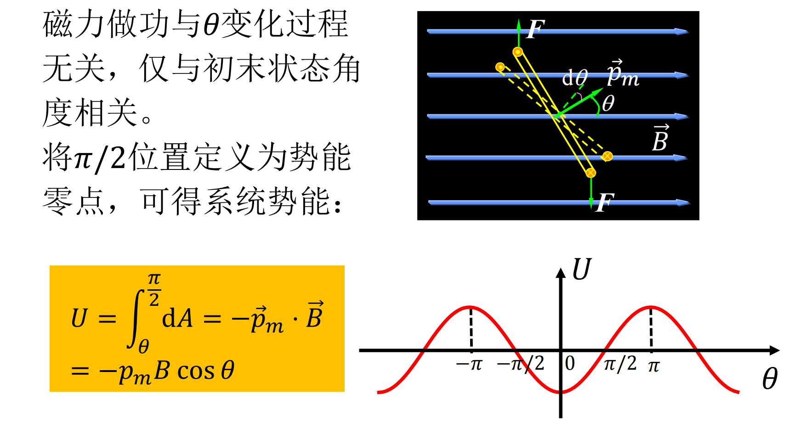
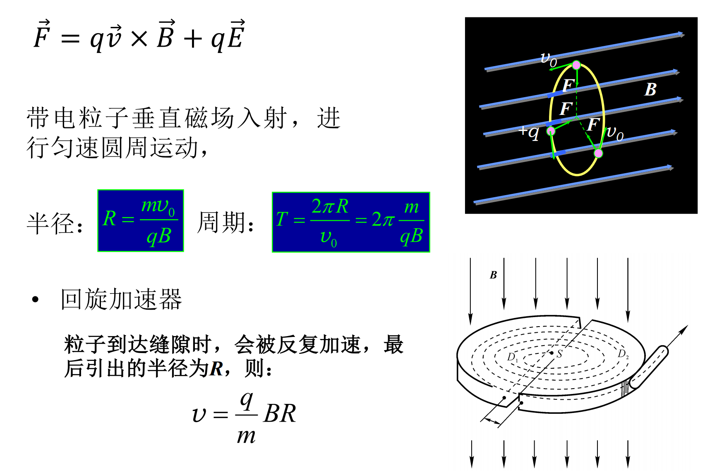
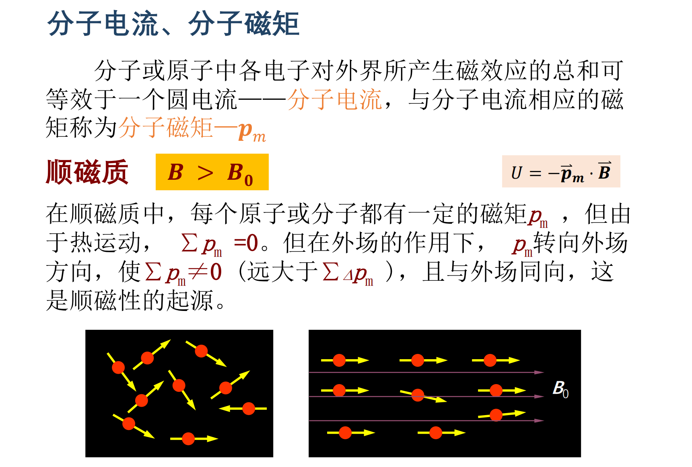
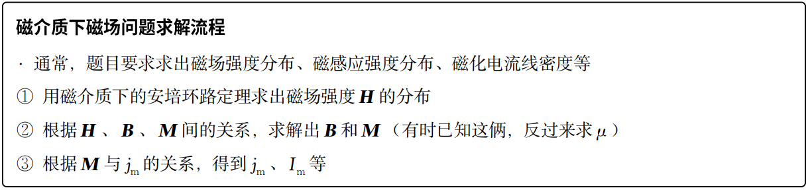

---
tags:
  - notes
comments: true
dg-publish: true
---

> [!PREREQUISITE]
>
> 大物乙 II 笔记查看：[memset0](https://mem.ac/course/physics/note/6/)
> 
> 题目/答案来源：[SAVIA的外装代脑](https://savia7582.github.io/Exterior/Physics/2/) ；浙江大学大学物理乙(II) PPT；浙江大学大学物理乙(II) 历年考试卷。

## 第 14 章：静电场中的导体和电解质

---

### 静电场——电场强度与电势(能)

> [!TIP]
>
>  

    
    

---

---

> [!QUESTION]
>
> 一块面积为 S 的金属大薄平板 A，带电量为 Q，在其附近平行放置另一块不带电的金属大薄平板 B，两板间距远小于板的线度。试求两板表面的电荷面密度，以及周围空间的场强分布。

A/B 内部场强为 0，取向右为正，故有：

$$
\begin{cases}
\frac{\sigma_1}{2\varepsilon_0}-\frac{\sigma_2}{2\varepsilon_0}-\frac{\sigma_3}{2\varepsilon_0}-\frac{\sigma_4}{2\varepsilon_0}=0 \quad A内部 \\ \frac{\sigma_1}{2\varepsilon_0}+\frac{\sigma_2}{2\varepsilon_0}+\frac{\sigma_3}{2\varepsilon_0}-\frac{\sigma_4}{2\varepsilon_0}=0\quad B 内部 
\end{cases}  
$$

---

> [!QUESTION]
>
> 在内外半径分别为 R1 和 R2 的导体球壳内，有一个半径为 r 的导体小球，小球与球壳同心，让小球与球壳分别带上电荷量 q 和 Q。试求：
> 
> ㈠ 小球的电势 Ur，球壳内、外表面的电势；
> ㈡ 两球的电势差；
> ㈢ 若球壳接地，再次求小球与球壳的电势差。

小球整体等势，所以我们求小球中心的电势即可： $U_r=\frac{1}{4\pi\varepsilon_0}(\frac{q}{r}-\frac{q}{R_1}+\frac{q+Q}{R_2})$

对于球壳表面，同样将电势叠加即可：$U_{R_1}=\frac{1}{4\pi\varepsilon_0}(\frac{q}{R_1}-\frac{q}{R_1}+\frac{q+Q}{R_2})=\frac{1}{4\pi\varepsilon_0}\frac{q+Q}{R_2} = U_{R_{2}}$

故电势差为：$U_r-U_{R_1}=\frac1{4\pi\varepsilon_0}(\frac qr-\frac q{R_1})$ 可以发现电势差与 Q 无关

（三） 若球壳接地，外表面电荷为 0，内表面 -q；内外表面电势均为 0；

### 电容器求解

> [!QUESTION]
>
> 设有半径都是 r 的两条平行“无限长”输电线 A 和 B，两轴间相距为 d ，且满足 d>>r ，求两输电线单位长度的电容。

---

> [!QUESTION]
>
> 

由 B 至接地，可以将其看作两个电容器并联：

$$
\begin{aligned}&U_{BA}=U_{BC}\to E_{BA}=2E_{BC}\to q_{B\text{上}}=2q_{B\text{下}}=\frac{2q}{3}\\&q_{A\text{下}}=-q_{B\text{上}}=-\frac{2q}{3},\:q_{C\text{上}}=-q_{B\text{下}}=-\frac{q}{3}\\ & C_{BA}=\varepsilon_0S/d,\:C_{BC}=\varepsilon_0S/2d,\to C=C_{BA}+C_{BC}=3\varepsilon_0S/2d\end{aligned}
$$
---

---

### 电介质下静电场问题求解

> [!QUESTION]
>
> 平行板电容器两极板面积为 S ，间距为d 。在极板间平行地放置两块厚度分别为d1 和 d2 的介质板，其相对介电常数分别为 $ε_{r_{1}}$ 和 $ε_{r_{2}}$ 。设电容器充电后两极板分别带有 ±q 的电荷。试求：（1）电容器的电容；（2）两介质交界面上的极化电荷面密度。

(2) 两介质在交界面上的极化电荷面密度的总量等于两介质界面上的极化电荷面密度的代数和；由 $\mathbf{P}=\varepsilon_{_0}(\varepsilon_{_r}-1)\mathbf{E}$ ； $\sigma^{\prime}=P\cdot n$ 得到：

$\sigma_1'+\sigma_2'=\boldsymbol{P}_1\cdot\boldsymbol{n}_1+\boldsymbol{P}_2\cdot\boldsymbol{n}_2=P_1-P_2=\boldsymbol{\varepsilon}_0(\boldsymbol{\varepsilon}_{r1}-1)E_1-\boldsymbol{\varepsilon}_0(\boldsymbol{\varepsilon}_{r2}-1)E_2=(\frac{\boldsymbol{\varepsilon}_{r1}-\boldsymbol{\varepsilon}_{r2}}{\boldsymbol{\varepsilon}_{r1}\boldsymbol{\varepsilon}_{r2}})\frac{q}{\boldsymbol{S}}$

---

> [!QUESTION]
>
> 一空气平行板电容器，两板间距为 d ，极板上带电量分别为 q+ 和 q− ，板间电势为 U ，忽略边缘效应；将电源断开，在两板间平行插入一厚度为 t （ t < d ）的金属板，则板间电势差和此时电容为？

> [!TIP]
>
> 插入金属板相当于变成了两个电容器串联，进一步可以看成是两板距离缩小。

那么就简单了：

$U'=E(d-t)=\boxed{\frac{d-t}dU}$ ，$C'=\frac{q}{U'}=\boxed{\frac{q}{U}\frac{d}{d-t}}$

---

> [!QUESTION]
>
> 一球形电容器，内外球面半径分别为 $R_{1}$ = 2cm 和 $R_{2}$ = 4cm ，在两球间充满击穿电场强度为 160kV/m 的电介质；则该电容器能承受的最大电压为

> [!TIP]
>
> 两半径分别为 $R_1 < R_2$ 同心球壳，带电量为 ±q 时，两球壳之间的电场强度为 $E= \frac{q}{4\pi \varepsilon_{0}r^2}$ ，$U=\frac{q}{4\pi \varepsilon_{0}r^2}\left( \frac{1}{R_{1}}-\frac{1}{R_{2}} \right)$；此时形成的电容为 $C=4\pi\varepsilon_0\frac{R_2R_1}{R_2-R_1}$ 。

场强最大处显然为 r=R1 处，故有 

$E_{击穿}=\frac{q}{4\pi \varepsilon_{0}R_{1}^2}$ => $U_{击穿}=R_1^2E_\text{击穿}\left(\frac1{R_1}-\frac1{R_2}\right)=\boxed{1.6\times10^3 V}$

---

> [!QUESTION]
>
> 一个半径为 R 的电介质球被均匀极化后，已知电极化强度为 P,求：
> (1)电介质球表面上极化面电荷的分布；
> (2)极化面电荷在电介质球心处所激发的场强？
> 
> 

对于考试而言，把“极化”当作一个“场”，并记住[极化强度是如何影响电荷面密度](attachments/physics2-problems-9.png)的即可。

---

> [!QUESTION]
>
> 平行板电容器两极板面积 S，充有两层电介质，介电常数分别为ε1 、ε2，厚度分别为 d1、d2, 电容器两极板上自由电荷面密度为±σ。求：（1）在各层电介质内的电位移矢量和场强。（2）电容器的电容？

可以看作若干个电容器串联。

### 求静电场中的能量

> [!QUESTION]
>
> 平行板电容器极板面积为 $2×10^{-2} m^2$，极板间距离为 $1×10^{−3} m$，在电容器内有一介质板（ $ε_r = 5$ ） 充满两极板间的全部空间。电容器与 300V 电源相连，充电后将电源切断，再抽出介质板。
> 
> 求：(1) 抽出过程中外力所做的功；（2）抽出介质板后，两极板间相互作用力。

> [!TIP]
>
> $\varepsilon_0:\text{ 真空中的介电常数 }=8.85\times10^{-12}\mathrm{~C}^2/(\mathrm{N}\cdot\mathrm{m}^2)$
> 
> 平行板电容器：$C = \frac{\varepsilon_{0}S}{d}$

(1)

$$
\begin{cases}
C_{1} = \frac{\varepsilon \varepsilon_{r}S}{d} \\
Q = C_{1}U \\
W_{1}=\frac{Q^2}{2C_{1}} \\
W_{2}=\frac{Q^2}{2C_{2}} \\
\Delta W = W_{2}-W_{1}
\end{cases} \implies \Delta W = \frac{1}{2}\frac{\varepsilon_0\varepsilon_rS}{d}U^2(\varepsilon_r-1)=\boxed{1.59\times10^{-4}J}
$$

习惯上，我们也会把 $\Delta W$ 用 A 表示。

(2)

$F = \frac{dA}{dx}$ && A = $\frac{Q^2}{2\varepsilon S}$ => F = -0.199N

---

> [!QUESTION]
>
> 平行板电容器的极板是边长为 a 的正方形，间距为 d，两板带电±Q。如图所示，把厚度为 d、相对介电常量为εr 的电介质板插入一半。试求电介质板所受电场力的大小及方向。
>
> 

电解质受力怎么求？同上一题，势能求导。

$$
C(x)=\frac{\varepsilon_0\varepsilon_rxa}d+\frac{\varepsilon_0(a-x)a}d=\frac{\varepsilon_0a}d[a+(\varepsilon_r-1)x]
$$

此时，电容器的静电能为: $W(x)=\frac{Q^2}{2C}=\frac{Q^2d}{2\varepsilon_0a[a+(\varepsilon_r-1)x]}$

当电介质移动 dx 时，电场力 F 对电介质板所作的功等于电容器静电能的减少：

$$
F=-\frac{dW(x)}{dx}=\frac{(\varepsilon_r-1)Q^2d}{2\varepsilon_0a[a+(\varepsilon_r-1)x]^2}
$$

代入 x=a/2 得：$F(\frac a2)=\frac{2(\varepsilon_r-1)Q^2d}{\varepsilon_0a^3(\varepsilon_r+1)^2}$

---

> [!QUESTION]
>
> 计算均匀带电球体的静电能，设球的半径为 R，所带电量为 q，球外为真空。

$\text{已知电荷体密度为:}\quad\rho=\frac q{\frac43\pi R^3}\text{则均匀带电球体所激发的电场分布为:}$

$$\vec{E}=\begin{cases}\frac{1}{4\pi\varepsilon_0}\frac{q}{R^3}\frac{r}{r}&(r<R)\\\frac{1}{4\pi\varepsilon_0}\frac{q}{r^3}\frac{r}{r}&(r>R)&\end{cases}$$

用 $W=\frac12\iint_V\rho UdV$ 计算，得：

$$
\begin{aligned}&W=\frac12\iiint_V\rho UdV=\frac12\frac q{\frac43\pi R^3}\int_0^R(\frac{3q}{8\pi\varepsilon_0R}-\frac{qr^2}{8\pi\varepsilon_0R^3})4\pi r^2dr\\&=\frac3{20}\frac{q^2}{\pi\varepsilon_0R}\end{aligned}
$$

用 $W=\frac{\mathcal{E}_0}2\iiint_VE^2dV$ 计算，得：

$$
\begin{aligned}W&=\frac{\varepsilon_0}2\iiint_VE^2dV=\frac{\varepsilon_0}2\int_0^R(\frac1{4\pi\varepsilon_0}\frac{qr}{R^3})^24\pi r^2dr+\frac{\varepsilon_0}2\int_R^\infty(\frac1{4\pi\varepsilon_0}\frac q{r^2})^24\pi r^2dr\\&=\frac{q^2}{40\pi\varepsilon_0R}+\frac{q^2}{8\pi\varepsilon_0R}=\frac3{20}\frac{q^2}{\pi\varepsilon_0R}\end{aligned}
$$

---
## 第 15 章：电流和磁场

### 求磁感应强度

> [!NOTE]
>
> 1. 依照定义有： $F=q\boldsymbol{v}\times\boldsymbol{B}$
>
> 若是直线电流产生的磁场，大拇指指向电流方向，则其它四指的绕行方向就是 B 的方向；若是环形电流产生的磁场，其它四指的绕行方向为电流方向，则大拇指指向 B 的方向。
>
> 2. 用毕奥-萨伐尔定律求磁感应强度。
>
>  
>
> 3. 用安培环路定理求磁感应强度。
>
> 

> [!TIP]
>
> 
>
> 

---

> [!QUESTION]
>
> 无穷大平行平面上有均匀分布的面电流，面电流密度为 i，i 的方向为电流流动的方向（i 为垂直于电流方向上单位长度的电流强度），求此平面外的磁感应强度 B 的大小。

由对称性 => B 都平行于平面，且垂直于 i ；距离平面相同距离的点的磁感应强度等大。取长为 l 的一个矩形回路，有：

$B*2l = \mu_{0}i*l \implies B=\frac{\mu_{0}i}{2}$

---

> [!QUESTION]
>
> 

分段求解，注意判别方向， 

$B=B_{3}+B_2-B_1=0+\frac{3\mu_0I}{8R}-\frac{\mu_0I}{4\pi R}=\frac{\mu_0I}{4R}(\frac32-\frac1\pi)$ 方向垂直纸面向里。

---

> [!QUESTION]
>
> 在半径为R 的无限长半圆筒形金属薄壁中，自上而下通过电流 I ，设电流均 匀地分布在薄壁上，求轴线上 P 点的磁感应强度。

> 微分 => 套用结论 => 积分

根据积分区间及对称性, $B_y=0\text{,}B_x=\int_0^\pi\frac{\mu_0\mathrm{I}}{2\pi^2\mathrm{R}}\mathrm{sin}\theta\mathrm{d}\theta=\frac{\mu_0\mathrm{I}}{\pi^2\mathrm{R}}$ ，因此, $B=\frac{\mu_0\mathrm{I}}{\pi^2\mathrm{R}}$ 。

---

> [!QUESTION]
>
> 一半径为 R 的无限长圆柱形导体，在其中距其轴线为 d 处挖去一半径为 r (2r＜R）、轴线与大圆柱形导体平行的小圆柱，形成圆柱形空腔，导体中沿轴均匀通有电流 I，如图所示。试求空腔内的磁感应强度 B。

由于挖空，不满足对称性，不方便使用安培环路定理。

对于挖空的部分，电流为 0，可以看作是空腔内同时存在等大反向的电流（这和高中求万有引力的补全是一致的）。

则有 $B_{1}=\frac{\mu_0jr_1}{2},B_{2}=\frac{\mu_0jr_2}{2}$，沿坐标轴分解得：

$$
\left\{\begin{matrix}
B_{1x}=-B_1\sin\theta=-\frac{\mu_0}2jr_1\sin\theta\\ 
B_{2x}=B_2\sin\alpha=\frac{\mu_0}2jr_2\sin\alpha\\
B_{1y}=B_1\cos\theta=\frac{\mu_0}2jr_1\cos\theta\\ 
B_{2y}=B_2\cos\alpha=\frac{\mu_0}2jr_2\cos\alpha 
\end{matrix}\right.
$$

𝑃点的磁感应强度𝑩的两个正交分量为：（最终沿 Y 轴正方向）

$$
\begin{aligned}&B_{x}=B_{1x}+B_{2x}=\frac{\mu_0j}2(r_2\sin\alpha-r_1\sin\theta)=0\\&B_{y}=B_{1y}+B_{2y}=\frac{\mu_0j}2(r_2\cos\alpha+r_1\cos\theta)=\frac{\mu_0j}2d\end{aligned} \implies B=\frac{\mu_0Id}{2\pi(R^2-r^2)}
$$

---

> [!QUESTION]
>
> 

---

### 求磁通量

> [!TIP]
>
> 记得使用磁场中的高斯定理 $\Phi_\mathrm{m}=\oint_s\boldsymbol{B}\cdot\mathrm{d}\boldsymbol{S}=0$ 来简化问题。

> [!QUESTION]
>
> 

---

### 求磁力

> [!QUESTION]
>
> 一根弯曲导线通有电流 I，弯曲部分是半径为 R 的半圆，两端直线部分的长度均为 l，载流导线位于与匀强磁场垂直的平面内，求作用在导线上的安培力。
> 
> 

根据高中知识其实都知道所所受力等价于电流起点和终点之间连线代表电线所受到的力。$\overrightarrow{F}=2(l+R)IB \hat{y}$

---

---

### 求磁矩

> [!QUESTION]
>
> 从经典观点看，氢原子可看作是一个电子绕核作高速旋转的体系，已知电子和质子的电荷分别为 e− 和 e ，电子质量为 $m_e$ ，氢原子的圆轨道半径为 r ，电子作平面轨道运动，则电子轨道运动的磁矩为

---

### 求磁力矩

> [!NOTE]
>
> 
> 

> [!QUESTION]
> [百度文库](https://wenku.baidu.com/view/eccf6cbec77da26925c5b00c) 如图所示，两根相互绝缘的无限直导线 1 和 2 绞接于 O 点，两导线间夹角为θ，通有相同的电流 I，试求单位长度导线所受磁力对 O 点的力矩。
>
> 

---

> [!QUESTION]
>
> 

> [!TIP]
>
> 均匀载流无限大平板在右侧附近产生的磁感应强度为 $\frac{\mu_{0}j}{2}$ ，方向垂直纸面向里因为是均匀磁场，所以可用磁矩计算磁力矩。

∵ 磁矩与线圈平面垂直 

∴ 
1. 线圈平面与载流大平面垂直时，磁矩平行于 B ，因此磁力矩为 0 ；

2. 线圈平行于载流大平面时，磁矩垂直于 B ，因此 $M=p_\text{m}B\sin90^\circ=\frac{\mu_0\pi R^2Ij}4$

---

### 求磁场力做功

> [!NOTE]
>
> 
> 
> 

---

### 洛伦兹力及其应用

### 霍尔效应

> [!NOTE] 
>
> 

## 第 16 章：物质中的磁场

### 磁介质的分类

介质在磁场中被磁化，介质内的磁感应强度 𝑩 为真空中原来的磁感应强度 $𝑩_𝟎$ 和附加磁感应强 𝑩'之和。 $B = B_0 + B'$ 

### 顺磁质和抗磁质的磁化

> 圆电流可以看作是一个小的载流线圈，当添加一个外部磁场时，所有载流线圈的方向趋近一致。

总而言之，顺磁性是因为分子磁矩倾向于往外加磁场方向排列；抗磁性来源于总磁矩为 0 时，分子进动。

### 磁化（束缚）电流和磁化强度

> [!NOTE]
>
> 

### 磁介质下求磁场

> [!QUESTION]
>
> 

## tips

---

=> 孤立导体所带静电能：W= $\frac{1}{2}QU$ （利用其等势体的性质） 

---

