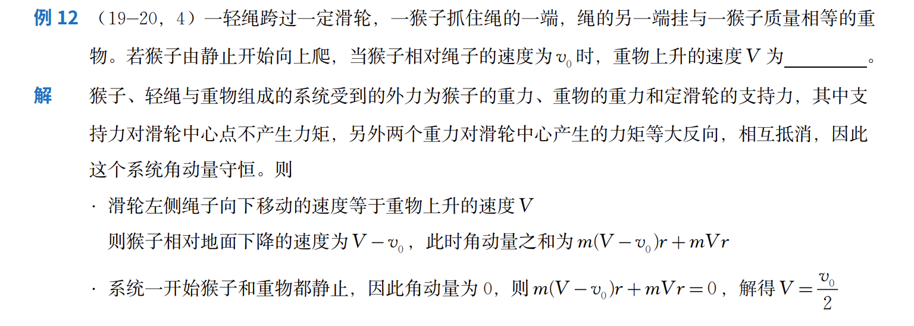
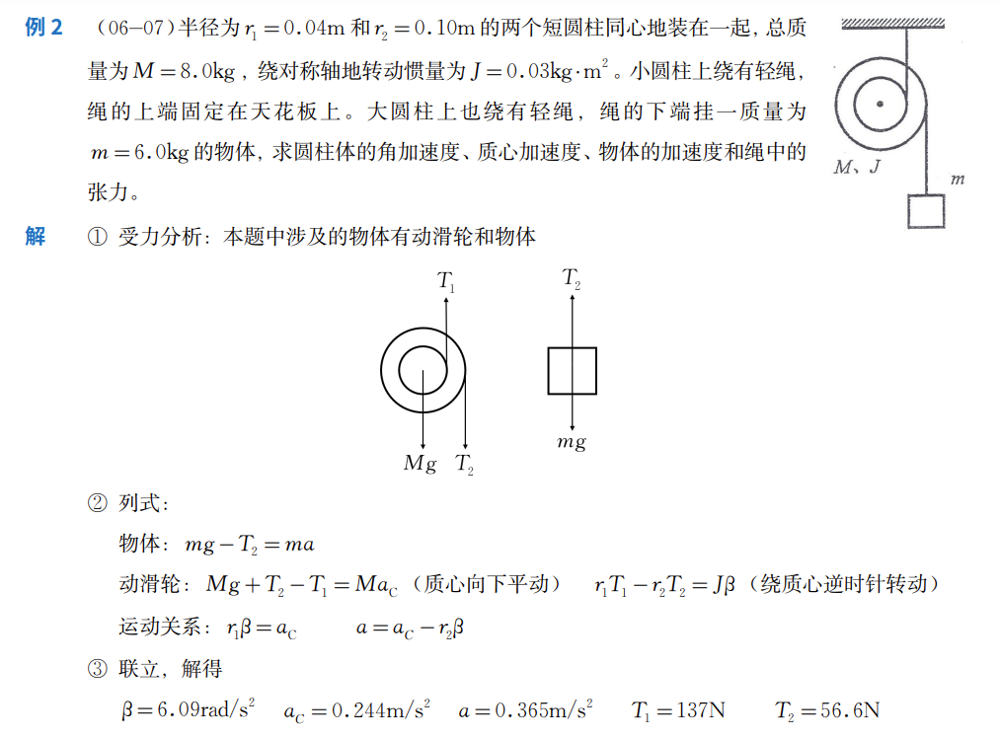
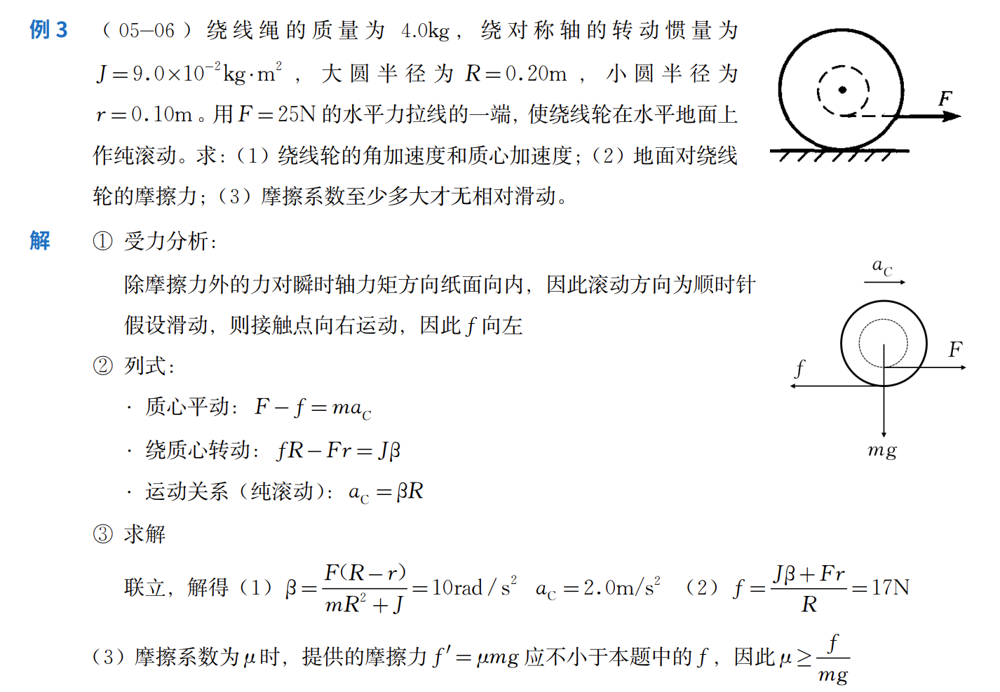
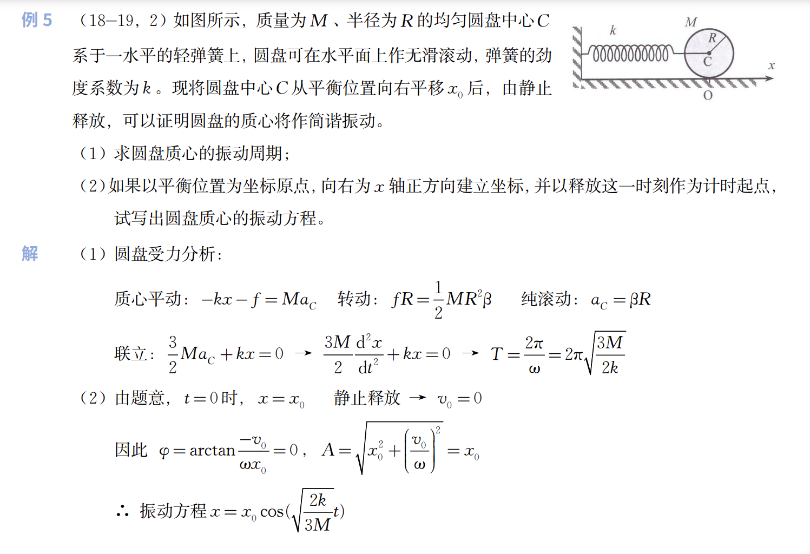
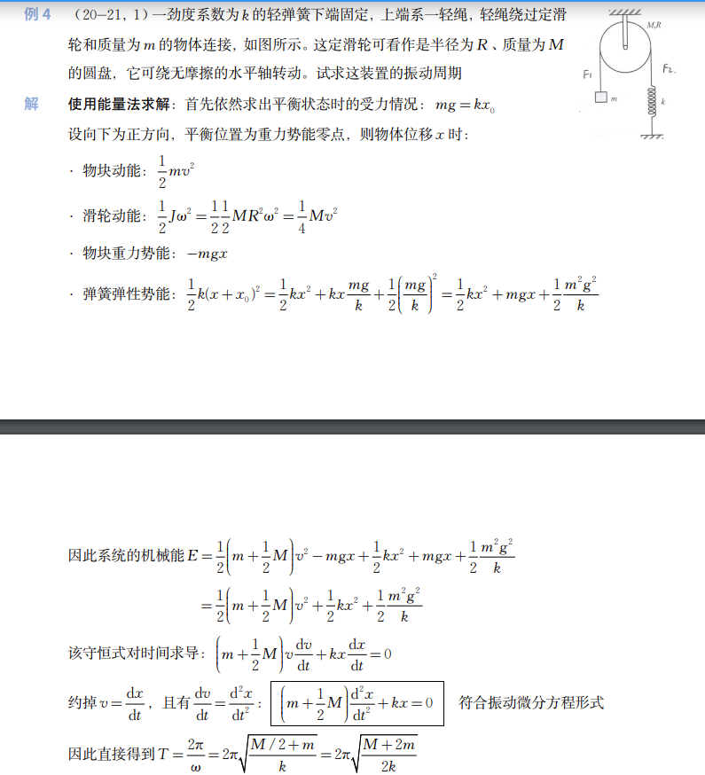
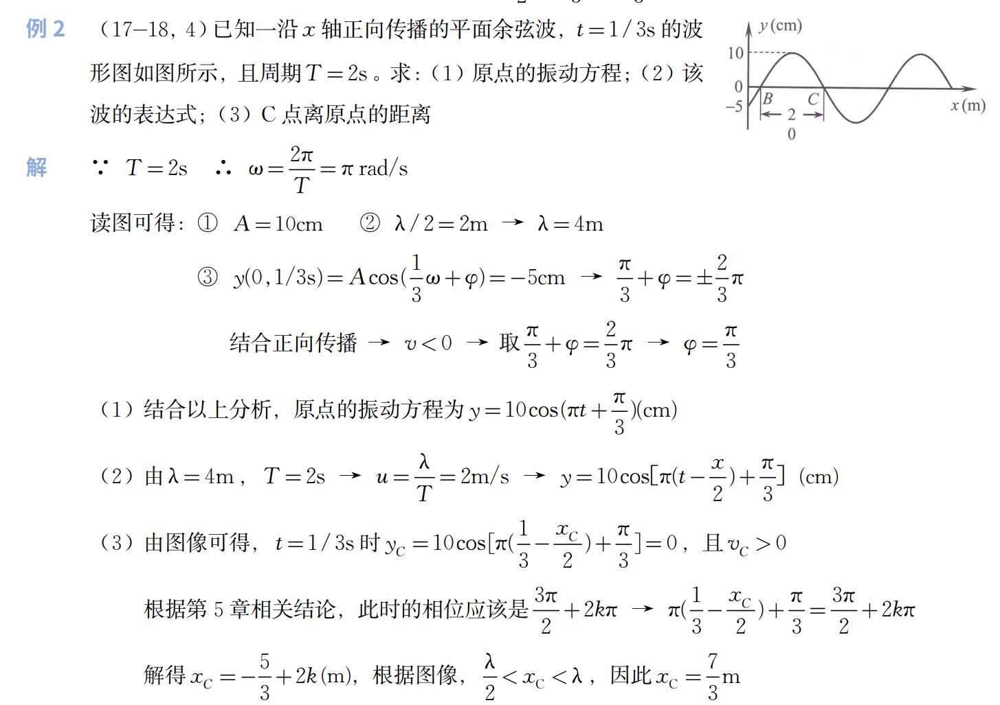
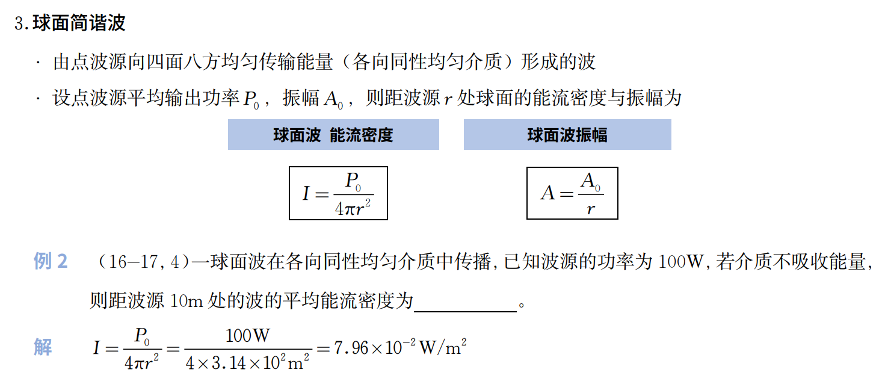
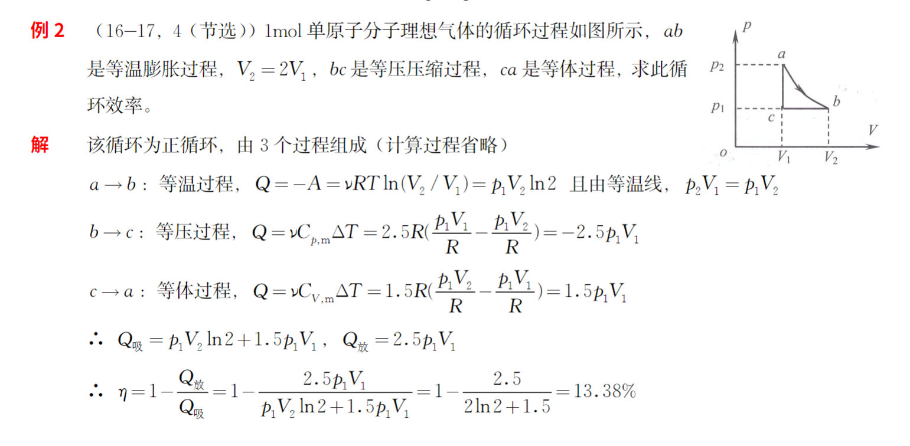
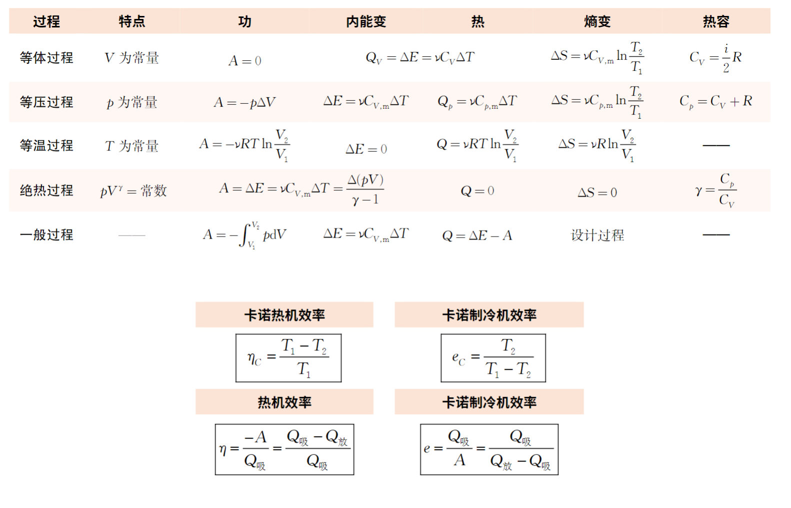

---
tags:
- notes
- physics
comments: true
dg-publish: true
---
## 期末复习 

> [!CITE]
>
>  [SAVIA的外装代脑](https://savia7582.github.io/Exterior/Physics/)
>  
> 注意，本身应该是大物甲的复习笔记，部分考点大物乙  <u>大概率</u> 不涉及，谨慎选择。

可能是我菜吧，一直没想到这样做。

本题作图也可很快，图中解法更加通用；利用 $a_{t}^{2}+a_{n}^{2} = a^{2}$ 计算不易获得的数据。

不要忘了法向加速度。

可能用冲量会更好理解。

关键在于发现角动量守恒。

个人感觉比较难找到的是 $a = a_{c}-r_{2}\beta$ 。 

> [!QUESTION]
>
> 如何判断质心运动方向？
> 
> - 不判断，速度和角动量都可以是矢量；
> 
> - 以 $f$ 或 $F$ 的作用点为瞬时轴，很容易判断向右走。

误以为高中题，结果一个大坑。

课本上这里讲的依托，不想翻智云，直接看这个了；当然不难发现，“自转” 和 “公转” 方向是一样的。

狭义相对论，主要记住几个公式。

第一问，搞清楚弹簧拉力和摩擦力方向比较重要。

能量法得微分方程，就不用考虑方向问题了。

判断 $\varphi$ 的正负真是一个大麻烦…… 

> [!QUESTION]
>
> 第一问中，$v < 0$ 是怎么来的？
> 
> 波沿 x 正向传播，也就是说将三角函数向右移，观察对应点的纵坐标变化。

此外，求 c 的横坐标确实愣了一下。

理解就好记。

关于半波损失，主要需要理解驻波的概念吧。

不要只记得 **麦克斯韦速率分布律** 中的最概然速率、平均速率和均方根/方均根速率而忘了定义式。

> 第八章比较模糊，都看一遍吧 => [第8章-热力学基础](attachments/第8章-热力学基础.pdf)

考了多个公式。

公式小结。

> 第九章还是比较简单的，但是不乏技巧性。

第二问高斯面的选取巧妙，给出了无限大有厚度平面内部场强计算方法。

## 课堂 PPT 测试题

### 机械波

**平面简谐波**

> [!QUESTION]
> 

**A**

> [!QUESTION]
>
>  

最大形变量 => 势能最大 => 动能最大

**C**

---

**半波损失**

> [!QUESTION]
>
>  

波密到波疏：相位差 $\pi$ ，排除 CD；反向，选 A

错了，因为波的速度也是反向的，具体看看前面的 [视频](#^6a5806)

**B**

---

### 气体分子动理论

> [!QUESTION]
>
> 

注意粒子还受到了浮力即可

得 $N_{A} = 8.19*10^{23}$ 

---

> [!QUESTION]
>
> 恒压下，加热理想气体，则气体分子的平均自由程和平均碰撞频率将如何随温度的变化而变化？怎样理解？

    
    

### 热力学基础

> [!QUESTION]
>
> 

热力学第一定律适用性很广。

 **A**

---

> [!QUESTION]
>
> 一定量的理想气体，分别从同一状态开始，经历等压、等体、等温过程。若气体在上述过程中吸收的热量相同，则气体对外做功最大的过程是：

$\begin{aligned}&Q=\Delta E+W\\&\text{等温:}W=Q\\&\text{等压:}W=Q-\Delta E<Q\\&\text{等体:}W=0\end{aligned}$

**A. 等温过程**

---

> [!QUESTION]
>
> 

解：(1) 设小球向上运动位移为正，则当产生微小的正位移 y 时，瓶内气体的体积有一微小的增量 dV, dV=yA ……

与此同时，压强将改变一微小值 dp,小球受到的合力 F=Adp,或 dp=F/A ……(2)
由于小球在运动过程中瓶内气体做准静态绝热过程，则有关系式 pV1=常数，两边微分，得：$\gamma V^{\gamma-1}pdV+V^{\gamma}dp=0$ 。

将 (1)(2) 带入上式得：$F=-\frac{\gamma pA^{2}}{V}\:y=-Ky$  得知小球做简谐运动：$T=2\pi\sqrt{\frac{m}{K}}=2\pi\sqrt{\frac{mV}{\gamma pA^{2}}}$

(2) 即：$\gamma=\frac{4\pi^{2}mV}{pA^{2}T^{2}}$，而这些量都可以通过实验测得。
