---
tags:
  - notes
  - sysI
comments: true
dg-publish: true
---

## I Introduction

### I.1 Trigger

- _Level-triggered/sensitive_
    - Output controlled  <u>by the level of the clock input.</u> 
- _Edge-triggered/sensitive_
    - Output changes only at the point in time when the clock changes from value to the other.
    - Can be positive-edge triggered (0 to 1), or negative-edge triggered (1 to 0).

Flip-flops（触发器） are edge-triggered while clocked (gated) latches（锁存器） are level-sensitive.

### I.2 Implement

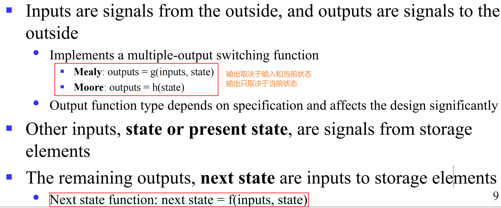

### I.3 Types of Sequential Circuits

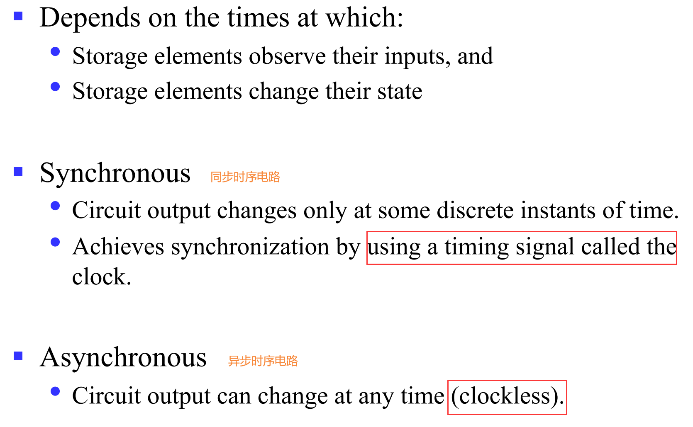

> [实验指导——初始化](https://zju-sys.pages.zjusct.io/sys1/sys1-sp24/lab3-1-appendix/#_6)

## II Analysis

### II.1 Finite State Machine

> [!DEFINITION ]
>
> _Finite state machine (FSM)_ is a generic model for sequential circuits used in sequential circuit design

#### II.1.1 State Diagram

#### II.1.2 State Table

### II.2 Basic Analysis Procedure

> The analysis consists of  <u>obtaining a suitable description that demonstrates the time sequence of inputs, outputs, and states.</u> 

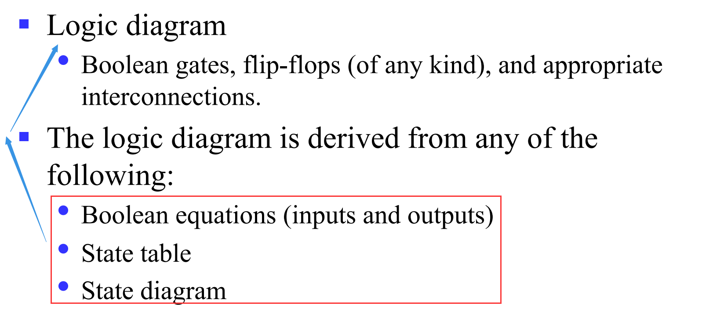

#### II.2.1 example

> 下面所表示的信息是一致的

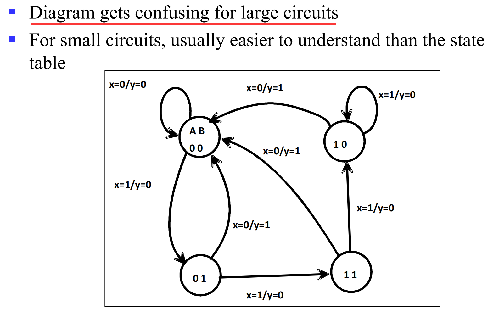

> [!QUESTION]
>
> 如何使用 FSM 判断一个二进制数能否被 3 整除？[相融关系 R 的迭代算法](../../../course_notes/CS70%20DMPT/notes/18-Misc.md#相融关系-R-的迭代算法) 的 Example

## III Basic sequential logic elements

$$Bistable-circuits \begin{cases}Latches \\ Flip-Flops\end{cases}$$
### III.1 Latch
> [!INFO]
>
> 双稳态电路（Bistable Circuit）是一种电子电路，它具有两个稳定的状态，并且可以在没有外部影响的情况下无限期地保持在这两个状态之一，直到被触发以改变到另一个状态。双稳态电路在数字电子学中是基本组件，用于存储二进制信息。这两个稳定的状态通常对应于逻辑电平“0”和“1”，在计算和数字通信系统中用作二进制数字。
#### III.1.1 simple one
下面是最为简单的双稳态电路，该电路没有输入，有两个输出 $Q\quad\overline{Q}$
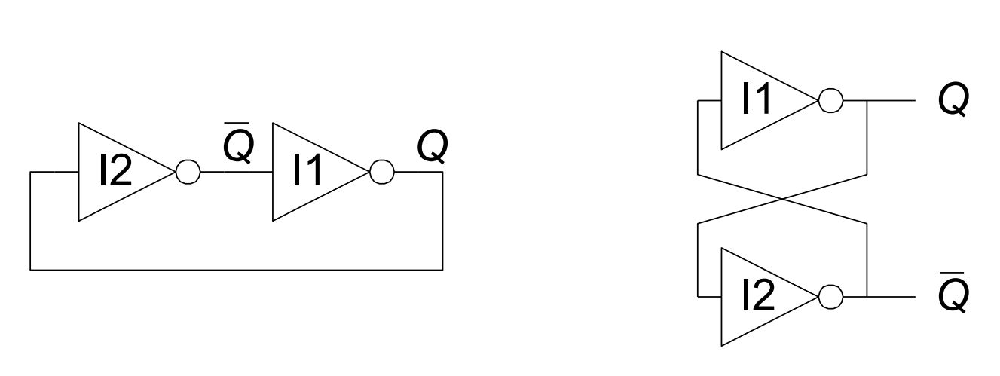
没有输入也就意味着不能够控制该电路
> 还存在亚稳态（老师上课提了一嘴）
#### III.1.2 SR Latch
> [!INFO]
>
> **SR Latch**：这是最简单的双稳态电路之一，使用 NAND 或 NOR 门创建两个稳定状态：“设置”（Set）和“重置”（Reset）。
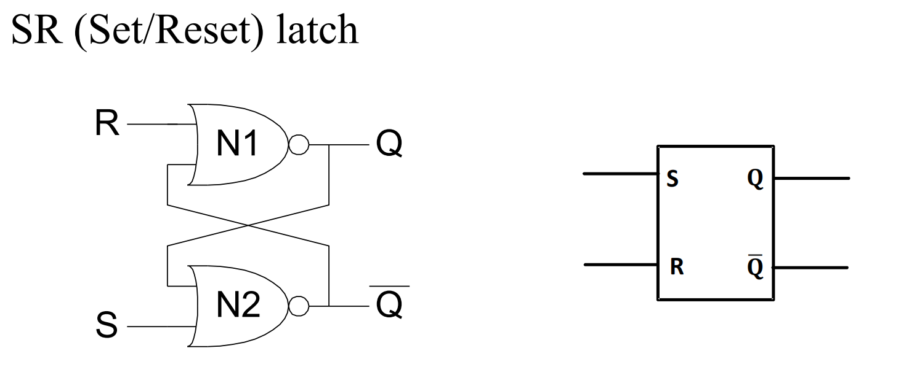
##### III.1.2.1 analysis
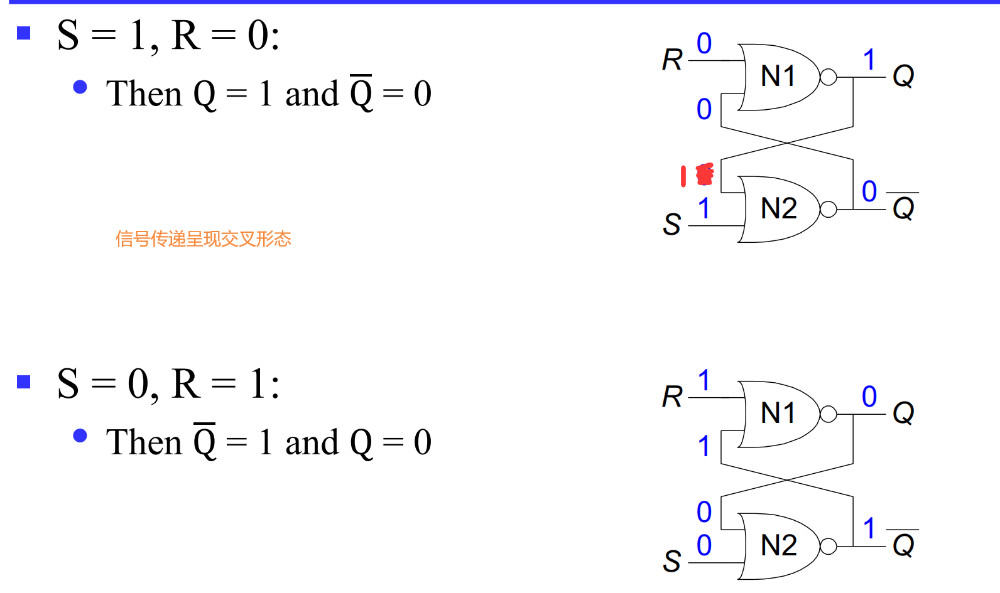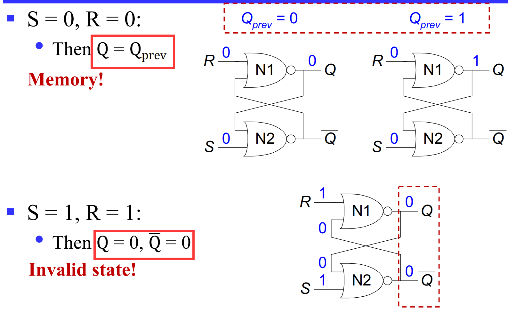
##### III.1.2.2 summery
###### III.1.2.2.1 SR Latch with NOR Gates
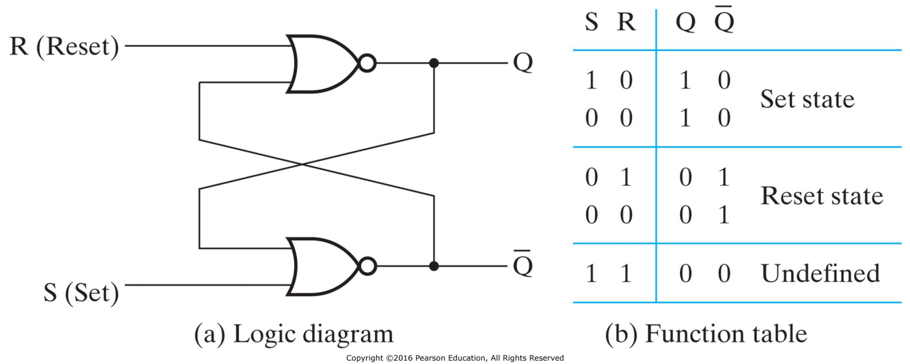
###### III.1.2.2.2 $\overline{SR}$ Latch with NAND Gates
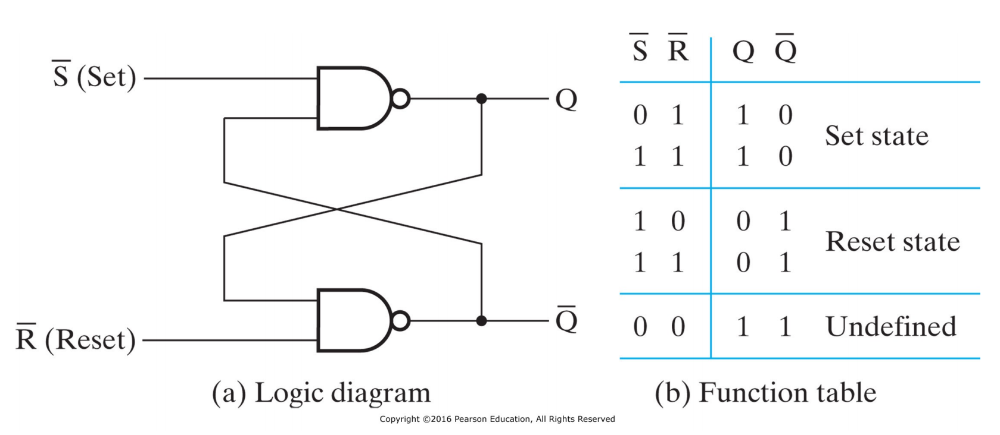
##### III.1.2.3 SR Latch with Control Input

#### III.1.3 Latch
在 SR Latch with NOR Gates 中，我们发现不应该出现 $\begin{cases}S = 1 \\ R = 1\end{cases}$ 的情况，而 $\begin{cases}S = 0 \\ R = 0\end{cases}$ 的情况可以被取代，所以我们直接将一个输入（D,data）取其本身和取非即可，再使用输入 C 进行控制，就形成了 D latch
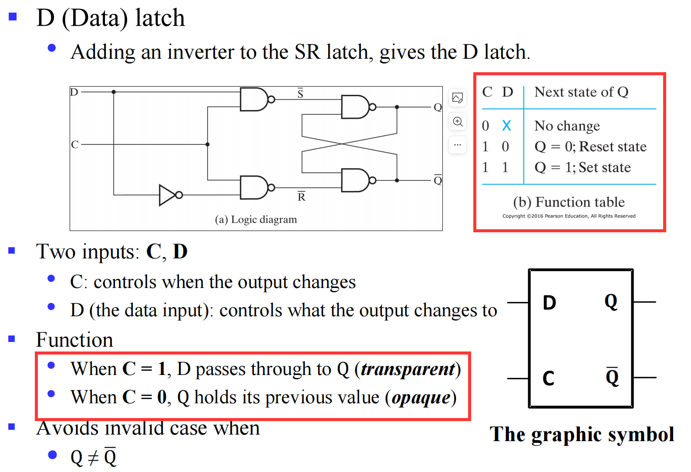
##### III.1.3.1 The Latch Timing Problem
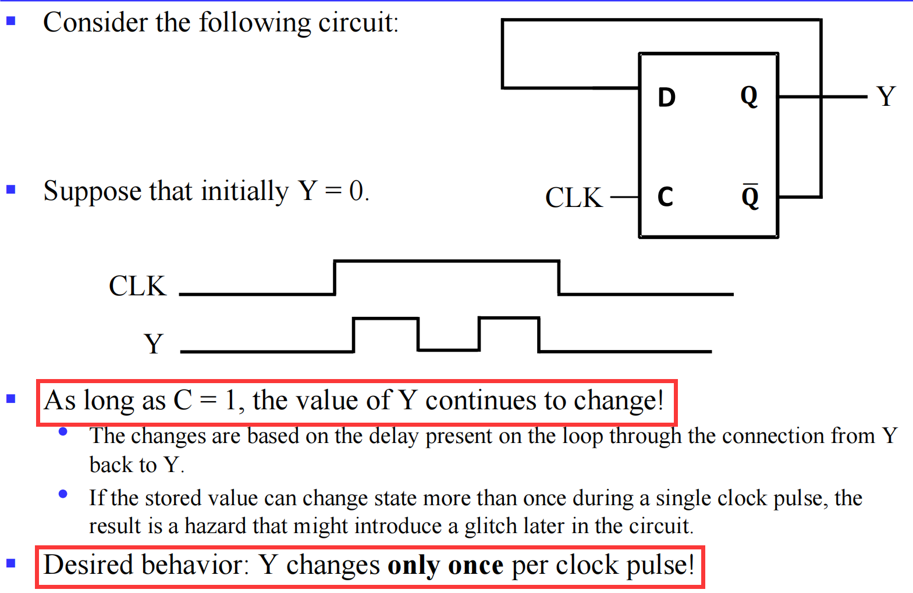
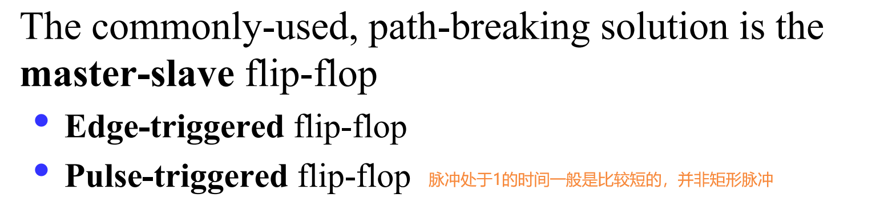
### III.2 Flip-Flop
#### III.2.1 Flip-Flop
##### III.2.1.1 Implement
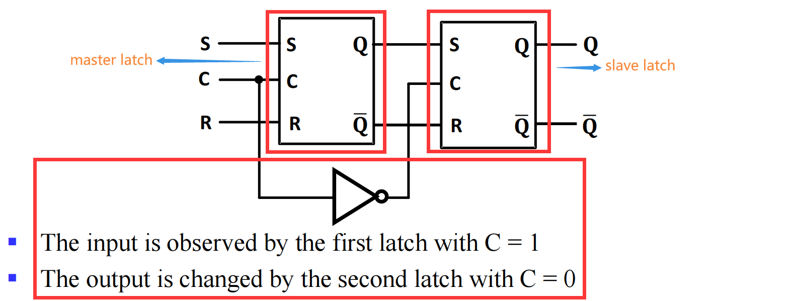
也就是说一定要 C 取 1 后再取 0 信号才能顺利传递；可以看到信号向右传是在 C 由 1 变为 0 的时候发生的，也就是说这是 **下降沿触发的 (negative-edge triggered flip-flop)**
> [!QUESTION]
>
> 如何构建上升沿触发？
> 
> 在最开始的输入 C 取反即可
用 D latch 替换掉 SR latch，触发器就如下：
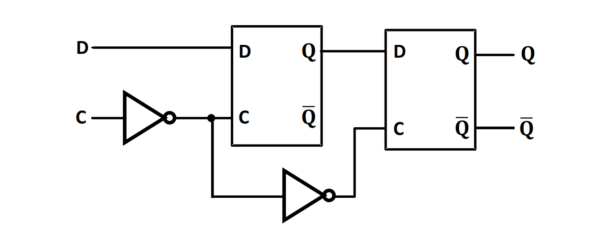
无疑这是一个上升沿触发型，我们来看看仿真波形图
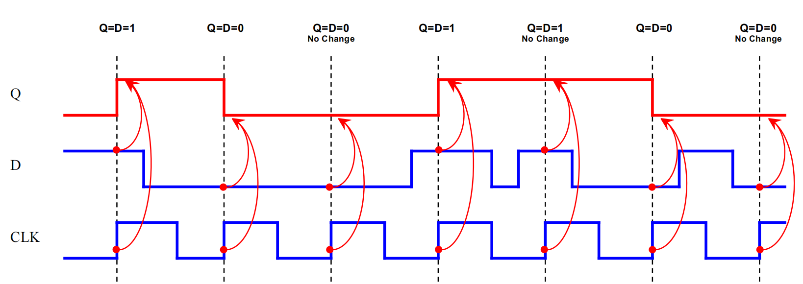
可以看到 Q 的改变发生在两个条件下：
- 时钟上升沿
- D 的值发生了变化
> [!ABSTRACT]
>
> 输出只在时钟边沿处根据输入进行 **更新**
###### III.2.1.1.1 Latch vs. D Flip-Flop
我们在前面就已经谈到了二者的区别

我们可以通过仿真波形图来比较直观地对比二者
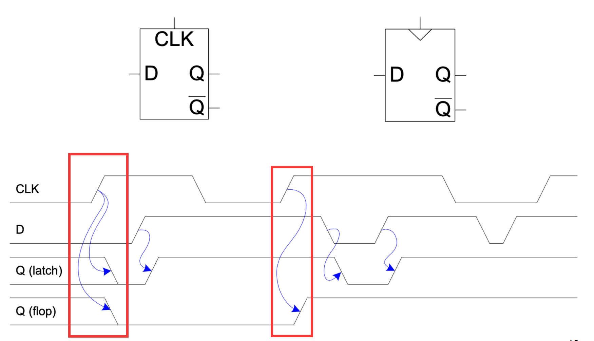
> [!HINT]
>
> 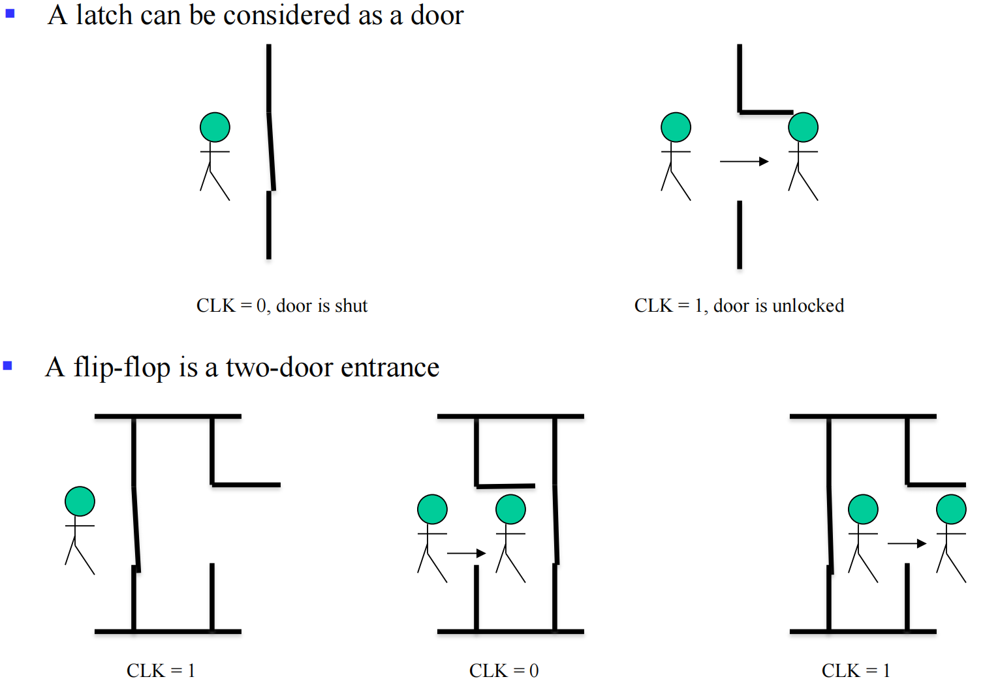
###### III.2.1.1.2 problem
当然依旧存在 **问题**：
- 延迟高，电路效率低
- （没太搞懂）
解决 **办法**： 使用 _edge-triggering flip-flop_
##### III.2.1.2 Enabled D Flip-Flop

##### III.2.1.3 Resettable D Flip-Flop

#### III.2.2 JK Flip-Flop
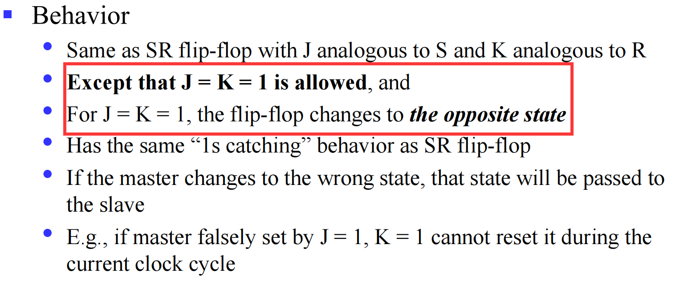
##### III.2.2.1 Implement
> [!HINT]
>
> To avoid 1’s catching behavior, one solution used is to use an **edge-triggered D** as the core of the flip-flop
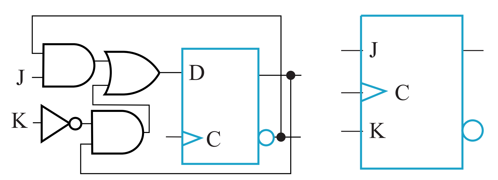
#### III.2.3 T Flip-Flop
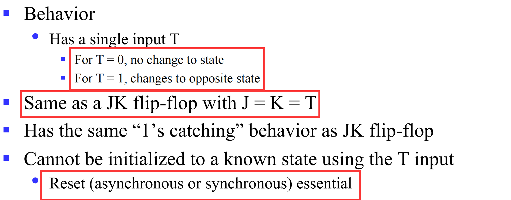
## IV Sequential logic design
### IV.1 Some definitions
#### IV.1.1 Equivalent State
- Two states are equivalent  <u>if their response for each possible input sequence is an identical output sequence.</u> 
- Alternatively, two states are equivalent  <u>if their outputs produced for each input symbol is identical and their next states for each input symbol are the same or equivalent.</u> 
> [!HELP]
>
> 其实有递归定义的味道；第一点说如果对于任意输入输出相同二者等价；第二点说如果对于任意输入输出的下一状态是等价的，则二者等价
##### IV.1.1.1 example

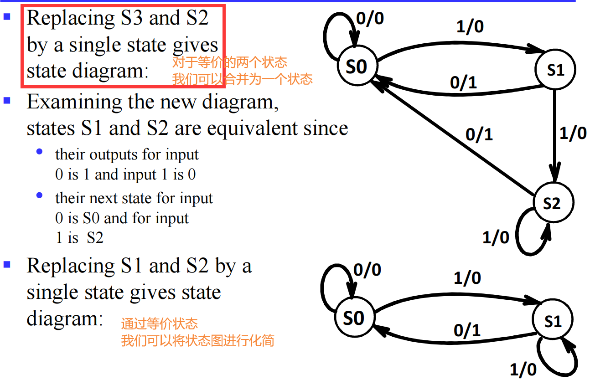
#### IV.1.2 Moore and Mealy Models
在上面的 [Introduction](04-Sequential_Logic_Design.md#Introduction#Implement) 中我们简单介绍了 Moore and Mealy Models，下面是其一对例子：
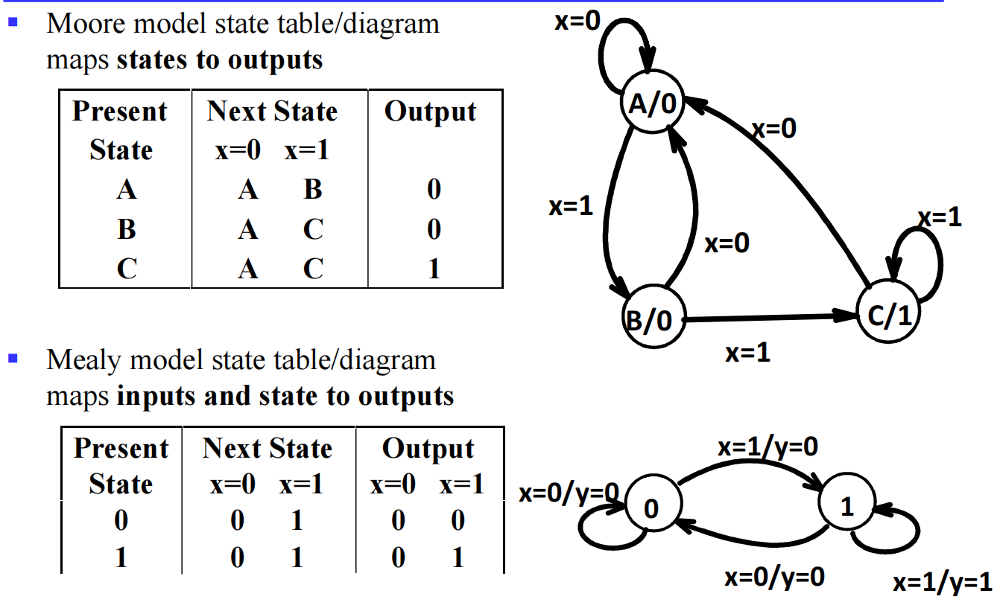
在 Moore 中，输出只受当前状态影响，但是下一状态还是可以受到输入的影响
### IV.2 The design procedure

> 到 [这里](attachments/Lec04-2.pdf#page=38&selection=0,0,0,31) 都直接跳过了，期末再来复习罢
## V Classic sequential logic elements
### V.1 Registers
#### V.1.1 Basic introduction
> [!QUESTION]
>
> 为什么需要寄存器？
> 
> 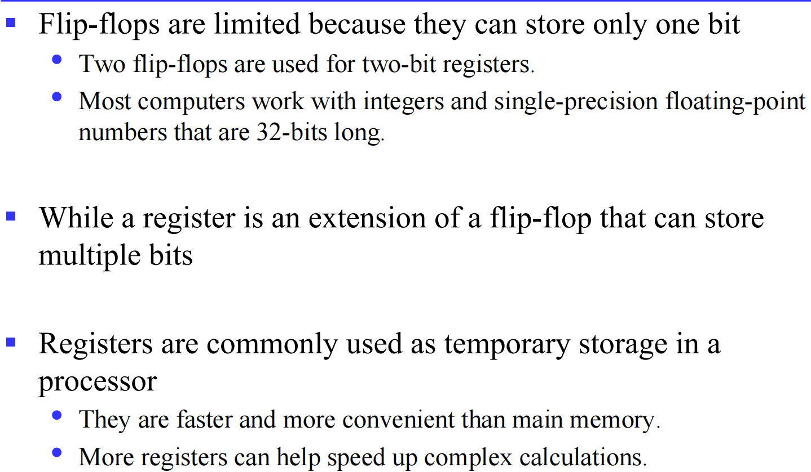
##### V.1.1.1 2-bit Register

##### V.1.1.2 4-Bit Register: Clock Gating

#### V.1.2 Registers in the digital system

##### V.1.2.1 Retister Transfers
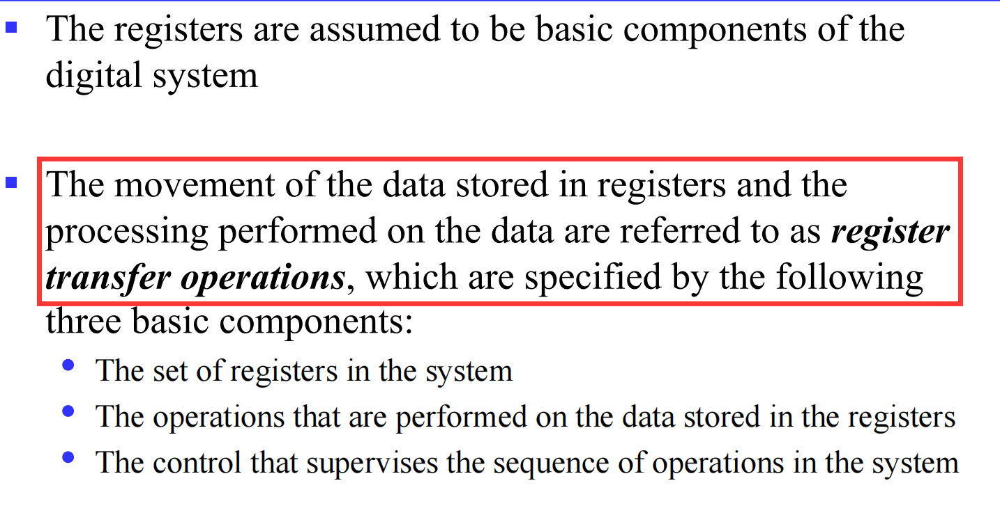
> [!DEFINITION ]
>
> An elementary operation (such as load, count, add, subtract, and shift) performed on data stored in registers is called a _microoperation_ .
##### V.1.2.2 Register Representation
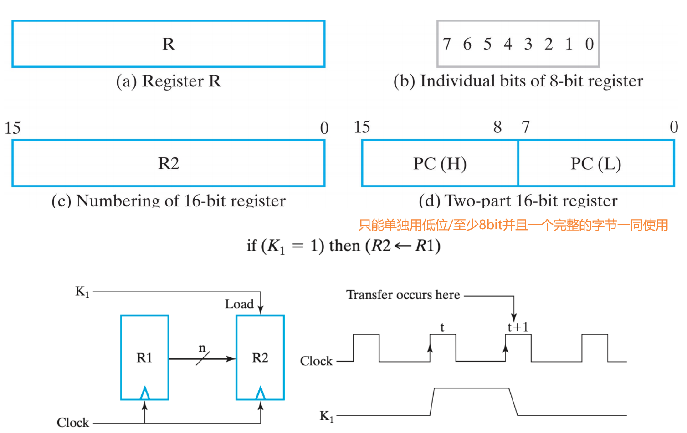
> 来自 lec04-3 p14，为什么在 $K_1$ 下降沿才发生 transfer ？

##### V.1.2.3 Register Transfer Structures
###### V.1.2.3.1 overview
- _Multiplexer-Based Transfers_ - Multiple inputs are selected by a multiplexer dedicated to the register, e.g., 
    - Shift registers 
    - Counters 
- _Bus-Based Transfers_ - Multiple inputs are selected by a shared multiplexer driving a bus that feeds inputs to multiple registers 
- _Three-State Bus_ - Multiple inputs are selected by 3-state drivers with outputs connected to a bus that feeds multiple registers
- _Other Transfer Structures_ - Use multiple multiplexers, multiple buses, and combinations of all the above
###### V.1.2.3.2 Dedicated Multiplexers vs. Single Bus

###### V.1.2.3.3 Multiplexer Bus vs. 3-State Bus

#### V.1.3 Shift Registers
> [!DEFINITION ]
>
> A register capable of shifting its stored bits laterally in one or both directions is called a _shift register_
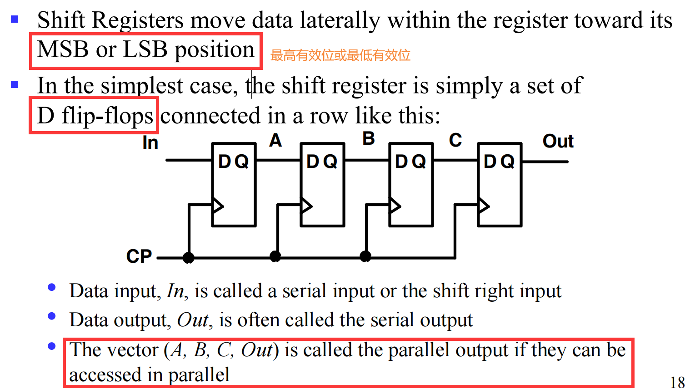
##### V.1.3.1 Shift Register with Parallel Load

以第一个或门对应的电路部分为例，真值表如下（后面有时间再自己画表格）：
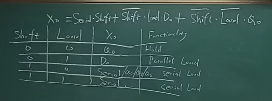
用 $X_{0}$ 表示输出，Functionality 表示功能，可以看到：
- hold 表示保持值不变
- parallel load 表示成功将数值直接放入对应寄存器中
- serial load 表示将上一个的数值放入对应寄存器中，从而实现了 **移位** 的目的
> [实验指导——移位寄存器](https://zju-sys.pages.zjusct.io/sys1/sys1-sp24/lab4-1/#_7)
### V.2 Counters
#### V.2.1 Basic introduction
> [!DEFINITION ]
>
> _Counters_ are sequential circuits which "count" through a specific state sequence. They can count up, count down, or count through other fixed sequences.
All processors contain a **program counter**, or **PC**.
- Programs consist of a list of instructions that are to be executed one after another (for the most part).
- The PC  <u>keeps track of the instruction currently being executed.</u> 
- The PC increments once on each clock cycle, and the next program instruction is then executed.

#### V.2.2 Ripple Counters
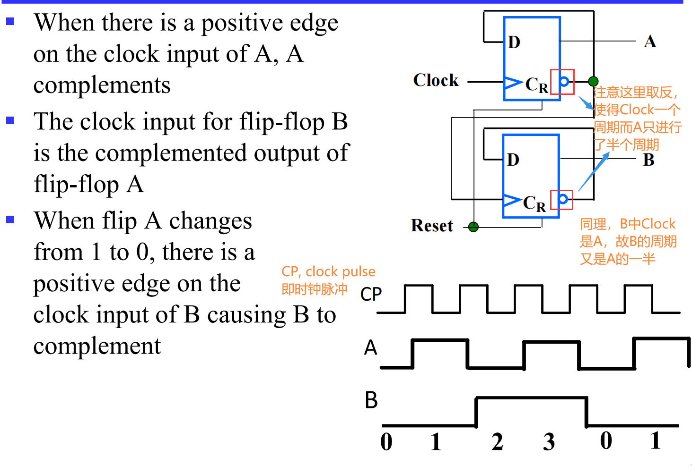
> [!QUESTION]
>
> 为什么叫行波计数器(ripple counter) ？
>
> These circuits are called ripple counters because  <u>each edge sensitive transition (positive in the example) causes a change in the next flip-flop’s state.</u> 
> 
> 考虑信号变换用时，我们可以更加直观地来理解：
> 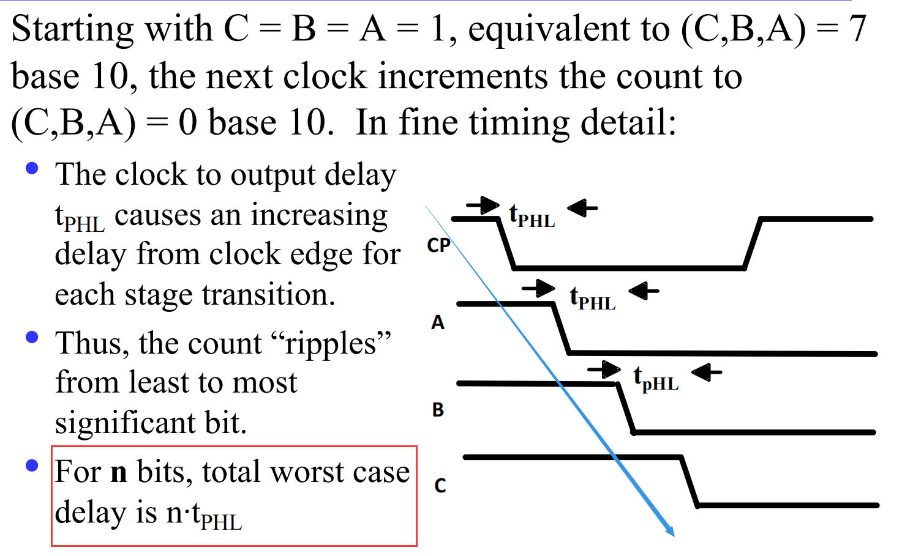
> [实验指导——分频器](https://zju-sys.pages.zjusct.io/sys1/sys1-sp24/lab3-1-appendix/#_15)
#### V.2.3 Synchronous Counters
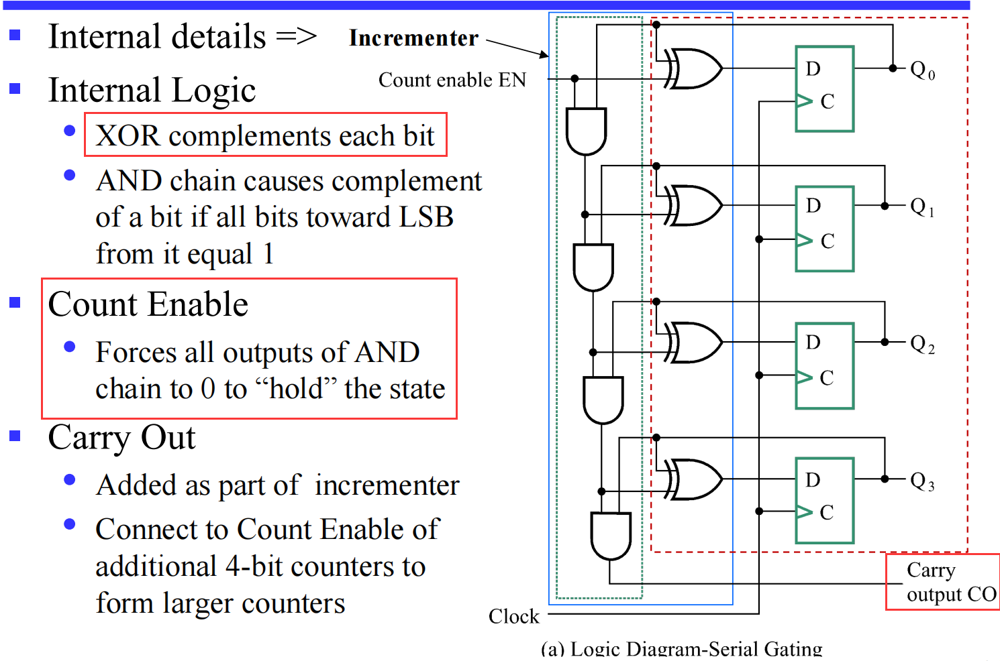
> [!QUESTION]
>
> 实现进位/计数的原理？ 
> [!HINT]
>
> $1\oplus X = \overline{X}$
> 
> $0 \oplus X = X$
> 
> [课堂录播](https://classroom.zju.edu.cn/livingroom?course_id=61063&sub_id=1173440&tenant_code=112) (54:27开始)
一连串的与门我们需要的计数较大时产生极大的延迟，这对于计数是不利的；仿照 [Shift Register with Parallel Load](04-Sequential_Logic_Design.md#Shift-Register-with-Parallel-Load) ，我们将 counter 写为 parallel mode
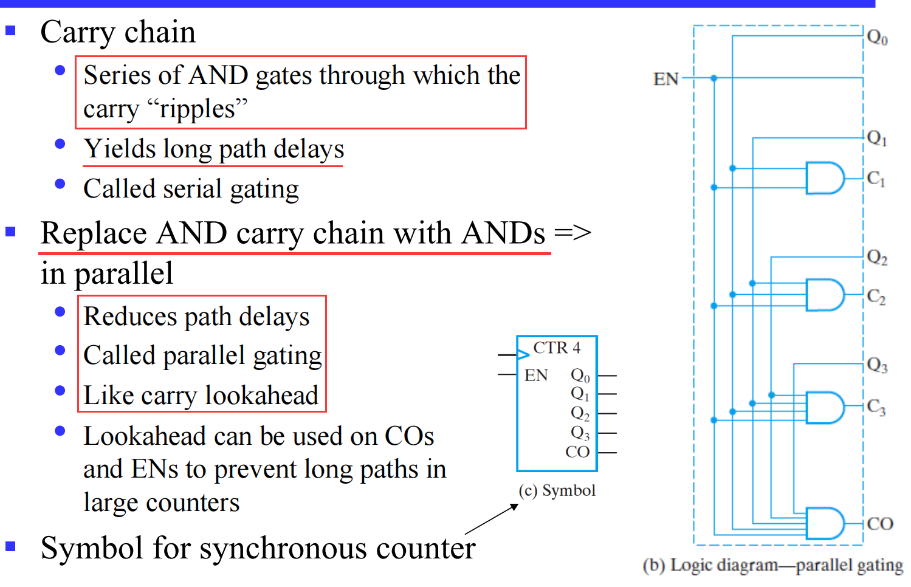
#### V.2.4 Other Counters
- Divide-by-n (Modulo n) Counter
- BCD counter with D flip-flops
> [实验指导——计数器](https://zju-sys.pages.zjusct.io/sys1/sys1-sp24/lab3-2/#_4)
> 对于 BCD 在 lec04-3 的 34 页后没看了，如果不懂了再看

